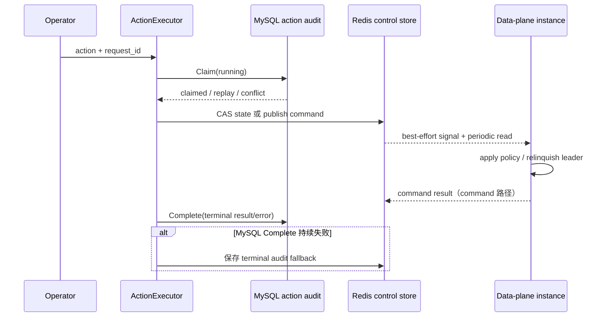

# 运行时治理与故障恢复

## 1. 结论

qs-server 把 resilience data plane 与 control plane 分开：

- data plane 在各进程内执行 RateLimit、Gate、Backpressure 和 LockLease；
- control plane 用 Redis versioned state、command、心跳和 MySQL action audit 调整或观察 data plane；
- Redis Pub/Sub 只加速唤醒，versioned state 才是可重复读取的收敛来源；
- control action 的 state/command、目标实例实际 effect 与 terminal audit 不在同一事务中；
- action 返回 error、partial 或 timeout，不足以证明“没有任何效果”。

仓库 `configs/apiserver.prod.yaml` 当前只把两个 resilience action flag 声明为 false：`resilience.tune_rate_limit` 和 `resilience.release_lock`。这只是版本化配置意图，不证明目标环境的 effective config；也不能外推为 event replay、retry 或 cache action 全部关闭。

## 2. 五类状态不能混为一谈

| 状态 | 存储/位置 | 回答的问题 |
| --- | --- | --- |
| action claim | MySQL `system_governance_action_runs` | 哪个 `(org_id, request_id)` 取得一次 operator 意图的执行权？ |
| versioned state | Redis control store | RateLimit override 或 leader cooldown 的期望状态是什么？ |
| command | Redis command store | 哪个目标实例需要执行一次 leader relinquish？ |
| data-plane effect | 本地 budget、目标 LockLease subsystem | policy 是否已应用，active leader 是否已取消并退出？ |
| terminal audit | MySQL；完成失败时 Redis fallback | action 对调用方最终报告了什么 result/error？ |

真实总链如下：


```mermaid
sequenceDiagram
    participant O as Operator
    participant E as ActionExecutor
    participant A as MySQL action audit
    participant C as Redis control store
    participant D as Data-plane instance

    O->>E: action + request_id
    E->>A: Claim(running)
    A-->>E: claimed / replay / conflict
    E->>C: CAS state 或 publish command
    C-->>D: best-effort signal + periodic read
    D->>D: apply policy / relinquish leader
    D-->>C: command result（command 路径）
    E->>A: Complete(terminal result/error)
    alt MySQL Complete 持续失败
        E->>C: 保存 terminal audit fallback
    end
```

这里没有跨 MySQL、Redis 和进程内状态的分布式事务。文档和排障必须分别核对“意图已提交”“效果已发生”“terminal audit 已持久化”。

## 3. 三个进程的职责与 readiness

| 进程 | control 行为 | data plane |
| --- | --- | --- |
| collection-server | 首次 control store 可用性确认、周期 rate state reconcile、心跳 | Redis/local budgets、HTTP/gRPC Gates、SubmitCoalescer/LockLease |
| apiserver | 每秒 reconcile 与心跳；启动、Pub/Sub 信号或 5 秒恢复轮询处理 leader command | local budgets、dependency Backpressure、leader/task LockLease |
| worker | 发布心跳 | duplicate suppression LockLease |

实例身份包含 `component + instance_id + generation`。generation 用来区分同一个 instance ID 重启前后的心跳。

collection 在 `resilience.control.enabled=true` 时要求首次 state sync 成功：

- `/readyz` 和 `/serve-readyz` 在首次同步前返回 503 `synchronizing`；
- 首次同步后，严格 `/readyz` 仍反映依赖状态；
- `/serve-readyz` 可以返回 200 `degraded`，同时明确 `dependency_ready=false`；
- 后续单次 reconcile 失败不会清空已工作的本地 policy，agent 会继续重试。

apiserver 和 worker 没有相同的 control readiness gate。control Redis 不可用时，它们的数据面仍按已装配的本地配置运行。因此不能把“control Redis 不可用”概括成所有进程统一 fail-closed。

仓库 `apiserver.prod.yaml` 还声明 collection governance 使用 DNS discovery、`minimum_instances=2`，worker 使用 DNS discovery、`minimum_instances=3`。它们同样只是版本化配置意图；目标环境实例数、DNS 结果和 effective value 必须由部署证据确认。

## 4. Tune RateLimit 的提交顺序

`ActionExecutor` 在调用 governor 前先用 MySQL claim request ID。取得执行权后，override 路径依次执行：

1. 校验 component、budget、`expected_version` 和 policy；
2. apiserver 本地 budget 先校验当前 version；
3. `ensureRateBaseline` 确保 Redis 中有可比较的 baseline state；
4. Redis `CompareAndSwap` 写入带 TTL 的 override state；
5. 目标为 apiserver 时，再对本地 budget 执行 `Apply`；
6. 目标为 collection-server 时，governor 不直接修改远端进程，由 collection agent 周期读取新版本并 reconcile；
7. action 返回后，`ActionExecutor` 再持久化 terminal audit。

reset 同样先处理 Redis state，再让本地 apiserver budget `ReconcileBaseline`；远端 collection 仍由 agent 收敛。

版本化 state 的契约是：

- operator 必须提交正数 `expected_version`；
- 版本不匹配返回 conflict，不做静默覆盖；
- override TTL 最大 24 小时，未指定时默认 30 分钟；
- state CAS/delete 成功后的 Pub/Sub publish 是 best-effort；publish 失败不撤销已提交 state；
- agent 每秒周期读取新版本，Pub/Sub 丢失不阻止最终收敛。

### 4.1 部分提交窗口

Redis CAS 成功后，本地 `Apply` 仍可能失败。此时：

- action 可以返回 error，并把 terminal audit 记为 failed；
- Redis versioned state 已经存在，不会因本地 error 自动回滚；
- 其他 agent 或本实例后续 reconcile 仍可能应用该状态；
- 使用相同 request ID 重试只会重放 terminal error，不会重新执行 action；
- 使用新 request ID 重试前必须重新读取 version，否则可能得到 version conflict。

因此 `TuneRateLimit` 的 error 不等于 policy 一定未生效。排障顺序应是：查 action audit，再查 Redis state version，最后查每个实例的 runtime snapshot。

## 5. Release leader 的提交顺序

`resilience.release_lock` 是目标实例命令，不是一次同步函数调用。完整顺序是：

1. `ActionExecutor` 先在 MySQL claim `(org_id, request_id)`；
2. governor 根据 heartbeat/discovery 解析目标 apiserver instance；
3. governor 以 `SETNX` 语义发布带 expiry 的 Redis command；
4. 目标实例启动时检查一次；收到 `command:apiserver` Pub/Sub 信号立即检查，并以 5 秒恢复轮询覆盖丢失信号；随后按 instance ID claim 该 command，避免重复执行；
5. 目标实例先用 CAS 写入带 TTL 的 leader cooldown state；
6. 目标 LockLease subsystem 设置本地 cooldown、取消 active leader body，并在 timeout 内等待 body 退出；
7. 目标实例把 `ok`、`noop`、`failed` 或 `timeout` result 写回 Redis；
8. governor 聚合目标 result，等待到期时返回 `partial` 或 `timeout`；
9. `ActionExecutor` 最后持久化 terminal audit。

cooldown state 先于 relinquish effect 写入，确保目标实例即使重启也能 reconcile，并避免刚让权后立即重新抢回 leader。

command、command result、instance heartbeat 和 terminal audit fallback 保留原 value key、JSON、TTL、幂等与冲突语义，同时维护独立 ZSET 索引。value 与索引由 Redis Lua 同步写入；fallback 删除使用 `DEL + ZREM`。读取使用 `ZRANGE` / `ZRANGEBYSCORE + MGET`，并清理过期成员和 value 已缺失的孤立成员，不再用 Redis 数据库级 `SCAN` 发现控制面记录。

该索引不是旧 value 的离线迁移：发布前门禁要求旧 command、result 和 audit fallback value 数为 0；旧 heartbeat 不阻塞切换，会按原 5 秒 TTL 自然过期。这个门禁是版本切换条件，不是授权删除存量数据。

### 5.1 部分提交窗口

- cooldown state CAS 成功后，`RelinquishLeader` 仍可能失败或等待超时；此时 cooldown 可能已经生效；
- leader body 收到 cancellation 后如果不合作，subsystem 只能等待和告警，不能强杀任意 Go 代码；
- 目标 effect 已发生但 command result 写回失败时，governor 可能得到 timeout；
- governor 等待超时后，尚未过期且尚未被 claim 的 command 仍可能被目标实例稍后执行；
- terminal audit 记录的是 action 聚合结果，不是 Redis state、目标 effect 和 command result 的原子快照。

因此 operator 收到 timeout/partial/error 后不能直接重复发新 request ID。必须先检查目标实例 cooldown state、active runs、command result 和 workload 日志，确认是否已产生效果。

## 6. Action audit、fallback 与重放

MySQL `system_governance_action_runs` 是 claim authority：

- 新 request ID 插入 `running`，取得执行权；
- 同 request ID 仍在 running，返回 conflict；
- 同 request ID 已 terminal，重放原 result/error；
- 同 request ID 被用于另一个 action，返回 conflict。

action 执行结束后，`ActionExecutor` 才调用 `Complete`。如果 MySQL completion 在 3 秒重试窗口内仍失败：

- terminal record 写入 ops Redis fallback；
- fallback 使用 `SETNX`，不设置 TTL；
- fallback 索引按 `FinishedAt` 排序，recovery 从旧到新、按 limit 分批读取；
- 后续相同 request ID 优先重放 fallback，不重复 action effect；
- recovery runner 每 30 秒、每批最多 100 条回填 MySQL；
- MySQL completion 成功后删除 fallback。

若 MySQL completion 和 Redis fallback 都失败，执行器返回 `governance action outcome could not be persisted`。这个错误只说明 terminal outcome 没有形成可重放记录，不会回滚已提交的 Redis state、command 或 data-plane effect。

## 7. 仓库 action flag 边界

仓库 `configs/apiserver.prod.yaml` 当前声明：

```yaml
system_governance:
  retry:
    manual_actions_enabled: true
  resilience:
    tune_rate_limit: false
    release_lock: false
```

若目标环境采用这组 effective values：

- `resilience.tune_rate_limit`、`resilience.release_lock` 在 registry 中是 planned/disabled；
- `events.replay_pending`、`events.replay_delivery` 以及 evaluation/interpretation retry action 仍可由 `retry.manual_actions_enabled=true` 启用；
- cache reload、warmup、repair action 在当前 registry 中独立启用，不受 resilience flag 影响。

所以本文只把两个 resilience flag 描述为“仓库版本化配置意图为 false”。目标环境是否采用这些值、operator 是否具备授权、action 是否真实执行，都需要独立证据。

## 8. 故障矩阵

| 故障 | 当前行为 | 必须继续核对 |
| --- | --- | --- |
| control Pub/Sub 丢消息 | agent 周期读取 versioned state | 各实例最终 version 是否收敛 |
| control Redis 冷启动不可用 | collection 首次同步前不 ready；apiserver/worker 保留本地 data plane | 具体 Redis family 与进程 readiness |
| control Redis 运行期短暂错误 | 保留已应用 policy，后台重试 | snapshot source/version 是否停滞 |
| stale expected version | 返回 version conflict | 重新读取 state 后再决策 |
| MySQL action claim 失败 | action 不执行 | 不得绕过 claim 直接做高风险 effect |
| tune state CAS 成功、本地 Apply 失败 | action error，但 state 可能被其他 agent 应用 | Redis version 与逐实例 snapshot |
| release command 等待 timeout | target 可能尚未执行，也可能稍后执行 | cooldown、active run、command result |
| action 已执行、MySQL complete 失败 | 写 Redis terminal fallback 并后续回填 | fallback pending 与 MySQL 恢复 |
| MySQL complete 与 Redis fallback 都失败 | 返回 outcome persistence error | effect 可能已经发生，需人工核对 |

## 9. 可观测性边界

当前没有专用的 `resilience control operation` Prometheus counter，仍不能用单一指标覆盖 claim、state/command、effect 和 terminal audit。命令检查已有 `qs_resilience_control_command_poll_total{trigger,outcome}`，其中 trigger 只允许 `startup`、`signal`、`recovery` 或 `unknown`；它只能说明检查路径及错误，不能证明命令 effect 成功。

现有直接证据包括：

- action audit 的 claim、status、result/error、started/finished time；
- `system_governance_audit_fallback_pending`；
- `system_governance_audit_fallback_total{operation,outcome}`；
- `qs_resilience_control_command_poll_total{trigger,outcome}`；
- Redis versioned state、command result；
- 各实例 resilience snapshot 中的 policy source/version、expires_at、LockLease active/cooldown 相关状态；
- action、agent reconcile 和 LockLease cancellation 日志。

审计 fallback 指标只能说明 terminal record 的持久化恢复状态，不能证明 data-plane effect 是否成功。完整观测与验收入口见 [可观测性、压测与验收](./70-可观测性-压测与验收.md)。

## 10. 验证入口与证据状态

代码与测试入口：

- action claim/complete/replay：`internal/apiserver/application/systemgovernance/action_executor.go`、`action_audit_recovery.go` 及其测试；
- RateLimit state CAS/apply：`internal/apiserver/resilience/subsystem/governance.go`、`subsystem.go`；
- release command：`internal/apiserver/resilience/subsystem/command_agent.go`；
- Redis state/command store：`internal/pkg/resilience/control/redisadapter`；
- readiness 与 agent：三个进程的 resilience subsystem 和 process composition root。

聚焦验证命令：

```bash
go test -count=1 ./internal/apiserver/application/systemgovernance/... \
  ./internal/apiserver/resilience/subsystem \
  ./internal/pkg/resilience/control/...
```

当前状态：

| 状态 | 内容 |
| --- | --- |
| `已实现` | MySQL claim/terminal replay、Redis terminal fallback/recovery、RateLimit versioned state、release leader command/cooldown，以及 command/result/heartbeat/fallback 显式索引。 |
| `配置意图` | 仓库 `apiserver.prod.yaml` 声明两个 resilience action flag 为 false；不代表目标环境 effective config。 |
| `观测缺口` | 缺少专用 control-operation counter；必须组合 audit、state、command result、snapshot 和日志。 |
| `待运行证据` | 需要在隔离环境验证 state 已提交但 local apply 失败、command timeout 后延迟 effect、MySQL complete/fallback 故障。 |

本地 unit/miniredis 测试只能证明代码契约，不证明目标环境部署 SHA、effective config、Redis/MySQL 故障行为或 operator 授权已经验收。
