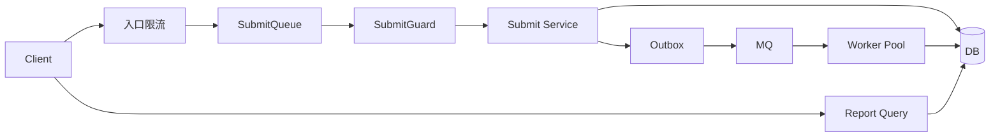

# concurrency

concurrency 模块是 qs-server 的高并发保护层，用于保护提交入口、异步 worker、数据库和报告查询接口，避免突发流量、重复提交、查询风暴和下游积压打穿系统。

## 1. 这个模块解决什么问题

高并发问题不是“加限流”一个动作。qs-server 需要同时处理前台突发流量、答卷提交洪峰、用户重复点击、下游处理能力有限、报告异步生成导致的状态查询放大。

## 2. 它在 qs-server 中处于什么位置

concurrency 位于接入层、collection-server 提交服务、worker 消费和 report 查询链路中。它既保护入口，也保护 DB、Redis、MQ、gRPC 和 worker。

## 3. 整体架构是什么

## 4. 关键链路有哪些

| 链路 | 文档 |
| --- | --- |
| 高并发保护整体架构 | [01-高并发保护整体架构.md](01-高并发保护整体架构.md) |
| 入口限流 | [02-入口限流链路.md](02-入口限流链路.md) |
| SubmitQueue 提交削峰 | [03-SubmitQueue提交削峰链路.md](03-SubmitQueue提交削峰链路.md) |
| SubmitGuard 重复提交抑制 | [04-SubmitGuard重复提交抑制链路.md](04-SubmitGuard重复提交抑制链路.md) |
| 下游背压 | [05-下游背压链路.md](05-下游背压链路.md) |
| Report 短轮询 | [06-Report短轮询查询链路.md](06-Report短轮询查询链路.md) |
| Report 长轮询 | [07-Report长轮询查询链路.md](07-Report长轮询查询链路.md) |
| Report WebSocket | [08-Report-WebSocket推送链路.md](08-Report-WebSocket推送链路.md) |
| 容量压测 | [09-容量边界与压测验证.md](09-容量边界与压测验证.md) |
| 方案取舍 | [10-方案取舍.md](10-方案取舍.md) |
| LockLease 租约锁与续租治理 | [11-LockLease租约锁与续租治理.md](11-LockLease租约锁与续租治理.md) |
| 韧性子系统与控制面 | [12-韧性子系统与控制面.md](12-韧性子系统与控制面.md) |

## 5. 为什么选择当前方案

只在 Nginx 限流无法理解业务幂等；只做 SubmitGuard 无法吸收洪峰；只靠短轮询会放大报告查询。当前方案把入口保护、提交削峰、重复提交抑制、背压和 report 查询治理拆成不同层，各层解决不同问题。

## 6. 代码事实源

| 能力 | 事实源 |
| --- | --- |
| RateLimit / Backpressure | [../../../internal/pkg/resilience/ratelimit](../../../internal/pkg/resilience/ratelimit)、[../../../internal/pkg/resilience/backpressure](../../../internal/pkg/resilience/backpressure) |
| 进程级组合 | [../../../internal/apiserver/resilience/subsystem](../../../internal/apiserver/resilience/subsystem)、[../../../internal/collection-server/resilience/subsystem](../../../internal/collection-server/resilience/subsystem)、[../../../internal/worker/resilience/subsystem](../../../internal/worker/resilience/subsystem) |
| 跨进程控制协议 | [../../../internal/pkg/resilience/control](../../../internal/pkg/resilience/control) |
| SubmitQueue | [../../../internal/collection-server/application/answersheet/submit_queue.go](../../../internal/collection-server/application/answersheet/submit_queue.go) |
| SubmitGuard / LockLease | [../../../internal/collection-server/infra/redisops/submit_guard.go](../../../internal/collection-server/infra/redisops/submit_guard.go)、[../../../internal/pkg/resilience/locklease](../../../internal/pkg/resilience/locklease) |
| Report 查询 | [../../../internal/collection-server/application/reportwait](../../../internal/collection-server/application/reportwait)、[../../04-接口与运维/12-小程序报告等待接入指南.md](../../04-接口与运维/12-小程序报告等待接入指南.md) |
