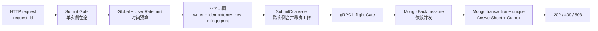

# Concurrency / Resilience

本专题研究的不是“怎么把 QPS 调大”，而是：当请求同时到达、依赖变慢、客户端重试、多个实例争抢工作时，系统怎样限制损失，又怎样保证最终只承认正确的业务事实。

逐篇源码基线和复核状态由 [`document-closure.json`](../../document-closure.json) 维护。配置阈值只属于版本化部署意图，不等于目标环境 effective config 或真实容量结论。

## 1. 本专题的核心命题

```text
高并发治理
  = 控制到达（RateLimit）
  + 控制在途（Gate）
  + 控制依赖并发（Backpressure / Pool）
  + 合并重复工作（Coalescer / Lease）
  + 裁决持久事实（Unique / Transaction / Claim / CAS）
  + 用证据校准预算（Metrics / Load Test / Failure Injection）
```

其中前四项都能降低事故概率和资源代价，但只有第五项能决定系统最终承认什么。Redis lease 可以失效，Mongo 唯一约束不能因此缺失；Gate 可以拒绝当前请求，不能撤销先前已经提交的事实。

如果还没有读过根级 [统一模型与推理方法](../04-统一模型与推理方法.md)，建议先读。那里统一解释 request、intent、fingerprint、coordination、durable fact 和 evidence，后续章节不再各自发明术语。

## 2. 从一个提交请求走完整条保护链


```mermaid
flowchart LR
    Request["HTTP request<br/>request_id"] --> Gate["Submit Gate<br/>单实例在途"]
    Gate --> Rate["Global + User RateLimit<br/>时间预算"]
    Rate --> Intent["业务意图<br/>writer + idempotency_key + fingerprint"]
    Intent --> Coalescer["SubmitCoalescer<br/>跨实例合并昂贵工作"]
    Coalescer --> GRPC["gRPC inflight Gate"]
    GRPC --> BP["Mongo Backpressure<br/>依赖并发"]
    BP --> Fact["Mongo transaction + unique<br/>AnswerSheet + Outbox"]
    Fact --> Response["202 / 409 / 503"]
```

真实提交入口顺序是 `Submit Gate -> Global RateLimit -> User RateLimit -> Handler`。图中每层回答不同问题：

| 层 | 问题 | 失效后由谁兜底 |
| --- | --- | --- |
| Gate | 本实例现在还能接多少在途请求？ | 快速拒绝；不参与事实裁决 |
| RateLimit | 时间窗口内允许多少到达，热点用户占多少？ | submit 用本地保守预算；后续 Gate/Backpressure |
| SubmitCoalescer | 同一意图是否应只展开一次昂贵流程？ | degraded-open；Mongo 唯一键与回读收敛 |
| Backpressure | 本实例显式 acquire 的 Mongo 操作还能发多少并发？ | 已接入方法有界等待/503；raw `Collection()` 旁路仍由 driver pool 承担 |
| Unique + transaction | 哪个意图事实成立，202 能承诺什么？ | 这是最终边界，失败时不能猜测成功 |

## 3. 学习路径与概念依赖

不要跳到压测脚本先记阈值。按下列顺序，后一章都以前一章的概念为前提：

1. [压力模型与责任边界](./10-压力模型与责任边界.md)：分清 λ、L、W、budget、scope，以及正确性/可用性/效率。
2. [入口准入：RateLimit 与 Gate](./20-入口准入-RateLimit与Gate.md)：从到达速率和在途请求推导多层准入，比较顺序与 Redis 降级方案。
3. [可靠提交：跨实例合并与幂等](./30-可靠提交-跨实例合并与幂等.md)：从超时重试和 commit-unknown 推导幂等、first-committer-wins、durable readback 与 SubmitCoalescer。
4. [下游背压与容量预算](./40-下游背压与容量预算.md)：从 Little's Law 推导共享依赖预算，理解 QPS、并发、连接池和实例数为什么不能直接相乘。
5. [LockLease 与长任务互斥](./50-LockLease与长任务互斥.md)：从进程暂停和租约过期推导 token、续租、协作式取消与 fencing。
6. [运行时治理与故障恢复](./60-运行时治理与故障恢复.md)：区分数据面、版本化控制意图、Pub/Sub 加速、readiness 与审计化 action。
7. [可观测性、压测与验收](./70-可观测性-压测与验收.md)：把“配置看起来合理”变成可证伪的容量与故障假设。

## 4. 学习中最容易混淆的关系

### 4.1 `request_id`、`idempotency_key` 与业务唯一性

- `request_id`：一次传输尝试的追踪标识；同一业务重试通常不同。
- `idempotency_key`：同一业务意图的稳定标识；重试必须复用。
- fingerprint：证明同 key 的内容是否相同；服务端持久指纹才参与裁决。
- 业务唯一性：例如“一个任务只能提交一次”；必须由业务实体约束表达，不能假设 transport idempotency 自动提供。

### 4.2 RateLimit、Gate、Backpressure 与 Pool

- RateLimit 的单位是 `requests/time`；
- Gate/Backpressure/Pool 的单位是 `in-flight`；
- Gate 按路由保护进程，Backpressure 按依赖保护下游，Pool 位于驱动末端；
- 相同数字不表示相同容量，更不表示同一 scope。

### 4.3 Lease、Signal 与持久事实

- Lease 只授予一段时间的执行资格；
- Signal 只提示等待者“现在值得回读”；
- unique/transaction/claim/CAS 才能决定最终结果；
- 若旧 owner 的副作用不可容忍，必须在写入点使用 fencing/version/CAS，延长 TTL 不足以修复。

## 5. 当前保护组合

| 问题 | 当前组合 | 不能替代什么 |
| --- | --- | --- |
| 入口过载 | Route Gate + RateLimit + dependency Backpressure | 不能代替持久化正确性约束 |
| 重复提交 | stable key + fingerprint + unique/transaction + SubmitCoalescer | Coalescer 不能代替 Mongo 唯一约束与 durable readback |
| 多实例长任务 | token lease + renewal + cancellation + 持久幂等边界 | 续租不能代替写入点的 version/CAS/fencing |

当前采用固定预算和明确降级策略。任何自动调节或更强互斥能力都必须在代码、配置、指标和故障测试同时具备后，才能进入现行能力说明。

## 6. 事实源

| 问题 | 当前事实源 |
| --- | --- |
| collection HTTP 准入 | `internal/collection-server/transport/rest/router_concurrency.go`、`router.go` |
| Gate 与 collection resilience | `internal/collection-server/concurrency`、`internal/collection-server/resilience/subsystem` |
| RateLimit / Backpressure / LockLease | `internal/pkg/resilience` 与当前 `component-base` 适配层 |
| 可靠提交 | `internal/collection-server/application/answersheet`、`internal/apiserver/application/survey/answersheet` |
| Mongo 幂等 | `internal/apiserver/infra/mongo/answersheet` |
| 运行时治理 | `internal/apiserver/application/systemgovernance`、三个进程的 resilience subsystem |
| 仓库版本化配置意图 | `configs/collection-server.prod.yaml`、`configs/apiserver.prod.yaml`、`configs/worker.prod.yaml` |
| 压测入口 | `Makefile` 的 `perf-*` 目标、`scripts/perf` |

## 7. 当前限制不是脚注

| 状态 | 结论及影响 |
| --- | --- |
| `已实现` | collection submit 在 Redis rate backend 缺失或运行期 degraded-open 时使用每实例 30/10 QPS 本地保守预算；集群聚合量仍随实例数变化。 |
| `当前接线缺口` | limiter 注入不等于方法级全覆盖：MySQL Actor read model 经 `WithContext()`、MySQL Outbox 经直接 GORM DB、Mongo AnswerSheet read model/repository 经 `Collection()` 绕过 acquire；Mongo Outbox 的显式接入不能证明其他 Mongo 方法已覆盖。现有 Backpressure 指标只是已接入方法的子集，不是全部 MySQL/Mongo 并发。 |
| `配置意图` | 仓库三个 `*.prod.yaml` 只记录版本化部署意图；不能据此断言目标环境的 effective config 或安全容量。 |
| `待补证据` | 目标环境实例数、负载偏斜、依赖放大系数、Redis 故障拐点和自动续租下的长任务失租行为。 |
| `当前未实现` | 自动并发调节和通用持久化 fencing 不属于当前能力。 |

规划项只有在代码、配置、指标和故障测试一起落地后，才成为现行能力。

## 8. 阅读后的核对清单

你应能不用背包名，完整回答：

1. 一个请求从到达到 Mongo commit，分别被哪些不同量约束？
2. 为什么相同 key/相同内容返回同一 202，不是 429；相同 key/不同内容才是 409？
3. Redis lease、completion signal 和 Mongo unique 各解决哪个失败窗口？
4. 为什么 503 不能推出“一定没有写入”，客户端为何必须复用原 key？
5. 为什么 3 个实例乘单实例上限只能得到理论聚合上界，不能得到安全容量？
6. 什么情况下 fail-open 只损失效率，什么情况下会破坏业务不变量？
