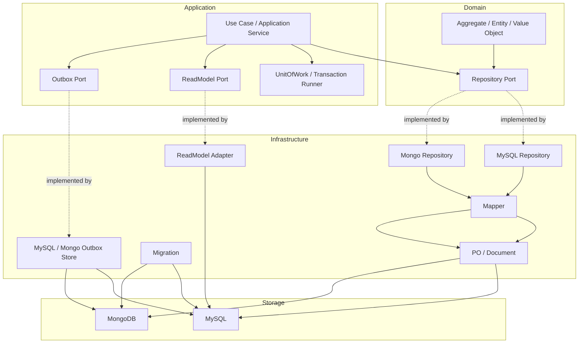

# Data Access 整体架构

**本文回答**：qs-server 的 Data Access Plane 如何把领域模型、应用服务、仓储接口、MySQL/Mongo 实现、PO/Document、UnitOfWork、migration、outbox store 和 read model 分层；为什么 domain 不能依赖 GORM/Mongo driver；为什么 MySQL 和 Mongo 不抽成一个统一大仓储框架；新增持久化能力时应该如何判断落点。

---

## 30 秒结论

| 维度 | 结论 |
| ---- | ---- |
| 模块定位 | Data Access Plane 是 qs-server 的**持久化机制层**，负责隔离领域模型和数据库实现 |
| 核心边界 | domain 定义聚合、不变量和 repository port；infra 实现 MySQL/Mongo repository、mapper、PO/document |
| 应用层职责 | application service 负责用例编排、事务边界、调用 repository/outbox/read model |
| MySQL 侧 | 基于 GORM、BaseRepository、UnitOfWork、PO/mapper、migration 和 MySQL outbox |
| Mongo 侧 | 基于 Mongo driver、BaseRepository、Document/mapper、session transaction 和 Mongo outbox |
| UoW | MySQL UnitOfWork 通过 context 传递事务；repository `WithContext` 会优先使用 context 中的 tx |
| Backpressure | MySQL/Mongo BaseRepository 都可挂 backpressure limiter，保护下游存储 |
| Migration | migration driver 区分 MySQL / Mongo backend，schema 演进归 migration，不归业务代码 |
| Read Model | Statistics read model 是读侧投影，不是业务写模型 |
| 架构测试 | architecture tests 禁止 domain 依赖 infra/database/migration，也禁止 data access 依赖 transport |
| 关键取舍 | 不追求一个统一 repository 框架；MySQL/Mongo 只共享边界原则，不共享全部实现 |

一句话概括：

> **Data Access 的核心价值不是“封装 CRUD”，而是让业务模型不被数据库 schema、driver、transaction 和 read model 污染。**

---

## 1. Data Access 要解决什么问题

业务模块需要持久化：

- Survey 的 Questionnaire / AnswerSheet。
- Scale 的 MedicalScale / Factor / InterpretationRule。
- Evaluation 的 Assessment / Report / Score。
- Actor 的 Testee / Clinician / Operator / Entry。
- Plan 的 AssessmentPlan / AssessmentTask。
- Statistics 的 read model / projection。
- Event 的 outbox state。

但持久化不能反向污染业务模型。

如果没有 Data Access 分层，会出现：

| 问题 | 后果 |
| ---- | ---- |
| domain 直接写 GORM tag | 聚合变成数据库表模型 |
| domain 直接 import Mongo driver | 领域层依赖基础设施 |
| handler 直接操作 DB | 绕过应用层事务和业务规则 |
| repository 返回 PO | 应用层和领域层被 schema 绑定 |
| read model 反向改写聚合 | 统计口径污染业务事实 |
| migration 混在业务代码里 | schema 演进不可审计 |
| outbox 与业务状态不同事务 | 事件丢失或幽灵事件 |

Data Access Plane 就是为了解决这些边界问题。

---

## 2. 总体分层图



核心依赖方向：

```text
domain -> port
application -> port
infra -> domain + port
transport -> application
```

禁止方向：

```text
domain -> infra
domain -> database
infra/data-access -> transport
```

---

## 3. 层职责

| 层 | 负责 | 不负责 |
| -- | ---- | ------ |
| Domain | 聚合不变量、领域行为、repository port、领域 ID | DB 连接、SQL、GORM tag、Mongo bson、事务 |
| Application | 用例编排、事务边界、跨 repository 协作、outbox stage | PO/Document 字段适配、HTTP 参数解析 |
| Infra/MySQL | GORM repository、PO、mapper、错误转换、MySQL outbox | 业务权限、REST/gRPC handler、领域决策 |
| Infra/Mongo | Mongo repository、Document、mapper、session transaction、Mongo outbox | 替代 MySQL 主模型、业务状态机 |
| Migration | schema 演进、表/索引/集合变更 | 运行时业务查询、历史修复语义 |
| ReadModel | 高频统计查询投影 | 主业务写模型 |

---

## 4. 领域层与仓储端口

领域层应该表达：

```text
Assessment.Submit()
Assessment.ApplyEvaluation()
AssessmentTask.Open()
MedicalScale.Publish()
```

而不是表达：

```text
INSERT INTO assessment ...
db.First(...)
collection.FindOne(...)
```

Repository port 用于表达“领域需要的存取能力”，而不是数据库表 CRUD。

### 4.1 Repository port 的原则

| 原则 | 说明 |
| ---- | ---- |
| 方法按业务语义命名 | `LoadForEvaluation` 比 `FindByID` 更表达用途 |
| 不泄漏 PO/Document | 返回 domain object 或应用 DTO |
| 不暴露 GORM/Mongo handle | 基础设施细节留在 infra |
| 错误做语义转换 | duplicate / not found / conflict 等转换成业务可理解错误 |
| 查询和写入可拆 | 高频读模型不要污染主 repository |

---

## 5. Application 层与事务边界

Application service 决定事务边界。

典型流程：

```text
Validate command
  -> uow.WithinTransaction
  -> repository save
  -> outbox stage
  -> commit
```

例如 durable event 场景必须保证：

```text
business state save
  + outbox stage
  in same transaction
```

### 5.1 Application 不应该做什么

Application 不应：

- 拼复杂 SQL。
- 使用 PO 字段判断业务规则。
- 直接依赖 GORM tag。
- 把 HTTP request 传入 repository。
- 在多个 repository 之间裸用多个独立事务。
- 把 read model 当 write model。

---

## 6. MySQL Data Access

### 6.1 BaseRepository

MySQL `BaseRepository[T]` 提供 GORM CRUD helper。

核心能力：

| 能力 | 说明 |
| ---- | ---- |
| `WithContext(ctx)` | 从 context 中取 UoW 事务，否则使用默认 DB |
| `CreateAndSync` | 创建记录并同步生成字段 |
| `UpdateAndSync` | 更新记录并同步字段 |
| `FindByID` | 按 ID 查询 |
| `ExistsByID/Field` | 存在性检查 |
| `FindWithConditions` | 条件查询 |
| `CountWithConditions` | 条件计数 |
| `SetErrorTranslator` | DB 错误转业务错误 |
| Backpressure limiter | `acquire(ctx)` 控制并发 |

### 6.2 UnitOfWork

MySQL UoW 是 component-base gorm uow 的别名封装。

暴露能力：

| 方法 | 说明 |
| ---- | ---- |
| `NewUnitOfWork(db)` | 创建 UoW |
| `WithTx(ctx, tx)` | 注入事务 |
| `TxFromContext(ctx)` | 读取事务 |
| `RequireTx(ctx)` | 要求当前 context 有事务 |
| `AfterCommit(ctx, hook)` | 注册 commit 后 hook |

Repository 的 `WithContext(ctx)` 会优先使用 context 中的 tx。

### 6.3 MySQL 典型适用对象

适合 MySQL 的数据：

- Assessment。
- AssessmentTask。
- Plan。
- Actor 关系。
- Operator/Clinician。
- Statistics read model。
- MySQL outbox。
- 需要事务和索引的结构化数据。

---

## 7. Mongo Data Access

### 7.1 BaseRepository

Mongo `BaseRepository` 封装 collection 级 CRUD。

核心能力：

| 能力 | 说明 |
| ---- | ---- |
| `InsertOne` | 插入文档 |
| `FindOne` | 查询单文档 |
| `FindByID` | 按 ObjectID 查询 |
| `UpdateOne/UpdateByID` | 更新文档 |
| `DeleteOne/DeleteByID` | 删除文档 |
| `Find` | 查询 cursor |
| `CountDocuments` | 统计 |
| `ExistsByFilter` | 存在性检查 |
| Backpressure limiter | 控制并发 |
| `DB/Collection` | 暴露底层对象给高级场景 |

### 7.2 BaseDocument

Mongo `BaseDocument` 包含：

| 字段 | 说明 |
| ---- | ---- |
| `_id` | Mongo ObjectID |
| `domain_id` | 领域 ID |
| `created_at/updated_at/deleted_at` | 时间字段 |
| `created_by/updated_by/deleted_by` | 审计字段 |

并提供：

- ApplyAuditCreate。
- ApplyAuditUpdate。
- AuditUserID。
- ObjectIDToUint64 / Uint64ToObjectID。

### 7.3 Mongo 典型适用对象

适合 Mongo 的数据：

- Questionnaire 文档。
- AnswerSheet 文档。
- Report 文档。
- 结构变化频繁、嵌套较深、文档式聚合明显的数据。
- Mongo outbox 边界中的事件。

---

## 8. Mapper / PO / Document

### 8.1 为什么需要 Mapper

Domain object 与 PO/Document 生命周期不同：

| Domain | PO / Document |
| ------ | ------------- |
| 表达业务不变量 | 表达存储 schema |
| 方法承载行为 | 字段承载持久化 |
| 不关心 DB tag | 需要 gorm/bson tag |
| 可组合值对象 | 可能拆列/嵌套文档 |
| 不应暴露 deleted_at | 需要软删除字段 |

Mapper 负责两类转换：

```text
Domain -> PO/Document
PO/Document -> Domain
```

### 8.2 Mapper 不应该做什么

Mapper 不应：

- 执行业务决策。
- 调用其它 repository。
- 修改外部状态。
- 做权限判断。
- 发事件。
- 做复杂查询。

---

## 9. Migration 与 Schema 演进

`migration.Driver` 定义了通用 migration driver 接口：

```go
type Driver interface {
    Backend() Backend
    SourcePath() string
    CreateInstance(fs embed.FS, config *Config) (*migrate.Migrate, error)
}
```

当前 backend：

```text
mysql
mongodb
```

### 9.1 Migration 的职责

| 职责 | 说明 |
| ---- | ---- |
| 创建表/集合 | schema 初始化 |
| 增加索引 | 查询和唯一约束 |
| 增加字段 | schema 演进 |
| 删除旧表 | 废弃 read model |
| 保证可重复执行 | migration version 管理 |

### 9.2 Migration 不负责

Migration 不应承担：

- 业务补偿语义。
- 长时间历史数据修复。
- 手工运营操作。
- 运行时 query。
- 应用层权限判断。

历史修复脚本应单独设计、审查和记录。

---

## 10. Read Model 与 Statistics

Statistics read model 是 Data Access Plane 的重要读侧能力。

`statisticsreadmodel.ReadModel` 暴露：

- org overview。
- access funnel。
- assessment service。
- plan task。
- clinician。
- assessment entry。
- questionnaire batch。

这些查询来自统计读模型表，而不是直接扫所有主业务表。

### 10.1 Read Model 原则

| 原则 | 说明 |
| ---- | ---- |
| 为查询优化 | 可冗余、可聚合 |
| 不做主写模型 | 不能反向修改业务状态 |
| 可重建 | sync/backfill 能恢复 |
| 口径明确 | 分子、分母、时间字段和维度要清楚 |
| 与业务主表分离 | 读模型漂移时回源或重建 |

### 10.2 Statistics 典型表

运行时统计读模型收敛为：

```text
statistics_journey_daily
statistics_content_daily
statistics_plan_daily
statistics_org_snapshot
```

这些是读侧投影，不是 Survey/Evaluation/Plan/Actor 的主事实。

---

## 11. Outbox Store 也是 Data Access

Event outbox 既属于 Event System，也属于 Data Access。

### 11.1 MySQL Outbox

MySQL outbox 使用：

```text
domain_event_outbox
```

适合和 MySQL 业务状态同事务 stage。

### 11.2 Mongo Outbox

Mongo outbox 使用：

```text
domain_event_outbox
```

适合和 Mongo 文档状态同 session transaction stage。

### 11.3 共享和不共享

| 共享 | 不共享 |
| ---- | ------ |
| outboxcore 状态 | claim SQL / Mongo query |
| record build | transaction API |
| payload encode/decode | index 定义 |
| transition policy | row/document mapping |

不抽一个统一 store 大框架，是因为 MySQL 和 Mongo 的事务、claim、索引模型差异明显。

---

## 12. Backpressure 保护

MySQL 和 Mongo BaseRepository 都支持 backpressure limiter。

调用路径：

```text
repository method
  -> acquire(ctx)
  -> DB operation
  -> release()
```

这使 Data Access 能作为 Resilience Plane 的下游保护点。

注意：

- backpressure 不是业务错误。
- limiter 应保持低基数 observability。
- timeout/backpressure error 应由 application 层转换或传播。

---

## 13. 架构测试

当前 architecture tests 保护两个关键边界。

### 13.1 Data Access 不依赖 Transport

检查路径：

```text
internal/apiserver/infra/mysql
internal/apiserver/infra/mongo
internal/pkg/database
internal/pkg/migration
```

禁止 import：

```text
internal/apiserver/transport
internal/apiserver/interface/restful
internal/collection-server/transport
```

### 13.2 Domain 不依赖 Infrastructure

检查路径：

```text
internal/apiserver/domain
```

禁止 import：

```text
internal/apiserver/infra
internal/pkg/database
internal/pkg/mongodb
internal/pkg/migration
```

这些测试防止数据访问实现反向污染领域模型。

---

## 14. 设计模式

| 模式 | 当前实现 | 意图 |
| ---- | -------- | ---- |
| Repository | domain port + infra implementation | 隔离领域和数据库 |
| Mapper | PO/Document <-> Domain | 隔离 schema 和业务模型 |
| Unit of Work | MySQL UoW / tx context | 多 repository 写入同事务 |
| Transactional Outbox | MySQL/Mongo outbox store | 主状态与事件起点一致 |
| Read Model | Statistics read model | 高频统计查询优化 |
| Adapter | MySQL/Mongo repository | 数据库实现可替换/隔离 |
| Backpressure | repository limiter | 保护数据库下游 |
| Migration Driver | MySQL/Mongo backend | schema 演进标准化 |

---

## 15. 设计取舍

| 设计 | 收益 | 代价 |
| ---- | ---- | ---- |
| Domain 不依赖 infra | 业务模型干净 | Mapper 多一层 |
| MySQL/Mongo 不抽统一大框架 | 保留数据库差异 | 代码形态不完全一致 |
| UoW 通过 context 传递 tx | repository 调用简单 | 必须注意事务上下文 |
| Read model 独立 | 查询快、口径集中 | 最终一致和同步成本 |
| Outbox store 分 MySQL/Mongo | 贴合事务边界 | 两套 store 测试 |
| BaseRepository 挂 backpressure | 下游保护统一 | 需要治理和观测 |
| Migration 独立 | schema 可审计 | 历史数据修复需另设 SOP |

---

## 16. 常见误区

### 16.1 “Data Access 就是 CRUD 封装”

不准确。CRUD 只是表面；真正价值是隔离领域、事务、schema、read model 和 outbox 边界。

### 16.2 “Domain 可以带 GORM tag，方便”

不应该。domain 带 GORM tag 会把业务模型变成表模型。

### 16.3 “Read model 可以反向成为业务事实源”

错误。read model 只服务查询，可重建，不是主写模型。

### 16.4 “Migration 可以顺手写业务修复”

不建议。schema 演进和业务补偿是两类不同操作。

### 16.5 “MySQL/Mongo repository 应该完全统一”

不现实。事务、索引、claim、document 语义不同，统一大框架会掩盖差异。

### 16.6 “Worker 可以直接写 repository”

不建议。worker 应通过 internal gRPC 回到 apiserver 应用层，保持主写模型统一。

---

## 17. 新增持久化能力的基本判断

新增数据存储能力前，先判断：

| 问题 | 影响 |
| ---- | ---- |
| 这是主写模型还是读模型？ | 决定 repository 还是 read model |
| 适合 MySQL 还是 Mongo？ | 结构化事务 vs 文档聚合 |
| 是否需要事务？ | 是否进入 UoW/session |
| 是否会产生 durable event？ | 是否需要 outbox stage |
| 是否需要 migration？ | 表/集合/索引/字段 |
| 是否需要 backpressure？ | 下游保护 |
| 是否需要缓存？ | Redis plane，而非 Data Access |
| 是否需要统计重建？ | Statistics read model |

详细流程见：

- [05-新增持久化能力SOP.md](./05-新增持久化能力SOP.md)

---

## 18. 代码锚点

### MySQL

- MySQL BaseRepository：[../../../internal/pkg/database/mysql/base.go](../../../internal/pkg/database/mysql/base.go)
- MySQL UnitOfWork：[../../../internal/pkg/database/mysql/uow.go](../../../internal/pkg/database/mysql/uow.go)
- MySQL repositories：[../../../internal/apiserver/infra/mysql/](../../../internal/apiserver/infra/mysql/)

### Mongo

- Mongo BaseRepository：[../../../internal/apiserver/infra/mongo/base.go](../../../internal/apiserver/infra/mongo/base.go)
- Mongo repositories：[../../../internal/apiserver/infra/mongo/](../../../internal/apiserver/infra/mongo/)

### Migration

- Migration driver：[../../../internal/pkg/migration/driver.go](../../../internal/pkg/migration/driver.go)
- Migration package：[../../../internal/pkg/migration/](../../../internal/pkg/migration/)

### Read Model / Outbox

- StatisticsReadModel port：[../../../internal/apiserver/port/statisticsreadmodel/read_model.go](../../../internal/apiserver/port/statisticsreadmodel/read_model.go)
- MySQL statistics read model：[../../../internal/apiserver/infra/mysql/statistics/readmodel/](../../../internal/apiserver/infra/mysql/statistics/readmodel/)
- MySQL outbox：[../../../internal/apiserver/infra/mysql/eventoutbox/](../../../internal/apiserver/infra/mysql/eventoutbox/)
- Mongo outbox：[../../../internal/apiserver/infra/mongo/eventoutbox/](../../../internal/apiserver/infra/mongo/eventoutbox/)

### Architecture Tests

- Data access architecture tests：[../../../internal/pkg/architecture/data_access_architecture_test.go](../../../internal/pkg/architecture/data_access_architecture_test.go)

---

## 19. Verify

```bash
go test ./internal/pkg/architecture
go test ./internal/pkg/database/mysql
go test ./internal/apiserver/infra/mongo
go test ./internal/pkg/migration/...
```

如果修改 outbox：

```bash
go test ./internal/apiserver/outboxcore
go test ./internal/apiserver/infra/mysql/eventoutbox
go test ./internal/apiserver/infra/mongo/eventoutbox
```

如果修改 statistics read model：

```bash
go test ./internal/apiserver/port/statisticsreadmodel
go test ./internal/apiserver/infra/mysql/statistics
go test ./internal/apiserver/application/statistics
```

如果修改文档：

```bash
make docs-hygiene
git diff --check
```

---

## 20. 下一跳

| 目标 | 文档 |
| ---- | ---- |
| MySQL 仓储与事务 | [01-MySQL仓储与UnitOfWork.md](./01-MySQL仓储与UnitOfWork.md) |
| Mongo 文档仓储 | [02-Mongo文档仓储.md](./02-Mongo文档仓储.md) |
| Migration 与 Schema | [03-Migration与Schema演进.md](./03-Migration与Schema演进.md) |
| ReadModel 与 Statistics | [04-ReadModel与Statistics.md](./04-ReadModel与Statistics.md) |
| 新增持久化能力 | [05-新增持久化能力SOP.md](./05-新增持久化能力SOP.md) |
| 回到 Data Access 阅读地图 | [README.md](./README.md) |
