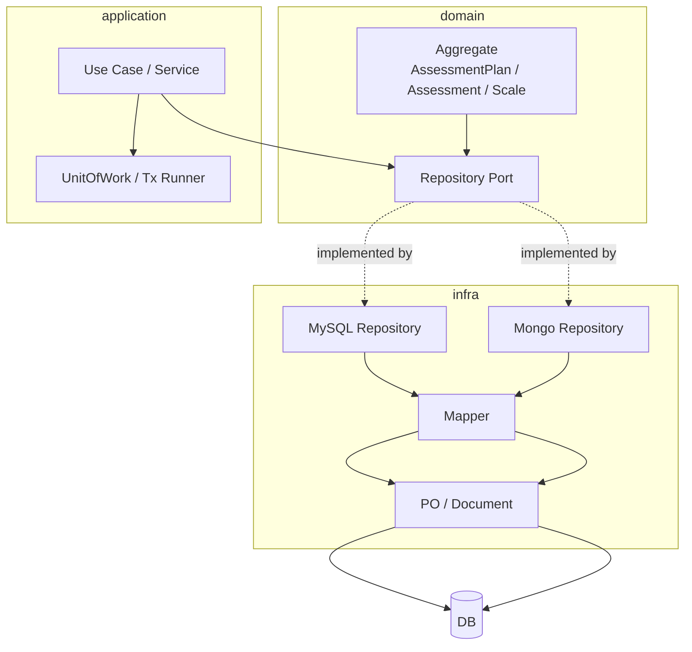

# Data Access Plane 整体架构

**本文回答**：Data Access Plane 如何把领域模型、应用服务、仓储实现、PO/Document、migration 和 read model 分层，避免数据库细节反向污染业务层。

## 30 秒结论

| 维度 | 结论 |
| ---- | ---- |
| 主要问题 | 业务聚合需要持久化，但不能让 GORM/Mongo driver/schema 进入 domain |
| 核心设计 | domain 定义仓储接口和不变量；infra 实现 repository、mapper、PO/document；application 通过 port 使用 |
| 保护手段 | architecture test 禁止 domain import infra，禁止 data access import transport |
| 取舍 | 不追求一个统一 repository 框架；MySQL/Mongo 保留各自实现方式，只共享边界规则 |

## 主图



## 模块要解决什么问题

Data Access 的问题不是“怎么写 SQL”，而是三个边界：

| 边界 | 如果不控制会怎样 | 当前设计 |
| ---- | ---------------- | -------- |
| domain 与 infra | 聚合方法开始依赖 GORM tag、Mongo bson 字段 | domain 只暴露 repository port，infra 负责 mapper |
| application 与事务 | 用例跨 repository 写入时事务分散 | MySQL 通过 UnitOfWork / tx context 表达 |
| read model 与主模型 | 统计查询反向修改业务聚合 | statistics read model 独立存储、独立 repository |

## 架构设计

Data Access 按“端口 + 适配器”组织，但不引入新的框架：

| 层 | 负责 | 不负责 |
| ---- | ---- | ---- |
| domain | 聚合不变量、仓储接口、领域 ID | DB 连接、schema、SQL、索引 |
| application | 用例编排、事务边界、调用仓储 | PO/Document 字段适配 |
| infra/mysql | GORM repository、PO、mapper、错误转换 | 业务权限、HTTP 参数解析 |
| infra/mongo | Mongo document repository、durable submit/outbox | 替代 MySQL 主模型 |
| migration | schema 演进文件和 driver | 运行时业务查询 |

## 设计模式应用

| 模式 | 位置 | 为什么用 |
| ---- | ---- | -------- |
| Repository | `domain/*Repository` + `infra/*Repository` | 把聚合存取从数据库实现中隔离 |
| Mapper | `infra/mysql/*/mapper.go`、`infra/mongo/*/mapper.go` | PO/Document 与 domain object 不同生命周期 |
| Unit of Work | [uow.go](../../../internal/pkg/database/mysql/uow.go) | 多仓储写入需要同一个事务 context |
| Adapter | MySQL/Mongo repository | 同一个 domain port 可以由不同存储实现 |

## 取舍与边界

- 当前不把 MySQL 和 Mongo repository 合并成一个泛型大框架；它们的 claim、事务、索引和 document 行为差异太大。
- Migration 只负责 schema 演进，不负责历史数据修复脚本的业务语义；一次性修复脚本需要单独审查。
- Read model 可以为查询优化而冗余字段，但不能反向成为业务写模型真值。

## 代码锚点与测试锚点

| 关注点 | 锚点 |
| ------ | ---- |
| MySQL BaseRepository | [base.go](../../../internal/pkg/database/mysql/base.go) |
| Mongo BaseRepository | [base.go](../../../internal/apiserver/infra/mongo/base.go) |
| Data Access architecture tests | [data_access_architecture_test.go](../../../internal/pkg/architecture/data_access_architecture_test.go) |

## Verify

```bash
go test ./internal/pkg/architecture ./internal/pkg/database/mysql ./internal/apiserver/infra/mongo
```
