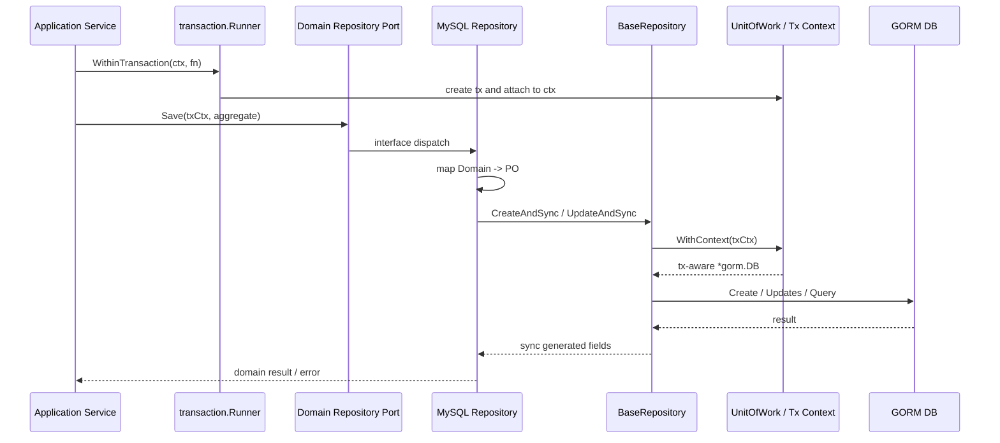
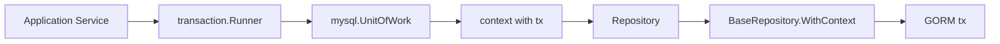
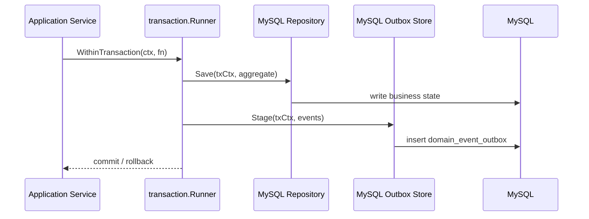

# MySQL 仓储与 UnitOfWork

**本文回答**：qs-server 的 MySQL 仓储如何通过 `BaseRepository`、GORM、PO/mapper、错误转换、backpressure 和 UnitOfWork 承接结构化主数据；应用层如何用 `transaction.Runner` 定义事务边界；MySQL outbox 为什么必须依赖同一个事务上下文。

---

## 30 秒结论

| 维度 | 结论 |
| ---- | ---- |
| 模块定位 | MySQL Data Access 承接结构化主数据、事务写入、索引查询、统计读模型和 MySQL outbox |
| 核心组件 | `BaseRepository[T]`、模块 repository、PO、mapper、`mysql.UnitOfWork`、`application/transaction.Runner` |
| GORM 边界 | GORM 只能出现在 infra/database 层，不能进入 domain |
| 事务模型 | MySQL UnitOfWork 通过 context 传递 tx；repository `WithContext(ctx)` 会优先使用 context 中的事务 |
| 应用抽象 | application 层依赖 `transaction.Runner`，只知道 `WithinTransaction(ctx, fn)`，不直接知道 GORM |
| 审计字段 | `CreateAndSync` / `UpdateAndSync` 会从 context 读取 userID 并写入 created_by / updated_by |
| 错误转换 | `SetErrorTranslator` 可将 DB duplicate 等错误转换为业务错误 |
| Backpressure | `BaseRepository` 可注入 `backpressure.Acquirer`，所有 CRUD helper 在 DB 操作前 acquire |
| Outbox | MySQL outbox `Stage(ctx, events...)` 依赖 `mysql.RequireTx(ctx)`，必须在同一事务中 stage |
| 关键边界 | BaseRepository 是通用 helper，不是业务 repository 框架；复杂业务查询仍由模块 repository 显式实现 |

一句话概括：

> **MySQL 仓储层负责把结构化业务事实可靠写入数据库，同时让 domain 不知道 GORM、事务和表结构。**

---

## 1. MySQL 仓储要解决什么问题

MySQL 在 qs-server 中主要承接：

```text
结构化主数据
关系型查询
事务写入
唯一约束
统计 read model
outbox 状态
```

典型对象包括：

- Assessment。
- AssessmentTask。
- AssessmentPlan。
- Actor 关系。
- Operator / Clinician。
- Statistics read model。
- MySQL outbox。

MySQL 仓储层要解决四件事：

| 问题 | 解决方式 |
| ---- | -------- |
| 领域模型不能依赖 GORM | 使用 repository port + infra repository + mapper |
| 多 repository 写入需要同一事务 | 使用 UnitOfWork / transaction.Runner |
| DB 错误需要转成业务语义 | 使用 error translator |
| DB 连接需要下游保护 | BaseRepository 注入 backpressure limiter |

---

## 2. 总体架构图



---

## 3. 分层职责

| 层 | 负责 | 不负责 |
| -- | ---- | ------ |
| Domain | 聚合行为、repository port、不变量 | GORM tag、SQL、事务 |
| Application | use case、事务边界、跨仓储编排 | PO 字段映射、DB driver |
| MySQL Repository | 实现 domain repository port、调用 mapper/BaseRepository | HTTP 参数解析、权限判断 |
| BaseRepository | 通用 CRUD、审计、backpressure、tx-aware DB | 复杂业务查询、领域决策 |
| PO | 表字段、索引、GORM tag | 领域行为 |
| Mapper | Domain <-> PO 转换 | 业务状态迁移 |
| UnitOfWork | 管理事务 context | 业务规则 |

---

## 4. BaseRepository

`BaseRepository[T]` 是 MySQL 通用仓储 helper。

核心字段：

| 字段 | 说明 |
| ---- | ---- |
| `db *gorm.DB` | 默认 DB 连接 |
| `errTranslator func(error) error` | DB 错误到业务错误的转换器 |
| `limiter backpressure.Acquirer` | 下游背压保护 |

### 4.1 WithContext

`WithContext(ctx)` 是事务传播关键点。

它会调用：

```text
gormuow.WithContext(ctx, r.db)
```

如果 ctx 中有 UnitOfWork 注入的 tx，就使用 tx；否则使用默认 DB。

这让 repository 方法不需要显式传入 `*gorm.DB`。

### 4.2 通用 CRUD

`BaseRepository` 提供：

| 方法 | 说明 |
| ---- | ---- |
| `CreateAndSync` | 创建 entity，并通过 sync callback 同步 generated fields |
| `UpdateAndSync` | 更新 entity，并同步 |
| `FindByID` | 按 ID 查询 |
| `FindByField` | 按字段查询 |
| `DeleteByID` | 按 ID 删除 |
| `ExistsByID` | 是否存在 |
| `ExistsByField` | 字段唯一性/存在性 |
| `FindWithConditions` | 多条件查询 |
| `FindList` | 分页查询 |
| `CountWithConditions` | 条件计数 |

### 4.3 审计字段

`CreateAndSync` 会从 context 中读取 userID：

```text
middleware.GetUserIDFromContext(ctx)
```

如果 userID > 0：

```text
SetCreatedBy(userID)
SetUpdatedBy(userID)
```

`UpdateAndSync` 会设置：

```text
SetUpdatedBy(userID)
```

这意味着审计字段由 repository helper 在写入时统一填充，业务 service 不需要手动设置 created_by / updated_by。

### 4.4 Backpressure

每个 CRUD helper 都会先调用：

```text
ctx, release, err := r.acquire(ctx)
defer release()
```

如果注入了 limiter，则会在 DB 操作前 acquire；没有 limiter 则直接执行。

这使 MySQL repository 可以被 Resilience Plane 统一保护。

---

## 5. BaseRepository 不是什么

`BaseRepository` 不是：

- 通用 ORM 框架。
- 所有业务查询的唯一入口。
- 领域 repository port。
- 查询构造器。
- 权限校验器。
- 事务管理器。
- outbox store。

它只是 infra 层的通用 CRUD 辅助工具。

复杂查询仍然应该由具体模块 repository 显式实现，例如：

```text
FindByOrgID
LoadForEvaluation
FindPendingTasks
ListByClinician
```

---

## 6. MySQL UnitOfWork

MySQL UoW 是对 component-base gorm uow 的封装。

### 6.1 暴露能力

| 方法 | 说明 |
| ---- | ---- |
| `NewUnitOfWork(db)` | 构造 UnitOfWork |
| `WithTx(ctx, tx)` | 将 tx 注入 context |
| `TxFromContext(ctx)` | 从 context 读取 tx |
| `RequireTx(ctx)` | 要求 context 中存在 tx |
| `AfterCommit(ctx, hook)` | 注册 commit 后 hook |

### 6.2 事务传播



关键点：

```text
tx 通过 context 传播；
domain 不知道 tx；
application 不直接传 *gorm.DB；
repository 自动使用 tx-aware DB。
```

---

## 7. Application transaction.Runner

application 层定义：

```go
type Runner interface {
    WithinTransaction(ctx context.Context, fn func(txCtx context.Context) error) error
}
```

这是一层重要抽象。

### 7.1 为什么需要 Runner

如果应用层直接依赖 MySQL UnitOfWork，会导致：

- application 和具体 DB 实现耦合。
- Mongo transaction 无法复用同一应用接口。
- 测试时不方便替换。
- 事务边界难以统一表达。

`transaction.Runner` 只暴露：

```text
WithinTransaction
```

这样应用服务只知道“我要一个事务边界”，不知道底层是 MySQL 还是 Mongo。

### 7.2 Container 装配

container assembler 中：

```text
newMySQLTransactionRunner(db)
  -> mysql.NewUnitOfWork(db)
  -> RunnerFunc(func(ctx, fn) { uow.WithinTransaction(ctx, fn) })
```

Mongo 也可以被适配成同一个 `transaction.Runner` 接口。

这让应用层统一依赖 transaction.Runner。

---

## 8. RequireTx 场景

有些能力必须要求处于事务中，例如 MySQL outbox stage。

MySQL outbox store 的 `Stage(ctx, events...)` 会调用：

```text
mysql.RequireTx(ctx)
```

如果没有 active transaction，就返回错误。

### 8.1 为什么 outbox 必须 RequireTx

durable_outbox 的语义是：

```text
业务状态保存
+
outbox record stage
必须在同一事务边界
```

如果没有 RequireTx，开发者可能在事务外写 outbox，导致：

| 场景 | 后果 |
| ---- | ---- |
| 业务状态保存成功，outbox 写失败 | 事件丢失 |
| outbox 写成功，业务状态 rollback | 下游消费幽灵事件 |
| 两者不一致 | 排障困难 |

所以 RequireTx 是架构护栏。

---

## 9. Error Translator

`translator.go` 提供 DB duplicate 错误识别与转换。

### 9.1 IsDuplicateError

它识别：

| Driver / Pattern | 说明 |
| ---------------- | ---- |
| MySQL error 1062 | duplicate entry |
| Postgres code 23505 | unique violation |
| string fallback | unique constraint / uniqueindex / duplicate entry / unique |
| unwrap | 递归 unwrap |

### 9.2 NewDuplicateToTranslator

`NewDuplicateToTranslator(mapper)` 会把 DB duplicate error 转换为业务错误。

示例语义：

```text
duplicate key
  -> ErrAssessmentAlreadyExists
  -> ErrOperatorAlreadyBound
  -> ErrEntryTokenDuplicated
```

这避免应用层直接解析 DB error string。

### 9.3 注意

错误转换应在具体 repository 内按业务语义设置。不要把所有 duplicate 都转成同一个业务错误。

---

## 10. PO 与 Mapper

### 10.1 PO 的职责

PO 负责：

- 表名。
- 字段。
- GORM tag。
- 索引。
- 软删除字段。
- 审计字段。
- DB 兼容类型。

### 10.2 Domain 的职责

Domain 负责：

- 领域 ID。
- 状态机。
- 业务行为。
- 不变量。
- 领域事件。

### 10.3 Mapper 的职责

Mapper 负责：

```text
Domain -> PO
PO -> Domain
```

不负责：

- 判断权限。
- 调用外部服务。
- 发事件。
- 开事务。
- 做复杂业务逻辑。

---

## 11. Repository 实现模式

典型 MySQL repository 应该长这样：

```text
type Repository struct {
    base mysql.BaseRepository[*SomePO]
}

func (r *Repository) Save(ctx context.Context, aggregate *domain.Aggregate) error {
    po := mapper.ToPO(aggregate)
    return r.base.UpdateAndSync(ctx, po, func(saved *SomePO) {
        mapper.SyncGeneratedFields(aggregate, saved)
    })
}
```

真实代码可能因为业务查询和 mapper 复杂度不同而有所差异，但基本原则不变：

```text
application -> domain repository port -> infra repository -> mapper -> PO -> BaseRepository/GORM
```

---

## 12. 与 Outbox 的协作

MySQL outbox 是 MySQL Data Access 的可靠出站机制。

### 12.1 典型事务



### 12.2 常见用法

| 事件 | MySQL 边界 |
| ---- | ---------- |
| `assessment.submitted` | Assessment 保存 + MySQL outbox |
| `assessment.failed` | MarkAsFailed 保存 + MySQL outbox |
| Plan task 相关如果升级为 durable | Task 保存 + MySQL outbox |
| Actor 行为 footprint | Actor 写入 + MySQL outbox |

---

## 13. 与 Backpressure 的协作

MySQL repository 可注入 `backpressure.Acquirer`。

这适合保护：

- 高并发查询。
- 批量任务调度。
- worker 回调导致的写入峰值。
- Statistics 同步重建。

### 13.1 Backpressure 不等于事务超时

Backpressure 控制的是进入 DB 操作前的并发槽位，不是 SQL 运行时长本身。

如果 SQL 慢，还要看：

- 索引。
- 执行计划。
- lock wait。
- connection pool。
- transaction 持有时间。

---

## 14. 与 ReadModel 的边界

MySQL 也承接 Statistics read model，例如：

```text
statistics_journey_daily
statistics_content_daily
statistics_plan_daily
statistics_org_snapshot
```

这些是 read-side table，不是业务主写模型。

### 14.1 Read model repository 和主 repository 的区别

| 维度 | 主 repository | Read model |
| ---- | ------------- | ---------- |
| 负责 | 业务事实 | 查询投影 |
| 写入 | application use case | sync/projector/rebuild writer |
| 一致性 | 事务强一致或业务一致 | 最终一致 |
| 是否可重建 | 通常不可随意重建 | 应可重建 |
| 是否反向改业务 | 不适用 | 不能 |

---

## 15. 设计模式与实现意图

| 模式 | 当前实现 | 意图 |
| ---- | -------- | ---- |
| Repository | domain port + MySQL repo | 隐藏 GORM |
| Unit of Work | mysql.UnitOfWork | 多 repository 同事务 |
| Transaction Runner | application Runner | 应用层统一事务抽象 |
| Mapper | PO <-> Domain | 隔离 schema |
| Error Translator | duplicate translator | DB 错误转业务错误 |
| Backpressure | Acquirer injection | DB 下游保护 |
| Transactional Outbox | MySQL outbox Stage + RequireTx | 主状态与事件同边界 |
| Read Model | MySQL statistics tables | 查询优化 |

---

## 16. 设计取舍

| 设计 | 收益 | 代价 |
| ---- | ---- | ---- |
| context 传 tx | repository 调用简单 | 需要保证 txCtx 传递正确 |
| application Runner 抽象 | MySQL/Mongo 事务统一接口 | 需要 container 装配 |
| BaseRepository 通用 CRUD | 减少重复代码 | 复杂查询仍需手写 |
| Mapper 分离 | domain 干净 | 转换代码增加 |
| Error translator | 业务错误清晰 | 每个 repository 要设置语义 |
| Backpressure 注入 | 存储保护统一 | 错误传播需要清晰 |
| RequireTx outbox | 可靠出站强约束 | 开发者必须进入事务边界 |

---

## 17. 常见误区

### 17.1 “有了 BaseRepository 就不用写模块 repository”

错误。BaseRepository 是 helper，不是 domain repository port 的替代品。

### 17.2 “Application 可以直接用 GORM”

不建议。Application 应依赖 repository port 和 transaction.Runner。

### 17.3 “事务可以在 repository 里随便开”

不应这样。事务边界应由 application use case 决定，repository 使用传入 ctx 中的 tx。

### 17.4 “outbox stage 可以事务外写”

不能。durable outbox 必须和业务状态同事务。

### 17.5 “duplicate error 可以统一处理成一个错误”

不够。不同业务唯一约束对应不同业务错误，需要 repository 设置 translator。

### 17.6 “Backpressure 超时就是 DB 错误”

不是。它是进入 DB 操作前的保护失败，排障要看限流/背压配置。

---

## 18. 排障路径

### 18.1 事务内写入没生效

检查：

1. 是否使用 `transaction.Runner.WithinTransaction`。
2. repository 是否拿到 txCtx。
3. BaseRepository.WithContext 是否使用 tx。
4. 是否在事务内返回 error 导致 rollback。
5. 是否 AfterCommit hook 未执行。

### 18.2 outbox stage 报 active transaction required

检查：

1. 是否在 Runner 内调用。
2. 是否传错 ctx。
3. 是否在 goroutine 中丢失 txCtx。
4. 是否使用了 MySQL outbox store 但没有 MySQL tx。

### 18.3 duplicate 未转业务错误

检查：

1. repository 是否 `SetErrorTranslator`。
2. DB error 是否能被 `IsDuplicateError` 识别。
3. mapper 是否返回正确业务错误。
4. 唯一索引是否真正存在。

### 18.4 MySQL 查询慢

检查：

1. SQL 是否命中索引。
2. 是否有慢查询。
3. connection pool。
4. transaction 是否持有过久。
5. backpressure 是否 timeout。
6. read model 是否该独立设计。

---

## 19. 修改指南

### 19.1 新增 MySQL 主表

必须：

1. 设计 domain aggregate / entity。
2. 定义 repository port。
3. 设计 PO。
4. 写 mapper。
5. 实现 infra repository。
6. 写 migration。
7. 如涉及 durable event，接 MySQL outbox stage。
8. 补 repository tests。
9. 补 architecture tests 如有新路径。
10. 更新文档。

### 19.2 新增事务用例

必须：

1. 使用 application `transaction.Runner`。
2. 在 `WithinTransaction` 中执行所有写操作。
3. 将 txCtx 传入 repository。
4. 如果有 outbox，事务内 stage。
5. 避免在事务中做长时间外部调用。
6. 必要时使用 AfterCommit 做 commit 后副作用。

### 19.3 新增复杂查询

先判断：

| 问题 | 建议 |
| ---- | ---- |
| 是业务主查询吗 | 模块 repository |
| 是统计/列表/聚合查询吗 | ReadModel |
| 是否高频 | 考虑 read model / cache |
| 是否跨多模块 | 考虑 query service，不污染主 repository |

---

## 20. 代码锚点

### Base / UoW

- MySQL BaseRepository：[../../../internal/pkg/database/mysql/base.go](../../../internal/pkg/database/mysql/base.go)
- MySQL UnitOfWork：[../../../internal/pkg/database/mysql/uow.go](../../../internal/pkg/database/mysql/uow.go)
- Error translator：[../../../internal/pkg/database/mysql/translator.go](../../../internal/pkg/database/mysql/translator.go)

### Application transaction

- Transaction Runner interface：[../../../internal/apiserver/application/transaction/runner.go](../../../internal/apiserver/application/transaction/runner.go)
- Transaction assembler：[../../../internal/apiserver/container/assembler/transaction.go](../../../internal/apiserver/container/assembler/transaction.go)

### Outbox

- MySQL outbox store：[../../../internal/apiserver/infra/mysql/eventoutbox/store.go](../../../internal/apiserver/infra/mysql/eventoutbox/store.go)

### Architecture

- Data Access architecture tests：[../../../internal/pkg/architecture/data_access_architecture_test.go](../../../internal/pkg/architecture/data_access_architecture_test.go)

---

## 21. Verify

```bash
go test ./internal/pkg/database/mysql
go test ./internal/apiserver/application/transaction
go test ./internal/apiserver/container/assembler
go test ./internal/apiserver/infra/mysql/...
```

如果修改 MySQL outbox：

```bash
go test ./internal/apiserver/outboxcore
go test ./internal/apiserver/infra/mysql/eventoutbox
go test ./internal/apiserver/application/eventing
```

如果修改架构边界：

```bash
go test ./internal/pkg/architecture
```

如果修改文档：

```bash
make docs-hygiene
git diff --check
```

---

## 22. 下一跳

| 目标 | 文档 |
| ---- | ---- |
| Mongo 文档仓储 | [02-Mongo文档仓储.md](./02-Mongo文档仓储.md) |
| Migration 与 Schema | [03-Migration与Schema演进.md](./03-Migration与Schema演进.md) |
| ReadModel 与 Statistics | [04-ReadModel与Statistics.md](./04-ReadModel与Statistics.md) |
| 新增持久化能力 | [05-新增持久化能力SOP.md](./05-新增持久化能力SOP.md) |
| 回看整体架构 | [00-整体架构.md](./00-整体架构.md) |
