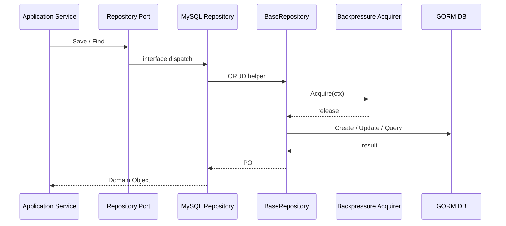

# MySQL 仓储与 UnitOfWork

**本文回答**：MySQL 仓储如何通过 `BaseRepository`、mapper、PO、UnitOfWork 和 backpressure 承接结构化主数据。

## 30 秒结论

| 维度 | 结论 |
| ---- | ---- |
| 解决问题 | 结构化主模型需要事务、审计字段、错误转换和下游背压 |
| 核心对象 | `BaseRepository[T]`、各模块 repository、mapper、PO、UnitOfWork |
| 设计模式 | Repository、Mapper、Unit of Work、Error Translator |
| 当前边界 | repository 可依赖 domain port，不可依赖 REST/gRPC handler |

## 主图



## 架构设计

MySQL 访问分成三类职责：

| 职责 | 代码锚点 | 说明 |
| ---- | -------- | ---- |
| 通用 CRUD / 审计 / backpressure | [base.go](../../../internal/pkg/database/mysql/base.go) | 注入 `backpressure.Acquirer`，避免包级全局 limiter |
| 模块仓储 | [plan_repository.go](../../../internal/apiserver/infra/mysql/plan/plan_repository.go) | 实现 domain repository port |
| 事务上下文 | [uow.go](../../../internal/pkg/database/mysql/uow.go) | 通过 context 传递 tx，不把 gorm.Tx 暴露给 domain |

## 领域模型设计

MySQL PO 不是领域对象：

| 类型 | 作用 |
| ---- | ---- |
| 聚合根 | 保持业务不变量，例如 AssessmentPlan、AssessmentTask |
| PO | 保存字段、索引、表名、审计字段 |
| Mapper | 聚合与 PO 的双向转换 |
| Repository | 组合 Mapper + BaseRepository，隐藏 GORM |

## 为什么这样设计

替代方案是让领域对象直接带 `gorm` tag。当前没有这么做，因为：

- 领域对象生命周期不等于表行生命周期。
- Mongo/Outbox/ReadModel 也需要不同映射方式。
- GORM 错误和唯一索引错误需要转换为业务错误码。

## 取舍与边界

- `BaseRepository` 只承接通用 CRUD，不承接复杂业务查询。
- UnitOfWork 只服务 MySQL 事务；Mongo claim/outbox 不强行纳入同一事务抽象。
- Backpressure 只限制等待下游槽位，不限制 DB 执行时间。

## 代码锚点与测试锚点

| 能力 | 锚点 |
| ---- | ---- |
| BaseRepository limiter 注入 | [backpressure_test.go](../../../internal/pkg/database/mysql/backpressure_test.go) |
| 错误转换 | [translator.go](../../../internal/pkg/database/mysql/translator.go)、[translator_test.go](../../../internal/pkg/database/mysql/translator_test.go) |
| Plan repository | [plan_repository.go](../../../internal/apiserver/infra/mysql/plan/plan_repository.go) |

## Verify

```bash
go test ./internal/pkg/database/mysql ./internal/apiserver/infra/mysql/...
```
