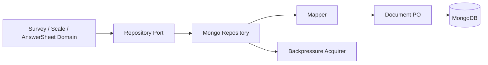

# Mongo 文档仓储

**本文回答**：Mongo 在 `qs-server` 中如何承接问卷/答卷/量表文档、durable submit 和 Mongo outbox，并与 MySQL 主模型保持边界。

## 30 秒结论

| 维度 | 结论 |
| ---- | ---- |
| 解决问题 | 半结构化问卷、答卷、量表内容更适合文档存储 |
| 核心对象 | `BaseRepository`、document PO、mapper、durable submit repository、eventoutbox store |
| 设计模式 | Repository、Document Mapper、State Transition Helper |
| 当前边界 | Mongo 不替代 MySQL 的结构化主模型；outbox claim 保留 Mongo 专用实现 |

## 主图



## 架构设计

Mongo 的价值在于承载“结构稳定性较低、内容嵌套较多”的对象：

| 模块 | Mongo 锚点 | 说明 |
| ---- | ---------- | ---- |
| questionnaire | [repo.go](../../../internal/apiserver/infra/mongo/questionnaire/repo.go) | 问卷结构和题目树 |
| scale | [repo.go](../../../internal/apiserver/infra/mongo/scale/repo.go) | 量表规则和解释内容 |
| answersheet | [repo.go](../../../internal/apiserver/infra/mongo/answersheet/repo.go) | 答卷与 durable submit |
| eventoutbox | [store.go](../../../internal/apiserver/infra/mongo/eventoutbox/store.go) | Mongo outbox claim/mark |

## 模型设计

Mongo document 保留三个约束：

1. document 字段表达持久化格式，不表达完整领域行为。
2. mapper 负责从 domain object 转换为 document。
3. repository 负责索引查询、claim、状态更新和错误转换。

## 设计模式应用

| 模式 | 使用点 | 说明 |
| ---- | ------ | ---- |
| Document Mapper | mapper 文件 | 聚合结构和 document schema 解耦 |
| Repository | repo 文件 | 应用服务只看 port，不看 Mongo driver |
| State Transition | eventoutbox store / outboxcore | claim、mark published/failed 不散落在 relay |

## 取舍与边界

- Mongo claim 使用 `FindOneAndUpdate` 等 Mongo 原生能力，不与 MySQL `FOR UPDATE SKIP LOCKED` 合并。
- Mongo outbox 与 MySQL outbox 共享 `outboxcore` 状态/codec/policy，但不共享 DB-specific claim 实现。
- 文档模型的索引要通过 migration 文件维护，不在运行时动态创建。

## 代码锚点与测试锚点

| 能力 | 锚点 |
| ---- | ---- |
| Mongo BaseRepository limiter | [backpressure_test.go](../../../internal/apiserver/infra/mongo/backpressure_test.go) |
| Mongo outbox contract | [store_test.go](../../../internal/apiserver/infra/mongo/eventoutbox/store_test.go) |
| Durable submit | [durable_submit.go](../../../internal/apiserver/infra/mongo/answersheet/durable_submit.go) |

## Verify

```bash
go test ./internal/apiserver/infra/mongo/...
```
