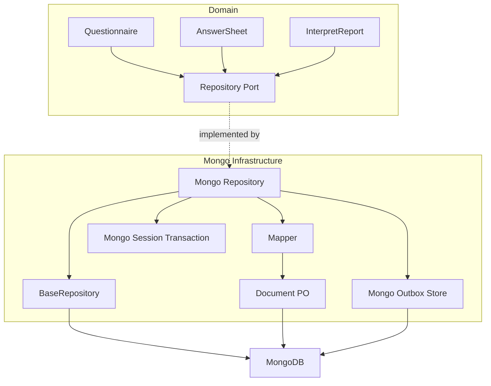
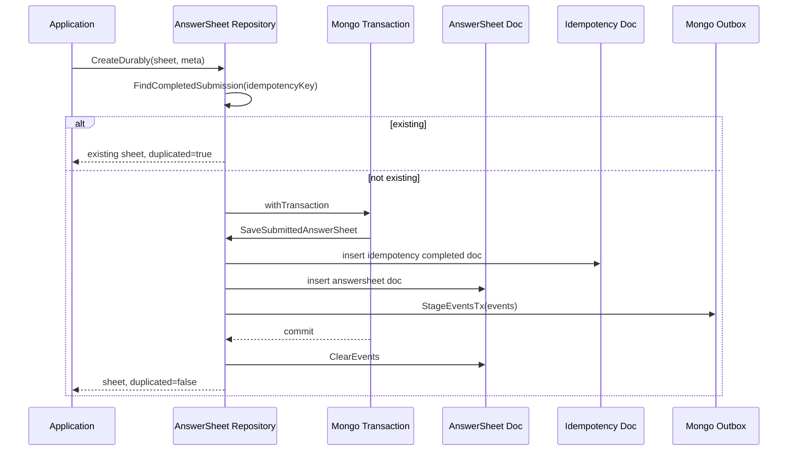

# Mongo 文档仓储

**本文回答**：qs-server 中 MongoDB 如何承接 Questionnaire、AnswerSheet、Report 等文档型聚合；`BaseRepository`、Document、Mapper、session transaction、durable submit、Mongo outbox 如何协作；Mongo 和 MySQL 的职责边界是什么；新增 Mongo 文档仓储时应该注意哪些事务、索引、幂等和事件出站问题。

---

## 30 秒结论

| 维度 | 结论 |
| ---- | ---- |
| 模块定位 | Mongo Data Access 承接结构嵌套深、版本/快照明显、文档聚合强的数据 |
| 典型对象 | Questionnaire、AnswerSheet、Report、Mongo outbox、部分行为/文档型数据 |
| 核心组件 | `infra/mongo.BaseRepository`、Document PO、Mapper、Mongo Repository、Mongo session transaction、Mongo outbox store |
| BaseRepository | 封装 collection 级 CRUD，并支持 backpressure limiter |
| BaseDocument | 包含 `_id`、`domain_id`、created/updated/deleted 时间和审计字段 |
| 审计 | `ApplyAuditCreate` / `ApplyAuditUpdate` 从 context 读取 userID 写入 document 审计字段 |
| Durable submit | AnswerSheet `CreateDurably` 会在同一 Mongo transaction 内写答卷、幂等记录、outbox events |
| Outbox | Mongo outbox `Stage` 要求 active Mongo session transaction |
| Claim | Mongo outbox 用 `FindOneAndUpdate` claim，优先少量 failed/stale publishing，再处理 pending |
| 关键边界 | Mongo 不替代 MySQL 的结构化主模型；文档聚合不等于随意无 schema；索引和 schema 演进仍需 migration 管理 |

一句话概括：

> **Mongo 在 qs-server 中不是“随便存 JSON”，而是用于承载文档型聚合、快照和 durable submit 这类更适合文档模型的业务事实。**

---

## 1. Mongo 为什么存在

qs-server 中有些对象天然是文档型：

| 对象 | 文档特征 |
| ---- | -------- |
| Questionnaire | 题目树、选项、校验规则、计分规则、版本快照 |
| AnswerSheet | 答案列表、题级分数、填写上下文、提交事实 |
| Report | 维度解读、建议、结论、结构化报告内容 |
| Scale snapshot / rules | 因子、规则、解释文案嵌套结构 |

这些数据如果强行拆成很多 MySQL 表，会带来：

- 结构复杂。
- join 多。
- 版本快照维护成本高。
- 聚合读写不自然。
- 文档整体加载困难。

Mongo 更适合这种“聚合内结构复杂，但聚合边界清楚”的数据。

---

## 2. Mongo Data Access 总图



---

## 3. Mongo 适用边界

### 3.1 适合 Mongo

| 场景 | 说明 |
| ---- | ---- |
| 聚合内部结构嵌套深 | 问卷题目树、报告维度 |
| 快照语义明显 | published snapshot |
| 一次读取需要整个聚合 | AnswerSheet / Report |
| 字段结构可能演进 | 问卷规则、解释配置 |
| 文档和事件同边界 | AnswerSheet durable submit + Mongo outbox |

### 3.2 不适合 Mongo

| 场景 | 更适合 |
| ---- | ------ |
| 高频关系查询 | MySQL |
| 强事务多表关系 | MySQL |
| 复杂统计聚合读模型 | MySQL read model |
| 权限关系和绑定 | MySQL |
| 高基数列表分页和排序 | MySQL 或专用 read model |
| 需要 SQL join 的结构化查询 | MySQL |

---

## 4. BaseRepository

`infra/mongo.BaseRepository` 是 Mongo collection 级 helper。

核心字段：

| 字段 | 说明 |
| ---- | ---- |
| `db *mongo.Database` | Mongo database |
| `collection *mongo.Collection` | 目标 collection |
| `limiter backpressure.Acquirer` | 下游背压保护 |

### 4.1 提供的 CRUD

| 方法 | 说明 |
| ---- | ---- |
| `InsertOne` | 插入文档 |
| `FindOne` | 按 filter 查询单文档 |
| `FindByID` | 按 ObjectID 查询 |
| `UpdateOne` | 按 filter 更新 |
| `UpdateByID` | 按 ObjectID 更新 |
| `DeleteOne` | 删除单文档 |
| `DeleteByID` | 按 ObjectID 删除 |
| `Find` | 返回 cursor |
| `CountDocuments` | 文档计数 |
| `ExistsByFilter` | 是否存在 |

所有这些方法都会在执行前调用 backpressure acquire，如果注入了 limiter。

### 4.2 BaseRepository 不是什么

它不是：

- 领域 repository。
- Mongo 事务管理器。
- 业务查询 DSL。
- outbox store。
- schema migration 工具。
- 权限校验器。

复杂查询和业务语义仍由模块 repository 实现。

---

## 5. BaseDocument

`BaseDocument` 是 Mongo 文档基础字段。

| 字段 | 说明 |
| ---- | ---- |
| `_id` | Mongo ObjectID |
| `domain_id` | 领域 ID |
| `created_at` | 创建时间 |
| `updated_at` | 更新时间 |
| `deleted_at` | 软删除时间 |
| `created_by` | 创建人 |
| `updated_by` | 更新人 |
| `deleted_by` | 删除人 |

### 5.1 审计方法

| 方法 | 说明 |
| ---- | ---- |
| `ApplyAuditCreate` | 从 ctx userID 设置 created_by / updated_by |
| `ApplyAuditUpdate` | 从 ctx userID 设置 updated_by |
| `AuditUserID` | 从 context 取审计用户 |
| `SetCreatedBy / SetUpdatedBy / SetDeletedBy` | 写审计字段 |

### 5.2 domain_id 的意义

Mongo `_id` 是 Mongo 内部文档 ID；`domain_id` 是业务领域 ID。

这种设计让领域层继续使用统一的 `meta.ID` / uint64 语义，而不把 Mongo ObjectID 泄漏给 domain。

---

## 6. Document / Mapper

### 6.1 Document PO

Mongo Document PO 负责：

- collection name。
- bson tag。
- 嵌套文档结构。
- Mongo 兼容类型。
- 审计字段。
- 查询字段。
- 软删除字段。

### 6.2 Mapper

Mapper 负责：

```text
Domain Object -> Document PO
Document PO -> Domain Object
```

例如：

- `QuestionnaireMapper`。
- `AnswerSheetMapper`。
- Report mapper。

Mapper 不应该：

- 发事件。
- 开事务。
- 调用其它 repository。
- 做权限判断。
- 推进状态机。

---

## 7. Questionnaire Mongo 仓储

Questionnaire 是典型文档聚合。

### 7.1 Head 与 Published Snapshot

Questionnaire repository 会区分：

```text
RecordRoleHead
RecordRolePublishedSnapshot
```

并使用：

```text
is_active_published
```

管理当前对外生效的已发布快照。

这说明 Mongo 不只是存一个当前 JSON，而是在文档层承载版本快照语义。

### 7.2 典型方法

| 方法 | 说明 |
| ---- | ---- |
| `Create` | 创建工作版本 head |
| `CreatePublishedSnapshot` | 创建或更新已发布快照 |
| `FindByCode` | 查询工作版本 |
| `FindPublishedByCode` | 查询当前已发布版本 |
| `FindLatestPublishedByCode` | 查询最新发布快照 |
| `FindByCodeVersion` | 按 code + version 查询 |
| `LoadQuestions` | 加载 questions 子文档 |
| `SetActivePublishedVersion` | 切换当前生效版本 |
| `ClearActivePublishedVersion` | 清空激活版本 |
| `Remove` | 软删除问卷族 |

### 7.3 为什么适合 Mongo

Questionnaire 内部包含：

- questions。
- options。
- validation rules。
- scoring rules。
- version snapshot。
- publish lifecycle。

这些结构在 Mongo 文档中更自然。

---

## 8. AnswerSheet Mongo 仓储

AnswerSheet 是答卷文档聚合。

### 8.1 普通 Create / Update

`Repository.Create` 会：

1. domain -> PO。
2. ApplyAuditCreate。
3. BeforeInsert。
4. ToBsonM。
5. InsertOne。
6. 将生成的 domain_id 设置回领域对象。

`Repository.Update` 会：

1. domain -> PO。
2. ApplyAuditUpdate。
3. BeforeUpdate。
4. ToBsonM。
5. 删除 `_id`，避免更新主键。
6. 使用 `$set` 更新。

### 8.2 FindByID

通过：

```text
domain_id
deleted_at = nil
```

查询，并用 mapper 转回 domain AnswerSheet。

### 8.3 软删除

Delete 不直接物理删除，而是设置：

```text
deleted_at
updated_at
```

---

## 9. Durable Submit

`AnswerSheet.CreateDurably` 是 Mongo 文档仓储最关键的可靠写入例子。

### 9.1 它解决什么

答卷提交必须同时完成：

```text
保存 AnswerSheet 文档
记录 idempotency key
产生 answersheet.submitted
产生 footprint.answersheet_submitted
stage Mongo outbox
```

如果这些不在同一个边界，会出现：

| 场景 | 后果 |
| ---- | ---- |
| 答卷保存成功，但事件没出站 | 后续不会创建 Assessment |
| 事件出站成功，但答卷没保存 | worker 找不到答卷 |
| 幂等记录缺失 | 重复提交产生多份答卷 |
| footprint 丢失 | 统计漏斗缺失 |

### 9.2 CreateDurably 流程



### 9.3 SaveSubmittedAnswerSheet

它会：

1. domain -> PO。
2. ApplyAuditCreate。
3. BeforeInsert。
4. AssignID。
5. `sheet.RaiseSubmittedEvent(...)`。
6. 插入 idempotency document。
7. 插入 answer sheet document。
8. 收集 sheet events。
9. 追加 `footprint.answersheet_submitted`。
10. 返回 events 给 CreateDurably stage outbox。

### 9.4 Idempotency

如果提交时带 idempotency key：

1. 先查 completed submission。
2. 如果已存在，直接返回已有 AnswerSheet。
3. 如果 transaction 失败，会短暂等待同 key 的 completed result。
4. 找到则返回已有结果，避免并发重复提交。

这是一种应用级幂等保护。

---

## 10. Mongo Outbox

Mongo outbox collection：

```text
domain_event_outbox
```

### 10.1 Stage

Mongo outbox `Stage(ctx, events...)` 要求：

```text
ctx.(mongo.SessionContext)
```

如果不是 active session transaction，返回：

```text
ErrActiveSessionTransactionRequired
```

这防止 durable event 在事务外被写入。

### 10.2 Indexes

Mongo outbox 会创建：

| Index | 用途 |
| ----- | ---- |
| `uk_event_id` | event_id 唯一 |
| `idx_status_next_attempt_at` | 按状态和下次尝试时间查询 |
| pending partial index | pending claim |
| failed partial index | failed retry |
| publishing partial index | stale publishing recovery |

### 10.3 ClaimDueEvents

Mongo claim 策略：

1. 先 claim 少量 failed。
2. 再 claim 少量 stale publishing。
3. 再 claim pending。
4. 如果 batch 未满，再继续 failed。
5. 如果还未满，再继续 stale publishing。

这样做是为了避免：

```text
大量 pending backlog 让 failed/stale publishing 永远得不到恢复机会。
```

### 10.4 ClaimOne

使用：

```text
FindOneAndUpdate(filter, {$set: {status: publishing, updated_at: now}})
```

并返回更新后的文档。

decode 失败时：

```text
NewDecodeFailureTransition
MarkEventFailed
```

---

## 11. Mongo Transaction Runner

container assembler 提供 Mongo transaction runner：

```text
newMongoTransactionRunner(db)
  -> db.Client().StartSession()
  -> session.WithTransaction(ctx, func(txCtx mongo.SessionContext) { fn(txCtx) })
```

它适配到 application 层统一接口：

```go
type Runner interface {
    WithinTransaction(ctx context.Context, fn func(txCtx context.Context) error) error
}
```

这使 application service 可以使用统一的 transaction.Runner，而不用直接依赖 Mongo session API。

---

## 12. Mongo 与 MySQL 的边界

| 维度 | Mongo | MySQL |
| ---- | ----- | ----- |
| 典型数据 | 文档聚合、快照、答卷、报告 | 结构化主数据、关系、任务、统计 |
| ID | `_id` + `domain_id` | uint64 primary key |
| 事务 | session transaction | GORM transaction / UoW |
| 查询 | document filter / aggregate | SQL / GORM |
| 版本快照 | 自然文档化 | 通常拆表/行 |
| outbox stage | Mongo session context | MySQL tx context |
| claim | FindOneAndUpdate | FOR UPDATE SKIP LOCKED |
| migration | Mongo backend | MySQL backend |

不要因为 Mongo 灵活就把所有数据都放到 Mongo；也不要因为 MySQL 强事务就把文档聚合拆碎。

---

## 13. 与 Backpressure 的协作

Mongo BaseRepository 也支持 `backpressure.Acquirer`。

调用：

```text
InsertOne / FindOne / UpdateOne / Find / CountDocuments
  -> acquire
  -> Mongo operation
  -> release
```

适合保护：

- 高并发答卷提交。
- 报告查询。
- 问卷大文档读取。
- Mongo outbox claim。
- 批量读写。

注意：backpressure 控制进入 Mongo 操作的并发，不解决 Mongo 查询慢或索引缺失。

---

## 14. 索引和 Migration

文档模型也需要索引和 schema 演进。

### 14.1 必须明确的索引

| 场景 | 索引 |
| ---- | ---- |
| AnswerSheet idempotency | idempotency_key unique |
| AnswerSheet find by domain_id | domain_id |
| Questionnaire find by code/version/record_role | code/version/record_role |
| Published snapshot active | code + record_role + is_active_published |
| Mongo outbox claim | status + next_attempt_at |
| Mongo outbox event_id | unique event_id |

### 14.2 不建议运行时随意建索引

部分 repository 当前会 ensure indexes，但文档层面应明确：

- 重要 schema/index 应进入 migration。
- 运行时 ensure 只能作为兼容/保护。
- 索引变更需要 review 和回滚策略。

---

## 15. 设计模式与实现意图

| 模式 | 当前实现 | 意图 |
| ---- | -------- | ---- |
| Document Repository | Mongo repository | 管理文档聚合存取 |
| Document Mapper | Mapper | 隔离 domain 与 bson schema |
| BaseRepository | common Mongo CRUD | 统一 collection 操作和 backpressure |
| BaseDocument | common fields | domain_id、审计、软删除统一 |
| Transactional Outbox | Mongo outbox store | 文档状态与事件同事务 |
| Idempotency Record | AnswerSheetSubmitIdempotencyPO | 防重复提交 |
| Snapshot Pattern | Questionnaire published snapshot | 版本发布后稳定读取 |
| Session Transaction | mongo.SessionContext | 多文档写入原子性 |

---

## 16. 设计取舍

| 设计 | 收益 | 代价 |
| ---- | ---- | ---- |
| Mongo 承接文档聚合 | 问卷/答卷/报告结构自然 | 索引和查询治理更重要 |
| domain_id 独立于 ObjectID | 领域 ID 不泄漏 Mongo 细节 | 需要转换和唯一约束 |
| Mapper 分离 | domain 干净 | 转换代码增加 |
| durable submit 同事务写 outbox | 答卷提交可靠驱动后续流程 | transaction 复杂度增加 |
| idempotency key | 并发重复提交可恢复 | 需要额外 collection 和查询 |
| Mongo outbox claim 独立实现 | 贴合 Mongo 能力 | 和 MySQL store 不完全一致 |
| runtime ensure indexes | 启动保护 | 关键索引仍应 migration 管理 |

---

## 17. 常见误区

### 17.1 “Mongo 就是无 schema”

错误。Mongo 没有 SQL schema，不代表没有文档结构、索引和迁移责任。

### 17.2 “Document 可以直接当 domain object”

不应该。Document 是持久化结构，domain object 承载行为和不变量。

### 17.3 “Mongo repository 可以替代 MySQL repository”

不能。它们承接不同数据形态和事务/查询需求。

### 17.4 “AnswerSheet 保存成功就等于流程完成”

不对。AnswerSheet durable submit 还要保证 outbox event stage，后续 worker 才能创建 Assessment。

### 17.5 “Mongo outbox 可以事务外 Stage”

不能。Stage 要求 active session transaction。

### 17.6 “idempotency key 只是前端用”

不只是。它是 durable submit 并发重复提交恢复的重要依据。

---

## 18. 排障路径

### 18.1 答卷提交成功但没有 Assessment

检查：

1. `CreateDurably` 是否执行成功。
2. AnswerSheet document 是否存在。
3. idempotency document 是否 completed。
4. Mongo outbox 是否有 `answersheet.submitted`。
5. Mongo outbox 是否 published。
6. worker 是否消费。
7. internal gRPC 是否创建 Assessment。

### 18.2 重复提交生成多份答卷

检查：

1. 是否传 idempotency key。
2. idempotency unique index 是否存在。
3. `FindCompletedSubmission` 是否命中。
4. transaction 失败后的 `WaitForCompletedSubmission` 是否等待到结果。
5. 前端/collection 是否正确透传 key。

### 18.3 Mongo outbox pending/failed

检查：

1. outbox indexes。
2. ClaimDueEvents 是否执行。
3. failed/stale/pending claim 顺序。
4. payload decode 是否失败。
5. MarkPublished/Failed 是否成功。
6. MQ publisher 是否可用。

### 18.4 Questionnaire 已发布但读取不到

检查：

1. head 记录是否存在。
2. published snapshot 是否存在。
3. record_role 是否正确。
4. is_active_published 是否正确。
5. code/version 查询条件。
6. deleted_at 是否 nil。
7. LoadQuestions projection 是否只取 questions。

### 18.5 Mongo 查询慢

检查：

1. filter 是否命中索引。
2. projection 是否合理。
3. 是否加载过大文档。
4. 是否需要 read model。
5. backpressure 是否 timeout。
6. Mongo slow query logs。

---

## 19. 修改指南

### 19.1 新增 Mongo 文档聚合

必须：

1. 定义 domain aggregate。
2. 定义 repository port。
3. 设计 Document PO。
4. 设计 Mapper。
5. 实现 Mongo repository。
6. 设计索引和 migration。
7. 如需 durable event，接 Mongo outbox。
8. 补 repository tests。
9. 更新文档。

### 19.2 新增 durable Mongo 写入

必须：

1. 明确业务事实。
2. 明确 idempotency 是否需要。
3. 使用 session transaction。
4. 在 transaction 内保存 document。
5. 在 transaction 内 stage outbox events。
6. transaction commit 后 ClearEvents。
7. 补失败和重复提交测试。

### 19.3 修改 Questionnaire 版本逻辑

必须检查：

- RecordRoleHead。
- RecordRolePublishedSnapshot。
- is_active_published。
- SetActivePublishedVersion。
- FindPublishedByCode。
- FindByCodeVersion。
- migration/index。
- Survey/Scale 文档。

---

## 20. 代码锚点

### Base

- Mongo BaseRepository：[../../../internal/apiserver/infra/mongo/base.go](../../../internal/apiserver/infra/mongo/base.go)
- Transaction assembler：[../../../internal/apiserver/container/assembler/transaction.go](../../../internal/apiserver/container/assembler/transaction.go)

### AnswerSheet

- AnswerSheet repository：[../../../internal/apiserver/infra/mongo/answersheet/repo.go](../../../internal/apiserver/infra/mongo/answersheet/repo.go)
- Durable submit：[../../../internal/apiserver/infra/mongo/answersheet/durable_submit.go](../../../internal/apiserver/infra/mongo/answersheet/durable_submit.go)

### Questionnaire

- Questionnaire repository：[../../../internal/apiserver/infra/mongo/questionnaire/repo.go](../../../internal/apiserver/infra/mongo/questionnaire/repo.go)

### Outbox

- Mongo outbox store：[../../../internal/apiserver/infra/mongo/eventoutbox/store.go](../../../internal/apiserver/infra/mongo/eventoutbox/store.go)

---

## 21. Verify

```bash
go test ./internal/apiserver/infra/mongo
go test ./internal/apiserver/infra/mongo/answersheet
go test ./internal/apiserver/infra/mongo/questionnaire
go test ./internal/apiserver/infra/mongo/eventoutbox
```

如果修改 durable submit：

```bash
go test ./internal/apiserver/infra/mongo/answersheet ./internal/apiserver/outboxcore ./internal/pkg/eventcatalog
```

如果修改事务装配：

```bash
go test ./internal/apiserver/container/assembler ./internal/apiserver/application/transaction
```

如果修改文档：

```bash
make docs-hygiene
git diff --check
```

---

## 22. 下一跳

| 目标 | 文档 |
| ---- | ---- |
| Migration 与 Schema | [03-Migration与Schema演进.md](./03-Migration与Schema演进.md) |
| ReadModel 与 Statistics | [04-ReadModel与Statistics.md](./04-ReadModel与Statistics.md) |
| 新增持久化能力 | [05-新增持久化能力SOP.md](./05-新增持久化能力SOP.md) |
| MySQL 仓储 | [01-MySQL仓储与UnitOfWork.md](./01-MySQL仓储与UnitOfWork.md) |
| 回看整体架构 | [00-整体架构.md](./00-整体架构.md) |
