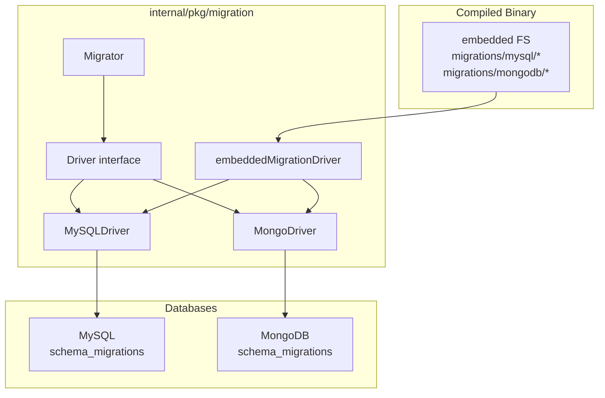
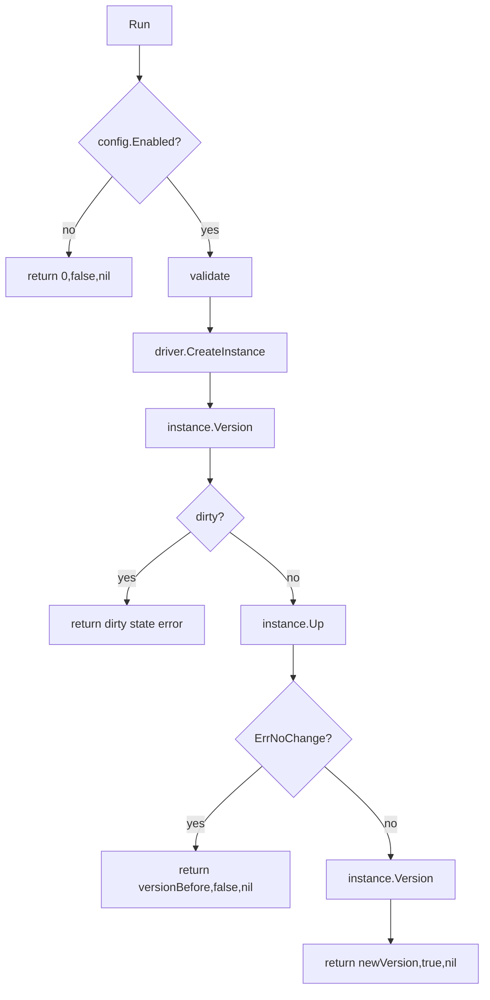

# Migration 与 Schema 演进

**本文回答**：qs-server 的 MySQL / Mongo schema 如何通过 migration 机制演进；migration 文件为什么是机器契约；`Migrator`、`Driver`、embedded FS、MySQL/Mongo backend、dirty state、rollback、version 查询分别承担什么职责；migration 与 repository、read model、outbox、一次性历史修复脚本的边界在哪里。

---

## 30 秒结论

| 维度 | 结论 |
| ---- | ---- |
| 模块定位 | Migration 是 qs-server 的**数据库 schema 演进机制**，负责让 MySQL/Mongo 的表、集合、索引、字段可追踪、可重复、可审计地演进 |
| 真值位置 | migration 文件位于 `internal/pkg/migration/migrations/mysql` 与 `internal/pkg/migration/migrations/mongodb` |
| 文件嵌入 | migration 文件通过 `//go:embed migrations/mysql/* migrations/mongodb/*` 打进二进制，不依赖外部挂载 |
| Driver 模型 | `Driver` 接口统一 MySQL/Mongo backend，暴露 `Backend()`、`SourcePath()`、`CreateInstance()` |
| MySQL Driver | 使用 `golang-migrate` 的 MySQL driver，source path 为 `migrations/mysql` |
| Mongo Driver | 使用 `golang-migrate` 的 MongoDB driver，source path 为 `migrations/mongodb` |
| 版本记录 | 默认 migration table/collection 是 `schema_migrations` |
| Run 行为 | `Run()` 会检查 enabled、配置、当前 version、dirty state，再执行 `Up()` |
| Dirty 边界 | dirty state 不自动修，直接返回错误，要求人工修复 |
| Rollback | `Rollback()` 只回滚最近一步 migration，不能替代业务数据修复 |
| 不负责 | Migration 只负责 schema/index 演进，不承担复杂历史数据修复、业务补偿、在线治理 API |
| 关键原则 | repository 依赖 schema，不能在运行时偷偷修改关键 schema；重要表/索引变更必须进入 migration |

一句话概括：

> **Migration 是数据库结构的机器化历史；repository 只能使用 schema，不能偷偷定义 schema。**

---

## 1. 为什么需要 Migration

qs-server 同时使用：

```text
MySQL
MongoDB
Statistics read model
MySQL outbox
Mongo outbox
```

这些持久化结构会不断演进：

- 新增业务表。
- 新增 Mongo collection。
- 新增唯一索引。
- 新增 read model 字段。
- 新增 outbox 索引。
- 废弃旧统计表。
- 调整字段类型。
- 增加查询索引。

如果这些变化只存在于代码或人工 SQL 里，会造成：

| 问题 | 后果 |
| ---- | ---- |
| dev/prod schema 不一致 | 线上才暴露查询或写入错误 |
| repository 假设的字段不存在 | 运行时 panic / SQL error |
| 索引漏建 | 查询慢、锁等待、outbox claim 慢 |
| 无版本记录 | 不知道数据库处在哪个状态 |
| 无 down 文件 | 回滚困难 |
| 运行时偷偷建索引 | 环境漂移，审计困难 |
| 历史修复混入 schema migration | migration 不可预测、不可重复 |

Migration 让 schema 演进变成可追踪的机器契约。

---

## 2. Migration 总体架构



关键点：

1. migration 文件被 embed 到二进制。
2. Migrator 使用 Driver 创建 migrate instance。
3. Driver 决定 backend、source path 和 database driver。
4. MySQL/Mongo 使用各自 backend 和版本记录表/集合。
5. Run/Rollback/Version 统一由 Migrator 暴露。

---

## 3. Driver 接口

`migration.Driver` 定义：

```go
type Driver interface {
    Backend() Backend
    SourcePath() string
    CreateInstance(fs embed.FS, config *Config) (*migrate.Migrate, error)
}
```

### 3.1 Backend

当前 backend：

```text
mysql
mongodb
```

它用于告诉 `golang-migrate` 当前要使用哪个 database driver。

### 3.2 SourcePath

| Driver | SourcePath |
| ------ | ---------- |
| MySQLDriver | `migrations/mysql` |
| MongoDriver | `migrations/mongodb` |

### 3.3 CreateInstance

每个 driver 根据自己的 DB client 创建 migrate instance。

MySQL：

```text
mysql.WithInstance(sql.DB, mysql.Config{
  DatabaseName,
  MigrationsTable,
})
```

Mongo：

```text
mongodb.WithInstance(mongo.Client, mongodb.Config{
  DatabaseName,
  MigrationsCollection,
})
```

---

## 4. embeddedMigrationDriver

`embeddedMigrationDriver` 保存：

| 字段 | 说明 |
| ---- | ---- |
| `backend` | mysql / mongodb |
| `sourcePath` | migrations/mysql 或 migrations/mongodb |
| `prefix` | 错误消息前缀 |

它通过 `iofs.New(fs, sourcePath)` 从 embedded FS 创建 source driver，再通过：

```text
migrate.NewWithInstance("iofs", sourceDriver, string(backend), databaseDriver)
```

创建 migrate instance。

### 4.1 为什么使用 embedded FS

好处：

| 收益 | 说明 |
| ---- | ---- |
| 二进制自包含 | 部署时不需要额外挂载 migrations 目录 |
| dev/prod 一致 | 使用同一套编译进二进制的 migration 文件 |
| 减少路径问题 | 运行目录变化不影响 migration source |
| CI 可测 | migration 文件随代码一起审查和测试 |

代价：

- 修改 migration 后必须重新构建二进制。
- 线上不能临时塞入未审查 migration 文件。

这正是想要的约束。

---

## 5. Config

`migration.Config` 包含：

| 字段 | 说明 |
| ---- | ---- |
| `Enabled` | 是否启用自动 migration |
| `AutoSeed` | 是否自动加载种子数据 |
| `Database` | 数据库名称 |
| `MigrationsTable` | MySQL migration 版本表 |
| `MigrationsCollection` | Mongo migration 版本集合 |

默认：

```text
MigrationsTable = schema_migrations
MigrationsCollection = schema_migrations
```

### 5.1 Enabled

`Run()` 中如果 `Enabled=false`：

```text
return 0, false, nil
```

这表示 migration 可以按环境关闭。

### 5.2 Database 必填

`validate()` 要求：

```text
config.Database != ""
```

如果数据库名缺失，migration 不能执行。

---

## 6. Migrator

`Migrator` 包含：

```go
type Migrator struct {
    driver Driver
    config *Config
}
```

构造方式：

| 方法 | 说明 |
| ---- | ---- |
| `NewMigrator(db *sql.DB, config)` | MySQL 兼容构造 |
| `NewMongoMigrator(client *mongo.Client, config)` | Mongo 兼容构造 |
| `NewMigratorWithDriver(driver, config)` | 推荐通用构造 |

### 6.1 Backend

`Backend()` 返回当前 driver 的 backend。

这让调用方可以知道当前运行的是：

```text
mysql migration
mongodb migration
```

---

## 7. Run 流程

`Run()` 的逻辑：



### 7.1 current version

如果当前数据库没有版本记录：

```text
migrate.ErrNilVersion
```

会被解释成：

```text
versionBefore = 0
```

### 7.2 dirty state

如果 version 返回 dirty：

```text
database is in dirty state at version N, please fix manually
```

系统不会自动继续。

这是正确设计：dirty 代表上一次 migration 未完整成功，自动继续可能扩大破坏范围。

### 7.3 no change

如果 `Up()` 返回 `migrate.ErrNoChange`：

```text
数据库已是最新版本
return versionBefore, false, nil
```

---

## 8. Rollback 与 Version

### 8.1 Rollback

`Rollback()` 会：

```text
instance.Steps(-1)
```

即只回滚最近一步 migration。

注意：

- Rollback 是 schema rollback。
- 不等于业务数据修复。
- 不一定安全，尤其涉及 drop column/drop table。
- 需要结合生产数据风险评估。

### 8.2 Version

`Version()` 返回：

```text
version
dirty
error
```

用于检查当前数据库 migration 状态。

---

## 9. MySQL Migration

### 9.1 使用方式

MySQLDriver：

```text
NewMySQLDriver(db *sql.DB)
  -> backend mysql
  -> sourcePath migrations/mysql
  -> database driver mysql.WithInstance
```

### 9.2 适合表达的 schema 变化

| 类型 | 示例 |
| ---- | ---- |
| 创建表 | assessment_task、domain_event_outbox |
| 增加列 | new status / metadata field |
| 增加索引 | org_id + created_at、status + next_attempt_at |
| 增加唯一约束 | idempotency key、event_id |
| 删除旧表 | 废弃统计表 |
| 调整 read model | statistics_* 表字段 |

### 9.3 MySQL migration 文件原则

推荐：

```text
<version>_<name>.up.sql
<version>_<name>.down.sql
```

原则：

- up/down 成对。
- 文件名表达业务含义。
- up 只做 schema 演进，不塞复杂业务逻辑。
- down 尽量可回滚；不可逆时必须在评审中说明。
- 大表变更要评估锁表和回滚策略。
- 索引增加要考虑线上执行时间。

---

## 10. Mongo Migration

### 10.1 使用方式

MongoDriver：

```text
NewMongoDriver(client *mongo.Client)
  -> backend mongodb
  -> sourcePath migrations/mongodb
  -> database driver mongodb.WithInstance
```

### 10.2 适合表达的 schema 变化

| 类型 | 示例 |
| ---- | ---- |
| 创建 collection | 新文档聚合 |
| 创建索引 | domain_id、code/version、event_id |
| 创建唯一索引 | idempotency_key、event_id |
| 添加字段默认值 | document schema 演进 |
| 重命名字段 | 需要谨慎 |
| 删除旧索引 | 废弃查询路径 |
| 修改 partial index | outbox pending/failed/publishing |

### 10.3 Mongo 不是无 schema

Mongo 没有 SQL schema，但仍然需要：

- collection 约定。
- bson 字段约定。
- index 约定。
- unique constraint。
- partial filter。
- versioned document migration。
- backward compatibility。

不要把 Mongo 当成“运行时想怎么写就怎么写”。

---

## 11. Migration 与 Repository 的关系

Repository 使用 schema，不定义 schema。

### 11.1 正确关系

```text
migration
  -> 创建表/集合/索引/字段
repository
  -> 假设 schema 已存在
  -> 执行 read/write
```

### 11.2 错误关系

```text
repository init
  -> 悄悄创建表/索引
  -> dev/prod schema 漂移
```

当前部分 Mongo repository 有 `ensureIndexes` 作为保护或兼容措施，但文档层面应明确：

> 关键 schema 和索引应进入 migration，运行时 ensure 不能替代 migration。

---

## 12. Migration 与 Outbox 的关系

Outbox store 依赖 schema：

| Store | Schema |
| ----- | ------ |
| MySQL outbox | `domain_event_outbox` 表、event_id unique、status/next_attempt_at index |
| Mongo outbox | `domain_event_outbox` collection、event_id unique、status/next_attempt_at 和 partial indexes |

如果 outbox schema 不对，会造成：

- Stage 失败。
- ClaimDueEvents 慢或失败。
- duplicate event_id 无法防止。
- pending/failed 查询不命中索引。
- backlog 状态不准。

因此 outbox migration 是事件系统可靠性的基础。

---

## 13. Migration 与 ReadModel 的关系

Statistics read model 强依赖 migration。

典型 read model 表：

```text
statistics_journey_daily
statistics_content_daily
statistics_plan_daily
statistics_org_snapshot
```

这些表的字段、索引、唯一键要由 migration 管理。

### 13.1 ReadModel 变更规则

如果新增统计口径字段：

1. 先写 migration 增加字段。
2. 更新 PO。
3. 更新 rebuild writer。
4. 更新 ReadModel adapter。
5. 更新 ReadService。
6. 补 backfill/rebuild 策略。
7. 更新 docs。

不要只改查询代码。

---

## 14. Migration 与历史数据修复的边界

### 14.1 Migration 负责

| 类型 | 示例 |
| ---- | ---- |
| schema 变化 | add table / add column / add index |
| 简单默认值 | new column default |
| 必要索引 | unique/index creation |
| 版本记录 | schema_migrations |

### 14.2 Migration 不负责

| 类型 | 应怎么做 |
| ---- | -------- |
| 大规模业务数据重算 | 单独 backfill job |
| 复杂历史补偿 | 专门 repair script + runbook |
| 人工修业务状态 | 运维审批 + 审计 |
| 长事务批量更新 | 分批脚本 |
| 跨模块业务语义修复 | 业务模块 SOP |

### 14.3 为什么不能混

如果把复杂历史修复塞进 migration：

- 部署时间不可控。
- rollback 不清楚。
- 环境差异导致结果不同。
- migration 无法安全重复。
- CI/CD 风险上升。

---

## 15. Dirty State 处理

dirty state 表示：

```text
上一次 migration 在某个版本执行失败，数据库状态不确定。
```

当前 `Run()` 遇到 dirty 会直接返回错误：

```text
database is in dirty state at version N, please fix manually
```

### 15.1 排查步骤

1. 查看 migration 版本表/集合。
2. 找到 dirty version。
3. 检查对应 up/down 文件。
4. 检查 DB 部分执行了哪些语句。
5. 决定手工修复 schema 或回滚。
6. 清理 dirty 标记。
7. 重新执行 migration。
8. 记录修复过程。

不要自动跳过 dirty migration。

---

## 16. 生产环境执行原则

### 16.1 执行前

检查：

- migration 文件已 code review。
- up/down 成对。
- 大表 DDL 风险。
- 索引创建耗时。
- 是否需要停机窗口。
- 是否影响旧代码兼容。
- 是否需要先发兼容字段再发代码。
- 是否需要 backfill。

### 16.2 执行中

观察：

- migration logs。
- DB lock。
- slow query。
- connection pool。
- schema_migrations。
- service readiness。

### 16.3 执行后

确认：

- Version 最新。
- dirty=false。
- repository tests / smoke tests。
- 关键接口可用。
- outbox claim 正常。
- statistics read model 查询正常。

---

## 17. Schema 演进兼容策略

推荐两阶段或三阶段：

### 17.1 新增字段

```text
1. migration add nullable/default field
2. 代码开始写新字段
3. backfill 旧数据
4. 如必要，再加 not null / unique
```

### 17.2 删除字段

```text
1. 代码停止读字段
2. 代码停止写字段
3. 观察一个发布周期
4. migration drop field
```

### 17.3 重命名字段

不要直接 rename。推荐：

```text
1. add new field
2. 双写
3. backfill
4. 读新字段
5. 停写旧字段
6. drop old field
```

### 17.4 索引变更

大表索引需要评估：

- online DDL。
- 锁表风险。
- 回滚策略。
- 索引大小。
- 查询计划是否真正使用。

---

## 18. 常见误区

### 18.1 “Mongo 没有 schema，所以不需要 migration”

错误。Mongo 仍有 collection、field、index、unique constraint 和 document shape。

### 18.2 “Repository 启动时 ensure index 就够了”

不够。关键索引应进入 migration，ensure index 只能作为兼容保护。

### 18.3 “Migration 适合做所有历史数据修复”

不适合。复杂历史修复应该单独 backfill。

### 18.4 “Dirty state 可以忽略”

不能。dirty 表示数据库可能处于半迁移状态，继续运行风险很高。

### 18.5 “Rollback 一定安全”

不一定。drop column/table 或数据转换可能不可逆。

### 18.6 “只改 PO 不写 migration”

错误。代码和数据库 schema 会漂移。

---

## 19. 排障路径

### 19.1 migration 没执行

检查：

1. Config.Enabled。
2. Database 是否为空。
3. driver 是否 nil。
4. migration 文件是否 embed。
5. source path 是否正确。
6. 当前 version 是否已最新。
7. ErrNoChange 是否被正确处理。

### 19.2 migration 执行失败

检查：

1. 失败版本。
2. SQL/JSON 文件语法。
3. 表/集合是否已存在。
4. 索引是否重复。
5. 权限。
6. DB 锁。
7. dirty state。
8. down 文件是否可回滚。

### 19.3 代码运行时报字段不存在

检查：

1. migration 是否已执行到对应版本。
2. 运行的二进制是否包含最新 migration。
3. DB 是否连接到正确环境。
4. schema_migrations 版本。
5. PO/Document 是否和 migration 对齐。

### 19.4 outbox claim 慢

检查：

1. outbox status/next_attempt_at 索引。
2. partial index 是否存在。
3. pending/failed/publishing 数量。
4. 查询计划。
5. migration 是否漏执行。

### 19.5 read model 查询异常

检查：

1. statistics 表是否存在。
2. 字段是否存在。
3. 索引是否存在。
4. rebuild writer 是否更新。
5. read model adapter 是否匹配新字段。
6. QueryCache 是否旧。

---

## 20. 修改指南

### 20.1 新增 MySQL migration

步骤：

1. 设计表/字段/索引。
2. 写 `*.up.sql`。
3. 写 `*.down.sql`。
4. 更新 PO。
5. 更新 repository/mapper。
6. 补 tests。
7. 验证 migration Run。
8. 更新文档。

### 20.2 新增 Mongo migration

步骤：

1. 设计 collection / index / field。
2. 写 Mongo migration 文件。
3. 更新 Document PO。
4. 更新 repository/mapper。
5. 如涉及索引，确认 unique/partial filter。
6. 补 tests。
7. 更新文档。

### 20.3 修改 read model schema

步骤：

1. 定义统计口径。
2. 写 migration。
3. 更新 PO。
4. 更新 rebuild writer。
5. 更新 ReadModel adapter。
6. 更新 ReadService。
7. 设计 backfill。
8. 清理/预热 QueryCache。
9. 更新 Statistics 文档。

---

## 21. 设计模式与实现意图

| 模式 | 当前实现 | 意图 |
| ---- | -------- | ---- |
| Embedded Migration Source | `//go:embed` | 二进制自包含迁移文件 |
| Driver Interface | `migration.Driver` | MySQL/Mongo 后端统一入口 |
| Backend-specific Driver | MySQLDriver / MongoDriver | 保留数据库差异 |
| Versioned Migration | golang-migrate | 记录版本和 dirty state |
| Up/Down Pair | migration files | 可追踪演进和回滚 |
| Schema Contract | migration + PO/document | 保证 repository 假设成立 |
| Dirty Guard | Run 遇 dirty 报错 | 防止自动扩大半迁移状态 |

---

## 22. 代码锚点

- Migration driver interface：[../../../internal/pkg/migration/driver.go](../../../internal/pkg/migration/driver.go)
- MySQL driver：[../../../internal/pkg/migration/driver_mysql.go](../../../internal/pkg/migration/driver_mysql.go)
- Mongo driver：[../../../internal/pkg/migration/driver_mongo.go](../../../internal/pkg/migration/driver_mongo.go)
- Embedded helper：[../../../internal/pkg/migration/driver_helper.go](../../../internal/pkg/migration/driver_helper.go)
- Migrator：[../../../internal/pkg/migration/migrate.go](../../../internal/pkg/migration/migrate.go)
- MySQL migrations：[../../../internal/pkg/migration/migrations/mysql](../../../internal/pkg/migration/migrations/mysql)
- Mongo migrations：[../../../internal/pkg/migration/migrations/mongodb](../../../internal/pkg/migration/migrations/mongodb)
- Data Access architecture tests：[../../../internal/pkg/architecture/data_access_architecture_test.go](../../../internal/pkg/architecture/data_access_architecture_test.go)

---

## 23. Verify

```bash
go test ./internal/pkg/migration
go test ./internal/pkg/architecture
```

如果修改 MySQL schema：

```bash
go test ./internal/pkg/database/mysql
go test ./internal/apiserver/infra/mysql/...
```

如果修改 Mongo schema：

```bash
go test ./internal/apiserver/infra/mongo/...
```

如果修改 Statistics read model：

```bash
go test ./internal/apiserver/infra/mysql/statistics
go test ./internal/apiserver/application/statistics
```

如果修改文档：

```bash
make docs-hygiene
git diff --check
```

---

## 24. 下一跳

| 目标 | 文档 |
| ---- | ---- |
| ReadModel 与 Statistics | [04-ReadModel与Statistics.md](./04-ReadModel与Statistics.md) |
| 新增持久化能力 | [05-新增持久化能力SOP.md](./05-新增持久化能力SOP.md) |
| MySQL 仓储 | [01-MySQL仓储与UnitOfWork.md](./01-MySQL仓储与UnitOfWork.md) |
| Mongo 文档仓储 | [02-Mongo文档仓储.md](./02-Mongo文档仓储.md) |
| 回看整体架构 | [00-整体架构.md](./00-整体架构.md) |
