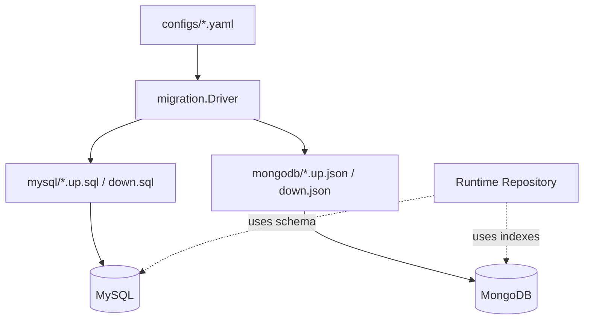

# Migration 与 Schema 演进

**本文回答**：MySQL/Mongo migration 如何作为机器契约维护 schema 演进，以及它与 repository、read model、一次性修复脚本的边界。

## 30 秒结论

| 维度 | 结论 |
| ---- | ---- |
| 解决问题 | schema 与索引必须可重复、可追踪、可回滚 |
| 真值位置 | `internal/pkg/migration/migrations/mysql` 与 `mongodb` |
| 当前边界 | migration 文件表达 schema；业务补偿和历史数据修复不混在 repository 里 |
| 测试保护 | architecture tests 防止 migration/data access 依赖 transport |

## 主图



## 架构设计

Migration 包只做三件事：

| 职责 | 锚点 |
| ---- | ---- |
| 选择 driver | [driver.go](../../../internal/pkg/migration/driver.go) |
| 执行 MySQL migration | [driver_mysql.go](../../../internal/pkg/migration/driver_mysql.go) |
| 执行 Mongo migration | [driver_mongo.go](../../../internal/pkg/migration/driver_mongo.go) |

## 为什么这样设计

schema 是机器契约，不应该只靠文档说明。migration 文件能让 dev/prod 环境按同一顺序演进，并让新增 repository 有明确的落地步骤。

## 取舍与边界

- Migration 不承担在线治理 API。
- 历史数据修复脚本如果存在，应作为 one-off 审核，不进入默认 migration 链。
- Repository 不应该在启动时偷偷创建索引，否则 dev/prod 漂移无法复现。

## 代码锚点与测试锚点

| 能力 | 锚点 |
| ---- | ---- |
| MySQL migration 文件 | [mysql](../../../internal/pkg/migration/migrations/mysql) |
| Mongo migration 文件 | [mongodb](../../../internal/pkg/migration/migrations/mongodb) |
| Data Access boundary test | [data_access_architecture_test.go](../../../internal/pkg/architecture/data_access_architecture_test.go) |

## Verify

```bash
go test ./internal/pkg/migration ./internal/pkg/architecture
```
