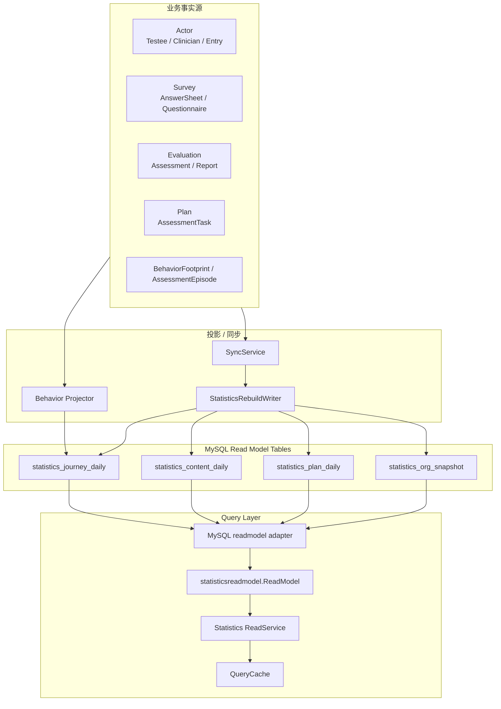
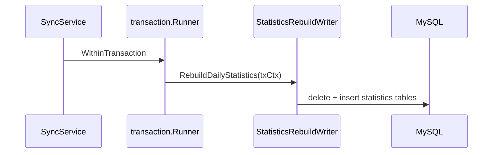

# ReadModel 与 Statistics

**本文回答**：Data Access Plane 如何承接 Statistics 的读侧模型；为什么 statistics read model 不属于业务主写模型；`statisticsreadmodel.ReadModel`、MySQL adapter、四张聚合表、behavior projection、SyncService / RebuildWriter、QueryCache 之间如何协作；新增统计口径时为什么不能只改 SQL。

---

## 30 秒结论

| 维度 | 结论 |
| ---- | ---- |
| 模块定位 | ReadModel 是 Data Access 中的**查询优化型持久化模型**，主要服务 Statistics 高频聚合查询 |
| 不是写模型 | Statistics read model 不替代 Survey、Evaluation、Plan、Actor 的主状态 |
| 核心 port | `statisticsreadmodel.ReadModel` 是 application 读侧端口，定义 overview、funnel、service、plan、clinician、entry、questionnaire batch 等查询 |
| MySQL adapter | `infra/mysql/statistics/readmodel` 实现 ReadModel port，封装 SQL、聚合表、fallback 和分页 |
| 四张聚合表 | `statistics_journey_daily`、`statistics_content_daily`、`statistics_plan_daily`、`statistics_org_snapshot` |
| 重建写入 | `StatisticsRepository.RebuildDailyStatistics / RebuildOrgSnapshotStatistics / RebuildPlanStatistics` 负责 delete + insert 重建 |
| 事务要求 | rebuild writer 通过 `gormuow.RequireTx(ctx)` 要求在事务中执行 |
| 行为投影 | `behavior_footprint`、`assessment_episode` 和 journey daily 构成行为统计输入 |
| 查询缓存 | QueryCache 只缓存 read model 查询结果，不是统计事实源 |
| 关键边界 | read model 可以冗余、聚合、最终一致，但不能反向改变业务聚合 |

一句话概括：

> **ReadModel 是为了“读得快、口径集中、可重建”；业务真值仍在各业务模块主模型中。**

---

## 1. 为什么需要 ReadModel

Statistics 查询通常要跨多个模块：

```text
Actor: Testee / Clinician / AssessmentEntry
Survey: Questionnaire / AnswerSheet
Evaluation: Assessment / Report
Plan: AssessmentTask
Event: BehaviorFootprint / AssessmentEpisode
```

如果每次请求都直接实时聚合主业务表，会带来：

| 问题 | 后果 |
| ---- | ---- |
| 跨表查询复杂 | SQL 难维护 |
| 主业务表压力大 | 影响写入和主流程 |
| 口径散落 | 不同接口统计结果不一致 |
| 查询慢 | 管理端看板体验差 |
| 很难缓存 | 每个接口拼法不同 |
| 难以重建历史统计 | 没有统一读侧模型 |

ReadModel 的价值是：

```text
把高频统计查询预聚合/投影到专用读侧表中
```

---

## 2. ReadModel 总图



---

## 3. ReadModel 与主写模型的边界

| 维度 | 主写模型 | ReadModel |
| ---- | -------- | --------- |
| 目标 | 保存业务事实 | 支撑查询 |
| 一致性 | 事务/状态机约束 | 最终一致 |
| 写入方 | application use case / repository | projector / sync / rebuild writer |
| 是否可重建 | 通常不能随意重建 | 应可重建 |
| 是否可冗余字段 | 谨慎 | 可以 |
| 是否能反向改业务 | 不适用 | 不能 |
| 示例 | Assessment / Testee / Task | statistics_journey_daily |

### 3.1 错误用法

不要把 read model 当成业务事实源：

| 错误 | 风险 |
| ---- | ---- |
| 用 `statistics_plan_daily` 判断 task 是否完成 | 统计延迟导致误判 |
| 用 `report_generated_count` 判断报告是否存在 | 应查 Evaluation Report |
| 用 entry funnel 判断 AssessmentEntry 状态 | 应查 Actor Entry |
| 修改统计表修业务状态 | 下次 sync 会覆盖，且业务主状态未变 |

---

## 4. StatisticsReadModel Port

`statisticsreadmodel.ReadModel` 是 Data Access 的读侧端口。

它暴露的查询面包括：

### 4.1 Organization / Overview

| 方法 | 说明 |
| ---- | ---- |
| `GetOrgOverviewSnapshot` | 机构概览快照 |
| `GetOrgOverviewWindow` | 机构窗口指标 |
| `ListOrgOverviewTrend` | 机构趋势 |
| `GetOrganizationOverview` | 机构资源总览 |
| `GetDimensionAnalysisSummary` | 维度分析摘要 |

### 4.2 Access Funnel

| 方法 | 说明 |
| ---- | ---- |
| `GetAccessFunnel` | 接入漏斗窗口 |
| `GetAccessFunnelTrend` | 漏斗趋势 |
| `ListAccessFunnelTrend` | 单指标趋势 |

### 4.3 Assessment Service

| 方法 | 说明 |
| ---- | ---- |
| `GetAssessmentService` | 测评服务窗口 |
| `GetAssessmentServiceTrend` | 测评服务趋势 |
| `ListAssessmentServiceTrend` | 单指标趋势 |

### 4.4 Plan Task

| 方法 | 说明 |
| ---- | ---- |
| `GetPlanTaskOverview` | 机构计划任务窗口 |
| `GetPlanTaskOverviewByPlan` | 单计划任务窗口 |
| `GetPlanTaskTrend` | 计划任务趋势 |
| `ListPlanTaskTrend` | 单指标趋势 |

### 4.5 Clinician / Entry / Questionnaire

| 方法族 | 说明 |
| ------ | ---- |
| `Count/List/GetClinician...` | 从业者统计 |
| `Count/List/GetAssessmentEntry...` | 入口统计 |
| `GetQuestionnaireBatchTotals` | 问卷批量统计 |

### 4.6 Port 设计原则

ReadModel port 的方法按业务查询面命名，不按表结构命名。

推荐：

```text
GetAccessFunnel
GetPlanTaskTrend
GetClinicianJourneyStats
```

不推荐：

```text
SelectStatisticsJourneyDailyRows
QueryTableWithRawSQL
```

这样可以隐藏底层聚合表细节。

---

## 5. MySQL ReadModel Adapter

`infra/mysql/statistics/readmodel` 是 MySQL-backed adapter，实现 `statisticsreadmodel.ReadModel`。

### 5.1 Adapter 职责

| 职责 | 说明 |
| ---- | ---- |
| 封装 SQL | 应用层不直接写 SQL |
| 读取聚合表 | journey/content/plan/org snapshot |
| fallback | org snapshot 缺失时可回源主表计数 |
| 分页 | clinician/entry 列表分页 |
| 趋势排序 | daily trend 按日期排序 |
| 空值归零 | COALESCE/SUM 避免 null 泄漏 |
| 错误转换 | not found / permission 等转换 |

### 5.2 Adapter 不负责

Adapter 不负责：

- 业务状态迁移。
- 发事件。
- 更新主业务表。
- 写 QueryCache。
- 执行 SyncService。
- 定义 REST DTO。
- 解析 HTTP 参数。

---

## 6. 四张核心聚合表

### 6.1 statistics_journey_daily

服务：

- org overview trend。
- access funnel。
- assessment service。
- clinician journey。
- entry funnel。
- behavior projection。

核心维度：

```text
org_id
subject_type
subject_id
clinician_id
entry_id
stat_date
```

subject_type 典型值：

```text
org
clinician
entry
```

典型指标：

```text
entry_opened_count
intake_confirmed_count
testee_profile_created_count
care_relationship_established_count
answersheet_submitted_count
assessment_created_count
report_generated_count
episode_completed_count
episode_failed_count
assessment_failed_count
```

### 6.2 statistics_content_daily

服务：

- questionnaire batch statistics。
- content submission/completion trend。
- scale/questionnaire 内容维度统计。

核心维度：

```text
org_id
content_type
content_code
origin_type
stat_date
```

典型指标：

```text
submission_count
completion_count
answersheet_submitted_count
assessment_created_count
report_generated_count
assessment_failed_count
```

### 6.3 statistics_plan_daily

服务：

- plan task overview。
- plan task trend。
- plan completion / open / expired 统计。

核心维度：

```text
org_id
plan_id
stat_date
```

典型指标：

```text
task_created_count
task_opened_count
task_completed_count
task_expired_count
enrolled_testees
active_testees
```

### 6.4 statistics_org_snapshot

服务：

- organization overview。
- dimension analysis summary。
- dashboard 初始快照。

典型指标：

```text
testee_count
clinician_count
active_entry_count
assessment_count
report_count
dimension_clinician_count
dimension_entry_count
dimension_content_count
snapshot_at
```

---

## 7. RebuildWriter

`StatisticsRepository` 同时承担 statistics rebuild writer。

### 7.1 RebuildDailyStatistics

`RebuildDailyStatistics(ctx, orgID, startDate, endDate)`：

1. `gormuow.RequireTx(ctx)`。
2. 删除窗口内 `statistics_journey_daily`。
3. 删除窗口内 `statistics_content_daily`。
4. 重建 journey daily。
5. 重建 access funnel daily。
6. 重建 assessment service daily。
7. 重建 content daily。

这是一种窗口内 delete + insert 重建模型。

### 7.2 RebuildOrgSnapshotStatistics

`RebuildOrgSnapshotStatistics(ctx, orgID, date)`：

1. 要求事务。
2. 删除该 org 的 `statistics_org_snapshot`。
3. 插入新的机构快照。

### 7.3 RebuildPlanStatistics

`RebuildPlanStatistics(ctx, orgID)`：

1. 要求事务。
2. 删除该 org 的 `statistics_plan_daily`。
3. 基于 `assessment_task` 和 `assessment_plan` 重建计划日统计。

### 7.4 为什么 RequireTx

重建通常包含：

```text
DELETE old window
INSERT rebuilt result
```

如果不在事务中，可能出现：

- 删除成功，插入失败。
- 统计窗口空洞。
- 部分指标更新。
- 查询读到半完成结果。

所以 rebuild writer 必须在事务中执行。

---

## 8. SyncService 与 ReadModel 的关系

SyncService 属于 application/statistics，负责：

```text
lock
time window
transaction
call RebuildWriter
```

它不直接写 SQL。具体 SQL 在 infra/mysql/statistics/rebuild_writer.go。



这种分层让：

- application 知道何时同步。
- infra 知道如何重建。
- domain 不知道 DB 细节。
- REST 查询不直接重建。

---

## 9. Behavior Projection 与 ReadModel

行为投影路径：

```text
footprint event
  -> behavior_projector_handler
  -> BehaviorProjector
  -> behavior_footprint
  -> assessment_episode
  -> statistics_journey_daily
```

其中：

| 表 | 说明 |
| -- | ---- |
| `behavior_footprint` | 原始行为足迹 |
| `assessment_episode` | 一次测评服务闭环 |
| `statistics_journey_daily` | 日聚合读模型 |

### 9.1 Projector 和 Sync 的关系

| 能力 | Projector | Sync/Rebuild |
| ---- | --------- | ------------ |
| 触发 | 事件驱动 | 定时/手工 |
| 粒度 | 单事件增量 | 时间窗口重建 |
| 目标 | 近实时 | 修复/重算/冷启动 |
| 乱序 | pending/reconcile | repair window |
| 查询 | 不直接对外 | ReadModel adapter 查询 |

两者互补，不是二选一。

---

## 10. Fallback 查询

MySQL read model adapter 在某些快照缺失时会 fallback 到主表计数。

例如 `GetOrgOverviewSnapshot`：

1. 优先查 `statistics_org_snapshot`。
2. 如果存在，直接返回 snapshot。
3. 如果 record not found，则回源 Testee、Clinician、AssessmentEntry、Assessment 等主表计数。
4. 如果不是 not found 错误，则返回错误。

### 10.1 Fallback 的意义

好处：

- 冷启动时 overview 不会完全不可用。
- 统计快照未同步时仍能返回基础值。
- 降低初始部署体验问题。

代价：

- fallback 查询可能慢。
- fallback 口径可能不如 read model 完整。
- 不能把 fallback 当长期主路径。

### 10.2 Fallback 不应泛滥

不是所有 read model 查询都应该 fallback。尤其是：

- 趋势查询。
- 复杂漏斗。
- 高频 dashboard。
- 大范围统计。

这些应该依赖 read model 和 sync。

---

## 11. QueryCache 与 ReadModel

QueryCache 位于 ReadService 之上：

```text
ReadService
  -> QueryCache hit?
  -> miss then ReadModel
  -> store cache
```

### 11.1 QueryCache 不是 ReadModel

| QueryCache | ReadModel |
| ---------- | --------- |
| Redis 缓存结果 | MySQL 统计读模型 |
| TTL / warmup 控制 | sync/rebuild/projector 维护 |
| 可丢弃 | 是统计读侧事实 |
| 不定义口径 | 承载统计口径 |
| 缓存 miss 回源 read model | 主查询源 |

如果统计不准，排障顺序：

```text
source facts
  -> projection / sync
  -> read model tables
  -> ReadModel adapter
  -> QueryCache
```

不要第一步就清 cache。

---

## 12. 与业务模块的边界

| 业务问题 | 应查 |
| -------- | ---- |
| 某个 Assessment 是否 interpreted | Evaluation Assessment |
| 某个 Report 内容 | Evaluation Report |
| 某个 Task 是否 completed | Plan AssessmentTask |
| 某个 Testee 标签 | Actor Testee |
| 某个 AnswerSheet 内容 | Survey AnswerSheet |
| 某个统计趋势 | Statistics ReadModel |

### 12.1 禁止反向写业务

ReadModel 不应：

- 更新 Assessment status。
- 创建 Report。
- 修改 Task status。
- 给 Testee 打标签。
- 变更 AnswerSheet。
- 修改 Scale/Questionnaire。

这些是业务写模型职责。

---

## 13. 新增统计口径的落点判断

新增统计口径时，先判断：

| 问题 | 落点 |
| ---- | ---- |
| 只是组合已有字段 | ReadService / query object |
| 需要已有聚合表的新查询 | ReadModel port + adapter |
| 需要新聚合字段 | migration + PO + rebuild writer + adapter |
| 需要新行为事件 | Event + projector + journey mutation |
| 需要高频缓存 | QueryCache / cachetarget / warmup |
| 需要历史修复 | SyncService / backfill |
| 需要业务状态变化 | 回业务模块，不在 Statistics |

---

## 14. 设计模式与实现意图

| 模式 | 当前实现 | 意图 |
| ---- | -------- | ---- |
| CQRS Read Model | statistics 聚合表 | 查询和写模型分离 |
| Port / Adapter | `statisticsreadmodel.ReadModel` | 应用层不依赖 SQL |
| Projection | behavior projector | 事件转读侧模型 |
| Rebuild Writer | `RebuildDailyStatistics` 等 | 可重建统计窗口 |
| Snapshot | `statistics_org_snapshot` | 快速读取机构概览 |
| Daily Aggregate | `*_daily` tables | 趋势和窗口统计 |
| Fallback Query | snapshot missing fallback | 冷启动可用 |
| Query Cache | Statistics QueryCache | 高频查询加速 |

---

## 15. 设计取舍

| 设计 | 收益 | 代价 |
| ---- | ---- | ---- |
| 独立 read model | 查询快、口径集中 | 最终一致 |
| 四张聚合表收敛 | 表结构清晰 | rebuild SQL 更复杂 |
| RebuildWriter 要求事务 | 避免半重建 | 必须正确传 txCtx |
| Snapshot fallback | 冷启动可用 | fallback 不是主路径 |
| Projector + Sync 双路径 | 近实时 + 可修复 | 两套路径都要测试 |
| QueryCache 独立 | 热点查询稳定 | 可能 stale |
| 不反写业务 | 模型边界清楚 | 排障需要回源模块确认事实 |

---

## 16. 常见误区

### 16.1 “ReadModel 就是另一套主表”

错误。ReadModel 是查询投影，不是业务真值。

### 16.2 “统计不准就直接改统计表”

不建议。应先查 source facts、projection、sync，再决定是否 rebuild/backfill。

### 16.3 “QueryCache 命中就是最新数据”

错误。Cache 可能滞后，read model 也可能有同步窗口。

### 16.4 “fallback 既然能查主表，就不需要同步”

错误。fallback 是冷启动保护，不是高频统计主路径。

### 16.5 “新增统计字段只改 SELECT 就行”

不够。可能需要 migration、PO、rebuild writer、adapter、ReadService、cache、docs、tests。

---

## 17. 排障路径

### 17.1 overview 为空

检查：

1. `statistics_org_snapshot` 是否有记录。
2. fallback 主表是否有数据。
3. ReadModel adapter 是否返回 record not found 以外错误。
4. SyncOrgSnapshotStatistics 是否执行。
5. QueryCache 是否缓存了旧空结果。

### 17.2 trend 缺日期

检查：

1. 对应 daily 表是否有行。
2. stat_date 是否在窗口内。
3. RebuildDailyStatistics 是否覆盖窗口。
4. ReadService 是否做 fillMissingDailyCounts。
5. QueryCache 是否旧。

### 17.3 plan 统计不准

检查：

1. assessment_task 主表。
2. assessment_plan 主表。
3. statistics_plan_daily。
4. RebuildPlanStatistics 是否执行。
5. ReadModel planID 过滤。
6. QueryCache。

### 17.4 行为漏斗不准

检查：

1. footprint event 是否出站。
2. behavior_footprint 是否写入。
3. assessment_episode 是否归因。
4. statistics_journey_daily 是否更新。
5. pending behavior events 是否堆积。
6. daily rebuild 是否覆盖日期。

---

## 18. 修改指南

### 18.1 新增 ReadModel 查询

步骤：

1. 定义查询口径。
2. 在 `statisticsreadmodel.ReadModel` 增加方法。
3. 在 MySQL adapter 实现。
4. 在 ReadService 调用。
5. 如需 REST，补 DTO/handler。
6. 补 tests。
7. 更新文档。

### 18.2 新增 daily 表字段

步骤：

1. 写 migration。
2. 更新 PO。
3. 更新 RebuildWriter insert SQL。
4. 更新 ReadModel adapter。
5. 更新 domain statistics DTO。
6. 更新 ReadService。
7. 更新 QueryCache target，如高频。
8. 补 backfill/rebuild。
9. 更新 docs。

### 18.3 新增 projection 字段

步骤：

1. 新增 footprint/event 或使用既有事件。
2. 更新 BehaviorProjector。
3. 更新 StatisticsJourneyMutation。
4. 更新 journey daily 表。
5. 更新 Sync/Rebuild。
6. 更新 ReadModel query。
7. 补 checkpoint/pending/reconcile tests。

---

## 19. 代码锚点

### Port / Adapter

- StatisticsReadModel port：[../../../internal/apiserver/port/statisticsreadmodel/read_model.go](../../../internal/apiserver/port/statisticsreadmodel/read_model.go)
- MySQL ReadModel adapter：[../../../internal/apiserver/infra/mysql/statistics/readmodel/read_model.go](../../../internal/apiserver/infra/mysql/statistics/readmodel/read_model.go)

### Rebuild / Sync

- Statistics rebuild writer：[../../../internal/apiserver/infra/mysql/statistics/rebuild_writer.go](../../../internal/apiserver/infra/mysql/statistics/rebuild_writer.go)
- Statistics sync service：[../../../internal/apiserver/application/statistics/sync_service.go](../../../internal/apiserver/application/statistics/sync_service.go)

### Domain / Query

- Statistics domain：[../../../internal/apiserver/domain/statistics/](../../../internal/apiserver/domain/statistics/)
- Statistics application：[../../../internal/apiserver/application/statistics/](../../../internal/apiserver/application/statistics/)

---

## 20. Verify

```bash
go test ./internal/apiserver/port/statisticsreadmodel
go test ./internal/apiserver/infra/mysql/statistics
go test ./internal/apiserver/application/statistics
go test ./internal/apiserver/domain/statistics
```

如果修改 behavior projection：

```bash
go test ./internal/worker/handlers
go test ./internal/pkg/eventcatalog
```

如果修改 QueryCache：

```bash
go test ./internal/apiserver/infra/statistics
go test ./internal/apiserver/application/cachegovernance
go test ./internal/apiserver/cachetarget
```

如果修改文档：

```bash
make docs-hygiene
git diff --check
```

---

## 21. 下一跳

| 目标 | 文档 |
| ---- | ---- |
| 新增持久化能力 | [05-新增持久化能力SOP.md](./05-新增持久化能力SOP.md) |
| Migration 与 Schema | [03-Migration与Schema演进.md](./03-Migration与Schema演进.md) |
| MySQL 仓储 | [01-MySQL仓储与UnitOfWork.md](./01-MySQL仓储与UnitOfWork.md) |
| Mongo 文档仓储 | [02-Mongo文档仓储.md](./02-Mongo文档仓储.md) |
| Statistics 业务文档 | [../../02-业务模块/statistics/README.md](../../02-业务模块/statistics/README.md) |
