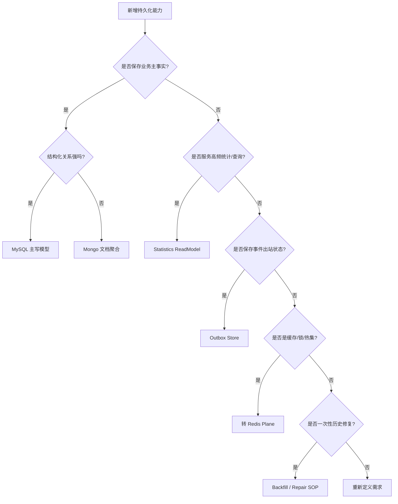

# 新增持久化能力 SOP

**本文回答**：当 qs-server 需要新增一张 MySQL 表、一个 Mongo collection、一个 repository、一个 read model、一条 migration、一个 outbox store 或一次历史修复能力时，应该按什么顺序判断边界、设计模型、写 migration、实现 mapper/repository、接事务/outbox、补测试和文档，避免 Data Access 层退化成散点 SQL/Document 操作。

---

## 30 秒结论

新增持久化能力按这条顺序执行：

```text
判断数据类型
  -> 定义模型边界
  -> 定义 port / query interface
  -> 设计 schema / index / migration
  -> 实现 PO/Document + Mapper
  -> 实现 Repository / ReadModel Adapter
  -> 接事务 / outbox / backpressure
  -> 补测试
  -> 更新文档
```

| 变化类型 | 典型例子 | 首要落点 |
| -------- | -------- | -------- |
| MySQL 主写模型 | AssessmentTask 新字段、新关系表 | domain port + MySQL repository + migration |
| Mongo 文档聚合 | 新答卷文档结构、新报告结构 | domain port + Mongo repository + document mapper |
| Statistics ReadModel | 新统计聚合字段、新趋势查询 | read model port + MySQL adapter + rebuild writer |
| Outbox 能力 | 新 durable event 需要同事务出站 | MySQL/Mongo outbox store + application stage |
| Migration | 新表、索引、字段、集合 | `internal/pkg/migration/migrations/*` |
| Backfill / Repair | 历史数据重算、修复统计 | 独立运维脚本/SOP，不默认混入 migration |
| Cache 能力 | ObjectCache / QueryCache / Hotset | Redis plane，不属于 Data Access 主体 |

一句话原则：

> **先判断这是业务写模型、文档模型、读模型还是事件出站状态，再决定 MySQL/Mongo/ReadModel/Outbox 的落点。**

---

## 1. 新增前先做边界判断

新增持久化能力前，先回答：

| 问题 | 影响 |
| ---- | ---- |
| 这是主写模型还是读模型？ | 决定 repository 还是 read model |
| 数据是结构化关系还是文档聚合？ | 决定 MySQL 还是 Mongo |
| 是否需要强事务？ | 决定 UnitOfWork / session transaction |
| 是否会产生 durable event？ | 决定是否接 outbox stage |
| 是否是统计查询优化？ | 决定是否进入 Statistics read model |
| 是否是缓存？ | 转 Redis plane |
| 是否只是一次性历史修复？ | 转 backfill / repair，不直接当普通 migration |
| 是否需要索引和唯一约束？ | 必须写 migration |
| 是否需要幂等？ | 唯一约束 / idempotency collection / 状态机 |
| 是否会被 worker 使用？ | 优先通过 apiserver internal gRPC，不让 worker 直写 repository |

---

## 2. 决策树



---

## 3. 通用流程

无论 MySQL、Mongo 还是 read model，都应遵守：

```text
model / port
  -> schema / migration
  -> mapper
  -> repository / adapter
  -> tests
  -> docs
```

### 3.1 不要反过来

不要从：

```text
handler
  -> raw SQL
  -> 临时表
```

开始。

这会导致：

- domain 不知道持久化事实。
- application 绕过事务。
- migration 缺失。
- tests 缺失。
- schema 漂移。
- 后续无法维护。

---

## 4. 新增 MySQL 主写模型

### 4.1 适用场景

适合 MySQL：

- 结构化主数据。
- 关系型查询。
- 多条件索引查询。
- 唯一约束。
- 多 repository 事务。
- 统计 read model。
- outbox store。

示例：

```text
assessment_task
clinician_relation
operator
assessment_entry
statistics_plan_daily
domain_event_outbox
```

### 4.2 实施步骤

1. 定义 domain aggregate/entity/value object。
2. 定义 repository port。
3. 设计 MySQL PO。
4. 设计 mapper。
5. 写 migration up/down。
6. 实现 infra/mysql repository。
7. 如需事务，使用 application `transaction.Runner`。
8. 如需 durable event，在同事务内 stage MySQL outbox。
9. 如需唯一约束，设置 error translator。
10. 如需下游保护，注入 backpressure limiter。
11. 补 repository/mapper/transaction tests。
12. 更新文档。

### 4.3 MySQL PO 检查清单

| 检查项 | 是否完成 |
| ------ | -------- |
| 表名明确 | ☐ |
| 主键字段明确 | ☐ |
| org_id / tenant scope 字段 | ☐ |
| created_at / updated_at / deleted_at | ☐ |
| created_by / updated_by / deleted_by 如需审计 | ☐ |
| 状态字段枚举值明确 | ☐ |
| 唯一索引明确 | ☐ |
| 查询索引明确 | ☐ |
| GORM tag 只在 PO 中 | ☐ |
| domain 不带 GORM tag | ☐ |

### 4.4 MySQL Repository 检查清单

| 检查项 | 是否完成 |
| ------ | -------- |
| 实现 domain repository port | ☐ |
| 不返回 PO 给 application/domain | ☐ |
| 使用 mapper 做转换 | ☐ |
| 使用 BaseRepository helper 或显式 GORM 查询 | ☐ |
| 事务通过 context 传递 | ☐ |
| 复杂查询有明确索引 | ☐ |
| duplicate 错误转业务错误 | ☐ |
| 不 import transport/interface handler | ☐ |

---

## 5. 新增 Mongo 文档聚合

### 5.1 适用场景

适合 Mongo：

- 文档内部结构复杂。
- 需要聚合整体读取。
- 版本快照明显。
- 字段结构相对灵活。
- 答卷/报告/问卷内容等文档型对象。
- 需要与 Mongo outbox 同事务 stage。

示例：

```text
Questionnaire
AnswerSheet
InterpretReport
Mongo domain_event_outbox
```

### 5.2 实施步骤

1. 定义 domain aggregate。
2. 定义 repository port。
3. 设计 Document PO。
4. 设计 mapper。
5. 写 Mongo migration，包含 collection/index。
6. 实现 infra/mongo repository。
7. 如果需要事务，使用 Mongo transaction runner。
8. 如果需要 durable event，在 session transaction 内 stage Mongo outbox。
9. 如果需要幂等，设计 idempotency collection。
10. 补 repository/mapper/transaction/outbox tests。
11. 更新文档。

### 5.3 Mongo Document 检查清单

| 检查项 | 是否完成 |
| ------ | -------- |
| collection name 明确 | ☐ |
| `_id` 与 `domain_id` 边界明确 | ☐ |
| bson tag 完整 | ☐ |
| created_at / updated_at / deleted_at | ☐ |
| 审计字段如需支持 | ☐ |
| 软删除查询条件明确 | ☐ |
| 必要索引进入 migration | ☐ |
| document 不直接作为 domain object | ☐ |
| mapper 双向转换有测试 | ☐ |

### 5.4 Mongo Transaction 检查清单

| 检查项 | 是否完成 |
| ------ | -------- |
| 使用 `mongo.SessionContext` | ☐ |
| 多文档写入在同一 session transaction | ☐ |
| outbox Stage 使用 txCtx | ☐ |
| transaction 失败后不会 ClearEvents | ☐ |
| 成功 commit 后再 ClearEvents | ☐ |
| 幂等 key 并发处理已测试 | ☐ |

---

## 6. 新增 Statistics ReadModel

### 6.1 适用场景

适合 read model：

- 高频看板查询。
- 趋势统计。
- 漏斗统计。
- 多模块聚合查询。
- 允许最终一致。
- 可以被 rebuild/backfill。
- 不能反向修改业务主状态。

### 6.2 实施步骤

1. 定义统计口径：分子、分母、时间字段、维度。
2. 判断现有四张聚合表是否可承载。
3. 如果需要，写 migration 增加字段/索引/表。
4. 更新 Statistics PO。
5. 更新 `statisticsreadmodel.ReadModel` port。
6. 更新 MySQL read model adapter。
7. 更新 `StatisticsRepository` rebuild writer。
8. 更新 SyncService 或 projector。
9. 更新 ReadService / DTO。
10. 判断是否需要 QueryCache。
11. 补 read model / rebuild / sync tests。
12. 更新 Statistics 文档。

### 6.3 ReadModel 检查清单

| 检查项 | 是否完成 |
| ------ | -------- |
| 统计口径定义清楚 | ☐ |
| 事实源明确 | ☐ |
| 时间字段明确 | ☐ |
| org_id / subject_type / stat_date 维度明确 | ☐ |
| migration 完成 | ☐ |
| rebuild writer 更新 | ☐ |
| read model adapter 更新 | ☐ |
| QueryCache 判断完成 | ☐ |
| 不反向修改业务主表 | ☐ |

---

## 7. 新增 Outbox 持久化能力

### 7.1 适用场景

适合 outbox：

- 新 durable_outbox event。
- 事件丢失会导致主流程卡住。
- 需要和业务主状态同事务。
- 需要可重试出站。
- 需要 backlog/failed/oldest age 观测。

### 7.2 MySQL Outbox

适用于业务主状态在 MySQL 的情况。

步骤：

1. 业务 use case 进入 MySQL `transaction.Runner`。
2. 保存业务主状态。
3. 调用 MySQL outbox store `Stage(txCtx, events...)`。
4. commit。
5. OutboxRelay 后续 publish。
6. worker handler 幂等。

### 7.3 Mongo Outbox

适用于业务主状态在 Mongo 的情况。

步骤：

1. 业务 use case 进入 Mongo session transaction。
2. 保存 Mongo document。
3. 调用 Mongo outbox store `Stage(txCtx, events...)`。
4. commit。
5. OutboxRelay 后续 publish。
6. worker handler 幂等。

### 7.4 Outbox 检查清单

| 检查项 | 是否完成 |
| ------ | -------- |
| 事件 delivery 是 durable_outbox | ☐ |
| Stage 与业务状态同事务 | ☐ |
| 不 direct publish durable event | ☐ |
| outbox schema/index 已存在 | ☐ |
| relay 可 claim/publish/mark | ☐ |
| status snapshot 可观测 | ☐ |
| handler 幂等 | ☐ |

---

## 8. 新增 Migration

### 8.1 MySQL migration

步骤：

1. 写 `.up.sql`。
2. 写 `.down.sql`。
3. 评估锁表/索引耗时。
4. 更新 PO。
5. 更新 repository。
6. 补 migration/schema tests。
7. 更新文档。

### 8.2 Mongo migration

步骤：

1. 写 Mongo migration 文件。
2. 创建 collection/index。
3. 更新 Document PO。
4. 更新 repository。
5. 补索引和查询测试。
6. 更新文档。

### 8.3 不要把复杂 backfill 塞进 migration

如果要重算大量历史数据，应单独设计：

- backfill job。
- 分批执行。
- 可恢复游标。
- metrics/logs。
- 失败重试。
- 回滚策略。
- 运维审批。

---

## 9. 新增 Backfill / Repair

### 9.1 适用场景

- 统计口径变更后重算历史。
- 修复错误字段。
- 补齐历史 projection。
- 修复 outbox 未出站事件。
- 修正脏数据。

### 9.2 原则

| 原则 | 说明 |
| ---- | ---- |
| 不默认进入 migration | 避免部署卡死 |
| 必须可分批 | 控制风险 |
| 必须可观测 | processed/failed/skipped |
| 必须可重入 | 支持断点重试 |
| 必须审计 | 记录执行范围和结果 |
| 不绕过业务不变量 | 必要时走 application service |

---

## 10. 新增 Cache 能力不要放 Data Access

如果需求是：

- ObjectCache。
- QueryCache。
- Hotset。
- WarmupTarget。
- Redis lock。
- Cache governance。

请去：

```text
03-基础设施/redis/
```

Data Access 只负责：

```text
DB schema
repository
mapper
read model
outbox store
migration
```

---

## 11. 架构边界禁令

### 11.1 禁止 domain import infra/database

不允许：

```go
import "gorm.io/gorm"
import "go.mongodb.org/mongo-driver/mongo"
import "internal/apiserver/infra/..."
import "internal/pkg/database"
```

出现在 domain。

### 11.2 禁止 data access import transport

不允许 infra/mysql、infra/mongo、database、migration import：

```text
internal/apiserver/transport
internal/apiserver/interface/restful
internal/collection-server/transport
```

### 11.3 禁止 handler 直连 DB

Worker 或 REST handler 不应直接写 DB。应走：

```text
handler
  -> application service
  -> repository port
  -> infra repository
```

Worker 通常应通过 internal gRPC 回到 apiserver。

---

## 12. 测试矩阵

### 12.1 Mapper tests

覆盖：

- Domain -> PO/Document。
- PO/Document -> Domain。
- 零值/空字段。
- 嵌套对象。
- version/status。
- ID 同步。

### 12.2 Repository tests

覆盖：

- Create/Update/Find/Delete。
- soft delete。
- unique constraint。
- not found。
- transaction rollback。
- backpressure acquire/release。
- error translator。
- query indexes 相关条件。

### 12.3 Transaction tests

覆盖：

- WithinTransaction commit。
- rollback。
- RequireTx。
- AfterCommit。
- txCtx 传递。
- outbox stage 同事务。

### 12.4 Mongo durable tests

覆盖：

- session transaction。
- idempotency key。
- duplicate submit。
- outbox stage。
- transaction failure。
- WaitForCompletedSubmission。

### 12.5 ReadModel tests

覆盖：

- read model port method。
- MySQL adapter SQL。
- empty data returns zero。
- time window `[from, to)`。
- org isolation。
- trend order。
- pagination。
- fallback。

### 12.6 Architecture tests

覆盖：

- domain 不依赖 infra。
- data-access 不依赖 transport。
- 新包路径符合分层。

---

## 13. 文档同步矩阵

| 变更 | 至少同步 |
| ---- | -------- |
| 新 MySQL 表/repository | [01-MySQL仓储与UnitOfWork.md](./01-MySQL仓储与UnitOfWork.md) |
| 新 Mongo collection/repository | [02-Mongo文档仓储.md](./02-Mongo文档仓储.md) |
| 新 migration/schema | [03-Migration与Schema演进.md](./03-Migration与Schema演进.md) |
| 新 statistics read model | [04-ReadModel与Statistics.md](./04-ReadModel与Statistics.md) |
| 新 durable event outbox | `../event/02-Publish与Outbox.md` |
| 新 Redis cache | `../redis/README.md` |
| 业务主模型变化 | `../../02-业务模块/...` |
| REST/gRPC 契约变化 | `../../04-接口与运维/...` |

---

## 14. 合并前检查清单

| 检查项 | 是否完成 |
| ------ | -------- |
| 已判断 MySQL / Mongo / ReadModel / Outbox / Cache / Backfill 边界 | ☐ |
| 已定义 domain model 或 read model 口径 | ☐ |
| 已定义 port / query interface | ☐ |
| 已写 migration up/down | ☐ |
| 已更新 PO/Document | ☐ |
| 已实现 mapper | ☐ |
| 已实现 repository / adapter | ☐ |
| 已接 transaction.Runner 或 session transaction | ☐ |
| 如有 durable event，已同事务 stage outbox | ☐ |
| 已设计索引和唯一约束 | ☐ |
| 已设计 error translator / idempotency | ☐ |
| 已接 backpressure，如有必要 | ☐ |
| 已补 mapper/repository/transaction/readmodel tests | ☐ |
| 已跑 architecture tests | ☐ |
| 已更新文档 | ☐ |

---

## 15. 反模式

| 反模式 | 后果 |
| ------ | ---- |
| domain 直接带 gorm/bson tag | 领域模型污染 |
| REST handler 直接写 DB | 绕过事务和业务规则 |
| repository 启动时偷偷建生产索引 | schema 漂移 |
| 只改 PO 不写 migration | 线上字段不存在 |
| durable event 事务外写 outbox | 事件和业务状态不一致 |
| read model 反写主表 | CQRS 边界破坏 |
| 把复杂 backfill 塞进 migration | 部署不可控 |
| cache 当数据库用 | 数据不可重建且语义不清 |
| worker 直写主 repository | 主写模型分裂 |
| 统计不准就改统计表 | 下次 rebuild 覆盖，源事实未修 |

---

## 16. Verify 命令

基础：

```bash
go test ./internal/pkg/architecture
go test ./internal/pkg/database/mysql
go test ./internal/apiserver/infra/mysql/...
go test ./internal/apiserver/infra/mongo/...
go test ./internal/pkg/migration/...
```

Outbox：

```bash
go test ./internal/apiserver/outboxcore
go test ./internal/apiserver/infra/mysql/eventoutbox
go test ./internal/apiserver/infra/mongo/eventoutbox
go test ./internal/apiserver/application/eventing
```

Statistics read model：

```bash
go test ./internal/apiserver/port/statisticsreadmodel
go test ./internal/apiserver/infra/mysql/statistics
go test ./internal/apiserver/application/statistics
```

Docs：

```bash
make docs-hygiene
git diff --check
```

---

## 17. 代码锚点

- MySQL BaseRepository：[../../../internal/pkg/database/mysql/base.go](../../../internal/pkg/database/mysql/base.go)
- MySQL UnitOfWork：[../../../internal/pkg/database/mysql/uow.go](../../../internal/pkg/database/mysql/uow.go)
- Mongo BaseRepository：[../../../internal/apiserver/infra/mongo/base.go](../../../internal/apiserver/infra/mongo/base.go)
- Migration：[../../../internal/pkg/migration/](../../../internal/pkg/migration/)
- StatisticsReadModel port：[../../../internal/apiserver/port/statisticsreadmodel/read_model.go](../../../internal/apiserver/port/statisticsreadmodel/read_model.go)
- MySQL read model adapter：[../../../internal/apiserver/infra/mysql/statistics/readmodel/read_model.go](../../../internal/apiserver/infra/mysql/statistics/readmodel/read_model.go)
- MySQL outbox：[../../../internal/apiserver/infra/mysql/eventoutbox/](../../../internal/apiserver/infra/mysql/eventoutbox/)
- Mongo outbox：[../../../internal/apiserver/infra/mongo/eventoutbox/](../../../internal/apiserver/infra/mongo/eventoutbox/)
- Architecture tests：[../../../internal/pkg/architecture/data_access_architecture_test.go](../../../internal/pkg/architecture/data_access_architecture_test.go)

---

## 18. 下一跳

| 目标 | 文档 |
| ---- | ---- |
| 回看整体架构 | [00-整体架构.md](./00-整体架构.md) |
| MySQL 仓储 | [01-MySQL仓储与UnitOfWork.md](./01-MySQL仓储与UnitOfWork.md) |
| Mongo 文档仓储 | [02-Mongo文档仓储.md](./02-Mongo文档仓储.md) |
| Migration | [03-Migration与Schema演进.md](./03-Migration与Schema演进.md) |
| ReadModel | [04-ReadModel与Statistics.md](./04-ReadModel与Statistics.md) |
