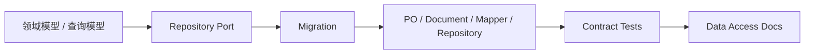

# 新增持久化能力 SOP

**本文回答**：新增表、集合、repository、read model 或 outbox 存储能力时，应按什么顺序补模型、migration、测试和文档。

## 30 秒结论

新增 Data Access 能力的默认顺序是：



## 操作清单

| 步骤 | 必做项 |
| ---- | ------ |
| 1. 定边界 | 判断是主写模型、文档模型、read model、outbox 还是一次性修复 |
| 2. 补契约 | domain/application 定义 port 或查询接口 |
| 3. 补 migration | MySQL SQL 或 Mongo JSON，包含索引和 down 文件 |
| 4. 补 mapper | PO/Document 与 domain/read model 映射 |
| 5. 补 repository | 使用显式 backpressure / tx / error translator，不引入 handler 依赖 |
| 6. 补测试 | mapper、repository、migration/architecture、outbox/read model contract |
| 7. 补文档 | 更新本目录对应深讲和业务模块文档 |

## 否定边界

- 不允许 handler 直连 DB。
- 不允许 domain import infra、GORM、Mongo driver。
- 不允许 repository 动态创建未记录在 migration 的生产索引。
- 不允许把一次性修复脚本写成常规 migration 而不说明数据语义。

## Verify

```bash
go test ./internal/pkg/architecture ./internal/pkg/database/... ./internal/apiserver/infra/mysql/... ./internal/apiserver/infra/mongo/...
python scripts/check_docs_hygiene.py
```
