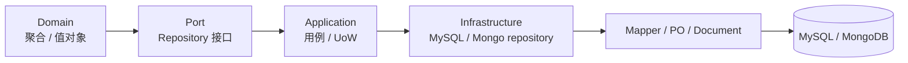

# Data Access Plane 阅读地图

**本文回答**：Data Access Plane 文档解释 `qs-server` 的 MySQL、MongoDB、migration、read model、outbox/idempotency 如何分工；它是存储访问真值层，不替代业务模块文档。

## 30 秒结论

| 问题 | 结论 |
| ---- | ---- |
| Data Access 解决什么 | 把领域模型与数据库 schema、事务、索引、投影表、outbox 文档隔离开 |
| 当前边界 | domain 不依赖 infra；repository/mapper/document/PO 归 infrastructure；migration 只表达 schema 演进 |
| 不做什么 | 不引入通用 ORM 框架，不让 handler 直连 DB，不把 read model 写成主业务模型 |
| 第一入口 | 先读 [00-整体架构.md](./00-整体架构.md)，再按 MySQL、Mongo、Migration、Read Model 进入 |



## 阅读顺序

1. [00-整体架构.md](./00-整体架构.md) — Data Access 总模型、包边界、依赖方向。
2. [01-MySQL仓储与UnitOfWork.md](./01-MySQL仓储与UnitOfWork.md) — GORM repository、BaseRepository、事务、backpressure。
3. [02-Mongo文档仓储.md](./02-Mongo文档仓储.md) — Mongo document、mapper、durable submit、outbox。
4. [03-Migration与Schema演进.md](./03-Migration与Schema演进.md) — migration 文件、driver、执行边界。
5. [04-ReadModel与Statistics.md](./04-ReadModel与Statistics.md) — statistics read model、journey projection、查询边界。
6. [05-新增持久化能力SOP.md](./05-新增持久化能力SOP.md) — 新增表、集合、repository、projection 的操作清单。

## 代码锚点与测试锚点

| 能力 | 源码 | 测试 |
| ---- | ---- | ---- |
| MySQL BaseRepository | [base.go](../../../internal/pkg/database/mysql/base.go) | [backpressure_test.go](../../../internal/pkg/database/mysql/backpressure_test.go) |
| Mongo BaseRepository | [base.go](../../../internal/apiserver/infra/mongo/base.go) | [backpressure_test.go](../../../internal/apiserver/infra/mongo/backpressure_test.go) |
| Migration driver | [driver.go](../../../internal/pkg/migration/driver.go) | [architecture tests](../../../internal/pkg/architecture/data_access_architecture_test.go) |
| MySQL outbox | [store.go](../../../internal/apiserver/infra/mysql/eventoutbox/store.go) | [store_test.go](../../../internal/apiserver/infra/mysql/eventoutbox/store_test.go) |
| Mongo outbox | [store.go](../../../internal/apiserver/infra/mongo/eventoutbox/store.go) | [store_test.go](../../../internal/apiserver/infra/mongo/eventoutbox/store_test.go) |

## Verify

```bash
go test ./internal/pkg/architecture ./internal/pkg/database/mysql ./internal/apiserver/infra/mongo ./internal/apiserver/infra/mysql/eventoutbox ./internal/apiserver/infra/mongo/eventoutbox
python scripts/check_docs_hygiene.py
```
