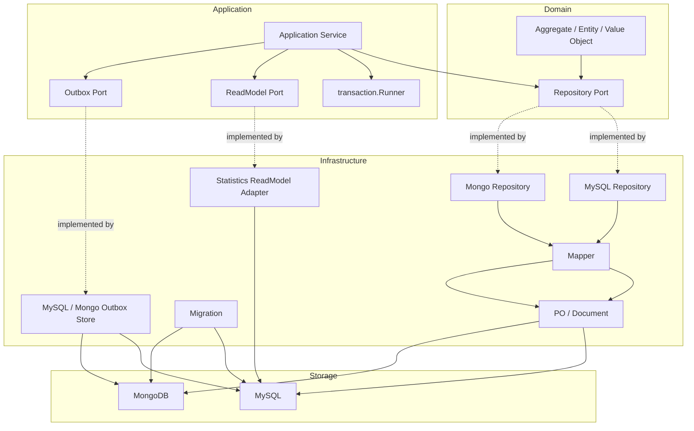

# Data Access 阅读地图

**本文回答**：`data-access/` 子目录这一组文档应该如何阅读；qs-server 的持久化机制负责什么、不负责什么；MySQL、Mongo、Migration、Statistics ReadModel、新增持久化能力 SOP 分别应该去哪里看。

---

## 30 秒结论

| 维度 | 结论 |
| ---- | ---- |
| 模块定位 | `data-access/` 是 qs-server 的**持久化机制文档组**，解释 repository、mapper、PO/document、UnitOfWork、migration、read model、outbox store 如何落在代码中 |
| 核心边界 | Domain 定义聚合和 repository port；Application 定义用例和事务边界；Infra 实现 MySQL/Mongo repository、mapper、PO/document |
| MySQL 侧 | 负责结构化主数据、关系查询、事务、统计读模型、MySQL outbox |
| Mongo 侧 | 负责文档型聚合、问卷/答卷/报告、版本快照、Mongo outbox |
| Migration | 负责 MySQL/Mongo schema、索引、字段和版本演进 |
| ReadModel | Statistics read model 是查询优化模型，不是业务主写模型 |
| Outbox | MySQL/Mongo outbox 是可靠事件出站的持久化状态，不是 MQ 本身 |
| 保护边界 | Architecture tests 禁止 domain 依赖 infra/database/migration，也禁止 data access 依赖 transport |
| 推荐读法 | 先读整体架构，再读 MySQL、Mongo、Migration、ReadModel，最后读新增能力 SOP |

一句话概括：

> **Data Access 的目标不是封装 CRUD，而是让业务模型不被数据库 schema、driver、transaction、read model 和 outbox 细节污染。**

---

## 1. Data Access 负责什么

Data Access 负责 qs-server 的持久化机制：

```text
Repository Port / Adapter
PO / Document
Mapper
MySQL UnitOfWork
Mongo Session Transaction
Migration
Statistics ReadModel
MySQL / Mongo Outbox Store
Backpressure 接入
错误转换
架构边界测试
```

它要回答：

```text
这个聚合应该存在 MySQL 还是 Mongo？
repository port 应该放在哪里？
PO/Document 如何和 domain object 转换？
事务边界由谁控制？
durable event 如何和业务状态同事务写入？
新字段/索引如何通过 migration 演进？
统计查询为什么走 read model？
read model 能不能反写业务主表？
```

---

## 2. Data Access 不负责什么

| 不属于 Data Access 的内容 | 应归属 |
| ------------------------- | ------ |
| 领域不变量和状态机 | `02-业务模块/*` |
| REST/gRPC 请求解析 | `04-接口与运维` 或 transport 层 |
| Worker handler 主流程 | `event/` + worker handlers |
| Redis cache / lock / hotset | `../redis/` |
| 限流、队列、背压策略定义 | `../resilience/` |
| 事件契约和 MQ 消费 | `../event/` |
| 业务历史修复语义 | 单独 Backfill / Repair SOP |
| 外部 SDK / WeChat / OSS | `../integrations/` |
| Metrics / Healthz / Pprof | `../observability/` |

一句话边界：

```text
Data Access 负责“如何持久化”；
业务模块负责“持久化什么业务事实”；
Migration 负责“schema 如何演进”；
ReadModel 负责“查询如何优化”。
```

---

## 3. 本目录文档地图

```text
data-access/
├── README.md
├── 00-整体架构.md
├── 01-MySQL仓储与UnitOfWork.md
├── 02-Mongo文档仓储.md
├── 03-Migration与Schema演进.md
├── 04-ReadModel与Statistics.md
└── 05-新增持久化能力SOP.md
```

| 顺序 | 文档 | 先回答什么 |
| ---- | ---- | ---------- |
| 1 | [00-整体架构.md](./00-整体架构.md) | Data Access 的整体分层、依赖方向、MySQL/Mongo/ReadModel/Outbox 边界 |
| 2 | [01-MySQL仓储与UnitOfWork.md](./01-MySQL仓储与UnitOfWork.md) | MySQL repository、BaseRepository、GORM、UnitOfWork、事务和 MySQL outbox |
| 3 | [02-Mongo文档仓储.md](./02-Mongo文档仓储.md) | Mongo document、mapper、BaseRepository、durable submit、Mongo outbox |
| 4 | [03-Migration与Schema演进.md](./03-Migration与Schema演进.md) | MySQL/Mongo migration、embedded migrations、dirty state、schema 兼容演进 |
| 5 | [04-ReadModel与Statistics.md](./04-ReadModel与Statistics.md) | Statistics read model、四张聚合表、rebuild writer、query adapter |
| 6 | [05-新增持久化能力SOP.md](./05-新增持久化能力SOP.md) | 新增表/集合/repository/read model/outbox/migration/backfill 的执行流程 |

---

## 4. 推荐阅读路径

### 4.1 第一次理解 Data Access

按顺序读：

```text
00-整体架构
  -> 01-MySQL仓储与UnitOfWork
  -> 02-Mongo文档仓储
  -> 03-Migration与Schema演进
```

读完后应能回答：

1. 为什么 domain 不能 import GORM/Mongo driver？
2. Repository port 和 infra repository 的区别是什么？
3. MySQL UnitOfWork 如何通过 context 传播事务？
4. Mongo durable submit 为什么需要 session transaction？
5. schema/index 为什么必须进入 migration？
6. 为什么 MySQL 和 Mongo 不抽成一个统一大仓储框架？

### 4.2 要新增结构化主数据

读：

```text
01-MySQL仓储与UnitOfWork
  -> 03-Migration与Schema演进
  -> 05-新增持久化能力SOP
```

重点看：

- domain aggregate / entity。
- repository port。
- MySQL PO。
- mapper。
- migration up/down。
- transaction.Runner。
- error translator。
- outbox stage 是否需要。
- backpressure 是否需要。

### 4.3 要新增文档型聚合

读：

```text
02-Mongo文档仓储
  -> 03-Migration与Schema演进
  -> 05-新增持久化能力SOP
```

重点看：

- Document PO。
- `domain_id` 与 `_id` 的边界。
- bson schema。
- mapper。
- Mongo indexes。
- session transaction。
- idempotency key。
- Mongo outbox stage。

### 4.4 要改 Statistics 查询或统计口径

读：

```text
04-ReadModel与Statistics
  -> ../../02-业务模块/statistics/README.md
  -> 05-新增持久化能力SOP
```

重点看：

- `statisticsreadmodel.ReadModel` port。
- MySQL read model adapter。
- 四张聚合表。
- rebuild writer。
- SyncService。
- QueryCache 边界。
- read model 不反写业务主模型。

### 4.5 要改 schema / index / migration

读：

```text
03-Migration与Schema演进
  -> 01-MySQL仓储与UnitOfWork
  -> 02-Mongo文档仓储
```

重点看：

- embedded migration。
- MySQL/Mongo driver。
- dirty state。
- rollback。
- schema 兼容演进。
- migration 与 backfill 的边界。

### 4.6 要新增 durable event 的持久化边界

读：

```text
../event/02-Publish与Outbox.md
  -> 01-MySQL仓储与UnitOfWork
  -> 02-Mongo文档仓储
```

重点看：

- 业务主状态在哪个数据库。
- outbox store 是否和主状态同事务。
- MySQL `RequireTx`。
- Mongo `SessionContext`。
- relay / worker handler 幂等。

---

## 5. Data Access 主图



---

## 6. MySQL / Mongo / ReadModel 选择

| 类型 | 优先选择 | 原因 |
| ---- | -------- | ---- |
| 强关系、事务、索引查询 | MySQL | 结构化主模型 |
| 文档嵌套、版本快照、聚合整体读写 | Mongo | 文档模型自然 |
| 高频统计、趋势、聚合查询 | Statistics ReadModel | 查询优化 |
| 可靠事件出站状态 | MySQL/Mongo Outbox | 与主状态同事务 |
| 缓存结果、热点查询 | Redis QueryCache | 读优化，不是 Data Access |
| 一次性历史修复 | Backfill / Repair | 不混入常规 migration |

### 6.1 简单判断

```text
能用事务、索引和关系表达清楚的主模型 -> MySQL
天然是大文档和快照的聚合 -> Mongo
只是为了看板和统计快 -> ReadModel
只是为了减少回源 -> Redis cache
只是为了事件可靠出站 -> Outbox
只是为了修历史数据 -> Backfill
```

---

## 7. MySQL 子系统速览

MySQL 侧主要包含：

| 能力 | 说明 |
| ---- | ---- |
| `BaseRepository[T]` | 通用 CRUD、审计、backpressure、错误转换 |
| UnitOfWork | 通过 context 传播 GORM transaction |
| transaction.Runner | application 层统一事务接口 |
| PO / Mapper | 隔离 GORM schema 和 domain |
| MySQL outbox | 与 MySQL 主状态同事务 stage durable event |
| Statistics read model | 高频统计查询表 |

关键原则：

```text
事务边界由 application 决定；
repository 使用 txCtx；
domain 不知道 GORM。
```

---

## 8. Mongo 子系统速览

Mongo 侧主要包含：

| 能力 | 说明 |
| ---- | ---- |
| `BaseRepository` | collection 级 CRUD、backpressure |
| `BaseDocument` | `_id`、`domain_id`、审计、软删除 |
| Document Mapper | 隔离 bson schema 和 domain |
| Session Transaction | 多文档写入原子性 |
| Durable Submit | AnswerSheet + idempotency + outbox 同事务 |
| Mongo outbox | 与 Mongo 文档同事务 stage durable event |
| Published Snapshot | Questionnaire head/snapshot 版本结构 |

关键原则：

```text
Mongo 不是无 schema；
重要索引进入 migration；
文档模型不等于 domain object。
```

---

## 9. Migration 速览

Migration 负责 schema/index 演进：

| 能力 | 说明 |
| ---- | ---- |
| embedded migration | migration 文件被打进二进制 |
| MySQLDriver | source path: `migrations/mysql` |
| MongoDriver | source path: `migrations/mongodb` |
| Run | 检查 enabled/version/dirty，然后 Up |
| Rollback | Steps(-1)，只回滚最近一步 |
| Version | 返回 version 和 dirty |
| Dirty state | 不自动继续，要求人工修复 |

关键原则：

```text
Migration 是 schema 机器契约；
复杂历史修复不是普通 migration。
```

---

## 10. ReadModel 速览

Statistics read model 主要服务：

```text
overview
access funnel
assessment service
plan task
clinician statistics
entry statistics
questionnaire batch statistics
```

核心表：

```text
statistics_journey_daily
statistics_content_daily
statistics_plan_daily
statistics_org_snapshot
```

关键原则：

```text
ReadModel 可冗余、可重建、最终一致；
不能反向成为业务主写模型。
```

---

## 11. Outbox 也是 Data Access

Outbox 跨 Event 和 Data Access 两个 plane。

| 维度 | 说明 |
| ---- | ---- |
| Event 视角 | 可靠出站机制 |
| Data Access 视角 | 待出站事件的持久化状态 |
| MySQL outbox | 与 MySQL 业务状态同事务 |
| Mongo outbox | 与 Mongo 文档状态同 session transaction |
| Relay | 从 outbox store claim due events 后 publish |

关键原则：

```text
durable event 必须同事务 stage；
outbox 不是 MQ；
consumer 仍需幂等。
```

---

## 12. 维护原则

### 12.1 Domain 不依赖 Infra

禁止 domain import：

```text
internal/apiserver/infra
internal/pkg/database
internal/pkg/mongodb
internal/pkg/migration
gorm.io/gorm
go.mongodb.org/mongo-driver
```

### 12.2 Data Access 不依赖 Transport

禁止 infra/mysql、infra/mongo、database、migration import：

```text
internal/apiserver/transport
internal/apiserver/interface/restful
internal/collection-server/transport
```

### 12.3 Repository 不偷偷定义 Schema

重要表、字段、索引、唯一约束必须进入 migration。

### 12.4 ReadModel 不反写主模型

Statistics read model 只能服务查询和投影，不能修改 Assessment、Task、Testee、AnswerSheet 等主事实。

### 12.5 Worker 不直写主 Repository

worker 通常通过 internal gRPC 回到 apiserver 应用层，保持主写模型统一。

---

## 13. 常见误区

### 13.1 “Data Access 就是 CRUD”

错误。Data Access 的重点是边界、事务、schema、read model、outbox 和架构护栏。

### 13.2 “Domain 带 GORM tag 更方便”

短期方便，长期污染领域模型。

### 13.3 “Mongo 没有 schema，不需要 migration”

错误。Mongo 仍需要 collection、index、unique constraint 和 document shape 管理。

### 13.4 “统计不准就直接改统计表”

不建议。先查源事实、projection、sync，再 rebuild/backfill。

### 13.5 “Outbox 写了就等于事件消费成功”

错误。Outbox 只是待出站状态，还要 relay、MQ、worker、handler。

### 13.6 “Rollback 一定安全”

不一定。drop column/table 或数据重写可能不可逆，必须提前评估。

---

## 14. 排障入口

| 现象 | 优先看 |
| ---- | ------ |
| MySQL 写入失败 | [01-MySQL仓储与UnitOfWork.md](./01-MySQL仓储与UnitOfWork.md) |
| Mongo 文档写入失败 | [02-Mongo文档仓储.md](./02-Mongo文档仓储.md) |
| outbox stage 报 active transaction required | MySQL/Mongo 事务边界 |
| migration dirty | [03-Migration与Schema演进.md](./03-Migration与Schema演进.md) |
| 线上字段不存在 | migration version / embedded binary |
| 统计查询慢 | [04-ReadModel与Statistics.md](./04-ReadModel与Statistics.md) |
| read model 不准 | source facts / projector / sync / QueryCache |
| duplicate 未转业务错误 | MySQL error translator |
| Mongo 重复提交 | idempotency key / unique index |

---

## 15. 代码锚点

### MySQL

- MySQL BaseRepository：[../../../internal/pkg/database/mysql/base.go](../../../internal/pkg/database/mysql/base.go)
- MySQL UnitOfWork：[../../../internal/pkg/database/mysql/uow.go](../../../internal/pkg/database/mysql/uow.go)
- MySQL repositories：[../../../internal/apiserver/infra/mysql/](../../../internal/apiserver/infra/mysql/)

### Mongo

- Mongo BaseRepository：[../../../internal/apiserver/infra/mongo/base.go](../../../internal/apiserver/infra/mongo/base.go)
- Mongo repositories：[../../../internal/apiserver/infra/mongo/](../../../internal/apiserver/infra/mongo/)

### Migration

- Migration package：[../../../internal/pkg/migration/](../../../internal/pkg/migration/)
- MySQL migrations：[../../../internal/pkg/migration/migrations/mysql](../../../internal/pkg/migration/migrations/mysql)
- Mongo migrations：[../../../internal/pkg/migration/migrations/mongodb](../../../internal/pkg/migration/migrations/mongodb)

### ReadModel / Outbox

- StatisticsReadModel port：[../../../internal/apiserver/port/statisticsreadmodel/read_model.go](../../../internal/apiserver/port/statisticsreadmodel/read_model.go)
- MySQL statistics read model：[../../../internal/apiserver/infra/mysql/statistics/readmodel/](../../../internal/apiserver/infra/mysql/statistics/readmodel/)
- MySQL outbox：[../../../internal/apiserver/infra/mysql/eventoutbox/](../../../internal/apiserver/infra/mysql/eventoutbox/)
- Mongo outbox：[../../../internal/apiserver/infra/mongo/eventoutbox/](../../../internal/apiserver/infra/mongo/eventoutbox/)

### Architecture

- Data access architecture tests：[../../../internal/pkg/architecture/data_access_architecture_test.go](../../../internal/pkg/architecture/data_access_architecture_test.go)

---

## 16. Verify

基础：

```bash
go test ./internal/pkg/architecture
go test ./internal/pkg/database/mysql
go test ./internal/pkg/migration/...
go test ./internal/apiserver/infra/mysql/...
go test ./internal/apiserver/infra/mongo/...
```

Outbox：

```bash
go test ./internal/apiserver/outboxcore
go test ./internal/apiserver/infra/mysql/eventoutbox
go test ./internal/apiserver/infra/mongo/eventoutbox
go test ./internal/apiserver/application/eventing
```

Statistics ReadModel：

```bash
go test ./internal/apiserver/port/statisticsreadmodel
go test ./internal/apiserver/infra/mysql/statistics
go test ./internal/apiserver/application/statistics
```

文档：

```bash
make docs-hygiene
git diff --check
```

---

## 17. 下一跳

| 目标 | 文档 |
| ---- | ---- |
| 整体架构 | [00-整体架构.md](./00-整体架构.md) |
| MySQL 仓储与事务 | [01-MySQL仓储与UnitOfWork.md](./01-MySQL仓储与UnitOfWork.md) |
| Mongo 文档仓储 | [02-Mongo文档仓储.md](./02-Mongo文档仓储.md) |
| Migration 与 Schema | [03-Migration与Schema演进.md](./03-Migration与Schema演进.md) |
| ReadModel 与 Statistics | [04-ReadModel与Statistics.md](./04-ReadModel与Statistics.md) |
| 新增持久化能力 | [05-新增持久化能力SOP.md](./05-新增持久化能力SOP.md) |
| 回到基础设施总入口 | [../README.md](../README.md) |
