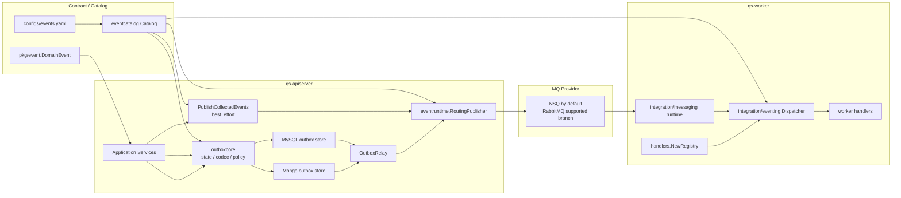
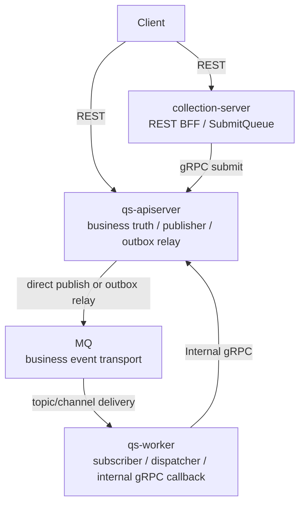
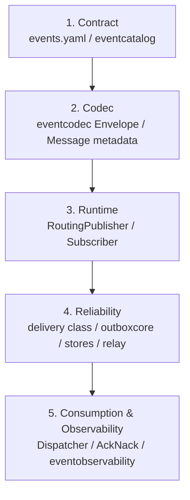

# 事件系统整体架构

**本文回答**：`qs-server` 当前事件系统由哪些层组成、三进程分别承担什么角色、direct publish 和 outbox relay 的可靠性边界在哪里，以及这些能力如何回链到源码和测试。

## 30 秒结论

| 维度 | 当前答案 |
| ---- | -------- |
| 契约真值 | [`configs/events.yaml`](../../../configs/events.yaml) 定义 topic、event、delivery、handler |
| 模型层 | [`internal/pkg/eventcatalog`](../../../internal/pkg/eventcatalog/) 解析契约；[`pkg/event`](../../../pkg/event/) 定义 domain event |
| 运行时层 | [`internal/pkg/eventruntime`](../../../internal/pkg/eventruntime/) 提供 publisher/subscriber；[`internal/pkg/eventcodec`](../../../internal/pkg/eventcodec/) 统一 payload 与 metadata |
| 可靠出站 | `best_effort` direct publish；`durable_outbox` 先写 outbox，再由 relay 发布 |
| 消费端 | worker 显式 handler registry + dispatcher + messaging runtime |
| 观测 | [`internal/pkg/eventobservability`](../../../internal/pkg/eventobservability/) 统一 publish/outbox/consume outcome |
| 关键边界 | 不是所有事件都 outbox 化；`RoutingPublisher` 不禁止 durable 事件，因为 relay 最终也通过它发布 |

## 主架构图



## 三进程角色



| 进程 | 事件系统职责 | 不承担什么 |
| ---- | ------------ | ---------- |
| `qs-apiserver` | 生成领域事件、direct publish、outbox staging、relay 发布 | 不消费业务 MQ |
| `qs-worker` | 订阅 topic、解析 event、分发 handler、Ack/Nack、回调 apiserver | 不持有业务主状态 |
| `collection-server` | 只在提交入口做削峰、透传 idempotency key | 不参与 `qs.*` 业务事件总线 |

## 五层模型



| 层 | 当前实现 | 主要测试 |
| -- | -------- | -------- |
| Contract | [`eventcatalog`](../../../internal/pkg/eventcatalog/) | [`catalog_test.go`](../../../internal/pkg/eventcatalog/catalog_test.go) |
| Codec | [`eventcodec`](../../../internal/pkg/eventcodec/) | [`codec_test.go`](../../../internal/pkg/eventcodec/codec_test.go) |
| Runtime | [`eventruntime`](../../../internal/pkg/eventruntime/) | [`publisher_test.go`](../../../internal/pkg/eventruntime/publisher_test.go)、[`subscriber_test.go`](../../../internal/pkg/eventruntime/subscriber_test.go) |
| Reliability | [`outboxcore`](../../../internal/apiserver/outboxcore/) + DB stores | [`core_test.go`](../../../internal/apiserver/outboxcore/core_test.go)、MySQL/Mongo store tests |
| Consumption | worker `eventing` + `messaging` + handlers | [`dispatcher_test.go`](../../../internal/worker/integration/eventing/dispatcher_test.go)、[`runtime_test.go`](../../../internal/worker/integration/messaging/runtime_test.go)、handler tests |
| Observability | [`eventobservability`](../../../internal/pkg/eventobservability/) | [`observer_test.go`](../../../internal/pkg/eventobservability/observer_test.go) |

## 出站可靠性分层

| delivery class | 当前事件 | 出站方式 | 语义 |
| -------------- | -------- | -------- | ---- |
| `best_effort` | `questionnaire.changed`、`scale.changed`、`task.*` | 应用服务持久化后调用 `PublishCollectedEvents` | 发布失败按 publisher 降级/错误处理，不保证补发 |
| `durable_outbox` | `answersheet.submitted`、`assessment.*`、`report.generated`、`footprint.*` | 先写 MySQL/Mongo outbox，再由 relay 发布 | 主状态与 outbox 在同一持久化边界内写入，relay 可重试 |

`outboxcore.BuildRecords` 会拒绝把 `best_effort` 事件写入 outbox；`eventruntime` 的架构测试会扫描 direct publish 调用点，防止 `durable_outbox` 事件绕过 outbox。

## 当前否定边界

| 不支持或不承诺 | 原因 |
| -------------- | ---- |
| 全事件 exactly-once | MQ 与 worker handler 当前按 at-least-once 风险管理，正确性靠业务幂等与 outbox |
| 全事件 outbox 化 | `questionnaire.changed`、`scale.changed`、`task.*` 明确保持 `best_effort` |
| `events.yaml` 配 worker 并发和重试 | 并发来自 worker 配置和 MQ adapter，不在事件契约里 |
| worker 直接写业务主状态 | worker 通过 internal gRPC 回调 apiserver |
| `SubmitQueue` 是业务 MQ | 它只是 collection-server 进程内缓冲队列 |

## 代码锚点与测试锚点

| 能力 | 源码 | 测试 |
| ---- | ---- | ---- |
| 契约与 delivery | [`configs/events.yaml`](../../../configs/events.yaml)、[`config.go`](../../../internal/pkg/eventcatalog/config.go) | [`catalog_test.go`](../../../internal/pkg/eventcatalog/catalog_test.go) |
| 发布路由 | [`publisher.go`](../../../internal/pkg/eventruntime/publisher.go) | [`publisher_test.go`](../../../internal/pkg/eventruntime/publisher_test.go)、[`architecture_test.go`](../../../internal/pkg/eventruntime/architecture_test.go) |
| outbox 状态机 | [`core.go`](../../../internal/apiserver/outboxcore/core.go) | [`core_test.go`](../../../internal/apiserver/outboxcore/core_test.go) |
| relay | [`outbox.go`](../../../internal/apiserver/application/eventing/outbox.go) | [`outbox_test.go`](../../../internal/apiserver/application/eventing/outbox_test.go) |
| worker 消费 | [`runtime.go`](../../../internal/worker/integration/messaging/runtime.go) | [`runtime_test.go`](../../../internal/worker/integration/messaging/runtime_test.go) |
| handler registry | [`catalog.go`](../../../internal/worker/handlers/catalog.go)、[`registry.go`](../../../internal/worker/handlers/registry.go) | [`registry_test.go`](../../../internal/worker/handlers/registry_test.go) |
| 观测 outcome | [`outcomes.go`](../../../internal/pkg/eventobservability/outcomes.go) | [`observer_test.go`](../../../internal/pkg/eventobservability/observer_test.go) |

## Verify

```bash
GOTOOLCHAIN=local /Users/yangshujie/.gvm/gos/go1.25.9/bin/go test ./internal/pkg/eventcatalog ./internal/pkg/eventcodec ./internal/pkg/eventruntime ./internal/pkg/eventobservability
GOTOOLCHAIN=local /Users/yangshujie/.gvm/gos/go1.25.9/bin/go test ./internal/apiserver/application/eventing ./internal/apiserver/outboxcore ./internal/apiserver/infra/mysql/eventoutbox ./internal/apiserver/infra/mongo/eventoutbox
GOTOOLCHAIN=local /Users/yangshujie/.gvm/gos/go1.25.9/bin/go test ./internal/worker/integration/eventing ./internal/worker/integration/messaging ./internal/worker/handlers
```
