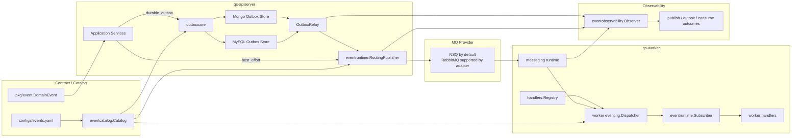
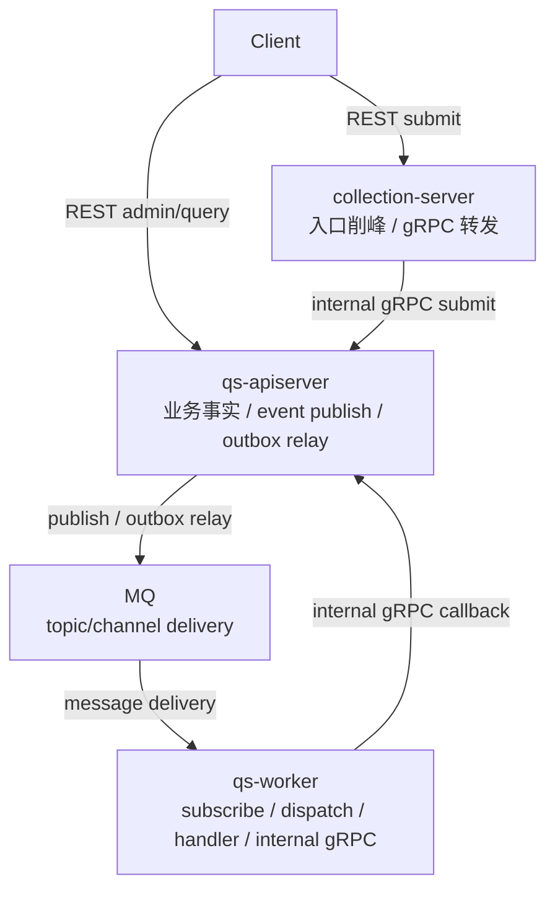
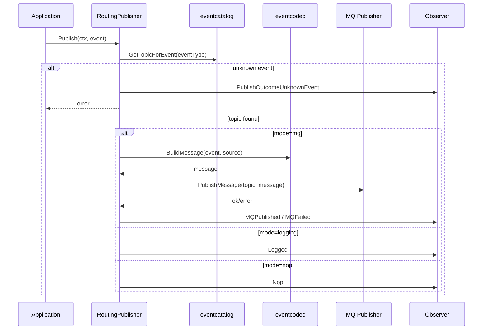
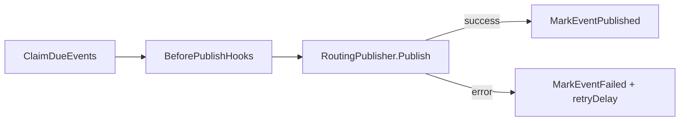
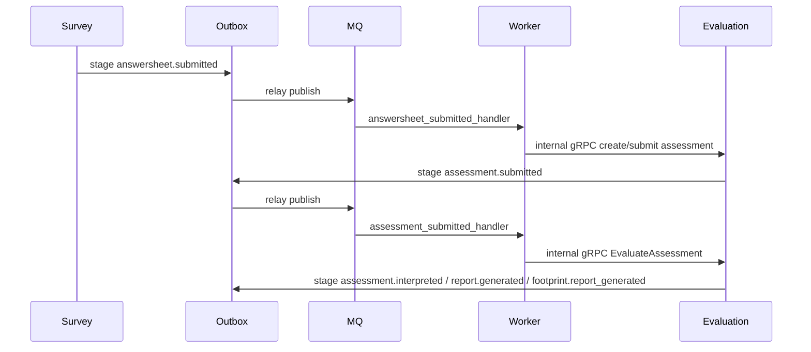

# 事件系统整体架构

**本文回答**：qs-server 的事件系统由哪些层组成；`configs/events.yaml`、eventcatalog、eventcodec、RoutingPublisher、Outbox、Worker Dispatcher、Messaging Runtime、Ack/Nack 与 event observability 如何协作；为什么 event 是系统主流程驱动器，但不能把所有事件都理解为强一致工作流。

---

## 30 秒结论

| 维度 | 结论 |
| ---- | ---- |
| 系统定位 | Event System 是 qs-server 的**异步流程驱动核心**，连接 Survey、Evaluation、Actor、Plan、Statistics 等模块 |
| 契约真值 | `configs/events.yaml` 定义 topic、event type、delivery、aggregate、domain、handler |
| 出站模式 | `best_effort` 事件可以 direct publish；`durable_outbox` 事件必须先 stage outbox，再由 relay 发布 |
| 发布路由 | `eventruntime.RoutingPublisher` 根据 event catalog 把 domain event 路由到 topic |
| 运行模式 | Publisher 支持 `mq / logging / nop` 三种模式，生产应使用 MQ-backed publisher |
| 可靠出站 | OutboxRelay claim due events，执行 before publish hook，publish，mark published；失败则 mark failed 并延后重试 |
| 消费模型 | Worker Dispatcher 校验 `events.yaml` 中所有 handler 都在显式 registry 注册，然后用 Subscriber 注册 eventType -> handler |
| Ack/Nack | 无法解析 event_type 的 poison message 会 Ack；handler 失败会 Nack；handler 成功后 Ack |
| 观测模型 | publish、outbox、consume 的 outcome 统一进入 eventobservability |
| 关键边界 | Event System 驱动流程，但不替代业务状态机；worker 不持有主业务写模型，通常通过 internal gRPC 回调 apiserver |

一句话概括：

> **事件系统负责把“业务事实已经发生”可靠或尽力通知出去；业务事实仍由各业务模块的聚合、仓储和事务边界维护。**

---

## 1. 为什么 event 是 qs-server 的核心组件

qs-server 的主业务链路高度依赖异步事件：

```text
AnswerSheet submitted
  -> create / submit Assessment
  -> evaluate Assessment
  -> generate Report
  -> project Behavior / Statistics
  -> update Tags / Notification / Plan
```

如果没有事件系统，这些链路只能被写成巨大的同步调用链：

- 答卷提交接口会等待评估、报告、统计、通知全部完成。
- 任一副作用失败都会污染主请求。
- 模块之间会直接互相调用，边界迅速坍塌。
- worker、retry、backpressure、统计投影都难以独立演进。

事件系统让 qs-server 可以把主业务事实和后续副作用解耦：

```text
业务模块保存主事实
  -> 产生领域事件
  -> Event System 出站
  -> Worker 消费并执行后续动作
```

---

## 2. 事件系统总图



---

## 3. 三进程职责



| 进程 | 事件系统职责 | 不承担什么 |
| ---- | ------------ | ---------- |
| `qs-apiserver` | 创建领域事件、stage outbox、direct publish、outbox relay 发布 | 不消费业务 MQ |
| `qs-worker` | 订阅 topic、解析消息、按 handler 分发、Ack/Nack、回调 apiserver | 不持有业务主状态 |
| `collection-server` | 接收前台提交、削峰、调用 apiserver | 不参与 `qs.*` 业务事件总线，不做 event consumer |

关键点：

> collection-server 的 SubmitQueue 是入口削峰队列，不是业务事件总线。

---

## 4. 事件契约层

事件契约由 `configs/events.yaml` 描述。

它定义：

| 字段 | 说明 |
| ---- | ---- |
| `version` | 事件配置版本 |
| `topics` | topic key、真实 topic name、description |
| `events` | event type 到 topic、delivery、handler 的映射 |
| `delivery` | `best_effort` 或 `durable_outbox` |
| `aggregate` | 事件所属聚合 |
| `domain` | 事件所属业务域 |
| `handler` | worker handler registry 中的 handler 名称 |

### 4.1 当前 topics

| topic key | topic name | 说明 |
| --------- | ---------- | ---- |
| `questionnaire-lifecycle` | `qs.survey.lifecycle` | 问卷和量表生命周期事件 |
| `assessment-lifecycle` | `qs.evaluation.lifecycle` | 测评生命周期事件 |
| `analytics-behavior` | `qs.analytics.behavior` | 行为足迹与测评服务过程投影事件 |
| `task-lifecycle` | `qs.plan.task` | 测评任务生命周期事件 |

### 4.2 当前事件族

| 事件族 | 典型事件 | delivery |
| ------ | -------- | -------- |
| Survey/Scale lifecycle | `questionnaire.changed`、`scale.changed` | best_effort |
| AnswerSheet / Assessment / Report | `answersheet.submitted`、`assessment.*`、`report.generated` | durable_outbox |
| Behavior footprint | `footprint.*` | durable_outbox |
| Plan task | `task.opened / completed / expired / canceled` | best_effort |

### 4.3 为什么契约集中在 YAML

集中配置的好处：

- 发布端和消费端共享同一事实。
- 事件类型、topic 和 handler 不散落代码。
- worker 启动时可以校验 handler 是否存在。
- 文档和 tests 能回到一个真值文件。
- delivery class 可以被 architecture tests 约束。

---

## 5. 事件模型层

领域事件使用 `pkg/event.DomainEvent` 表达。业务模块只需要创建领域事件，不需要知道 MQ 细节。

典型事件包含：

```text
event_id
event_type
aggregate_type
aggregate_id
occurred_at
payload
metadata
```

### 5.1 业务模块的职责

业务模块负责：

- 在聚合状态变化后创建领域事件。
- 在应用层决定 direct publish 或 outbox staging。
- 确保主状态和事件边界一致。

业务模块不负责：

- MQ topic 选择。
- handler registry。
- Ack/Nack。
- outbox relay。
- message codec。
- retry scheduling。

---

## 6. Codec 层

`eventcodec` 负责把 domain event 转成可发送的 MQ message。

`RoutingPublisher.publishToMQ` 中会调用：

```text
eventcodec.BuildMessage(evt, source)
```

message 会携带：

- payload。
- event_type metadata。
- event source。
- envelope 信息。

Worker 消费时，`MessageEventExtractor` 优先从 message metadata 读取 `event_type`；如果 metadata 缺失，则尝试 decode envelope，从 payload 中恢复 event type。

### 6.1 Codec 的意义

Codec 层避免：

- 每个 handler 自己解析不同格式。
- MQ adapter 泄漏进业务模块。
- payload 和 metadata 不一致。
- poison message 无法判断。

---

## 7. 发布层：RoutingPublisher

`eventruntime.RoutingPublisher` 根据 event catalog 把事件路由到 topic。

### 7.1 核心依赖

| 字段 | 说明 |
| ---- | ---- |
| `topicResolver` | 从 event type 查 topic |
| `mqPublisher` | 具体 MQ publisher |
| `observer` | publish outcome observer |
| `source` | 事件来源，例如 apiserver |
| `mode` | mq / logging / nop |

### 7.2 PublishMode

| mode | 行为 |
| ---- | ---- |
| `mq` | 调用 MQ publisher 发送 message |
| `logging` | 只写日志，不发送 MQ |
| `nop` | 不发送，只记录 nop outcome |

`PublishModeFromEnv` 默认规则：

| env | mode |
| --- | ---- |
| prod / production | mq |
| dev / development | logging |
| test / testing | nop |
| unknown | logging |

### 7.3 Publish 流程



### 7.4 关键边界

`RoutingPublisher` 不判断 event 是否应该 outbox。它只负责“给定一个事件，按 catalog 路由到 topic”。

这很重要，因为：

```text
outbox relay 最终也要通过 RoutingPublisher 发布 durable event
```

所以不能在 RoutingPublisher 内禁止 durable event 发布。是否允许 direct publish durable event，应由 application architecture tests 和发布路径约束。

---

## 8. 出站可靠性分层

Event System 有两类出站方式：

| delivery | 出站方式 | 适用事件 |
| -------- | -------- | -------- |
| `best_effort` | 业务保存后 direct publish | lifecycle cache invalidation、task notification 等轻量副作用 |
| `durable_outbox` | 业务保存事务内 stage outbox，relay 异步 publish | 答卷提交、测评、报告、行为投影等主链路事件 |

### 8.1 best_effort

适用：

- `questionnaire.changed`。
- `scale.changed`。
- `task.opened / completed / expired / canceled`。

语义：

- 发布失败一般不回滚主状态。
- 不保证补发。
- 适合作为通知、缓存刷新、轻量投影。
- 如果未来某事件变成强依赖，应升级为 durable_outbox 并补 outbox stage 边界。

### 8.2 durable_outbox

适用：

- `answersheet.submitted`。
- `assessment.submitted`。
- `assessment.interpreted`。
- `assessment.failed`。
- `report.generated`。
- `footprint.*`。

语义：

- 主状态与 outbox record 必须在同一持久化边界内写入。
- relay 可重试。
- publish 失败会 mark failed 并设置 next_attempt_at。
- 下游消费仍需幂等。

---

## 9. Outbox 层

Outbox 用于可靠出站。

### 9.1 Outbox core

`outboxcore` 定义 outbox 状态和通用转换：

```text
pending
publishing
published
failed
```

它还提供：

- BuildRecords。
- DecodePendingEvent。
- NewPublishedTransition。
- NewFailedTransition。
- BuildStatusSnapshot。

### 9.2 Outbox store

当前有：

| Store | 典型用途 |
| ----- | -------- |
| MySQL outbox store | MySQL 事务边界内的业务事件 |
| Mongo outbox store | Mongo durable submit / report 等边界 |

### 9.3 OutboxRelay

`OutboxRelay.DispatchDue` 做：

1. `ClaimDueEvents(batchSize, now)`。
2. 对每个 pending event 执行 before publish hooks。
3. 调用 publisher.Publish。
4. 成功则 `MarkEventPublished`。
5. 失败则 `MarkEventFailed`，并设置 next attempt。



### 9.4 Durable publisher guard

`NewDurableOutboxRelay` 要求 publisher 是 MQ-backed：

```text
RequireDurablePublisher = true
```

如果 publisher 不是 `mode=mq` 且没有 MQ publisher，durable relay 不应启动。

这避免生产 durable outbox 事件最终只被 log 掉。

---

## 10. 消费层：Worker Dispatcher

Worker 的事件消费分两层：

```text
eventing.Dispatcher
  -> eventruntime.Subscriber
  -> worker handlers registry
```

### 10.1 Dispatcher 初始化

`Dispatcher.Initialize(catalog)` 会：

1. 检查 catalog 已加载。
2. 检查 registry 不为空。
3. 打印已注册 handlers。
4. 校验 `events.yaml` 中每个 handler 都已在 registry 注册。
5. 创建 HandlerFactory。
6. 创建 eventruntime.Subscriber。
7. RegisterHandlers。
8. 输出 handler count。

如果 `events.yaml` 引用了不存在的 handler，worker 初始化失败。

这是一条强约束：**新增事件不能只改 YAML，必须注册 handler。**

### 10.2 Subscriber

`eventruntime.Subscriber` 负责：

- RegisterHandlers：按 event type 创建 handler。
- GetTopicsToSubscribe：返回按 topic 聚合的订阅清单。
- Dispatch：根据 event type 调用 handler。
- HasHandler：判断 event type 是否有 handler。

---

## 11. MQ Messaging Runtime

Worker 的 messaging runtime 负责：

- 创建 subscriber。
- 确保 topic 存在。
- 订阅 topic。
- 解析 event type。
- 调用 dispatcher。
- 按结果 Ack/Nack。

### 11.1 provider

`CreateSubscriber` 当前支持：

| provider | adapter |
| -------- | ------- |
| `nsq` | component-base nsq subscriber |
| `rabbitmq` | component-base rabbitmq subscriber |
| unknown | fallback to NSQ |

当前文档体系中默认按 NSQ 理解，RabbitMQ 是适配器分支能力。

### 11.2 SubscribeHandlers

`SubscribeHandlersWithOptions` 会：

1. 从 dispatcher 获取 topic subscriptions。
2. 对每个 topic 调用 subscriber.Subscribe。
3. channel 使用 serviceName。
4. 每条消息进入 dispatch handler。

### 11.3 MessageEventExtractor

解析 event type 的优先级：

1. `msg.Metadata["event_type"]`。
2. decode payload envelope。

如果二者都失败，视为 invalid/poison message。

---

## 12. Ack/Nack 规则

`MessageSettlementPolicy` 定义消费结算行为。

| 场景 | 行为 |
| ---- | ---- |
| 缺 event_type 且 payload 无法 decode | Ack invalid message，记录 `poison_acked` |
| handler dispatch 失败 | Nack message，记录 `nacked` 或 `nack_failed` |
| handler dispatch 成功 | Ack message，记录 `acked` 或 `ack_failed` |

### 12.1 为什么 poison message 要 Ack

无法解析 event type 的消息通常无法通过重试修复。持续 Nack 会造成 poison message 无限重投，阻塞队列。因此选择 Ack invalid 并记录观测 outcome。

### 12.2 为什么 handler 失败要 Nack

handler 失败可能是下游暂时不可用、业务依赖还未准备好、幂等锁冲突等，Nack 允许 MQ 重试。

### 12.3 handler 必须幂等

因为 MQ 消费至少可能重复，且 Ack 失败也可能导致重复投递，所以 handler 必须按业务 ID、event ID、lock 或状态机保证幂等。

---

## 13. Observability

`eventobservability` 统一记录三类 outcome：

| 类型 | 示例 |
| ---- | ---- |
| Publish outcome | unknown_event、logged、nop、mq_published、mq_failed |
| Outbox outcome | claim_failed、published、publish_failed、mark_failed_failed |
| Consume outcome | poison_acked、nacked、acked、ack_failed |

### 13.1 低基数原则

event observability 的 label 应该使用：

- source。
- mode。
- topic。
- event_type。
- handler。
- outcome。
- relay。
- service。

不应该使用：

- event_id。
- aggregate_id。
- assessment_id。
- answer_sheet_id。
- raw error。
- user_id。

---

## 14. 事件系统驱动的主链路

### 14.1 答卷到报告



### 14.2 行为投影

```text
footprint.* event
  -> analytics-behavior topic
  -> behavior_projector_handler
  -> BehaviorProjector
  -> behavior_footprint / assessment_episode / statistics_journey_daily
```

### 14.3 Plan task 通知

```text
TaskLifecycle.Open
  -> task.opened best_effort
  -> qs.plan.task
  -> task_opened_handler
  -> Notification / MiniProgram
```

---

## 15. 关键边界和不变量

### 15.1 Event 不是业务状态

事件表示“某个业务事实已发生”，但不替代业务状态。

| 事件 | 业务事实源 |
| ---- | ---------- |
| `answersheet.submitted` | AnswerSheet |
| `assessment.submitted` | Assessment |
| `report.generated` | InterpretReport |
| `task.opened` | AssessmentTask |
| `footprint.report_generated` | Behavior projection input |

### 15.2 Worker 不直接持有主状态

worker handler 通常应该：

```text
consume event
  -> parse payload
  -> call internal gRPC / application port
  -> Ack/Nack
```

不要让 worker 直接写业务主表，除非该 handler 明确属于 projection adapter 且有幂等和 checkpoint。

### 15.3 delivery class 不能随意改

把事件从 best_effort 改成 durable_outbox 需要：

- 设计 outbox stage 边界。
- 选择 MySQL/Mongo outbox store。
- 确保主状态和 outbox 同事务。
- 补 relay 和 tests。
- 更新 docs 和 SOP。

把 durable_outbox 改成 best_effort 风险更大，通常不应做。

### 15.4 Outbox 不等于 exactly-once

Outbox 提供可靠出站，但不能保证全链路 exactly-once。消费端仍要考虑：

- 重复投递。
- handler 重入。
- Ack 失败后重复。
- 下游超时。
- 幂等键和状态机。

---

## 16. 设计模式与实现意图

| 模式 | 当前实现 | 意图 |
| ---- | -------- | ---- |
| Event Catalog | `configs/events.yaml` + `eventcatalog.Catalog` | 集中契约，发布消费共享 |
| Routing Publisher | `eventruntime.RoutingPublisher` | 根据 event type 路由 topic |
| Transactional Outbox | outboxcore + MySQL/Mongo stores | 主事实和事件起点同边界 |
| Relay | `OutboxRelay` | 异步发布 due events，失败重试 |
| Explicit Registry | worker handlers registry | 防止 YAML handler 漏注册 |
| Dispatcher | worker eventing.Dispatcher | event type 到 handler 分发 |
| Ack/Nack Policy | MessageSettlementPolicy | 统一 poison / fail / success 结算 |
| Observability Vocabulary | eventobservability outcomes | 统一事件系统观测口径 |
| MQ Adapter | component-base messaging | 隔离 NSQ/RabbitMQ 细节 |

---

## 17. 设计取舍

| 设计 | 收益 | 代价 |
| ---- | ---- | ---- |
| YAML 集中事件契约 | 一处看 topic/delivery/handler | 需要严格校验与文档同步 |
| best_effort 与 durable_outbox 分层 | 成本和可靠性可区分 | 开发者必须理解 delivery 语义 |
| outbox relay 统一发布 | 可重试、可观测 | 引入 backlog 和 relay 排障 |
| worker 显式 registry | handler 缺失早失败 | 新增事件要多改一步 |
| poison Ack | 避免毒消息阻塞 | 需要日志/指标发现坏消息 |
| handler 失败 Nack | 临时错误可重试 | handler 必须幂等 |
| publish mode 支持 logging/nop | 开发/测试安全 | 生产必须确保 durable relay 用 MQ-backed publisher |
| worker 回调 apiserver | 主写模型统一 | 链路多一跳 |

---

## 18. 常见误区

### 18.1 “所有事件都应该 durable outbox”

不需要。轻量通知、缓存刷新、任务通知可以 best_effort。主链路事件才需要 durable_outbox。

### 18.2 “outbox 之后就是 exactly-once”

错误。outbox 只保证可靠出站，消费端仍然可能重复处理。

### 18.3 “worker handler 可以直接改业务表”

不建议。主写模型应回到 apiserver application service。projection handler 除外，但必须有 checkpoint 和幂等。

### 18.4 “events.yaml 写了 handler 就能消费”

不够。handler 还必须在 worker registry 中注册，否则 dispatcher 初始化会失败。

### 18.5 “task.opened 事件失败应该回滚 task 状态”

不应该。task.* 是 best_effort 通知事件，通知失败不回滚任务状态。

### 18.6 “RoutingPublisher 应该禁止 durable event”

不应这样。outbox relay 最终也要用 RoutingPublisher 发布 durable event。禁止 direct durable publish 应通过架构测试和应用层路径约束。

---

## 19. 排障入口

| 现象 | 先看 |
| ---- | ---- |
| event type unknown | `configs/events.yaml`、eventcatalog |
| durable event 没发出去 | outbox store、relay、publisher mode |
| outbox failed 增长 | before hook、MQ publisher、mark failed |
| worker 没订阅 | topic subscriptions、dispatcher init |
| handler 不执行 | handler registry、event type、payload metadata |
| poison message | eventcodec envelope、metadata event_type |
| handler 重复执行 | Ack failure、Nack retry、幂等 |
| report 后统计不动 | footprint event、behavior_projector_handler、pending reconcile |

---

## 20. 代码锚点

### Contract / Runtime

- Event config：[../../../configs/events.yaml](../../../configs/events.yaml)
- Event catalog：[../../../internal/pkg/eventcatalog/](../../../internal/pkg/eventcatalog/)
- Event codec：[../../../internal/pkg/eventcodec/](../../../internal/pkg/eventcodec/)
- RoutingPublisher：[../../../internal/pkg/eventruntime/publisher.go](../../../internal/pkg/eventruntime/publisher.go)
- Subscriber：[../../../internal/pkg/eventruntime/subscriber.go](../../../internal/pkg/eventruntime/subscriber.go)

### Outbox

- Outbox core：[../../../internal/apiserver/outboxcore/core.go](../../../internal/apiserver/outboxcore/core.go)
- Outbox relay：[../../../internal/apiserver/application/eventing/outbox.go](../../../internal/apiserver/application/eventing/outbox.go)
- MySQL outbox：[../../../internal/apiserver/infra/mysql/eventoutbox/](../../../internal/apiserver/infra/mysql/eventoutbox/)
- Mongo outbox：[../../../internal/apiserver/infra/mongo/eventoutbox/](../../../internal/apiserver/infra/mongo/eventoutbox/)

### Worker

- Worker dispatcher：[../../../internal/worker/integration/eventing/dispatcher.go](../../../internal/worker/integration/eventing/dispatcher.go)
- Messaging runtime：[../../../internal/worker/integration/messaging/runtime.go](../../../internal/worker/integration/messaging/runtime.go)
- Worker handlers：[../../../internal/worker/handlers/](../../../internal/worker/handlers/)

### Observability

- Event observability：[../../../internal/pkg/eventobservability/](../../../internal/pkg/eventobservability/)

---

## 21. Verify

```bash
go test ./internal/pkg/eventcatalog
go test ./internal/pkg/eventcodec
go test ./internal/pkg/eventruntime
go test ./internal/pkg/eventobservability
```

Outbox：

```bash
go test ./internal/apiserver/application/eventing
go test ./internal/apiserver/outboxcore
go test ./internal/apiserver/infra/mysql/eventoutbox
go test ./internal/apiserver/infra/mongo/eventoutbox
```

Worker：

```bash
go test ./internal/worker/integration/eventing
go test ./internal/worker/integration/messaging
go test ./internal/worker/handlers
```

Docs：

```bash
make docs-hygiene
git diff --check
```

---

## 22. 下一跳

| 目标 | 文档 |
| ---- | ---- |
| 阅读地图 | [README.md](./README.md) |
| 事件目录与契约 | [01-事件目录与契约.md](./01-事件目录与契约.md) |
| 发布与 Outbox | [02-Publish与Outbox.md](./02-Publish与Outbox.md) |
| Worker 消费 | [03-Worker消费与AckNack.md](./03-Worker消费与AckNack.md) |
| 新增事件 | [04-新增事件SOP.md](./04-新增事件SOP.md) |
| 观测排障 | [05-观测与排障.md](./05-观测与排障.md) |
| MQ 选型 | [06-MQ 选型与分析--讨论市面主流 MQ 的实现方式与优缺点，分析为什么选择 NSQ .md](./06-MQ%20选型与分析--讨论市面主流%20MQ%20的实现方式与优缺点，分析为什么选择%20NSQ%20.md) |
