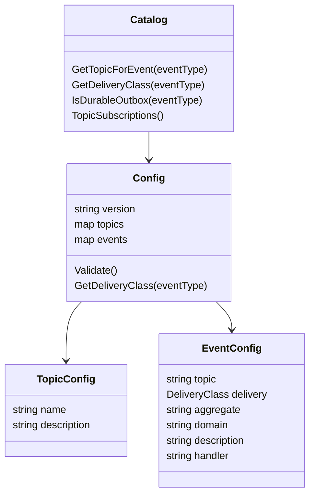
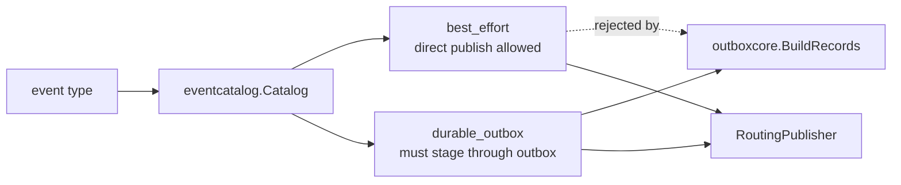
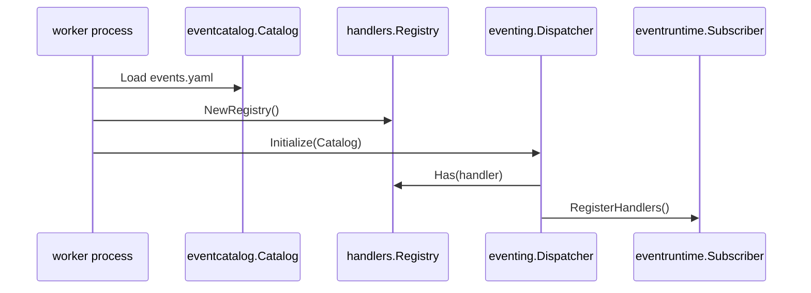

# 事件契约与 Catalog

**本文回答**：`configs/events.yaml` 当前表达哪些事件契约，`eventcatalog` 如何把 YAML 变成代码可查询模型，以及新增事件时哪些契约测试会保护 topic、delivery 和 handler 绑定。

## 30 秒结论

| 维度 | 当前事实 |
| ---- | -------- |
| 真值文件 | [`configs/events.yaml`](../../../configs/events.yaml) |
| 结构 | `version`、`topics`、`events` 三层 |
| topic 数量 | 4 个运行时 topic |
| event 数量 | 19 个事件 |
| delivery class | 只有 `best_effort` 与 `durable_outbox` |
| worker handler | 每个 event 必须声明 `handler`，由 worker 显式 registry 校验 |
| 不在 YAML 中 | worker 并发、重试策略、consumer 元数据、下游服务清单 |

## 模型图



## YAML schema 当前只表达四件事

```yaml
topics:
  assessment-lifecycle:
    name: "qs.evaluation.lifecycle"

events:
  assessment.submitted:
    topic: assessment-lifecycle
    delivery: durable_outbox
    aggregate: Assessment
    domain: evaluation/assessment
    handler: assessment_submitted_handler
```

| 字段 | 作用 | 代码入口 |
| ---- | ---- | -------- |
| `events.*.topic` | 事件到逻辑 topic key 的绑定 | [`Config.Validate`](../../../internal/pkg/eventcatalog/config.go) |
| `topics.*.name` | 运行时物理 topic 名 | [`Catalog.GetTopicForEvent`](../../../internal/pkg/eventcatalog/catalog.go) |
| `events.*.delivery` | 出站可靠性合同 | [`DeliveryClass`](../../../internal/pkg/eventcatalog/config.go) |
| `events.*.handler` | worker handler 名 | [`Dispatcher.Initialize`](../../../internal/worker/integration/eventing/dispatcher.go) |

## 当前 topic 与事件清单

| Topic key | Topic name | 事件 |
| --------- | ---------- | ---- |
| `questionnaire-lifecycle` | `qs.survey.lifecycle` | `questionnaire.changed`、`scale.changed` |
| `assessment-lifecycle` | `qs.evaluation.lifecycle` | `answersheet.submitted`、`assessment.submitted`、`assessment.interpreted`、`assessment.failed`、`report.generated` |
| `analytics-behavior` | `qs.analytics.behavior` | 全部 `footprint.*` |
| `task-lifecycle` | `qs.plan.task` | `task.opened`、`task.completed`、`task.expired`、`task.canceled` |

## delivery class 是事件合同，不是发布器策略



`RoutingPublisher` 只负责把“已允许发布”的事件发到 topic。它不会拒绝 `durable_outbox`，因为 outbox relay 最终也要通过同一个 publisher 发送 durable 事件。是否允许 direct publish 由应用发布点和架构测试共同约束。

## handler 绑定如何校验

worker 侧启动时：

1. resource stage 加载 `configs/events.yaml`。
2. container 显式构造 `handlers.NewRegistry()`。
3. `integration/eventing.Dispatcher.Initialize(catalog)` 校验每个 `events.*.handler` 都能在 registry 中解析。
4. `eventruntime.Subscriber.RegisterHandlers()` 按 catalog 注册事件到 handler 的映射。



## 契约测试保护什么

| 保护点 | 测试 |
| ------ | ---- |
| 代码常量与 YAML 对齐 | [`eventcatalog/catalog_test.go`](../../../internal/pkg/eventcatalog/catalog_test.go) |
| 每个 event 声明合法 delivery | [`TestEventsYAMLDeclaresDeliveryClassForEveryEvent`](../../../internal/pkg/eventcatalog/catalog_test.go) |
| 缺失或非法 delivery 被拒绝 | [`catalog_test.go`](../../../internal/pkg/eventcatalog/catalog_test.go) |
| durable direct publish 被架构测试禁止 | [`eventruntime/architecture_test.go`](../../../internal/pkg/eventruntime/architecture_test.go) |
| worker handler 全量绑定 | [`worker/handlers/registry_test.go`](../../../internal/worker/handlers/registry_test.go) 与 [`dispatcher_test.go`](../../../internal/worker/integration/eventing/dispatcher_test.go) |

## 当前否定边界

| 不是 | 说明 |
| ---- | ---- |
| 不是 retry 配置 | worker 并发和 MQ 重投由 worker 配置和 provider 实现决定 |
| 不是消费者拓扑配置 | YAML 不声明“哪些服务消费”；当前通用消费者是 worker |
| 不是 schema registry | payload 字段仍由领域事件结构和 handler 解码测试保护 |
| 不是发布许可唯一来源 | delivery 只是合同；发布点仍要看代码和架构测试 |

## Verify

```bash
GOTOOLCHAIN=local /Users/yangshujie/.gvm/gos/go1.25.9/bin/go test ./internal/pkg/eventcatalog ./internal/pkg/eventruntime ./internal/worker/integration/eventing ./internal/worker/handlers
```
