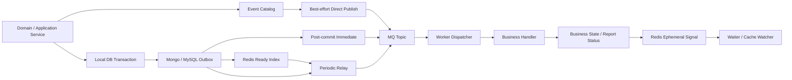

# 事件模块整体设计

## 1. 本文回答

本文是 qs-server event 体系的总设计入口，回答以下问题：

1. event 模块究竟包含哪些能力？
2. Domain Event、Outbox、MQ 和 Redis Signal 分别解决什么问题？
3. 事件如何从业务事务到达 worker，失败时如何重试？
4. 当前系统保证什么，又不保证什么？
5. 新增或调整事件时，必须维护哪些契约？

本文描述当前代码已经实现的设计。尚未实现的能力会显式标记为“规划改造”，不与当前保障混写。

## 2. 30 秒结论

qs-server 的 event 不是单一代码包，而是一组跨进程异步一致性机制：

- **Domain Event** 表达已经发生的业务事实。
- **Outbox** 把业务状态与可发布事件放进同一本地事务，解决“业务已成功，但 MQ 发布失败”的窗口。
- **MQ** 负责跨进程异步投递、worker 扩容和失败重试。
- **Redis Signal** 只负责在线唤醒和缓存失效，丢失可接受，不是业务事实。

可靠事件链路是 **at-least-once** 而不是 exactly-once：Outbox 会保留已持久化但尚未被 publisher 确认的待发布事实；网络、ACK 或 Outbox 状态回写失败可能导致重复投递，因此消费端必须依靠业务唯一键、状态机、claim 或锁实现幂等。

当前实现中存在两套可靠 Outbox：

- MongoDB `domain_event_outbox`：承载答卷和 Interpretation 报告等 Mongo 业务事实。
- MySQL `domain_event_outbox`：承载 Evaluation 事实。

Redis ready index 和 post-commit immediate 只是降低发布延迟的加速层；它们都不改变 Outbox 是可靠事实源的设计。

工程化结构已经收口：`EventSpec + EffectiveRegistry` 提供统一有效契约，EventSubsystem 在 resource stage 构造并统一持有 publisher、Mongo/MySQL Outbox profile、本地 projection consumer、status 与 lifecycle。Survey、Evaluation 和 Interpretation 只依赖窄端口。完整边界见 [10-事件工程化设计.md](10-事件工程化设计.md)。

## 3. 重点速查

| 问题 | 当前答案 | 主要事实源 |
| --- | --- | --- |
| 事件名称、Topic、handler 在哪定义 | `configs/events.yaml` 是运行时目录 | `configs/events.yaml`、`internal/pkg/eventcatalog` |
| 事件包结构是什么 | `id/eventType/occurredAt/aggregateType/aggregateID/data` | `pkg/event`、`internal/pkg/eventcodec` |
| 哪些事件必须进 Outbox | catalog 中 `delivery: durable_outbox` | `configs/events.yaml`、`outboxcore.BuildRecords` |
| 哪些事件可以直接发布 | catalog 中 `delivery: best_effort` | `configs/events.yaml`、`application/eventing/publish.go` |
| Outbox 如何排空 | immediate 尝试 + Redis ready index + DB fallback relay | `application/eventing`、`infra/redis/outboxready` |
| worker 如何找到 handler | catalog handler name + 显式 handler registry | `internal/worker/integration/eventing`、`internal/worker/handlers` |
| 消费失败如何处理 | handler error 触发 NACK；成功触发 ACK | `internal/worker/integration/messaging` |
| Signal 是否可靠 | 不可靠，只用于唤醒、失效和预热 | `internal/pkg/reportstatus`、`internal/pkg/cachesignal` |
| 当前是否有统一事件去重表 | 没有；幂等由各业务链路自己保护 | Evaluation/Interpretation 状态机、claim、CAS、Redis lease |
| 当前是否有 DLQ 和最大重试次数 | 没有统一 DLQ；Outbox `failed` 是可重试状态 | `outboxcore`、Mongo/MySQL eventoutbox |
| `signals.yaml` 是否会被运行时加载 | 不会，当前是说明性清单 | `configs/signals.yaml`、各进程 signaling options |
| 当前是否有完整 Effective Event Registry | 有；启动时合并 YAML 与 EventSpec | `internal/pkg/eventcatalog` |
| Mongo relay 是否已完全脱离 Survey | 是；Mongo profile 由 EventSubsystem 唯一持有 | `internal/apiserver/eventing/subsystem` |

## 4. 模块边界

### 4.1 event 模块负责什么

event 体系负责：

- 定义跨进程可识别的事件 envelope、事件名称和 payload。
- 把事件类型解析到物理 MQ Topic 和 worker handler。
- 在本地业务事务中暂存不能丢失的事件。
- 有界地 claim、并发发布、标记成功或记录下次重试时间。
- 让 worker 根据 event type 调用明确的业务 handler，并处理 ACK/NACK。
- 暴露发布、消费、Outbox 积压和状态指标。

### 4.2 event 模块不负责什么

event 体系不负责：

- 不把 MQ 当作业务真相源；业务状态仍在 MongoDB/MySQL 领域数据中。
- 不保证 exactly-once；重复发布和重复消费必须被接受。
- 不代替业务状态机和业务幂等。
- 不使用 Redis Pub/Sub 保存不能丢失的业务事实。
- 不提供跨 MongoDB、MySQL 和 MQ 的分布式事务。
- 不在通用 event runtime 中决定“测评是否需要计算”或“报告是否已经生成”这类业务规则。

## 5. 三种投递语义

event 体系有三种不能混用的投递语义。

| 语义 | 适用对象 | 存储 | 失败后 | 典型用例 |
| --- | --- | --- | --- | --- |
| `durable_outbox` | 不能因 MQ 短暂故障丢失的业务事实 | MongoDB/MySQL Outbox | relay 重试 | `answersheet.submitted`、`evaluation.outcome.committed` |
| `best_effort` | 可丢失、可由查询或后续变更修复的领域通知 | 不进 Outbox，直接 publish | 记录失败，不保证重试 | `questionnaire.changed`、`task.completed` |
| `ephemeral_signal` | 只需唤醒在线订阅者的短命通知 | Redis Pub/Sub 不持久化 | 订阅者通过 TTL、重查或下次变更恢复 | `report_status_changed`、缓存 changed signal |

### 5.1 `durable_outbox` 表示什么

`durable_outbox` 是事件类型的可靠性契约：该事件如果被产生，应当与业务状态一起写入 Outbox，不允许通过通用 direct-publish helper 发布。

行为旅程不再通过 Event/Outbox/MQ 投影。`behavior_journey_scan` 直接从入口解析日志、接入日志、答卷、测评和报告事实表轮询重建 `behavior_footprint`、episode 与日聚合；`configs/events.yaml`、worker handler 与 Outbox 中均没有 `footprint.*` 事件。`evaluation.failed` 也不再触发实时 behavior 投影。

### 5.2 `best_effort` 表示什么

`best_effort` 事件使用共享 `RoutingPublisher` 直接发布。在 MQ 模式中发布到 catalog 指定的 Topic；在开发 logging 模式中只记录事件；在测试 nop 模式中不产生外部副作用。

这类事件的业务写入与 MQ publish 不在同一事务中，发布失败时可能丢失。只有能接受这一语义的通知才能分类为 `best_effort`。

### 5.3 `ephemeral_signal` 表示什么

Signal 不进入 event catalog、Outbox 或 MQ。Signal 的正确消费方式是：

1. 订阅方先查询真实状态。
2. 如果状态尚未完成，才等待 Signal 或超时。
3. 被唤醒后再次查询真实状态。
4. Signal 丢失时依靠超时、TTL 或下次查询恢复。

## 6. 运行时整体架构



图中有两条不同的事件出站路径：

- `best_effort`：业务成功后直接调用 publisher。
- `durable_outbox`：业务状态与 Outbox 同事务写入，事务提交后由 immediate 或 relay 发布。

两条路径最终都经过同一个 `RoutingPublisher`，使用 event catalog 把 event type 解析为物理 Topic。

## 7. 事件契约与路由

### 7.1 事件 envelope

当前 JSON envelope 由以下字段组成：

| 字段 | 含义 |
| --- | --- |
| `id` | 每次事件实例的 UUID |
| `eventType` | 路由到 Topic 和 handler 的稳定事件名 |
| `occurredAt` | 事件在产生方创建的时间 |
| `aggregateType` | 事件所属聚合类型 |
| `aggregateID` | 事件所属聚合标识 |
| `data` | 事件类型专属 payload |

已实现的 envelope 中没有通用 `event_version`、`schema_version`、`business_key` 或 `trace_id`。如果 payload 需要不兼容升级，必须先设计明确的版本策略，不能假设运行时已经支持 schema negotiation。

### 7.2 事件目录

`configs/events.yaml` 定义：

- 逻辑 Topic 和物理 Topic 名称。
- event type 属于哪个 Topic。
- event type 的 delivery class。
- aggregate、domain、说明和 worker handler 名称。

apiserver 和 worker 在启动时都使用该目录。目录加载会校验：

- 事件引用的 Topic 必须存在。
- handler 不能为空。
- delivery class 必须是 `best_effort` 或 `durable_outbox`。
- Topic 必须至少被一个事件引用。

代码中的 event type 常量是 YAML 的镜像，契约测试保护两者不发生增删漂移。

### 7.3 Topic 与 handler

当前物理 Topic 为：

| Topic | 主要内容 |
| --- | --- |
| `qs.survey.lifecycle` | 问卷和测评模型生命周期通知 |
| `qs.evaluation.lifecycle` | 答卷提交、Evaluation 执行和 Interpretation 结果 |
| `qs.plan.task` | 测评任务生命周期通知 |

worker 的 handler 不使用 `init()` 或隐式全局注册，而是由 `handlers.NewRegistry()` 显式列出。启动时 dispatcher 会确认 YAML 引用的每个 handler 都能在 registry 中创建；缺失绑定会导致 worker 初始化失败。

## 8. Outbox 可靠出站

### 8.1 本地事务边界

可靠事件的基本不变量是：

> 业务状态和该状态产生的 Outbox 记录必须在同一个本地数据库事务中提交或回滚。

当前存在两个事务边界：

| Outbox | 本地数据库 | 承载事实 | 运行时名称 |
| --- | --- | --- | --- |
| Mongo Outbox | MongoDB | AnswerSheet、Interpretation Report | `mongo-domain-events` |
| Assessment Outbox | MySQL | Evaluation requested/outcome committed/failed | `assessment-mysql-outbox` |

两个 Outbox 都使用同一组 core 状态和 relay 契约，但事务不跨数据库。Mongo 业务只与 Mongo Outbox 同事务，MySQL 业务只与 MySQL Outbox 同事务。

### 8.2 Outbox 记录

已实现的 Outbox 记录包含：

- `event_id`、`event_type`、`aggregate_type`、`aggregate_id`。
- 暂存时解析出的 `topic_name`。
- 完整事件 envelope 序列化后的 `payload_json`。
- `status`、`attempt_count`、`next_attempt_at`、`last_error`。
- `created_at`、`updated_at`、`published_at`。
- claim 所需的标识，具体实现因 Mongo/MySQL 适配器而异。

Outbox 核心状态为：

```text
pending -> publishing -> published
                    \-> failed -> publishing -> ...
```

`failed` 在当前实现中是“等待下次尝试”状态，不是终态 DLQ。当前没有全局最大重试次数或通用 dead-letter store。

### 8.3 claim 与优先级

relay 会优先处理少量到期 `failed` 和 stale `publishing` 记录，再处理 `pending`，防止失败事件永久被新流量饿死。

事件类型按业务链路分为 P0/P1/P2：

- P0：答卷提交和 Evaluation 请求。
- P1：Evaluation 结果/失败和 Interpretation 结果/失败。
- P2：当前没有 catalog 中的 durable event；该桶保留给未来的低优先级可靠事件。

优先级只影响排空顺序，不改变可靠性语义。

### 8.4 post-commit immediate

immediate dispatcher 在业务事务已经提交后，按 event ID 重新读取 Outbox 记录并尝试立即发布。它的设计边界是：

- 不在数据库事务内调用 MQ。
- 只处理明确列入 immediate policy 的核心链路事件。
- 使用超时和最大并发保护进程。
- 并发槽满、读取失败或 MQ 失败都不回滚已提交的业务事务。
- 未成功标记为 published 的记录仍由后续 relay 处理。

当前 immediate event type 是代码策略，不是 `events.yaml` 字段：`answersheet.submitted`、`evaluation.requested`、`evaluation.outcome.committed`。

### 8.5 Redis ready index

ready index 是按 P0/P1/P2 分桶的 Redis ZSet，用于快速找到已到期的 Outbox event ID。

关键不变量：

- Redis 中只保存调度索引，不保存唯一业务事实。
- relay 从 ZSet 取到 ID 后，仍需在 Outbox store 中执行持久化 claim。
- Redis 不可用、索引为空或 claim-by-ID 未取到数据时，relay 回退到 DB 扫描。
- reconciler 定期从 Outbox 反向回填索引，修复 post-commit 索引写入丢失或已 pop 未 claim 的窗口。

### 8.6 共享 Mongo relay

Mongo AnswerSheet 和 Interpretation 使用同一个 `domain_event_outbox` collection 和同一个 `mongo-domain-events` ready-index namespace。当前只启动一个能排空该集合全部事件的 Mongo relay。

Mongo AnswerSheet 和 Interpretation 共享 EventSubsystem 中唯一的 `mongo_domain_events` profile。该 profile 持有唯一 Store、ready index、immediate dispatcher、relay、reconciler 和 status reader。

AnswerSheet Repository 只负责答卷与提交幂等记录；Interpretation 只通过 `ProfileBinding` 暂存和通知事件。二者都不构造、代理或导出 Mongo Outbox runtime。

## 9. MQ 发布与消费

### 9.1 RoutingPublisher

`RoutingPublisher` 是 best-effort 和 Outbox relay 共用的最终发布器。它：

1. 根据 event type 从 catalog 查找物理 Topic。
2. 把 Domain Event 编码为 JSON envelope 和 MQ metadata。
3. 根据进程模式执行 MQ publish、logging 或 nop。
4. 记录 publish outcome 指标。

当 durable relay 被要求使用可靠 publisher 时，只有 `mode=mq` 且 MQ publisher 非空才会构建 relay。如果 MQ 未启用或初始化失败，当前进程会降级为 logging 模式，可靠 relay 不启动，Outbox 记录留在数据库等待后续恢复。

### 9.2 worker 订阅与 dispatch

worker 从 event catalog 推导需要订阅的全部 Topic，并使用同一 service/channel 订阅每个 Topic。

消息处理顺序为：

1. 优先从 MQ metadata 取得 `event_type`；没有时从 envelope 解析。
2. 根据 event type 在 subscriber 中查找启动时注册好的 handler。
3. 通过通用日志 decorator 记录 handler 的开始、成功、失败和耗时。
4. handler 调用 gRPC、投影、通知或其他业务服务。
5. handler 返回错误时 NACK；返回 `nil` 时 ACK。

### 9.3 消息安置策略

| 情况 | 当前处理 | 含义 |
| --- | --- | --- |
| metadata 没有 event type，envelope 也无法解析 | ACK 并记录 poison outcome | 避免永久无法处理的消息无限重试 |
| envelope 可解析，但 event type 没有 handler | warning 后返回 `nil`，最终 ACK | 当前策略是跳过未注册事件，不会进入通用 DLQ |
| handler 返回错误 | NACK | 交给 MQ 重试 |
| handler 成功 | ACK | 完成该次消费 |
| ACK/NACK 本身失败 | 记录专门 outcome 和日志 | 消息可能被再次投递 |

因此“未知事件如何安置”是一项显式运行策略，不能仅从“有无告警日志”推断事件是否会被重试。

## 10. 幂等与重复消费

### 10.1 为什么重复是正常现象

以下窗口都可能导致同一事件再次投递：

- MQ publish 成功，但 Outbox `mark published` 失败。
- worker 已执行业务副作用，但 ACK 失败。
- worker 处理超时或进程退出，MQ 重新投递。
- stale `publishing` 记录被 Outbox relay 恢复。

这些都是 at-least-once 系统需要预期的正常边界。

### 10.2 当前幂等策略

当前没有一张通用 `processed_event` 表为所有 handler 去重。各链路使用自己的业务不变量：

| 链路 | 主要保护 |
| --- | --- |
| AnswerSheet -> Assessment | answer sheet 业务唯一性、Ensure 语义、best-effort Redis lease |
| Evaluation execute | Assessment 状态、EvaluationRun claim 和终态检查 |
| Outcome commit | 事务内状态推进、run/outcome 持久化约束 |
| Interpretation generation | generation 业务键、run claim、CAS/version conflict 处理 |
| Behavior journey | 不再由 event 投影；`behavior_journey_scan` 从业务事实轮询重建 |
| Task notification | event metadata 传给 notifier，但不由通用 event runtime 保证外部副作用唯一 |

评估一个新 handler 是否安全时，不能只看它能否解析 payload，必须证明重复调用不会产生不可接受的重复副作用。

## 11. 一次性信令

### 11.1 当前信令

| Signal | 当前发布方 | 当前消费方 | 用途 |
| --- | --- | --- | --- |
| `report_status_changed` | apiserver / worker 的 report-status reporter | collection-server | 唤醒 wait-report，然后重查报告状态 |
| `questionnaire_cache_changed` | apiserver | apiserver、collection-server | 失效或预热问卷缓存 |
| `scale_cache_changed` | apiserver | apiserver | 失效或预热量表缓存 |
| `typology_model_cache_changed` | apiserver | apiserver、collection-server | 失效或预热类型学模型缓存 |

`configs/signals.yaml` 当前没有被进程加载，它是说明性清单，不是像 `events.yaml` 一样的可执行契约。`internal/pkg/signalcatalog` 的同步测试会校验其名称、delivery 和 transport；实际是否启用 Signal、Redis prefix 和 buffer size，仍由 apiserver、worker 和 collection-server 各自的 signaling options 决定。

### 11.2 报告状态与 Signal 的关系

`report_status_changed` 的 payload 包含 assessment、answer sheet、report、status、stage 和失败原因等字段，但 payload 本身仍不是最终真相源。

collection-server 被唤醒后必须重新读取 report-status cache 或数据库状态。如果 Redis Pub/Sub 丢失消息，wait-report 依靠超时返回和客户端后续查询恢复。

## 12. 异常、降级与背压

| 故障 | 当前行为 | 正确性影响 |
| --- | --- | --- |
| MQ publisher 不可用 | 发布器降级为 logging；durable relay 不启动 | Outbox 保留已暂存事件；best-effort 事件可丢 |
| immediate 并发槽满或超时 | 记录 skipped/failed，不回滚业务 | relay 后续发布 |
| Redis ready index 不可用 | 记录告警并回退 DB claim | 可靠性不变，排空效率可能下降 |
| MQ publish 失败 | Outbox 转为 `failed`，设置 `next_attempt_at` | 后续重试 |
| publish 成功但 mark published 失败 | 记录错误，Outbox 仍可被重新 claim | 可能重复投递，不丢失事件 |
| worker handler 失败 | NACK | MQ 重试，要求 handler 幂等 |
| Signal publish 失败 | 记录指标与 warning，不回滚业务状态 | 通过重查/超时恢复 |
| Signal watcher 断开 | watcher 循环重连 | 断开期间的 Signal 可丢 |

relay 的 batch size、publish workers、immediate max concurrent 和运行间隔都是运行配置，用于在排空速度、MQ 压力和数据库连接池之间做权衡。这些参数影响延迟与容量，不应改变事件的业务语义。

## 13. 观测与运维事实

当前已实现的主要观测面包括：

- publish outcome：MQ 成功、logging、nop、unknown event、encode failed、MQ failed。
- Outbox outcome：claim failed、published、publish failed、mark failed、immediate skipped。
- consume outcome：poison ACK、ACK/NACK 成功与失败。
- handler/consume duration：按 service、Topic、event type 和 outcome 统计。
- Outbox backlog：按 store/status 以及 store/event type/status 统计数量和最老年龄。
- report signal：notify、notify failed、watch received、watch reconnect、waiter 注册/唤醒/超时。

当前治理端可读取 event catalog 摘要和 Mongo/MySQL Outbox 状态。Outbox 中存在大量 `failed`、最老 pending age 持续增长或某个 event type 积压时，应从事件类型、store、relay publish outcome 和 worker consume outcome 四个角度联合定位。

尚未形成的通用能力：

- 通用 DLQ 及 DLQ depth 指标。
- 通用 replay API 或管理工作流。
- 统一 processed-event 去重率。
- 统一 schema version distribution。

## 14. 契约与运行时事实源

event 信息仍按责任分布在多个位置，但 EffectiveRegistry 是运行时策略的统一只读视图：

| 信息 | 当前位置 |
| --- | --- |
| event type / Topic / delivery / handler | `configs/events.yaml` |
| 代码事件常量 | `internal/pkg/eventcatalog/types.go` |
| payload | `internal/pkg/eventpayload`、`internal/pkg/eventoutcome` |
| producer 构造器 | 各领域包 `events.go` |
| worker handler factory | `internal/worker/handlers/catalog.go` |
| owner / profile / immediate / priority / idempotency / settlement | `internal/pkg/eventcatalog/spec.go` |
| 有效运行策略 | `internal/pkg/eventcatalog.EffectiveRegistry` |
| Outbox profile 与 lifecycle | `internal/apiserver/eventing/subsystem` |
| additional consumers | `EventSpec.AdditionalConsumers` + apiserver 配置 binding |
| behavior footprint 禁用策略 | [09-事件契约矩阵.md](09-事件契约矩阵.md)、apiserver `behavior_journey_scan` |
| Signal 名称/payload | `internal/pkg/cachesignal`、`internal/pkg/reportstatus` |
| Signal 名称常量与清单同步 | `internal/pkg/signalcatalog`、`configs/signals.yaml` |
| Signal 启用与 Redis 参数 | 各服务 signaling options |

这些位置不应合并成一个超大 YAML；同步测试负责防止 wire contract、工程契约、handler 和文档矩阵漂移。

## 15. 变更事件的完整检查清单

新增或修改事件时，至少回答以下问题：

1. **语义**：这是已发生的事实、执行指令，还是临时唤醒？
2. **可靠性**：丢失是否可接受？是 `durable_outbox`、`best_effort` 还是 Signal？
3. **事务**：如果可靠，它与哪个 Mongo/MySQL 业务事实同事务暂存？
4. **契约**：event type、aggregate、payload JSON 字段是什么？是否存在老消费者？
5. **路由**：应该进入哪个 Topic，由哪个 handler 处理？
6. **幂等**：同一事件重复执行时，哪个业务键、状态机、claim、CAS 或锁保护它？
7. **失败**：handler 哪些错误应 NACK 重试，哪些应视为终态成功？
8. **容量**：它是 P0/P1/P2 哪一级，是否需要 immediate，预期频率是多少？
9. **观测**：如何从 publish、Outbox backlog 和 consume 指标确认它在正常流动？
10. **验证**：YAML/常量同步、payload contract、handler 绑定、事务 staging 和重复消费测试是否都存在？

完整的当前事件与信号矩阵见 [09-事件契约矩阵.md](09-事件契约矩阵.md)。

只有代码常量、YAML 项和 handler 同时存在，不足以证明一个事件设计完整；事务边界和重复消费保护同样是契约的一部分。

## 16. 已实现与后续证据门槛

### 16.1 已实现

- 受 catalog 管理的 Topic、delivery class 和 handler 绑定。
- Mongo/MySQL 本地事务 Outbox。
- immediate、Redis ready index、DB fallback 三层排空路径。
- 有界 worker pool、Outbox 批量标记和重试时间。
- worker 显式 handler registry、通用日志 decorator 和 ACK/NACK 安置。
- Redis report-status/cache Signal 及 wait-report 降级查询。
- publish/outbox/consume/backlog/signal 主要指标。
- 按 event type 维护 producer、delivery、store、immediate、handler、幂等和失败结算矩阵。
- `signals.yaml` 与代码 Signal 常量的名称、delivery 和 transport 同步测试。
- behavior footprint 已退出 Event/Outbox/MQ，由 `behavior_journey_scan` 轮询重建。
- `EventSpec + EffectiveRegistry` 统一 owner、profile、immediate、priority、idempotency 和 settlement。
- EventSubsystem 唯一持有 Mongo/MySQL profile 与 lifecycle。
- hot-rank 已迁移为独立 channel consumer，Redis 故障不阻断主 worker channel。
- unknown ACK 已与普通 handled ACK 分开观测。
- event status 已增加 events、profiles 和 consumers，同时保留 catalog、outboxes。

### 16.2 待补证据

- 验证所有外部通知副作用在重复消费下是否符合业务预期。
- Signal 发布方与订阅方仍是清单和文档声明，尚未与进程实际绑定做全量自动校验。
- 具备真实基础设施环境时，继续验证 Mongo/MySQL 事务、MQ 恢复排空、immediate/relay 竞争和 rolling deployment。
- 只有出现不可逆外部副作用的重复执行证据时，才立项事件专用 inbox/dedup record。

完整工程化结构与非目标见 [10-事件工程化设计.md](10-事件工程化设计.md)。

## 17. 代码事实源

| 能力 | 事实源 |
| --- | --- |
| 事件目录 | [../../../configs/events.yaml](../../../configs/events.yaml) |
| Signal 说明性清单 | [../../../configs/signals.yaml](../../../configs/signals.yaml) |
| 事件基础类型 | [../../../pkg/event](../../../pkg/event) |
| catalog 和代码事件常量 | [../../../internal/pkg/eventcatalog](../../../internal/pkg/eventcatalog) |
| envelope 编解码 | [../../../internal/pkg/eventcodec](../../../internal/pkg/eventcodec) |
| publish / subscriber runtime | [../../../internal/pkg/eventruntime](../../../internal/pkg/eventruntime) |
| EventSubsystem | [../../../internal/apiserver/eventing/subsystem](../../../internal/apiserver/eventing/subsystem) |
| Outbox 应用机制 | [../../../internal/apiserver/application/eventing](../../../internal/apiserver/application/eventing) |
| Outbox core | [../../../internal/apiserver/outboxcore](../../../internal/apiserver/outboxcore) |
| Mongo Outbox | [../../../internal/apiserver/infra/mongo/eventoutbox](../../../internal/apiserver/infra/mongo/eventoutbox) |
| MySQL Outbox | [../../../internal/apiserver/infra/mysql/eventoutbox](../../../internal/apiserver/infra/mysql/eventoutbox) |
| Redis ready index | [../../../internal/apiserver/infra/redis/outboxready](../../../internal/apiserver/infra/redis/outboxready) |
| worker handler 组装 | [../../../internal/worker/integration/eventing](../../../internal/worker/integration/eventing) |
| worker MQ 安置 | [../../../internal/worker/integration/messaging](../../../internal/worker/integration/messaging) |
| worker 业务 handler | [../../../internal/worker/handlers](../../../internal/worker/handlers) |
| 缓存 Signal | [../../../internal/pkg/cachesignal](../../../internal/pkg/cachesignal) |
| 报告状态 Signal | [../../../internal/pkg/reportstatus](../../../internal/pkg/reportstatus) |

## 18. 后续阅读

- [02-领域事件设计.md](02-领域事件设计.md)
- [03-Outbox可靠出站链路.md](03-Outbox可靠出站链路.md)
- [04-MQ发布与消费链路.md](04-MQ发布与消费链路.md)
- [05-一次性信令链路.md](05-一次性信令链路.md)
- [06-事件幂等与重复消费治理.md](06-事件幂等与重复消费治理.md)
- [07-事件积压与补偿机制.md](07-事件积压与补偿机制.md)
- [08-方案取舍.md](08-方案取舍.md)
- [09-事件契约矩阵.md](09-事件契约矩阵.md)
- [10-事件工程化设计.md](10-事件工程化设计.md)
