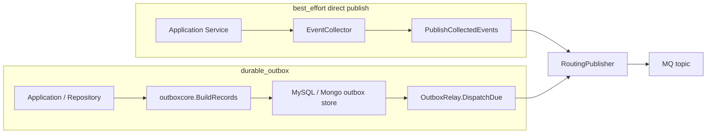
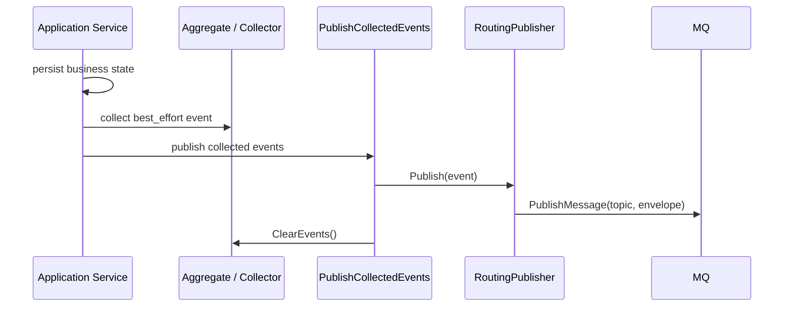
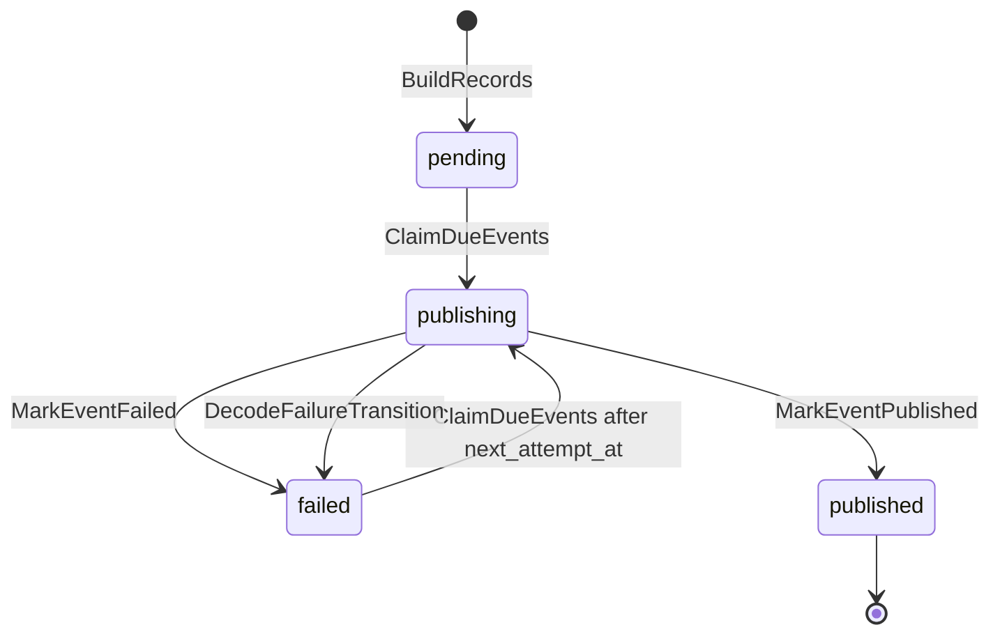
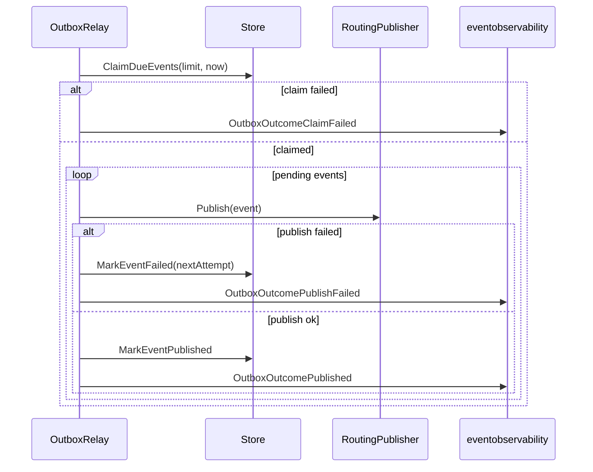

# Publish 与 Outbox

**本文回答**：`qs-apiserver` 事件如何从领域事件进入 MQ，`best_effort` direct publish 与 `durable_outbox` outbox relay 的边界是什么，MySQL/Mongo outbox 共享了什么、没有共享什么。

## 30 秒结论

| 维度 | 当前事实 |
| ---- | -------- |
| direct publish | `questionnaire.changed`、`scale.changed`、`task.*` 走 `PublishCollectedEvents` |
| durable outbox | `answersheet.submitted`、`assessment.*`、`report.generated`、`footprint.*` 先写 outbox |
| 统一 publisher | direct publish 与 relay 最终都调用 [`RoutingPublisher`](../../../internal/pkg/eventruntime/publisher.go) |
| outbox 核心 | [`outboxcore`](../../../internal/apiserver/outboxcore/) 共享状态、record build、decode、transition policy |
| DB-specific 部分 | MySQL claim 用 SQL 事务与锁；Mongo claim 用文档状态更新 |
| 架构保护 | `eventruntime/architecture_test.go` 禁止 durable 事件通过普通 direct publish 出站 |

## 两条出站路径



## direct publish 当前语义

`PublishCollectedEvents` 只负责把聚合或 collector 中暂存的事件逐条发布，并在结束后清理 collector。它不做 delivery 判断，也不做补偿队列。

| direct publish 事件 | 发布点 |
| ------------------- | ------ |
| `questionnaire.changed` | [`survey/questionnaire/lifecycle_service.go`](../../../internal/apiserver/application/survey/questionnaire/lifecycle_service.go) |
| `scale.changed` | [`scale/lifecycle_service.go`](../../../internal/apiserver/application/scale/lifecycle_service.go)、[`scale/factor_service.go`](../../../internal/apiserver/application/scale/factor_service.go) |
| `task.*` | [`plan/task_management_service.go`](../../../internal/apiserver/application/plan/task_management_service.go)、[`plan/task_scheduler_service.go`](../../../internal/apiserver/application/plan/task_scheduler_service.go)、[`plan/lifecycle_service.go`](../../../internal/apiserver/application/plan/lifecycle_service.go)、[`plan/enrollment_service.go`](../../../internal/apiserver/application/plan/enrollment_service.go) |



## durable outbox 当前语义

`durable_outbox` 事件必须先进入 outbox store。`outboxcore.BuildRecords` 在 resolver 支持 delivery 查询时会拒绝 `best_effort` 事件进入 outbox，避免把可靠性合同写反。

| durable 事件族 | 持久化边界 |
| -------------- | ---------- |
| `answersheet.submitted` | Mongo durable submit：答卷、幂等记录、Mongo outbox 同事务 |
| `assessment.submitted` / `assessment.failed` | MySQL assessment 持久化与 MySQL outbox 同事务 |
| `assessment.interpreted` / `report.generated` | 报告保存成功后写 Mongo outbox |
| `footprint.*` | 按产生位置进入 MySQL 或 Mongo outbox |

## outbox 状态机



共享状态与默认策略在 [`outboxcore/core.go`](../../../internal/apiserver/outboxcore/core.go)：

| 概念 | 当前值或行为 |
| ---- | ------------ |
| 状态 | `pending`、`publishing`、`published`、`failed` |
| stale 时间 | `DefaultPublishingStaleFor = 1m` |
| relay retry delay | `DefaultRelayRetryDelay = 10s` |
| decode failure retry delay | `DefaultDecodeFailureRetryDelay = 10s` |
| failed transition | attempt count +1，写 last error 与 next attempt |

## relay 发布时序



## MySQL 与 Mongo 共享和不共享的边界

| 共享 | 不共享 |
| ---- | ------ |
| record build | claim SQL / Mongo query |
| payload encode/decode | transaction API |
| status string | row/document mapping |
| transition policy | database index / lock behavior |
| delivery class 拒绝规则 | 存储字段类型和查询语法 |

这也是当前不抽“统一 outbox repository”的原因：状态机和 codec 是共享语义，claim 是数据库实现细节。

## 关键测试

| 行为 | 测试 |
| ---- | ---- |
| durable record build 与 best-effort 拒绝 | [`outboxcore/core_test.go`](../../../internal/apiserver/outboxcore/core_test.go) |
| MySQL store contract | [`mysql/eventoutbox/store_test.go`](../../../internal/apiserver/infra/mysql/eventoutbox/store_test.go) |
| Mongo store contract | [`mongo/eventoutbox/store_test.go`](../../../internal/apiserver/infra/mongo/eventoutbox/store_test.go) |
| relay outcome 与失败继续 | [`application/eventing/outbox_test.go`](../../../internal/apiserver/application/eventing/outbox_test.go) |
| direct publish 架构保护 | [`eventruntime/architecture_test.go`](../../../internal/pkg/eventruntime/architecture_test.go) |
| durable relay 仍可通过 RoutingPublisher 发布 | [`eventruntime/publisher_test.go`](../../../internal/pkg/eventruntime/publisher_test.go) |

## Verify

```bash
GOTOOLCHAIN=local /Users/yangshujie/.gvm/gos/go1.25.9/bin/go test ./internal/pkg/eventruntime ./internal/apiserver/application/eventing ./internal/apiserver/outboxcore ./internal/apiserver/infra/mysql/eventoutbox ./internal/apiserver/infra/mongo/eventoutbox
```
