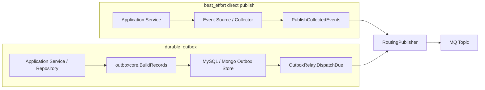
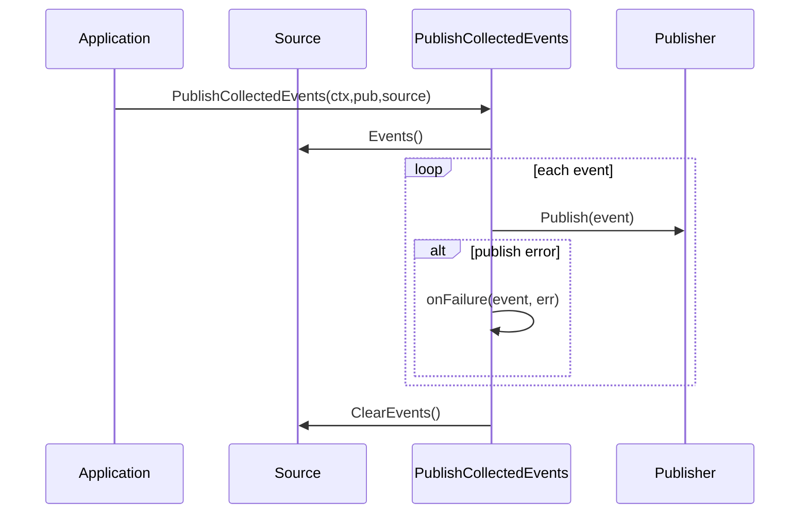
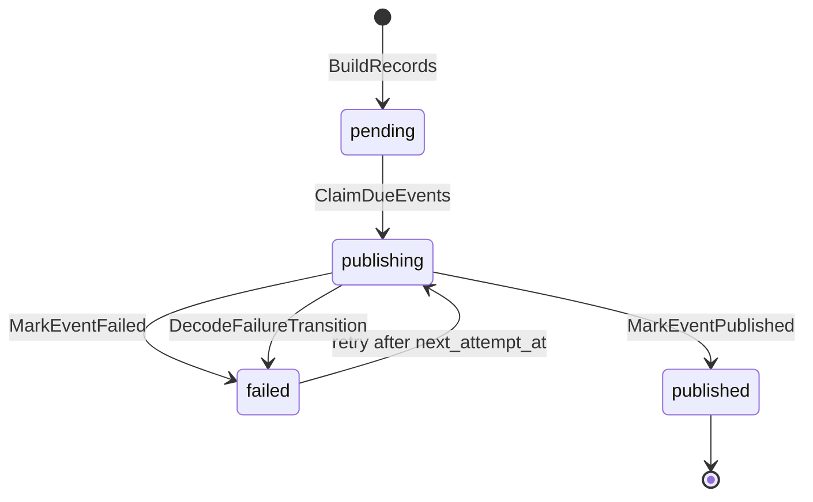
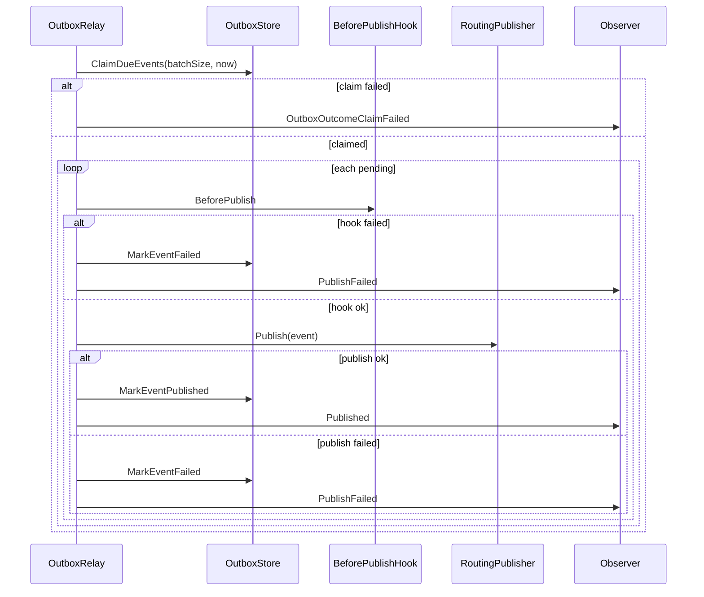

# Publish 与 Outbox

**本文回答**：qs-apiserver 中领域事件如何从应用层进入 MQ；`best_effort` direct publish 与 `durable_outbox` 的边界是什么；`PublishCollectedEvents`、`RoutingPublisher`、`outboxcore`、MySQL/Mongo outbox store、OutboxRelay 如何协作；哪些事件不能绕过 outbox。

---

## 30 秒结论

| 维度 | 结论 |
| ---- | ---- |
| 两条出站路径 | `best_effort` 走 direct publish；`durable_outbox` 先 stage outbox，再由 relay 发布 |
| direct publish helper | `PublishCollectedEvents` 遍历 Source 事件并调用 publisher，单事件失败不中断后续事件，结束后清空 Source |
| direct publish 风险 | helper 不判断 delivery class，因此不能用于 durable 主链路事件 |
| durable outbox | outbox record 与业务主状态必须在同一持久化边界内写入 |
| 统一发布器 | direct publish 和 relay 最终都调用 `eventruntime.RoutingPublisher` |
| Outbox core | `outboxcore` 统一 record build、payload decode、状态、transition policy |
| MySQL store | Stage 需要 MySQL 事务上下文；claim 使用 `FOR UPDATE SKIP LOCKED` 抢 pending/failed/stale publishing |
| Mongo store | Stage 需要 Mongo session transaction；claim 优先少量 failed/stale，再处理 pending，避免饿死 |
| Relay | Claim due events -> before hooks -> publish -> mark published / mark failed |
| Durable guard | durable relay 要求 MQ-backed publisher，避免生产 durable event 只被 log 掉 |
| 关键不变量 | best_effort 不应进入 outbox；durable_outbox 不应通过普通 direct publish 绕过 outbox |

一句话概括：

> **direct publish 是轻量通知路径；outbox 是主链路可靠出站路径。二者最终都用同一个 RoutingPublisher，但进入 publisher 之前的可靠性边界完全不同。**

---

## 1. 为什么要区分 Publish 与 Outbox

事件出站有两类诉求。

### 1.1 轻量通知诉求

例如：

```text
questionnaire.changed
scale.changed
task.opened
```

这类事件通常用于：

- 缓存刷新。
- 任务通知。
- 轻量投影。
- 非主链路副作用。

它们可以使用 best_effort direct publish。发布失败通常不应回滚主状态。

### 1.2 主链路可靠诉求

例如：

```text
answersheet.submitted
assessment.submitted
report.generated
footprint.report_generated
```

这类事件一旦丢失，会导致：

- 答卷提交后不创建测评。
- 测评提交后不执行评估。
- 报告生成后统计/标签/通知不推进。
- 行为投影缺失。

所以必须使用 durable outbox：业务主状态和 outbox record 同一持久化边界内写入，relay 后续重试发布。

---

## 2. 两条出站路径总图



关键区别：

| 维度 | best_effort | durable_outbox |
| ---- | ----------- | -------------- |
| 进入 MQ 方式 | 直接调用 publisher | relay 从 outbox 发布 |
| 业务事务内是否写事件 | 否 | 是 |
| 发布失败是否可补偿 | 默认不补偿 | 可由 outbox retry |
| 是否需要 outbox store | 否 | 是 |
| 是否适合主链路 | 否 | 是 |
| handler 是否仍要幂等 | 是 | 是 |

---

## 3. PublishCollectedEvents

`PublishCollectedEvents` 是应用层 helper。

### 3.1 Source 接口

```go
type Source interface {
    Events() []event.DomainEvent
    ClearEvents()
}
```

Source 可以是：

- 聚合自身。
- staticSource。
- 其它收集领域事件的对象。

### 3.2 行为语义

`PublishCollectedEvents` 的行为：

1. source 为空则直接返回。
2. publisher 为空则调用 onMissingPublisher，然后返回。
3. 遍历 source.Events()。
4. 对每个 event 调用 publisher.Publish。
5. 单个 event publish 失败时调用 onFailure。
6. 不因单个 event 失败中断后续 event。
7. 遍历完成后调用 source.ClearEvents()。



### 3.3 它不做什么

`PublishCollectedEvents` 不做：

- delivery class 判断。
- outbox staging。
- topic 解析。
- retry。
- transaction。
- durable guarantee。
- Ack/Nack。
- handler dispatch。

因此它只适合 best_effort 事件。

---

## 4. Direct Publish 适用边界

当前适合 direct publish 的事件：

| Event | Delivery | 语义 |
| ----- | -------- | ---- |
| `questionnaire.changed` | best_effort | 问卷规则变化通知 |
| `scale.changed` | best_effort | 量表规则变化通知 |
| `task.opened` | best_effort | 任务开放通知 |
| `task.completed` | best_effort | 任务完成通知 |
| `task.expired` | best_effort | 任务过期通知 |
| `task.canceled` | best_effort | 任务取消通知 |

### 4.1 Direct publish 的正确理解

best_effort 并不等于“不重要”，而是系统选择：

```text
主状态成功优先；
副作用可以丢失或由其它路径修复；
不为此付出 outbox 成本。
```

### 4.2 Direct publish 失败如何处理

`PublishCollectedEvents` 会把错误交给 onFailure，但不会中断后续事件，也不会重试。

所以排障时要看：

- publish outcome。
- log。
- MQ availability。
- 是否应该升级为 durable_outbox。

---

## 5. RoutingPublisher

direct publish 与 outbox relay 最终都调用 `RoutingPublisher`。

### 5.1 发布流程

```text
event type
  -> topicResolver.GetTopicForEvent
  -> eventcodec.BuildMessage
  -> mqPublisher.PublishMessage(topic, message)
```

如果 event type 不在 catalog：

- observe unknown_event。
- 记录 error log。
- 返回 error。

### 5.2 PublishMode

| Mode | 说明 |
| ---- | ---- |
| `mq` | 发送 MQ |
| `logging` | 只记录日志 |
| `nop` | 不发送 |

生产环境 durable relay 必须是 MQ-backed publisher。

### 5.3 为什么 RoutingPublisher 不禁止 durable event

因为 outbox relay 发布 durable event 时也要使用 RoutingPublisher。如果在 RoutingPublisher 中直接拒绝 durable_outbox event，会连 relay 都无法工作。

正确边界是：

```text
普通应用 direct publish 不应发送 durable event；
outbox relay 可以发送 durable event。
```

这个边界通过应用路径和架构测试保护，而不是通过 RoutingPublisher 单独判断。

---

## 6. Durable Outbox 适用边界

当前 durable outbox 事件包括：

```text
answersheet.submitted
assessment.submitted
assessment.interpreted
assessment.failed
report.generated
footprint.*
```

这些事件都具备：

| 条件 | 说明 |
| ---- | ---- |
| 丢失会影响流程 | 比如不执行评估、不生成投影 |
| 需要重试 | MQ 或 worker 临时失败时不能丢 |
| 需要观测 | pending/failed/oldest age |
| 需要和业务状态同边界 | 避免状态成功但事件丢失 |

---

## 7. Outbox Stage 边界

### 7.1 MySQL outbox stage

MySQL Store 的 `Stage(ctx, events...)` 要求：

```text
mysql.RequireTx(ctx)
```

也就是说必须在 MySQL 事务上下文中调用。

典型边界：

```text
WithinTransaction
  -> save Assessment
  -> stage AssessmentSubmittedEvent / AssessmentFailedEvent
  -> commit
```

如果 stage 失败，事务应失败，避免业务状态成功但事件没有入 outbox。

### 7.2 Mongo outbox stage

Mongo Store 的 `Stage(ctx, events...)` 要求：

```text
ctx.(mongo.SessionContext)
```

也就是说必须在 Mongo session transaction 中调用。

典型边界：

```text
Mongo transaction
  -> save AnswerSheet / Report
  -> stage answersheet.submitted / report.generated / footprint
  -> commit
```

### 7.3 为什么需要同一持久化边界

如果业务状态和 outbox 不是同一边界，会出现：

| 场景 | 后果 |
| ---- | ---- |
| 状态保存成功，outbox 写失败 | 后续流程永远不触发 |
| outbox 写成功，状态保存失败 | worker 消费到不存在的业务事实 |
| report.generated 提前出站 | 下游查不到报告 |
| assessment.submitted 丢失 | 测评卡住不评估 |

---

## 8. Outbox core

`outboxcore` 提供共享语义：

| 能力 | 说明 |
| ---- | ---- |
| 状态常量 | pending / publishing / published / failed |
| BuildRecords | 从 DomainEvent 构建 outbox record |
| DecodePendingEvent | 从 payload JSON 还原 PendingEvent |
| PublishedTransition | 生成 published 状态更新 |
| FailedTransition | 生成 failed 状态更新 |
| StatusSnapshot | 汇总 outbox 状态 |
| UnfinishedStatuses | pending/publishing/failed 等未完成状态 |

### 8.1 Outbox 状态机



### 8.2 BuildRecords 的关键约束

`BuildRecords` 会：

- 通过 resolver 查 topic。
- 通过 resolver 查 delivery。
- 生成 payload JSON。
- 设置 pending。
- 设置 next_attempt_at。
- 拒绝不适合 outbox 的事件。

特别是：best_effort 事件不应被写入 outbox。

---

## 9. MySQL Outbox Store

MySQL outbox 表：

```text
domain_event_outbox
```

核心字段：

| 字段 | 说明 |
| ---- | ---- |
| event_id | 唯一事件 ID |
| event_type | 事件类型 |
| aggregate_type | 聚合类型 |
| aggregate_id | 聚合 ID |
| topic_name | 物理 topic |
| payload_json | 事件 payload |
| status | pending/publishing/published/failed |
| attempt_count | 尝试次数 |
| next_attempt_at | 下次尝试时间 |
| last_error | 最近错误 |
| published_at | 发布时间 |

### 9.1 ClaimDueEvents

MySQL claim 使用事务：

```text
FOR UPDATE SKIP LOCKED
```

选择：

```text
(status=pending AND next_attempt_at<=now)
OR (status=failed AND next_attempt_at<=now)
OR (status=publishing AND updated_at<=staleBefore)
```

然后把选中 rows 更新为：

```text
status = publishing
updated_at = now
```

这能避免多 relay 实例重复 claim 同一批事件。

### 9.2 Decode failure

如果 row payload decode 失败：

```text
NewDecodeFailureTransition
MarkEventFailed
continue
```

不会让坏 payload 阻塞整批 relay。

---

## 10. Mongo Outbox Store

Mongo collection：

```text
domain_event_outbox
```

### 10.1 Indexes

Mongo store 会创建：

- `uk_event_id` unique index。
- `idx_status_next_attempt_at`。
- pending partial index。
- failed partial index。
- publishing partial index。

### 10.2 Stage

Mongo Stage 要求 active session transaction：

```text
ErrActiveSessionTransactionRequired
```

这保证 Mongo 业务文档和 outbox docs 同事务提交。

### 10.3 ClaimDueEvents

Mongo claim 采用分段策略：

1. 少量 failed。
2. 少量 stale publishing。
3. pending。
4. 如果还有容量，再继续 failed。
5. 如果还有容量，再继续 stale publishing。

这样避免 failed/stale rows 被大量 pending backlog 饿死。

### 10.4 ClaimOne

Mongo 使用 `FindOneAndUpdate`：

```text
filter by status/time
sort
set status=publishing
return document after update
```

decode 失败则 mark failed。

---

## 11. OutboxRelay

OutboxRelay 是通用 relay。

### 11.1 初始化选项

| 选项 | 说明 |
| ---- | ---- |
| Name | relay 名称 |
| Store | outbox store |
| Publisher | event publisher |
| Observer | event observability |
| Status | outbox status reporter |
| BatchSize | 每次 claim 数量，默认 50 |
| RetryDelay | publish 失败后延迟，默认 outboxcore delay |
| RequireDurablePublisher | 是否要求 MQ-backed publisher |
| BeforePublishHooks | 发布前 hook |

### 11.2 DispatchDue

流程：



### 11.3 before publish hook

BeforePublishHook 适合做：

- 发布前校验。
- 运行时开关检查。
- 业务一致性 guard。
- 防止不满足条件的事件出站。

Hook 失败会 mark failed，不会 publish。

---

## 12. Report durable save 是典型边界

Evaluation 的 Report 保存链路是 durable outbox 的典型例子。

```text
InterpretationHandler
  -> ApplyEvaluation
  -> Save Assessment
  -> Build Report
  -> SaveReportDurably
  -> stage assessment.interpreted / report.generated / footprint.report_generated
```

为什么 `assessment.interpreted` 不在 `ApplyEvaluation` 里直接添加事件？

因为完整成功语义是：

```text
Assessment 已保存为 interpreted
Report 已成功保存
success events 已 stage
```

如果提前发 interpreted，可能出现：

```text
下游收到 interpreted
但 report 查不到
```

---

## 13. Footprint durable outbox

`footprint.*` 事件虽然属于统计/行为投影，但也使用 durable_outbox。

原因：

- 行为漏斗依赖它。
- assessment_episode 依赖它。
- statistics_journey_daily 依赖它。
- 迟到/乱序需要 projector/pending/reconcile。
- 丢失会影响统计闭环。

这些事件通常由业务应用服务在各自持久化边界 stage。

---

## 14. 哪些事件不能绕过 outbox

以下事件不能通过普通 direct publish：

```text
answersheet.submitted
assessment.submitted
assessment.interpreted
assessment.failed
report.generated
footprint.entry_opened
footprint.intake_confirmed
footprint.testee_profile_created
footprint.care_relationship_established
footprint.care_relationship_transferred
footprint.answersheet_submitted
footprint.assessment_created
footprint.report_generated
```

原因：

- 它们的 delivery 是 durable_outbox。
- 它们驱动主链路或统计投影。
- 丢失会产生无法自动修复的流程洞。
- 需要 backlog/failed 观测。

---

## 15. Outbox 与 MQ 的边界

Outbox 不是 MQ。

| Outbox | MQ |
| ------ | -- |
| 存在数据库中 | 存在消息系统中 |
| 表示“待出站事件” | 表示“已投递消息” |
| 支持 claim/retry/status | 支持 topic/channel/delivery |
| 与业务事务绑定 | 与消费者订阅绑定 |
| relay 发布后进入 MQ | worker 从 MQ 消费 |

### 15.1 Stage 成功不等于消费成功

完整链路：

```text
stage outbox
  -> relay publish
  -> MQ deliver
  -> worker dispatch
  -> handler success
  -> Ack
```

stage 只完成第一步。

---

## 16. 设计模式与实现意图

| 模式 | 当前实现 | 意图 |
| ---- | -------- | ---- |
| Event Collector | Source / Events / ClearEvents | 聚合临时收集 best_effort 事件 |
| Routing Publisher | RoutingPublisher | event type -> topic |
| Transactional Outbox | outboxcore + store | 业务状态与事件起点同边界 |
| Relay | OutboxRelay | 异步发布 due events |
| Store Adapter | MySQL / Mongo outbox store | 数据库差异留在 infra |
| State Machine | pending/publishing/published/failed | 可靠出站状态可观测 |
| Before Hook | OutboxBeforePublishHook | 发布前 guard |
| Observer | eventobservability | publish/outbox outcome 指标 |

---

## 17. 设计取舍

| 设计 | 收益 | 代价 |
| ---- | ---- | ---- |
| best_effort 保留 direct publish | 轻量，成本低 | 不能保证补发 |
| durable 走 outbox | 可靠，可观测，可重试 | 引入 outbox store、relay、backlog |
| MySQL/Mongo 各自 store | 贴合事务边界 | 两套 claim 实现 |
| 共享 outboxcore | 统一状态与转换 | store 仍需分别测试 |
| relay 统一 publisher | 发布路径一致 | 必须保证 publisher mode 正确 |
| claim stale publishing | relay 崩溃后可恢复 | 需要 stale 时间参数 |
| failed retry delay | 自动恢复临时故障 | poison 事件需要观测处理 |

---

## 18. 常见误区

### 18.1 “PublishCollectedEvents 可以发布所有事件”

错误。它不判断 delivery class，只适合 best_effort。

### 18.2 “写入 outbox 就等于事件已发送”

错误。还需要 relay publish、MQ deliver、worker Ack。

### 18.3 “outbox 能保证 exactly-once”

不能。outbox 保证可靠出站，消费端仍要幂等。

### 18.4 “best_effort 事件一定可以丢”

不是这么理解。它只是系统不承担 outbox 级补偿，业务上仍应尽量保证 publisher 可用和观测。

### 18.5 “Mongo 和 MySQL outbox 应该完全统一实现”

不现实。共享状态和 record build 可以统一，claim/transaction/index 是数据库实现细节。

### 18.6 “relay 失败应该回滚业务状态”

不应该。业务状态已提交，relay 失败应重试出站，不回滚业务事实。

---

## 19. 排障路径

### 19.1 best_effort 事件没收到

检查：

1. 事件是否被聚合收集。
2. `PublishCollectedEvents` 是否被调用。
3. publisher 是否 nil。
4. publisher mode 是否 mq/logging/nop。
5. event type 是否在 catalog。
6. MQ topic 是否存在。
7. worker 是否订阅 topic。
8. handler 是否注册。

### 19.2 durable 事件没出站

检查：

1. 业务事务是否 stage outbox。
2. outbox record 是否 pending。
3. relay 是否运行。
4. ClaimDueEvents 是否 claim。
5. publisher 是否 MQ-backed。
6. before hook 是否失败。
7. MarkEventPublished/Failed 是否成功。

### 19.3 outbox failed 增长

检查：

1. last_error。
2. MQ publisher。
3. event payload decode。
4. before hook。
5. topic resolver。
6. event catalog。
7. retry delay 和 next_attempt_at。

### 19.4 outbox publishing 卡住

检查：

1. updated_at 是否超过 stale threshold。
2. relay 是否崩溃。
3. ClaimDueEvents 是否包含 stale publishing。
4. DB locks / transactions。
5. MarkEventPublished 是否失败。

---

## 20. 修改指南

### 20.1 新增 durable_outbox 事件

必须：

1. 定义事件 payload。
2. 添加 eventcatalog constants。
3. 添加 `configs/events.yaml`。
4. 设计 stage 边界。
5. 使用 MySQL/Mongo transaction。
6. 补 outbox store 测试。
7. 补 relay / architecture tests。
8. 补 worker handler。
9. 补文档和排障项。

### 20.2 将 best_effort 升级为 durable_outbox

必须说明：

- 为什么事件丢失不可接受。
- 业务状态在哪里保存。
- outbox record 与哪个事务绑定。
- 使用 MySQL 还是 Mongo store。
- relay 是否可观测。
- 是否需要历史补偿。

### 20.3 修改 outbox store

必须补：

- Stage transaction required tests。
- BuildRecords tests。
- ClaimDueEvents tests。
- Decode failure tests。
- MarkPublished / MarkFailed tests。
- StatusSnapshot tests。

---

## 21. 代码锚点

### Direct publish

- Publish helper：[../../../internal/apiserver/application/eventing/publish.go](../../../internal/apiserver/application/eventing/publish.go)
- RoutingPublisher：[../../../internal/pkg/eventruntime/publisher.go](../../../internal/pkg/eventruntime/publisher.go)

### Outbox core / relay

- Outbox core：[../../../internal/apiserver/outboxcore/core.go](../../../internal/apiserver/outboxcore/core.go)
- Outbox relay：[../../../internal/apiserver/application/eventing/outbox.go](../../../internal/apiserver/application/eventing/outbox.go)

### Stores

- MySQL outbox store：[../../../internal/apiserver/infra/mysql/eventoutbox/store.go](../../../internal/apiserver/infra/mysql/eventoutbox/store.go)
- Mongo outbox store：[../../../internal/apiserver/infra/mongo/eventoutbox/store.go](../../../internal/apiserver/infra/mongo/eventoutbox/store.go)

### Contract

- Event config：[../../../configs/events.yaml](../../../configs/events.yaml)
- Event catalog：[../../../internal/pkg/eventcatalog/](../../../internal/pkg/eventcatalog/)

---

## 22. Verify

```bash
go test ./internal/apiserver/application/eventing
go test ./internal/apiserver/outboxcore
go test ./internal/apiserver/infra/mysql/eventoutbox
go test ./internal/apiserver/infra/mongo/eventoutbox
go test ./internal/pkg/eventruntime
```

如果修改 delivery 或 `events.yaml`：

```bash
go test ./internal/pkg/eventcatalog ./internal/pkg/eventruntime ./internal/worker/integration/eventing ./internal/worker/handlers
make docs-hygiene
```

---

## 23. 下一跳

| 目标 | 文档 |
| ---- | ---- |
| 回看整体架构 | [00-整体架构.md](./00-整体架构.md) |
| 回看事件目录 | [01-事件目录与契约.md](./01-事件目录与契约.md) |
| Worker 消费 | [03-Worker消费与AckNack.md](./03-Worker消费与AckNack.md) |
| 新增事件 | [04-新增事件SOP.md](./04-新增事件SOP.md) |
| 排障 | [05-观测与排障.md](./05-观测与排障.md) |
