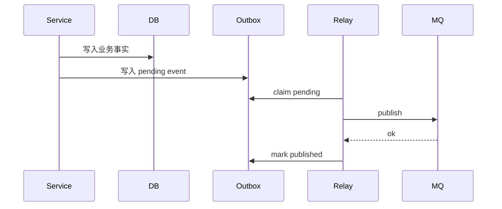

# Outbox 可靠出站链路

## 1. 解决什么问题

Outbox 解决“业务写入成功，但 MQ 发布失败怎么办”的一致性问题。答卷提交、测评完成、报告生成这类业务事实不能只依赖一次 MQ publish。

## 2. 所在位置

Outbox 位于业务写入和 MQ 之间。Survey / Evaluation / Report 在保存业务状态时同时记录 Outbox 事件；relay 后续把事件发布到 MQ。

## 3. 设计目标

业务写入和事件出站准备处于同一一致性边界；发布失败可重试；事件状态可查询；积压可观测；死信可人工补偿。

## 4. 整体流程

## 5. 核心数据结构

Outbox 记录至少包含 event_id、event_type、aggregate_id、business_key、payload、status、retry_count、next_attempt_at、last_error、created_at、published_at。

## 6. 正常流程

提交成功后写入 `answersheet.submitted` 等事件。relay 获取 pending 事件，发布到配置的 topic，发布成功后把状态推进为 published。

## 7. 异常流程

MQ 发布失败时 Outbox 记录保留 pending 或 retry 状态，并更新 retry_count / next_attempt_at。达到重试上限后进入 failed / dead letter，由补偿任务或人工处理。

## 8. 幂等 / 降级 / 背压

relay claim 必须防止多实例重复发布；消费者仍需幂等，因为 MQ 至少一次投递下可能重复消费；relay 并发和批量大小必须有上限，避免 MQ 或 DB 慢时扩大积压。

## 9. 可选方案

直接 publish MQ 简单但会丢事件；业务写入后起 goroutine 发布不可靠；分布式事务成本高且跨 Mongo / MySQL / MQ 不现实。

## 10. 当前方案取舍

Outbox 不等于 MQ。Outbox 负责本地业务写入与事件发布之间的一致性，MQ 负责跨进程异步投递。当前选择 Outbox + relay + MQ 的最终一致方案。

## 11. 观测指标

Outbox pending count、oldest pending age、claim duration、publish success / failed、retry count、dead letter count、relay loop error、publish latency。

## 12. 代码事实源

- [../../../internal/apiserver/outboxcore](../../../internal/apiserver/outboxcore)
- [../../../internal/apiserver/application/eventing/outbox.go](../../../internal/apiserver/application/eventing/outbox.go)
- [../../../internal/apiserver/infra/mongo/eventoutbox](../../../internal/apiserver/infra/mongo/eventoutbox)
- [../../../internal/apiserver/infra/mysql/eventoutbox](../../../internal/apiserver/infra/mysql/eventoutbox)
- [../../../internal/apiserver/container/internal/outboxruntime](../../../internal/apiserver/container/internal/outboxruntime)
- [../../../configs/events.yaml](../../../configs/events.yaml)
