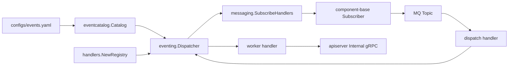
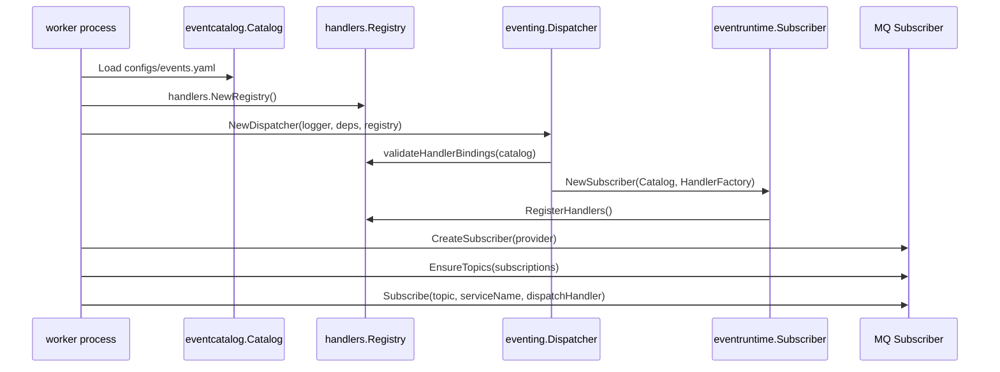
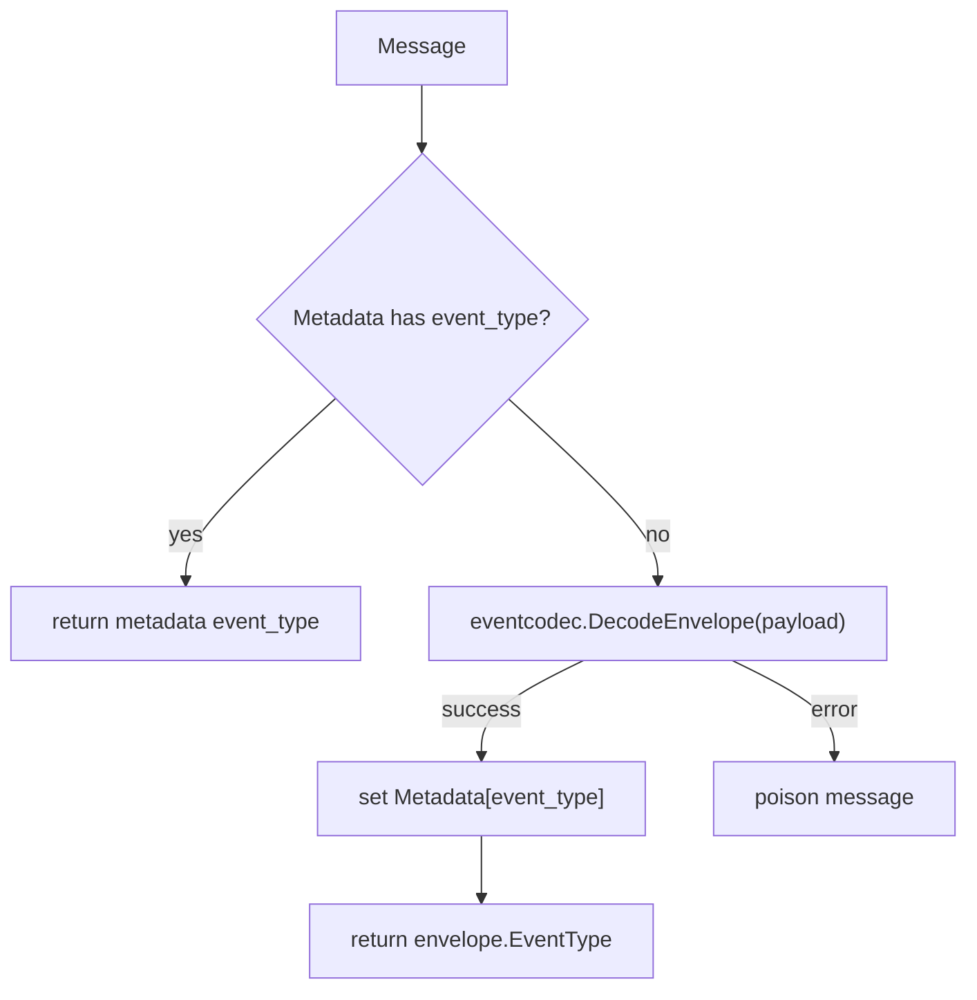
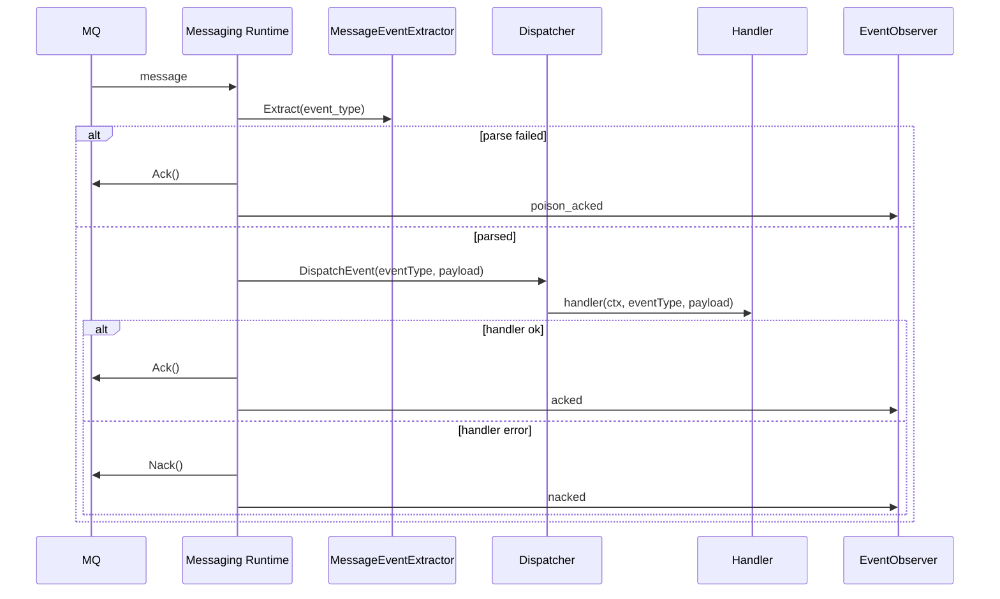

# Worker 消费与 Ack/Nack

**本文回答**：`qs-worker` 如何根据 `configs/events.yaml` 自动生成 topic subscriptions；worker handler 如何显式注册和校验；MQ message 如何解析出 event type；dispatcher 如何分发 handler；成功、失败、毒消息分别如何 Ack/Nack；worker 消费为什么必须具备幂等和重复抑制。

---

## 30 秒结论

| 维度 | 结论 |
| ---- | ---- |
| 订阅来源 | worker 不手写 topic；订阅来自 `eventcatalog.Catalog.TopicSubscriptions()` |
| handler 来源 | `handlers.NewRegistry()` 显式注册 handler factory，不走隐式 init 全局注册 |
| 初始化校验 | `Dispatcher.Initialize` 会校验 `events.yaml` 中每个 handler 都已在 registry 注册，缺失则启动失败 |
| 分发模型 | `eventruntime.Subscriber` 建立 `eventType -> handlerFunc` 映射 |
| MQ runtime | `worker/integration/messaging` 负责 subscriber 创建、topic ensure、Subscribe、Ack/Nack |
| event type 解析 | 优先读 message metadata `event_type`；缺失时 fallback decode event envelope |
| 毒消息 | event type 无法解析时 Ack，避免无限重投阻塞队列 |
| handler 成功 | handler 返回 nil 后 Ack |
| handler 失败 | handler 返回 error 后 Nack，由 MQ provider 决定后续重投 |
| 幂等要求 | MQ 语义不是 exactly-once，handler 必须通过状态机、eventID、业务 ID、locklease 或 checkpoint 保证幂等 |
| 主写模型 | worker 通常通过 internal gRPC 回调 apiserver，不直接持有业务主写模型 |

一句话概括：

> **worker 是事件消费和副作用执行进程；它负责可靠地解析、分发、Ack/Nack，但业务正确性仍依赖 handler 幂等和 apiserver 主写模型。**

---

## 1. Worker 在事件系统里的定位

事件出站后，worker 承接异步副作用：

```text
MQ topic
  -> worker subscriber
  -> dispatcher
  -> handler
  -> internal gRPC / projection / notification
```

它的职责是：

- 订阅 topic。
- 接收 MQ message。
- 提取 event type。
- 根据 event type 找 handler。
- 执行 handler。
- 根据结果 Ack/Nack。
- 记录 consume outcome。
- 对需要的场景做重复抑制或投影 checkpoint。

它不应该：

- 绕过 apiserver 直接改主业务状态。
- 直接持有 Survey/Evaluation/Actor/Plan 主写模型。
- 自己解释 topic/delivery 契约。
- 把 event 消费状态当成业务状态。
- 假设消息只会处理一次。

---

## 2. Worker 消费总图



---

## 3. 启动与订阅时序



关键启动约束：

1. catalog 必须加载。
2. handler registry 必须配置。
3. YAML 中的 handler 必须都能在 registry 找到。
4. Subscriber 必须成功注册所有 event type。
5. MQ subscriber 必须订阅所有 topic subscriptions。

---

## 4. Handler Registry

`handlers.NewRegistry()` 是 worker handler 的显式 catalog。

当前注册了 12 个 handler factory：

| Handler Name | 说明 |
| ------------ | ---- |
| `answersheet_submitted_handler` | 处理答卷提交，计算答卷分并创建 Assessment |
| `assessment_submitted_handler` | 处理测评提交，触发评估等后续动作 |
| `assessment_interpreted_handler` | 处理测评已解读 |
| `assessment_failed_handler` | 处理测评失败 |
| `behavior_projector_handler` | 处理全部 `footprint.*` 行为投影 |
| `questionnaire_changed_handler` | 处理问卷变更 |
| `report_generated_handler` | 处理报告生成，例如回写标签 |
| `scale_changed_handler` | 处理量表变更 |
| `task_opened_handler` | 处理任务开放通知 |
| `task_completed_handler` | 处理任务完成通知 |
| `task_expired_handler` | 处理任务过期通知 |
| `task_canceled_handler` | 处理任务取消通知 |

### 4.1 Registry 接口

`Registry` 提供：

| 方法 | 说明 |
| ---- | ---- |
| `Names()` | 返回已注册 handler 名称 |
| `Has(name)` | 判断 handler 是否存在 |
| `Create(name, deps)` | 根据名称创建 handler function |

### 4.2 为什么显式 registry 很重要

| 价值 | 说明 |
| ---- | ---- |
| 启动早失败 | YAML handler 缺失时启动失败，而不是消息到来才失败 |
| diff 可见 | 新增 handler 必须改 catalog，代码审查更明确 |
| 测试容易 | dispatcher 可以注入 fake registry |
| 避免隐式 init | 不依赖包 init 注册带来的顺序和可见性问题 |

---

## 5. Handler 依赖边界

handler 依赖由 `handlers.Dependencies` 注入。

核心依赖包括：

| 依赖 | 用途 |
| ---- | ---- |
| Logger | 结构化日志 |
| AnswerSheetClient | 历史/兼容的答卷 gRPC client |
| EvaluationClient | 历史/兼容的评估 gRPC client |
| InternalClient | worker 当前主要 internal gRPC 依赖 |
| LockManager | Redis locklease，用于重复抑制 |
| LockKeyBuilder | Redis keyspace |
| Notifier | 任务通知接口 |

`InternalClient` 抽象了 worker 侧使用的 apiserver internal gRPC 能力：

- CreateAssessmentFromAnswerSheet。
- CalculateAnswerSheetScore。
- EvaluateAssessment。
- SyncAssessmentAttention。
- GenerateQuestionnaireQRCode。
- GenerateScaleQRCode。
- HandleQuestionnairePublishedPostActions。
- HandleScalePublishedPostActions。
- ProjectBehaviorEvent。
- SendTaskOpenedMiniProgramNotification。

这说明 worker handler 主要通过 internal gRPC 回调 apiserver，不直接写业务主表。

---

## 6. Dispatcher

`worker/integration/eventing.Dispatcher` 把 handler registry 接到共享 event runtime。

### 6.1 Initialize

`Initialize(catalog)` 做：

1. catalog 非空校验。
2. registry 非空校验。
3. 打印 registry 中可用 handler。
4. `validateHandlerBindings(catalog)` 校验所有 YAML handler 都存在。
5. 构造 handler factory。
6. 创建 `eventruntime.Subscriber`。
7. 调用 `subscriber.RegisterHandlers()`。
8. 记录 handler count。

### 6.2 validateHandlerBindings

它会遍历：

```text
catalog.Config().Events
```

并检查：

```text
registry.Has(eventCfg.Handler)
```

缺失则返回错误：

```text
handler "xxx" not registered for event "yyy"
```

这条检查让 YAML 和 worker 代码保持同步。

---

## 7. Subscriber

`eventruntime.Subscriber` 负责 event type 到 handler 的内存映射。

### 7.1 RegisterHandlers

它会遍历 config events：

```text
eventType -> eventCfg.Handler -> handlerFactory(handlerName)
```

然后保存：

```text
handlers[eventType] = handlerFunc
```

如果 handlerFactory 返回错误，注册失败。

### 7.2 TopicSubscriptions

`GetTopicsToSubscribe()` 返回按 topic 聚合的订阅：

```text
TopicName
EventTypes[]
```

messaging runtime 用它订阅 MQ topic。

### 7.3 Dispatch

`Dispatch(ctx, eventType, payload)` 做：

- 找到 handler。
- 找不到则 warn 并返回 nil。
- 找到则调用 handler。

注意：正常启动时找不到 handler 应被初始化校验提前阻断，所以运行时找不到一般说明 catalog/registry 或初始化路径异常。

---

## 8. Messaging Runtime

`worker/integration/messaging` 负责与具体 MQ adapter 交互。

### 8.1 CreateSubscriber

当前支持：

| provider | 行为 |
| -------- | ---- |
| `nsq` | 使用 component-base NSQ subscriber，配置 `MaxInFlight` |
| `rabbitmq` | 使用 RabbitMQ subscriber |
| unknown | warn 后 fallback NSQ |

### 8.2 EnsureTopics

对 dispatcher 返回的 topic subscriptions：

1. 收集 topic names。
2. 使用 NSQ topic creator 确保 topic 存在。
3. 如果无 topic，则 debug 返回。

### 8.3 SubscribeHandlers

对每个 topic：

```text
subscriber.Subscribe(topicName, serviceName, messageHandler)
```

其中：

| 参数 | 说明 |
| ---- | ---- |
| `topicName` | 从 event catalog 得到 |
| `serviceName` | worker service name，作为 channel |
| `messageHandler` | createDispatchHandlerWithObserver 创建 |

---

## 9. event type 解析

`MessageEventExtractor` 负责从 MQ message 中提取 event type。



### 9.1 为什么要 fallback decode envelope

不同 MQ provider 对 metadata/header 支持不同。NSQ 这类消息系统没有天然 header 概念，因此 payload envelope 是保底信息源。

### 9.2 提取失败意味着什么

如果 metadata 没有 `event_type`，payload 又不能 decode 成 event envelope，该 message 对 worker 来说不可路由。它会被当作 poison message。

---

## 10. Ack/Nack 策略

`MessageSettlementPolicy` 统一消费结算。

### 10.1 三种分支

| 场景 | 行为 | Outcome |
| ---- | ---- | ------- |
| 无法解析 event type | Ack | `poison_acked` / `poison_ack_failed` |
| handler 返回 nil | Ack | `acked` / `ack_failed` |
| handler 返回 error | Nack | `nacked` / `nack_failed` |

### 10.2 时序图



---

## 11. 为什么 poison message 要 Ack

poison message 是 worker 无法解析 event type 的消息。

如果对 poison message Nack，会导致：

- 消息持续重投。
- topic/channel 被毒消息占住。
- worker 反复报同一个解析错误。
- 真正可处理消息延迟。

所以当前策略是：

```text
Ack invalid message
记录 poison outcome
通过日志/metrics 排查上游错误
```

这是一种保护队列的取舍。

---

## 12. 为什么 handler 失败要 Nack

handler 失败可能是临时错误：

- apiserver internal gRPC 暂时不可用。
- DB/Redis 短暂超时。
- 下游背压。
- 幂等锁冲突。
- 投影暂时无法归因。
- 外部服务错误。

Nack 允许 MQ provider 后续重投。

但这要求 handler 必须幂等。

---

## 13. 幂等与重复消费

Event System 不提供全链路 exactly-once。以下情况都可能重复：

- MQ 重投。
- handler 失败后 Nack。
- Ack 失败。
- worker crash。
- 多实例并发。
- duplicate event。

### 13.1 当前幂等/重复抑制手段

| 场景 | 手段 |
| ---- | ---- |
| answersheet.submitted | Redis locklease duplicate suppression |
| behavior projector | analytics_projector_checkpoint |
| outbox relay | event_id unique + outbox status |
| Assessment/Evaluation | 状态机和唯一约束 |
| Report / Statistics | report durable boundary + projection checkpoint |
| Task notification | best_effort，handler 尽量容忍重复 |

### 13.2 answersheet.submitted duplicate suppression

`answersheet_submitted_handler` 使用 Redis locklease：

```text
answersheet:processing:{answerSheetID}
```

行为：

| 情况 | 处理 |
| ---- | ---- |
| lock manager 不可用 | degraded-open，继续处理 |
| acquire 失败 | degraded-open，继续处理 |
| 未获取锁 | duplicate skipped，返回 nil |
| 获取锁成功 | 执行业务处理，defer release |

这是一种 best-effort duplicate suppression，不是强事务幂等。真正业务正确性仍应由 apiserver 创建 Assessment 的幂等和唯一约束兜底。

---

## 14. Handler 分组

### 14.1 AnswerSheet

| Event | Handler | 主要动作 |
| ----- | ------- | -------- |
| `answersheet.submitted` | `answersheet_submitted_handler` | 解析答卷提交事件，计算答卷分，创建 Assessment |

### 14.2 Assessment / Report

| Event | Handler | 主要动作 |
| ----- | ------- | -------- |
| `assessment.submitted` | `assessment_submitted_handler` | 触发 EvaluateAssessment |
| `assessment.interpreted` | `assessment_interpreted_handler` | 后续统计/日志/副作用 |
| `assessment.failed` | `assessment_failed_handler` | 失败统计/告警/日志 |
| `report.generated` | `report_generated_handler` | 报告生成后回写标签等动作 |

### 14.3 Behavior

| Events | Handler | 主要动作 |
| ------ | ------- | -------- |
| `footprint.*` | `behavior_projector_handler` | 调 internal gRPC ProjectBehaviorEvent，更新 behavior projection |

### 14.4 Survey / Scale lifecycle

| Event | Handler | 主要动作 |
| ----- | ------- | -------- |
| `questionnaire.changed` | `questionnaire_changed_handler` | 问卷发布后动作，例如二维码/缓存 |
| `scale.changed` | `scale_changed_handler` | 量表发布后动作，例如二维码/缓存 |

### 14.5 Plan task

| Event | Handler | 主要动作 |
| ----- | ------- | -------- |
| `task.opened` | `task_opened_handler` | 发送小程序任务开放通知 |
| `task.completed` | `task_completed_handler` | 任务完成通知 |
| `task.expired` | `task_expired_handler` | 任务过期通知 |
| `task.canceled` | `task_canceled_handler` | 任务取消通知 |

---

## 15. Worker concurrency 与 channel

### 15.1 MaxInFlight

`CreateSubscriber` 对 NSQ provider 会将 `worker.concurrency` 映射到：

```text
nsq.Config.MaxInFlight
```

这控制 worker 并发消费能力。

### 15.2 Channel

`SubscribeHandlers` 使用：

```text
subscriber.Subscribe(topicName, serviceName, msgHandler)
```

`serviceName` 作为 channel。多 worker 实例使用同一个 serviceName 时，共享同一个 channel backlog。

### 15.3 events.yaml 不表达并发

`events.yaml` 不配置：

- worker 并发。
- channel 名称。
- retry 次数。
- handler timeout。
- consumer group。
- DLQ。

这些属于 worker runtime / MQ provider 配置，不属于事件契约。

---

## 16. 失败传播语义

### 16.1 handler 返回 error

handler 返回 error 会导致：

```text
runtime Nack
MQ 后续重投
consume outcome = nacked
```

### 16.2 handler 内吞错

如果 handler 把错误吞掉并返回 nil：

```text
runtime Ack
消息不会重投
```

所以 handler 对错误是否返回必须谨慎：

| 错误类型 | 建议 |
| -------- | ---- |
| 临时下游错误 | 返回 error，让 MQ 重试 |
| 业务已完成 / 幂等命中 | 返回 nil |
| payload 非法但已解析 event type | 通常返回 error 或按业务决定，不要 silent drop |
| 重复处理 | 返回 nil |
| 通知 best_effort 失败 | 可记录 warning 后返回 nil，取决于事件语义 |

---

## 17. Worker 与 apiserver 边界

worker handler 通过 `InternalClient` 调用 apiserver。

优点：

- 主写模型集中在 apiserver。
- handler 易测。
- 权限/状态机/事务仍在应用层。
- worker 只做异步驱动。

不要让 worker 直接写：

- Assessment。
- AnswerSheet。
- Testee。
- Task。
- Report。

例外是明确的 read-side/projection adapter，但必须有 checkpoint/幂等机制。

---

## 18. Observability

Worker 消费会记录：

| 指标类型 | 说明 |
| -------- | ---- |
| consume outcome | acked / nacked / poison_acked / ack_failed |
| consume duration | handler 执行耗时 |
| topic | MQ topic |
| event_type | 事件类型 |
| service | worker serviceName |

### 18.1 低基数原则

不要把以下字段作为 metrics label：

- event_id。
- aggregate_id。
- answer_sheet_id。
- assessment_id。
- task_id。
- user_id。
- raw error。

这些应放日志，不放 metrics label。

---

## 19. 排障路径

### 19.1 Worker 启动失败

检查：

1. `configs/events.yaml` 是否加载。
2. handler registry 是否 nil。
3. YAML handler 是否在 registry 注册。
4. Subscriber.RegisterHandlers 是否报错。
5. MQ subscriber 是否创建成功。
6. topic ensure 是否失败。

### 19.2 某事件没有 handler 执行

检查：

1. event type 是否在 YAML。
2. event 是否进入正确 topic。
3. worker 是否订阅该 topic。
4. message metadata/payload 是否包含 event_type。
5. dispatcher.HasHandler(eventType)。
6. handler registry 是否注册。
7. handler 是否返回 error 被 Nack。

### 19.3 消息反复重试

检查：

1. handler error log。
2. internal gRPC 是否可用。
3. 下游业务是否返回临时错误。
4. 幂等锁是否冲突。
5. payload 是否无法被 handler 解析。
6. 是否需要把永久性业务错误转为 Ack 并记录补偿。

### 19.4 poison message 增长

检查：

1. publisher 是否使用 eventcodec.BuildMessage。
2. message metadata 是否丢失。
3. payload envelope 是否完整。
4. 是否有手工写入 MQ 的错误消息。
5. MQ provider adapter 是否破坏 payload。

---

## 20. 修改指南

### 20.1 新增 handler

必须：

1. 实现 handler function。
2. 增加 handler factory。
3. 加入 `handlers.NewRegistry()`。
4. 在 `configs/events.yaml` 引用 handler。
5. 补 registry/dispatcher/handler tests。
6. 补本文档或 SOP。

### 20.2 修改 Ack/Nack 策略

必须非常谨慎。

如果把 handler error 改成 Ack：

- 可能丢事件。
- 需要证明错误不可重试。
- 需要补观测和补偿。

如果把 poison message 改成 Nack：

- 可能造成毒消息无限重投。
- 需要 DLQ 或最大重试策略。

### 20.3 新增 MQ provider

必须实现：

- Publisher。
- Subscriber。
- Ack/Nack semantics。
- Metadata/envelope 兼容。
- topic ensure 或 equivalent。
- tests。
- docs。
- observability。

---

## 21. 设计模式与实现意图

| 模式 | 当前实现 | 意图 |
| ---- | -------- | ---- |
| Explicit Registry | `handlers.NewRegistry` | handler 绑定显式可审查 |
| Dispatcher | `eventing.Dispatcher` | catalog-driven event dispatch |
| Subscriber Runtime | `eventruntime.Subscriber` | eventType -> handlerFunc |
| Settlement Policy | `MessageSettlementPolicy` | Ack/Nack/poison 规则集中 |
| Envelope Fallback | `MessageEventExtractor` | 兼容无 metadata 的 MQ |
| Internal Client Boundary | `handlers.InternalClient` | worker 不直写主模型 |
| Duplicate Suppression | locklease / checkpoint | 控制重复消费副作用 |
| Observability | eventobservability | 统一 consume outcome |

---

## 22. 设计取舍

| 设计 | 收益 | 代价 |
| ---- | ---- | ---- |
| handler registry 显式 | 启动早失败，diff 清楚 | 新增 handler 多一步 |
| poison Ack | 防止毒消息阻塞 | 坏消息需要靠观测发现 |
| handler error Nack | 临时错误可重试 | handler 必须幂等 |
| metadata + envelope 双解析 | 兼容不同 MQ | payload 必须保持 envelope |
| serviceName 作为 channel | 多实例共享 backlog | 不同消费组需要明确命名 |
| worker 调 internal gRPC | 主写模型统一 | 多一次网络调用 |
| duplicate suppression degraded-open | Redis 故障时可用性优先 | 可能重复处理，需要业务幂等兜底 |

---

## 23. 常见误区

### 23.1 “worker 消费成功就等于业务完成”

不一定。Ack 只表示 handler 返回 nil。业务是否完成要看 apiserver 主状态或投影状态。

### 23.2 “Nack 一定会无限重试”

取决于 MQ provider 和配置。当前语义是交给 provider 重投，不在 events.yaml 中配置重试次数。

### 23.3 “poison message 应该 Nack”

通常不应该。无法解析 event type 的消息重试也无法修复，Ack 后观测更合理。

### 23.4 “handler 可以直接写业务表”

不建议。worker 应通过 internal gRPC 回调 apiserver，保持写模型统一。

### 23.5 “events.yaml 里配置了 handler 就一定存在”

不一定。必须由 worker registry 校验，缺失会启动失败。

### 23.6 “MaxInFlight 在 events.yaml 配”

不是。它属于 worker messaging config，不属于事件契约。

---

## 24. 代码锚点

### Dispatcher / Subscriber

- Worker dispatcher：[../../../internal/worker/integration/eventing/dispatcher.go](../../../internal/worker/integration/eventing/dispatcher.go)
- Event subscriber：[../../../internal/pkg/eventruntime/subscriber.go](../../../internal/pkg/eventruntime/subscriber.go)

### Messaging runtime

- Messaging runtime：[../../../internal/worker/integration/messaging/runtime.go](../../../internal/worker/integration/messaging/runtime.go)

### Handlers

- Handler registry：[../../../internal/worker/handlers/registry.go](../../../internal/worker/handlers/registry.go)
- Handler catalog：[../../../internal/worker/handlers/catalog.go](../../../internal/worker/handlers/catalog.go)
- AnswerSheet handler：[../../../internal/worker/handlers/answersheet_handler.go](../../../internal/worker/handlers/answersheet_handler.go)
- Worker handlers：[../../../internal/worker/handlers/](../../../internal/worker/handlers/)

### Contract

- Event config：[../../../configs/events.yaml](../../../configs/events.yaml)

---

## 25. Verify

```bash
go test ./internal/worker/integration/eventing
go test ./internal/worker/integration/messaging
go test ./internal/worker/handlers
```

如果修改 handler registry 或 `events.yaml`：

```bash
go test ./internal/pkg/eventcatalog ./internal/worker/integration/eventing ./internal/worker/handlers
make docs-hygiene
```

如果修改 MQ provider 或 Ack/Nack 语义：

```bash
go test ./internal/worker/integration/messaging ./internal/pkg/eventruntime ./internal/pkg/eventobservability
```

---

## 26. 下一跳

| 目标 | 文档 |
| ---- | ---- |
| 回看事件总架构 | [00-整体架构.md](./00-整体架构.md) |
| 回看事件目录 | [01-事件目录与契约.md](./01-事件目录与契约.md) |
| Publish 与 Outbox | [02-Publish与Outbox.md](./02-Publish与Outbox.md) |
| 新增事件 | [04-新增事件SOP.md](./04-新增事件SOP.md) |
| 排障 | [05-观测与排障.md](./05-观测与排障.md) |
