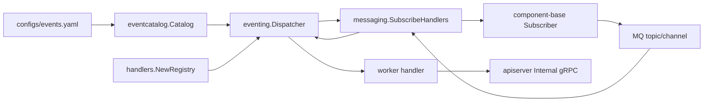
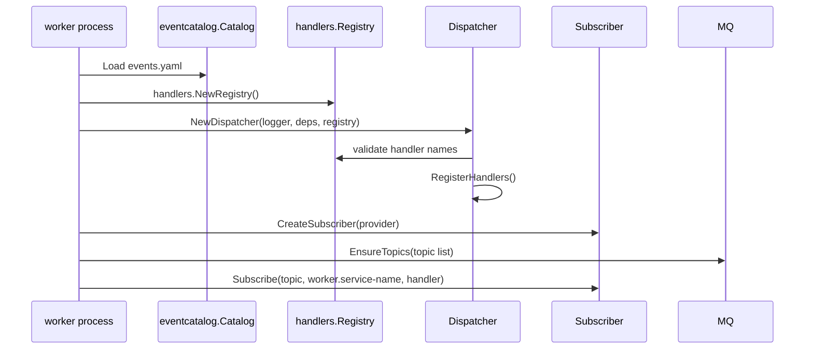
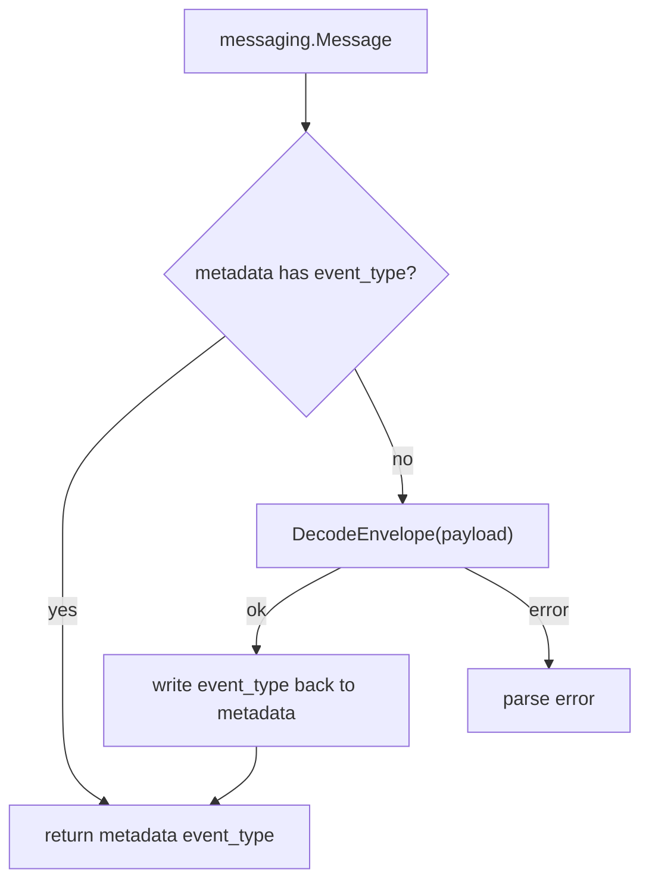
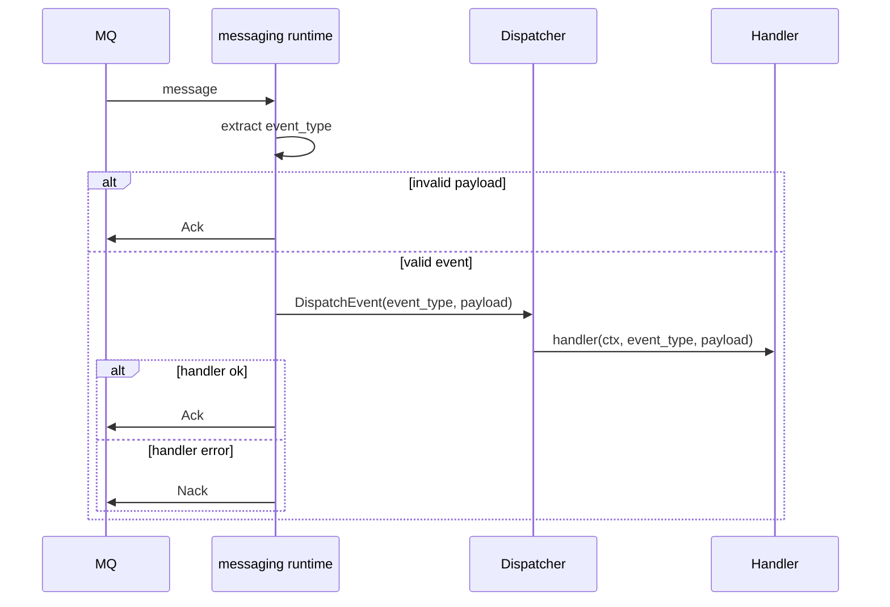

# Worker 消费与 Ack/Nack

**本文回答**：`qs-worker` 如何从 `events.yaml` 生成订阅，如何把 MQ message 解析成 event type，如何分发 handler，以及成功、失败、毒消息分别怎样 Ack/Nack。

## 30 秒结论

| 维度 | 当前事实 |
| ---- | -------- |
| 订阅来源 | `eventcatalog.Catalog.TopicSubscriptions()` |
| handler 来源 | `handlers.NewRegistry()` 显式构造，不再走 init-time 全局主路径 |
| dispatcher | [`integration/eventing.Dispatcher`](../../../internal/worker/integration/eventing/dispatcher.go) |
| MQ runtime | [`integration/messaging`](../../../internal/worker/integration/messaging/runtime.go) |
| event type 解析 | metadata `event_type` 优先；没有 metadata 时 fallback 解 payload envelope |
| 成功 | handler 成功后 `Ack()` |
| handler 错误 | `Nack()`，由 MQ 决定后续重投 |
| 毒消息 | payload 无法解析时 `Ack()`，避免永久堆积 |

## Worker 消费架构图



## 启动与订阅时序



## handler registry 是显式 catalog

`handlers.NewRegistry()` 在 [`worker/handlers/catalog.go`](../../../internal/worker/handlers/catalog.go) 中集中声明 handler name 到 factory 的映射。`Registry` 提供 `Names/Has/Create`，由 dispatcher 在启动阶段校验。

| 好处 | 说明 |
| ---- | ---- |
| 启动时发现缺失 handler | `events.yaml` 中任何 handler 名无法解析都会启动失败 |
| 测试可注入 fake registry | [`dispatcher_test.go`](../../../internal/worker/integration/eventing/dispatcher_test.go) 能精确覆盖缺失 handler |
| 避免隐式 init 主路径 | 新增 handler 必须改 catalog，diff 更清晰 |

## MessageEventExtractor



当前 NSQ 没有原生 headers，component-base 通过 envelope 保留 metadata。worker 仍兼容 legacy raw payload：metadata 不存在时会尝试从 payload envelope 解出 `eventType`。

## Ack/Nack 策略

| 分支 | 当前行为 | 观测 outcome |
| ---- | -------- | ------------ |
| payload 无法解析 | `Ack()` | `poison_acked` / `poison_ack_failed` |
| handler 成功 | `Ack()` | `acked` / `ack_failed` |
| handler 返回错误 | `Nack()` | `nacked` / `nack_failed` |



## worker concurrency 与 channel

| 配置 | 作用 |
| ---- | ---- |
| `worker.concurrency` | 传给 NSQ subscriber 的 `MaxInFlight` |
| `worker.service-name` | 订阅 channel 名；多实例同名共享 backlog |
| `events.yaml` | 不配置并发、不配置重试、不配置 consumer |

## 当前 handler 分组

| 事件 | handler | 主要动作 |
| ---- | ------- | -------- |
| `answersheet.submitted` | `answersheet_submitted_handler` | 计分与创建测评，含 Redis duplicate suppression |
| `assessment.submitted` | `assessment_submitted_handler` | 统计更新与触发评估 |
| `assessment.interpreted` / `assessment.failed` | assessment handlers | 统计、日志和后续副作用 |
| `report.generated` | `report_generated_handler` | 读取报告并回调标签 |
| `footprint.*` | `behavior_projector_handler` | 回调 apiserver 投影行为 |
| `questionnaire.changed` / `scale.changed` | lifecycle handlers | 二维码/发布后动作 |
| `task.*` | task handlers | 小程序通知等任务副作用 |

## 代码锚点与测试锚点

| 能力 | 源码 | 测试 |
| ---- | ---- | ---- |
| handler catalog | [`handlers/catalog.go`](../../../internal/worker/handlers/catalog.go) | [`handlers/registry_test.go`](../../../internal/worker/handlers/registry_test.go) |
| dispatcher | [`integration/eventing/dispatcher.go`](../../../internal/worker/integration/eventing/dispatcher.go) | [`dispatcher_test.go`](../../../internal/worker/integration/eventing/dispatcher_test.go) |
| Subscribe / AckNack | [`integration/messaging/runtime.go`](../../../internal/worker/integration/messaging/runtime.go) | [`runtime_test.go`](../../../internal/worker/integration/messaging/runtime_test.go) |
| worker runtime bootstrap | [`process/runtime_bootstrap.go`](../../../internal/worker/process/runtime_bootstrap.go) | [`process`](../../../internal/worker/process/) tests |
| handlers | [`worker/handlers`](../../../internal/worker/handlers/) | handler-specific tests |

## Verify

```bash
GOTOOLCHAIN=local /Users/yangshujie/.gvm/gos/go1.25.9/bin/go test ./internal/worker/integration/eventing ./internal/worker/integration/messaging ./internal/worker/handlers ./internal/worker/process
```
