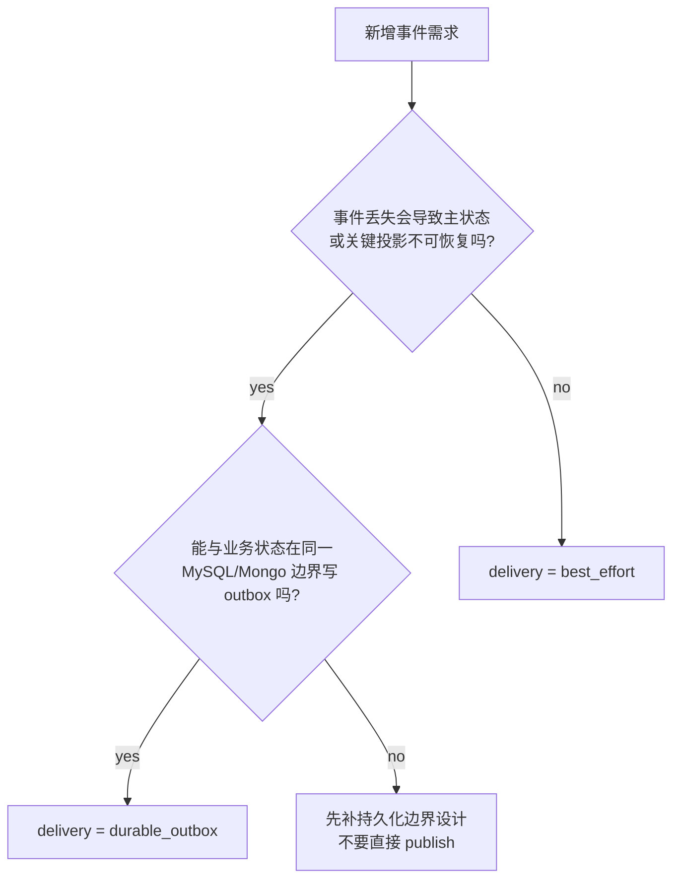
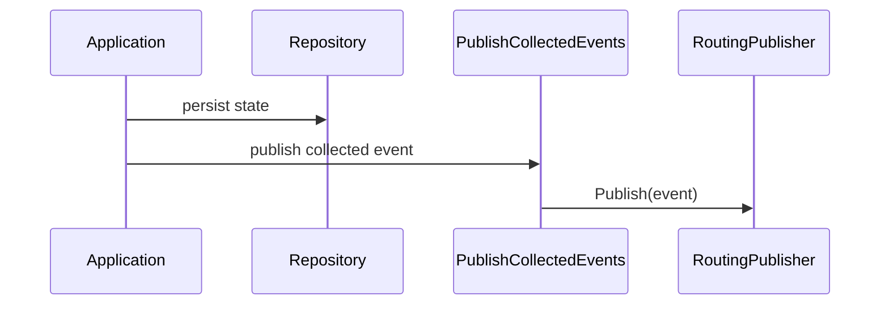
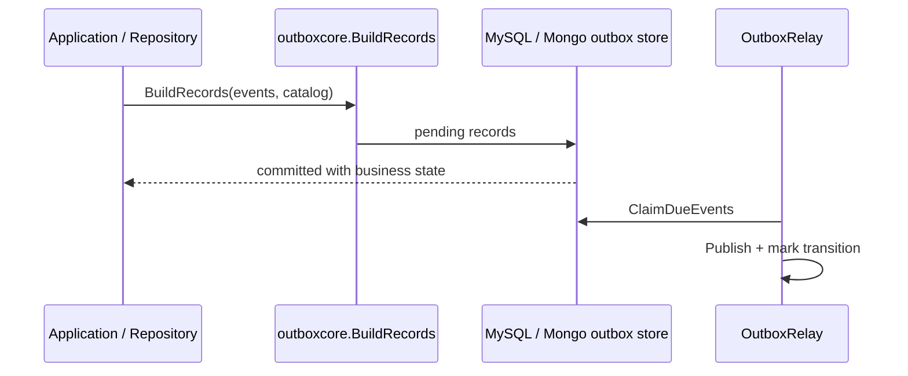

# 新增事件 SOP

**本文回答**：新增一个业务事件时，如何先判断它的 delivery class，再同步修改 `events.yaml`、领域事件、发布/stage 路径、worker handler、测试和文档，避免事件系统再次退化成散点修改。

## 30 秒结论

| 步骤 | 必做判断 |
| ---- | -------- |
| 先定 delivery | 是否需要与业务状态同持久化边界补发？是则 `durable_outbox`，否则才是 `best_effort` |
| 再改契约 | `configs/events.yaml` 加 event、topic、delivery、handler |
| 再写生产路径 | `best_effort` 只能用 direct publish；`durable_outbox` 必须 stage 到 outbox |
| 再接 worker | 更新 `handlers.NewRegistry()`，补 handler 测试 |
| 最后补文档和验证 | 更新本目录相关文档，跑 catalog/runtime/outbox/worker 测试 |

## 决策树



## 变更清单

| 区域 | `best_effort` | `durable_outbox` |
| ---- | ------------- | ---------------- |
| `events.yaml` | 加 event，`delivery: best_effort` | 加 event，`delivery: durable_outbox` |
| 领域事件 | 在对应 domain `events.go` 定义事件常量和 constructor | 同左 |
| 发布点 | 业务状态保存后调用 `PublishCollectedEvents` | repository/application 在事务边界调用 outbox store |
| worker | 添加 handler factory 到 `handlers.NewRegistry()` | 同左 |
| 测试 | catalog + publisher/direct publish 相关测试 | catalog + outboxcore/store/relay + publisher 相关测试 |
| 文档 | 更新事件清单与 direct publish 说明 | 更新事件清单与 outbox 持久化边界说明 |

## 具体步骤

### 先改事件契约

1. 在 [`configs/events.yaml`](../../../configs/events.yaml) 增加事件。
2. 在 [`internal/pkg/eventcatalog/types.go`](../../../internal/pkg/eventcatalog/types.go) 增加事件常量。
3. 运行 catalog 测试，确保 YAML 与代码常量一致。

### 再写领域事件

1. 在所属 domain 的 `events.go` 里新增 constructor。
2. 保持 payload 字段能被 `eventcodec.EncodeDomainEvent` JSON 编码。
3. 在 domain 或 application 测试里确认事件生成时机。

### 如果是 best-effort



实现要求：

- 只能在已审定的 best-effort 应用路径使用 `PublishCollectedEvents`。
- 不要把 `durable_outbox` 事件混进 direct publish collector。
- 如果新增 direct publish 调用点，必须更新 `eventruntime/architecture_test.go` 的 allowlist，并说明为什么它是 best-effort。

### 如果是 durable-outbox



实现要求：

- 使用支持 `DeliveryClassResolver` 的 catalog/resolver。
- `outboxcore.BuildRecords` 必须能拒绝 best-effort 事件。
- MySQL/Mongo claim 逻辑只在对应 store 内实现，不要把数据库细节塞进 `outboxcore`。

### 接 worker handler

1. 在 [`worker/handlers/catalog.go`](../../../internal/worker/handlers/catalog.go) 添加 handler factory。
2. 在 handler 文件中实现业务处理。
3. 通过 `Dispatcher.Initialize` 校验 `events.yaml` handler 名可解析。
4. 补 handler 测试和 registry 全量绑定测试。

## 必跑测试

```bash
GOTOOLCHAIN=local /Users/yangshujie/.gvm/gos/go1.25.9/bin/go test ./internal/pkg/eventcatalog ./internal/pkg/eventcodec ./internal/pkg/eventruntime
GOTOOLCHAIN=local /Users/yangshujie/.gvm/gos/go1.25.9/bin/go test ./internal/apiserver/application/eventing ./internal/apiserver/outboxcore ./internal/apiserver/infra/mysql/eventoutbox ./internal/apiserver/infra/mongo/eventoutbox
GOTOOLCHAIN=local /Users/yangshujie/.gvm/gos/go1.25.9/bin/go test ./internal/worker/integration/eventing ./internal/worker/integration/messaging ./internal/worker/handlers
python scripts/check_docs_hygiene.py
```

## 常见错误

| 错误 | 后果 |
| ---- | ---- |
| 新增 event 但不声明 delivery | `eventcatalog` validate 失败 |
| 新增 handler 但不改 `handlers.NewRegistry()` | worker 启动校验失败 |
| durable 事件走 direct publish | 架构测试失败，且会绕开补发语义 |
| best-effort 事件写 outbox | `outboxcore.BuildRecords` 拒绝 |
| 把 worker 并发写进 events.yaml | 文档与代码漂移；worker 并发来自 worker 配置 |

## Verify

新增事件的最小验收不是“编译过”，而是：

- `events.yaml`、`eventcatalog` 常量、领域事件字符串一致。
- 发布点符合 delivery class。
- worker handler 可被 registry 解析。
- 测试能覆盖契约、发布/stage、消费和文档链接。
