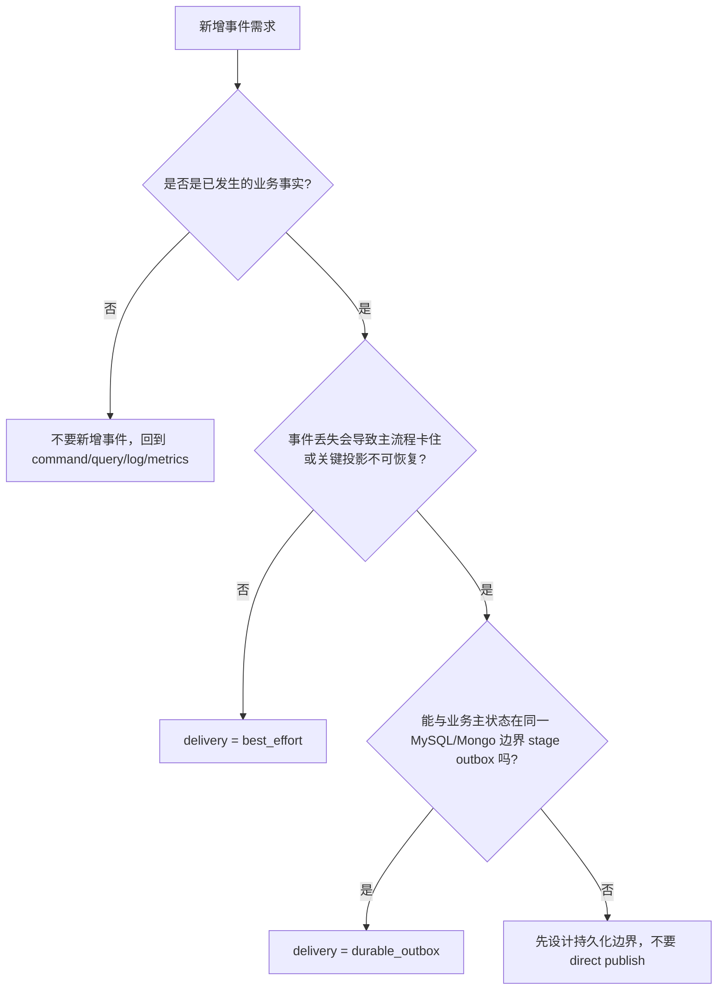

# 新增事件 SOP

**本文回答**：在 qs-server 中新增一个事件时，如何先判断“它是不是业务事实事件”，再决定 topic、delivery class、payload、outbox/direct publish、worker handler、幂等策略、观测和测试；避免事件系统退化成“随手发消息”的散点实现。

---

## 30 秒结论

新增事件按这条顺序执行：

```text
业务事实判断
  -> delivery class 判断
  -> topic / event / handler 契约
  -> domain event payload
  -> publish / outbox stage 边界
  -> worker handler / registry
  -> 幂等与 Ack/Nack 语义
  -> observability
  -> tests
  -> docs
```

| 步骤 | 必做判断 |
| ---- | -------- |
| 1. 判断是否需要事件 | 这是已经发生的业务事实，还是命令、查询、日志、缓存操作？ |
| 2. 定义语义 | event type 是否是过去式事实？payload 是否可稳定演进？ |
| 3. 选择 topic | 属于 survey lifecycle、assessment lifecycle、analytics behavior 还是 plan task？ |
| 4. 选择 delivery | 丢失是否会导致主链路或关键投影不可恢复？ |
| 5. 写契约 | `configs/events.yaml` + `eventcatalog/types.go` |
| 6. 写事件结构 | domain `events.go` 中定义 payload 和 constructor |
| 7. 写出站路径 | best_effort direct publish；durable_outbox stage outbox |
| 8. 接 worker | handler、registry、decode、internal gRPC / projection / notification |
| 9. 补幂等 | 状态机、唯一约束、locklease、checkpoint 或 duplicate suppression |
| 10. 补测试文档 | catalog、publisher/outbox、worker、observability、docs hygiene |

一句话原则：

> **事件是“事实通知”，不是“远程函数调用”。先确定事实和可靠性，再写 YAML 和 handler。**

---

## 1. 新增事件前先判断：这是不是事件

不是所有“需要触发后续动作”的需求都应该新增事件。

### 1.1 适合新增事件的场景

| 场景 | 示例 |
| ---- | ---- |
| 一个业务事实已经持久化发生 | `answersheet.submitted` |
| 下游需要异步响应 | `assessment.submitted` 触发评估 |
| 多个模块需要感知同一事实 | `report.generated` 被统计、标签、通知感知 |
| 需要解耦副作用 | `task.opened` 触发通知 |
| 需要行为投影 | `footprint.entry_opened` |
| 需要可靠出站和补偿 | `assessment.failed` |

### 1.2 不适合新增事件的场景

| 需求 | 更合适的方式 |
| ---- | ------------ |
| 同步查询数据 | 直接调用 query service |
| 前端需要即时返回 | REST/gRPC 返回 |
| 只是内部函数拆分 | 应用服务方法 |
| 只是写日志 | logging |
| 只是计数监控 | metrics |
| 只是权限判断 | security/capability |
| 只是缓存失效 | 可用 best_effort event，也可走 cache governance，先判断影响 |
| 需要请求-响应结果 | gRPC/REST，不要用 event 伪装 RPC |

### 1.3 事实事件 vs 命令事件

事件名应该表示过去发生的事实：

```text
assessment.submitted
report.generated
task.opened
```

不应该表示命令：

```text
assessment.evaluate
report.generate
task.open
```

如果你想写的是命令，先考虑：

- application service command。
- internal gRPC。
- scheduler command。
- explicit job/task。

---

## 2. Delivery Class 决策树



### 2.1 选择 best_effort

适合：

- 缓存刷新。
- 轻量通知。
- 可由定时同步修复的读侧投影。
- 丢失不阻断主业务状态。
- 不需要 backlog/failed/oldest age 监控。

示例：

```text
questionnaire.changed
scale.changed
task.opened
task.completed
task.expired
task.canceled
```

### 2.2 选择 durable_outbox

适合：

- 驱动主业务链路。
- 事件丢失会卡住流程。
- 事件丢失会造成统计/标签/报告不可恢复。
- 需要可靠补发。
- 需要 outbox backlog 观测。

示例：

```text
answersheet.submitted
assessment.submitted
assessment.interpreted
assessment.failed
report.generated
footprint.*
```

### 2.3 不能选 durable 的情况

如果你找不到和业务事实同事务写 outbox 的边界，不要先把 delivery 写成 durable_outbox。

先解决：

```text
业务状态保存在哪里？
MySQL 还是 Mongo？
outbox store 是否在同一事务里？
失败时是否回滚主状态？
relay 谁负责？
```

---

## 3. 第一步：定义事件契约

修改：

```text
configs/events.yaml
internal/pkg/eventcatalog/types.go
```

### 3.1 events.yaml 必填字段

```yaml
new.event_type:
  topic: assessment-lifecycle
  delivery: durable_outbox
  aggregate: SomeAggregate
  domain: some/domain
  description: "某个业务事实已发生"
  handler: some_event_handler
```

| 字段 | 必填原因 |
| ---- | -------- |
| topic | publisher 和 worker 需要知道 topic |
| delivery | 决定 direct publish 还是 outbox |
| aggregate | 排障和事件归属 |
| domain | 文档和模块归属 |
| description | 语义说明 |
| handler | worker 分发 |

### 3.2 eventcatalog/types.go

新增常量：

```go
const SomeEvent = "some.event"
```

并加入：

```go
EventTypes()
```

这保证代码常量与 YAML 可以通过测试对齐。

### 3.3 命名规范

推荐：

```text
<domain_or_aggregate>.<past_tense_fact>
```

示例：

```text
plan.enrolled
task.reopened
notification.sent
```

不推荐：

```text
do_something
report.generate
mq.task.open
handler.task_opened
```

---

## 4. 第二步：选择 Topic

当前 topic 只有四类：

| Topic Key | Topic Name | 使用场景 |
| --------- | ---------- | -------- |
| `questionnaire-lifecycle` | `qs.survey.lifecycle` | Questionnaire / Scale 生命周期 |
| `assessment-lifecycle` | `qs.evaluation.lifecycle` | AnswerSheet / Assessment / Report 主链路 |
| `analytics-behavior` | `qs.analytics.behavior` | `footprint.*` 行为投影 |
| `task-lifecycle` | `qs.plan.task` | Plan task 状态通知 |

### 4.1 Topic 选择原则

| 判断 | 选择 |
| ---- | ---- |
| 规则或内容生命周期变化 | questionnaire-lifecycle |
| 答卷、测评、报告主链路 | assessment-lifecycle |
| 行为足迹或服务过程投影 | analytics-behavior |
| 计划任务状态通知 | task-lifecycle |

### 4.2 什么时候新增 topic

新增 topic 要非常克制。只有满足以下条件才考虑：

- 当前四类 topic 无法表达新事件族。
- 需要独立扩缩容/隔离消费。
- 消息量级明显不同。
- 失败隔离要求明显不同。
- 运维上需要独立 topic/channel。

否则优先复用现有 topic。

---

## 5. 第三步：定义领域事件 payload

在所属 domain 的 `events.go` 中新增：

```go
type SomeEventData struct {
    OrgID int64 `json:"org_id"`
    ...
}

type SomeEvent = event.Event[SomeEventData]

func NewSomeEvent(...) SomeEvent {
    return event.New(eventcatalog.SomeEvent, "Aggregate", aggregateID, SomeEventData{...})
}
```

### 5.1 Payload 设计原则

| 原则 | 说明 |
| ---- | ---- |
| 只放下游必需字段 | 不要把整个聚合塞进事件 |
| 字段命名稳定 | JSON tag 用 snake_case |
| 使用 ID 引用 | 大对象由消费者按需查询 |
| 时间字段明确 | `occurred_at` / `submitted_at` / `generated_at` |
| 包含 org_id | 多租户排障和消费常用 |
| 保持可演进 | 新增字段向后兼容，删除/改名要谨慎 |

### 5.2 不要在 payload 中放

- 密码。
- token。
- 身份证号等敏感明文。
- 超大文档。
- 前端展示冗余字段。
- 不稳定内部结构。
- 高成本序列化对象。

---

## 6. 第四步：实现发布路径

### 6.1 best_effort 发布

路径：

```text
业务状态保存成功
  -> aggregate collect event
  -> PublishCollectedEvents
  -> RoutingPublisher
  -> MQ
```

适合：

```text
questionnaire.changed
scale.changed
task.*
```

实现要求：

1. 确认事件 delivery 是 best_effort。
2. 业务状态先保存。
3. 再调用 `PublishCollectedEvents`。
4. onFailure 记录日志和 event_id / event_type。
5. 不把 durable event 混入同一 Source。

### 6.2 durable_outbox 发布

路径：

```text
业务状态保存事务
  -> outbox store Stage
  -> transaction commit
  -> OutboxRelay
  -> RoutingPublisher
  -> MQ
```

实现要求：

1. 确认事件 delivery 是 durable_outbox。
2. 找到业务主状态事务边界。
3. MySQL 使用 MySQL outbox store。
4. Mongo 使用 Mongo outbox store。
5. Stage 必须在同一事务/session 中。
6. relay 必须能 publish。
7. store 能生成 status snapshot。
8. worker handler 幂等。

### 6.3 不要直接调用 RoutingPublisher 发布 durable event

除了 outbox relay，普通应用服务不应 direct publish durable_outbox event。

---

## 7. 第五步：接入 Worker Handler

### 7.1 新增 handler

修改：

```text
internal/worker/handlers/catalog.go
internal/worker/handlers/<some_handler>.go
```

在 `handlers.NewRegistry()` 加入：

```go
"some_event_handler": func(deps *Dependencies) HandlerFunc {
    return handleSomeEvent(deps)
}
```

### 7.2 handler 实现

handler 应该：

1. 使用 `ParseEventData` 解 envelope 和 payload。
2. 校验必要字段。
3. 执行业务动作。
4. 临时错误返回 error。
5. 幂等命中返回 nil。
6. 记录关键日志。
7. 避免直接写主业务表，优先 internal gRPC。

### 7.3 复用 handler

多个 event 可以复用一个 handler，例如 `footprint.*` 复用 `behavior_projector_handler`。

但复用时要确保：

- handler 内部按 eventType 正确分支。
- payload decode 覆盖所有 event。
- tests 覆盖所有 event type。
- 错误不会吞掉某类 event。

---

## 8. 第六步：设计幂等

新增事件必须回答：

```text
如果同一个 event 被处理两次，会发生什么？
```

### 8.1 常用幂等手段

| 场景 | 手段 |
| ---- | ---- |
| 主业务状态迁移 | 状态机前置条件 |
| 创建记录 | 唯一约束 |
| 处理答卷提交 | answerSheetID locklease + apiserver 幂等 |
| 行为投影 | analytics_projector_checkpoint |
| 任务通知 | best-effort 容忍重复或通知端去重 |
| report generated 回写标签 | Testee 标签 add 幂等 |
| 外部请求 | idempotency key / 去重表 |

### 8.2 durable_outbox 不等于幂等

outbox 只能保证事件尽量出站，不保证消费者只处理一次。消费者必须自己做幂等。

---

## 9. 第七步：定义 Ack/Nack 语义

handler 错误处理要明确。

| 错误类型 | 建议返回 |
| -------- | -------- |
| 临时网络错误 | return error -> Nack |
| apiserver 暂时不可用 | return error -> Nack |
| 下游背压/超时 | return error -> Nack |
| 幂等重复 | return nil -> Ack |
| 业务对象已完成 | return nil -> Ack |
| 永久性 payload 语义错误 | 谨慎处理；可返回 error 触发排障，也可记录并 Ack，需明确 |
| 通知 best_effort 失败 | 可 warning 后 nil，取决于事件语义 |

不要随便吞错。吞错意味着 MQ Ack 后不会重投。

---

## 10. 第八步：补观测

新增事件至少要能观测：

| 维度 | 建议 |
| ---- | ---- |
| publish outcome | event_type、topic、mode、outcome |
| outbox outcome | relay、event_type、outcome |
| consume outcome | topic、event_type、service、outcome |
| handler log | event_id、event_type、aggregate_id、业务 ID |
| duration | handler consume duration |
| idempotency outcome | duplicate_skipped / lock_degraded / checkpoint hit |
| error | last_error 进入日志或 outbox failed |

### 10.1 低基数原则

metrics label 不要放：

- event_id。
- assessment_id。
- answer_sheet_id。
- task_id。
- user_id。
- raw error。

这些放日志，不放 metrics label。

---

## 11. 第九步：补测试

### 11.1 Catalog tests

覆盖：

- 新 event 在 YAML。
- 新 event 在 `EventTypes()`。
- delivery 合法。
- topic 存在。
- handler 非空。

### 11.2 Domain event tests

覆盖：

- constructor 设置正确 event type。
- aggregate type/id 正确。
- payload JSON 可序列化。
- occurred time / orgID / IDs 正确。

### 11.3 Publish / Outbox tests

best_effort：

- direct publish 调用。
- publish failure 记录但不中断。
- ClearEvents 行为。

durable_outbox：

- Stage 必须在事务中。
- BuildRecords 成功。
- best_effort 事件写 outbox 被拒绝。
- ClaimDueEvents。
- MarkEventPublished/Failed。
- relay publish 成功/失败。

### 11.4 Worker tests

覆盖：

- registry 包含 handler。
- Dispatcher 初始化成功。
- 缺 handler 初始化失败。
- handler decode payload。
- handler 成功 Ack。
- handler 失败 Nack。
- poison message Ack。
- 幂等重复返回 nil。

### 11.5 Observability tests

覆盖：

- publish outcome。
- outbox outcome。
- consume outcome。
- duration。
- duplicate suppression 或 checkpoint outcome。

---

## 12. 第十步：更新文档

新增事件后至少更新：

| 文档 | 更新内容 |
| ---- | -------- |
| [01-事件目录与契约.md](./01-事件目录与契约.md) | topic/event/delivery/handler 清单 |
| [02-Publish与Outbox.md](./02-Publish与Outbox.md) | direct publish 或 outbox stage 边界 |
| [03-Worker消费与AckNack.md](./03-Worker消费与AckNack.md) | handler 分组和消费语义 |
| [05-观测与排障.md](./05-观测与排障.md) | 排障路径和 metrics |
| 业务模块文档 | 事件对应的业务链路 |
| `configs/events.yaml` | 契约真值 |
| OpenAPI/proto | 如果事件影响 internal API |

---

## 13. 示例：新增 best_effort 事件

需求：

```text
计划任务被重新开放后通知用户。
```

判断：

| 问题 | 结论 |
| ---- | ---- |
| 是否业务事实 | 是，task reopened |
| 丢失是否卡主链路 | 否 |
| 是否需要补发 | 否 |
| delivery | best_effort |
| topic | task-lifecycle |
| handler | task_reopened_handler |

修改：

```text
eventcatalog/types.go
configs/events.yaml
domain/plan/events.go
TaskLifecycle.Reopen
PublishCollectedEvents path
worker handler + registry
tests/docs
```

---

## 14. 示例：新增 durable_outbox 事件

需求：

```text
评估结果审核通过后触发报告发布和通知。
```

判断：

| 问题 | 结论 |
| ---- | ---- |
| 是否业务事实 | 是，report.approved |
| 丢失是否影响流程 | 是 |
| 能否同事务 stage | 需要与 report approval 保存同边界 |
| delivery | durable_outbox |
| topic | assessment-lifecycle |
| handler | report_approved_handler |

修改：

```text
eventcatalog/types.go
configs/events.yaml
domain/evaluation/report/events.go
ReportApprovalService transaction
Mongo/MySQL outbox stage
Outbox relay tests
worker handler + registry
idempotency
docs
```

---

## 15. 示例：新增 footprint 事件

需求：

```text
用户完成任务提醒点击行为统计。
```

判断：

| 问题 | 结论 |
| ---- | ---- |
| 是否业务主链路 | 否 |
| 是否行为投影 | 是 |
| 是否需要进入 statistics journey | 可能 |
| delivery | 通常 durable_outbox，如果是核心行为投影 |
| topic | analytics-behavior |
| handler | behavior_projector_handler |

修改：

```text
domain/statistics/events.go
configs/events.yaml
eventcatalog/types.go
产生位置 stage footprint
worker behavior projector decode
BehaviorProjector router
behavior_footprint / journey mutation
read model / sync
docs
```

注意：不是所有行为都要进 `assessment_episode`。先判断它是否属于测评服务闭环。

---

## 16. 合并前检查清单

| 检查项 | 是否完成 |
| ------ | -------- |
| 事件是已发生的业务事实，而不是命令 | ☐ |
| event type 命名符合过去式事实 | ☐ |
| topic 选择合理 | ☐ |
| delivery class 有书面理由 | ☐ |
| `configs/events.yaml` 已更新 | ☐ |
| `eventcatalog/types.go` 已更新 | ☐ |
| payload 和 constructor 已定义 | ☐ |
| best_effort direct publish 或 durable outbox stage 边界已实现 | ☐ |
| worker handler 已实现 | ☐ |
| handler 已加入 `handlers.NewRegistry()` | ☐ |
| 幂等策略已设计 | ☐ |
| Ack/Nack 语义已明确 | ☐ |
| publish/outbox/consume 观测已覆盖 | ☐ |
| tests 已补齐 | ☐ |
| 文档已更新 | ☐ |

---

## 17. 反模式

| 反模式 | 后果 |
| ------ | ---- |
| 为了调用异步逻辑而新增命令式事件 | 事件系统变成 RPC |
| durable 事件 direct publish | 主链路事件丢失后无法补偿 |
| best_effort 事件写 outbox | outbox 被轻量事件污染 |
| 新增 YAML 不加代码常量 | catalog 测试失败或漂移 |
| 新增 handler 不加 registry | worker 启动失败 |
| handler 吞掉临时错误 | MQ Ack 后不会重试 |
| handler 无幂等 | 重复投递造成重复副作用 |
| payload 放整个聚合 | schema 难演进、消息过大 |
| metrics label 放业务 ID | 高基数污染监控 |
| 修改 delivery 不更新文档 | 排障时误判可靠性 |

---

## 18. Verify 命令

基础：

```bash
go test ./internal/pkg/eventcatalog
go test ./internal/pkg/eventcodec
go test ./internal/pkg/eventruntime
go test ./internal/pkg/eventobservability
```

Outbox：

```bash
go test ./internal/apiserver/application/eventing
go test ./internal/apiserver/outboxcore
go test ./internal/apiserver/infra/mysql/eventoutbox
go test ./internal/apiserver/infra/mongo/eventoutbox
```

Worker：

```bash
go test ./internal/worker/integration/eventing
go test ./internal/worker/integration/messaging
go test ./internal/worker/handlers
```

Docs：

```bash
make docs-hygiene
git diff --check
```

---

## 19. 代码锚点

- Event config：[../../../configs/events.yaml](../../../configs/events.yaml)
- Event constants：[../../../internal/pkg/eventcatalog/types.go](../../../internal/pkg/eventcatalog/types.go)
- Publish helper：[../../../internal/apiserver/application/eventing/publish.go](../../../internal/apiserver/application/eventing/publish.go)
- RoutingPublisher：[../../../internal/pkg/eventruntime/publisher.go](../../../internal/pkg/eventruntime/publisher.go)
- Outbox core：[../../../internal/apiserver/outboxcore/core.go](../../../internal/apiserver/outboxcore/core.go)
- Outbox relay：[../../../internal/apiserver/application/eventing/outbox.go](../../../internal/apiserver/application/eventing/outbox.go)
- Worker registry：[../../../internal/worker/handlers/catalog.go](../../../internal/worker/handlers/catalog.go)
- Worker dispatcher：[../../../internal/worker/integration/eventing/dispatcher.go](../../../internal/worker/integration/eventing/dispatcher.go)
- Messaging runtime：[../../../internal/worker/integration/messaging/runtime.go](../../../internal/worker/integration/messaging/runtime.go)

---

## 20. 下一跳

| 目标 | 文档 |
| ---- | ---- |
| 回看整体架构 | [00-整体架构.md](./00-整体架构.md) |
| 回看事件目录 | [01-事件目录与契约.md](./01-事件目录与契约.md) |
| Publish 与 Outbox | [02-Publish与Outbox.md](./02-Publish与Outbox.md) |
| Worker Ack/Nack | [03-Worker消费与AckNack.md](./03-Worker消费与AckNack.md) |
| 观测排障 | [05-观测与排障.md](./05-观测与排障.md) |
