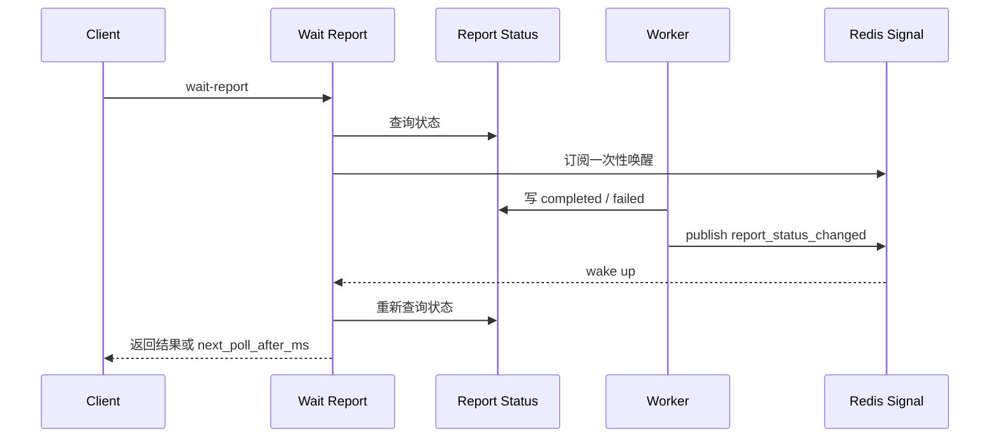

# 一次性信令链路

## 1. 解决什么问题

一次性信令解决 report 长轮询请求的临时唤醒问题。worker 完成报告后，如果有 HTTP 请求正在等待状态变化，需要尽快唤醒，而不是等长轮询超时。

## 2. 所在位置

信令位于 worker / report status 更新和 collection-server report wait 请求之间。它通过 Redis Pub/Sub 或等价 best-effort 通知传递，不进入可靠业务事件链路。

## 3. 设计目标

降低无效等待；缩短报告完成后的用户感知延迟；信令丢失不影响业务正确性；不把 Redis Pub/Sub 当可靠 MQ。

## 4. 整体流程

## 5. 核心数据结构

signal name、report_id、assessment_id、status、published_at、ttl、subscriber context、timeout。

## 6. 正常流程

`wait-report` 请求先查状态；未完成则等待信令或超时。worker 更新 report status 后发布 `report_status_changed`，等待中的请求被唤醒并重新读状态。

## 7. 异常流程

信令丢失、订阅方重启或 Redis Pub/Sub 短暂不可用时，请求最终超时并返回 `next_poll_after_ms`。客户端继续短轮询或重新发起等待请求。

## 8. 幂等 / 降级 / 背压

同一 report 多次 publish 可以幂等处理；等待请求必须有 15 到 25 秒级超时；最大等待连接数需要受限；信令失败不阻断报告状态写入。

## 9. 可选方案

只靠短轮询实现简单但请求量大；用 MQ 唤醒 HTTP 请求过重且职责错误；WebSocket 实时性最好但连接管理复杂，属于按配置启用或规划增强。

## 10. 当前方案取舍

一次性信令只负责唤醒正在等待的请求，不负责保存业务事实。真正的事实来源仍然是数据库状态、Outbox 事件和 report status。

## 11. 观测指标

wait request count、wake by signal count、timeout count、signal publish failed、active waiters、wait duration、next_poll_after_ms distribution。

## 12. 代码事实源

- [../../../configs/signals.yaml](../../../configs/signals.yaml)
- [../../../internal/collection-server/application/reportwait](../../../internal/collection-server/application/reportwait)
- [../../../internal/pkg/reportstatus](../../../internal/pkg/reportstatus)
- [../../../internal/pkg/cachesignal](../../../internal/pkg/cachesignal)
- [../../04-接口与运维/12-小程序报告等待接入指南.md](../../04-接口与运维/12-小程序报告等待接入指南.md)
