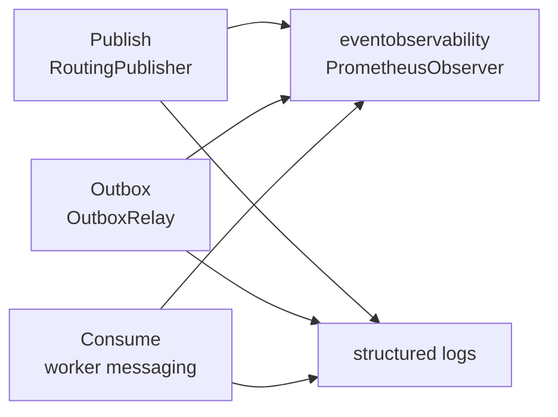
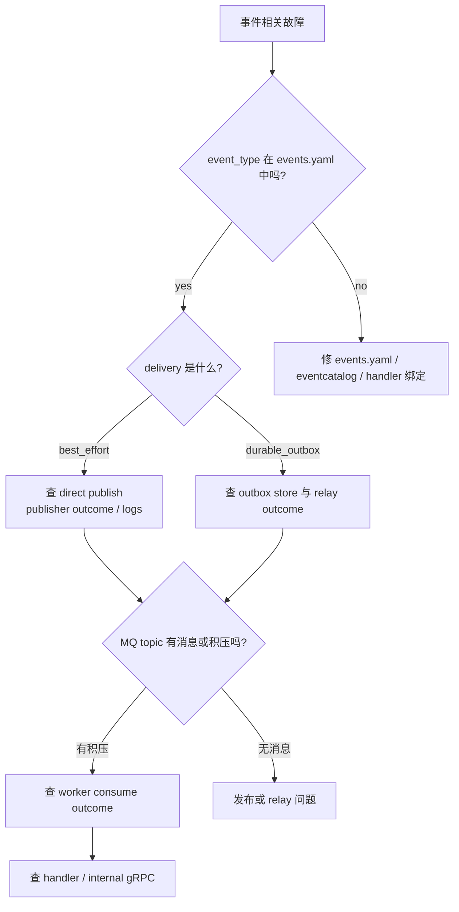
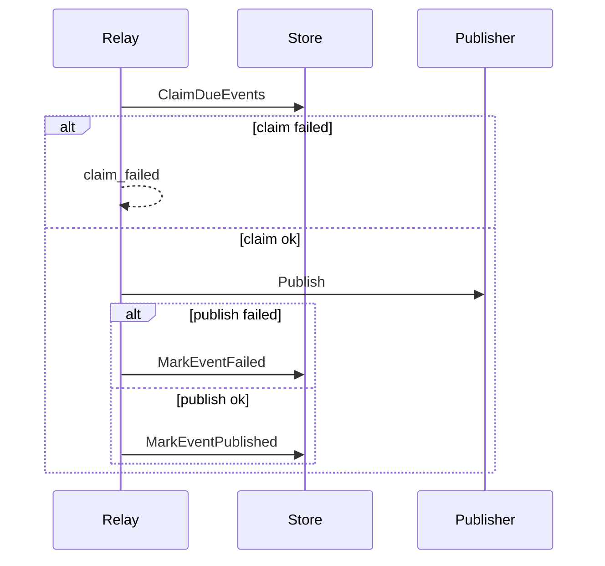

# 事件观测与排障

**本文回答**：事件系统现在有哪些可观测 outcome，publish/outbox/consume 三段分别如何定位问题，以及出现积压、丢事件疑似、poison message、Ack/Nack 异常时应按什么顺序排查。

## 30 秒结论

| 维度 | 当前事实 |
| ---- | -------- |
| 观测模型 | [`eventobservability.Observer`](../../../internal/pkg/eventobservability/outcomes.go) |
| 默认实现 | Prometheus observer，使用 bounded labels |
| publish outcome | `mq_published`、`mq_failed`、`fallback_logged`、`logged`、`nop`、`unknown_event`、`encode_failed` |
| outbox outcome | `claim_failed`、`published`、`publish_failed`、`mark_failed_failed`、`mark_published_failed` |
| consume outcome | `acked`、`ack_failed`、`nacked`、`nack_failed`、`poison_acked`、`poison_ack_failed` |
| 高基数字段 | 不把 `event_id`、`aggregate_id`、error message 放进 metrics labels |

## 三段观测图



## outcome 模型

| 段 | 事件结构 | 主要 labels |
| -- | -------- | ----------- |
| Publish | `PublishEvent` | `source`、`mode`、`topic`、`event_type`、`outcome` |
| Outbox | `OutboxEvent` | `relay`、`topic`、`event_type`、`outcome` |
| Consume | `ConsumeEvent` | `service`、`topic`、`event_type`、`outcome` |

代码锚点：

- [`eventobservability/outcomes.go`](../../../internal/pkg/eventobservability/outcomes.go)
- [`eventobservability/metrics.go`](../../../internal/pkg/eventobservability/metrics.go)
- [`eventobservability/observer_test.go`](../../../internal/pkg/eventobservability/observer_test.go)

## 排障决策树



## Publish 排障

| outcome | 含义 | 优先看哪里 |
| ------- | ---- | ---------- |
| `unknown_event` | catalog 找不到 event type | `configs/events.yaml`、`eventcatalog` 测试 |
| `encode_failed` | event payload JSON 编码失败 | 领域事件 data 结构 |
| `mq_failed` | MQ provider 发布失败 | MQ 连接、topic、provider 日志 |
| `fallback_logged` | `PublishModeMQ` 但 publisher nil | apiserver process resource bootstrap |
| `logged` / `nop` | 当前模式不实际发 MQ | 环境、`messaging.*` 配置、publish mode |
| `mq_published` | 已交给 provider | 下一步看 MQ 和 worker |

相关测试：[`publisher_test.go`](../../../internal/pkg/eventruntime/publisher_test.go)。

## Outbox 排障



| outcome | 含义 | 处理方向 |
| ------- | ---- | -------- |
| `claim_failed` | store claim due events 失败 | DB 连接、索引、事务、Mongo query |
| `publish_failed` | relay 拿到事件但发布失败 | MQ provider 或 payload 编码 |
| `mark_failed_failed` | 发布失败后标记 failed 又失败 | DB 写路径优先级高 |
| `mark_published_failed` | 发布成功后标记 published 失败 | 可能重复发布，需查事件幂等 |
| `published` | relay 发布并标记完成 | 下一步看 worker |

相关测试：[`outbox_test.go`](../../../internal/apiserver/application/eventing/outbox_test.go)。

## Consume 排障

| outcome | 含义 | 处理方向 |
| ------- | ---- | -------- |
| `poison_acked` | payload 不能解析，已 Ack 避免堆积 | 查 publisher/envelope 兼容 |
| `poison_ack_failed` | 毒消息 Ack 失败 | 查 MQ adapter / connection |
| `acked` | handler 成功且 Ack 成功 | 链路完成 |
| `ack_failed` | handler 成功但 Ack 失败 | 可能重投，检查 handler 幂等 |
| `nacked` | handler 失败并 Nack | 查 handler 和 internal gRPC |
| `nack_failed` | handler 失败且 Nack 失败 | 查 MQ adapter / connection |

相关测试：[`integration/messaging/runtime_test.go`](../../../internal/worker/integration/messaging/runtime_test.go)。

## 常见问题速查

| 现象 | 第一检查点 | 第二检查点 |
| ---- | ---------- | ---------- |
| 新事件 worker 没处理 | `events.yaml` handler 名、`handlers.NewRegistry()` | `Dispatcher.Initialize` 日志和测试 |
| MQ 有积压 | worker `service-name` / concurrency | handler error 与 consume outcome |
| durable 事件没有补发 | outbox 表/集合状态 | relay 是否启动、outbox outcome |
| best-effort 事件疑似丢失 | publish outcome | 应用保存后是否调用 direct publish |
| poison message 增多 | producer payload envelope | NSQ envelope / legacy raw payload 兼容 |
| 重复处理 | MQ at-least-once、Ack 失败、mark published 失败 | handler 幂等和业务唯一约束 |

## Verify

```bash
GOTOOLCHAIN=local /Users/yangshujie/.gvm/gos/go1.25.9/bin/go test ./internal/pkg/eventobservability ./internal/pkg/eventruntime ./internal/apiserver/application/eventing ./internal/worker/integration/messaging
```
