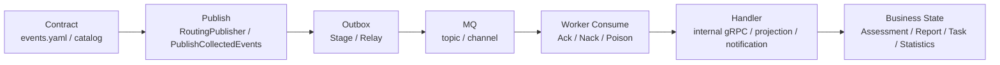
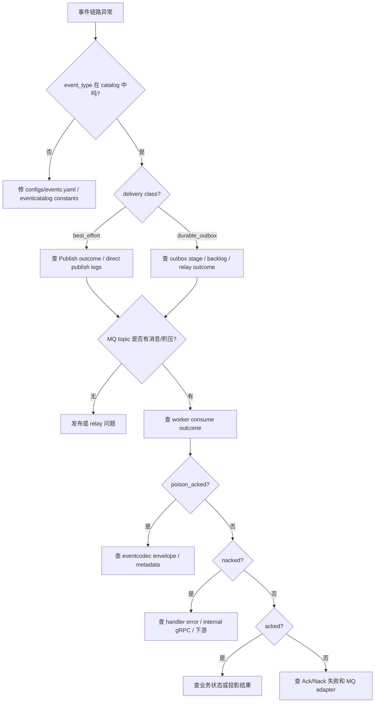

# 观测与排障

**本文回答**：qs-server 事件系统有哪些可观测 outcome；publish、outbox、MQ、worker consume、handler、业务回调六层应该如何定位问题；outbox backlog、poison message、Ack/Nack 异常、handler 重复处理、事件疑似丢失时应按什么顺序排查。

---

## 30 秒结论

| 维度 | 结论 |
| ---- | ---- |
| 观测模型 | `eventobservability` 定义 publish、outbox、consume、outbox status 等 bounded outcome |
| 默认实现 | `PrometheusObserver` 暴露 counter、histogram、gauge |
| Publish 指标 | `qs_event_publish_total` 观察 unknown_event、encode_failed、mq_failed、mq_published 等 |
| Outbox 指标 | `qs_event_outbox_total` 观察 claim/publish/mark outcome；`qs_event_outbox_backlog` 和 `qs_event_outbox_oldest_age_seconds` 观察积压 |
| Consume 指标 | `qs_event_consume_total` 观察 acked、nacked、poison_acked 等；`qs_event_consume_duration_seconds` 观察 handler 耗时 |
| 只读状态 | `StatusService` 汇总 catalog 摘要和多个 outbox snapshot，不提供 replay/repair |
| 日志定位 | event_id、event_type、aggregate_id、topic、handler、relay、msg_id 应写日志，不应作为 metrics 高基数 label |
| 排障顺序 | 先判 event type 和 delivery，再按 publish -> outbox -> MQ -> worker -> handler -> business callback 逐层定位 |
| 治理边界 | 当前事件状态入口以只读为主；event replay、手工 mark、DLQ 需要独立设计和 SOP |

一句话概括：

> **事件排障不要直接猜业务代码；先看契约、delivery、outbox、MQ、worker outcome，再进入 handler 和业务状态。**

---

## 1. 事件系统的六层排障模型

事件链路可以拆成六层：

```text
1. Contract：event type 是否在 catalog，delivery/handler 是否正确
2. Publish：应用是否生成并发布/stage 事件
3. Outbox：durable 事件是否进入 outbox，relay 是否发布
4. MQ：topic/channel 是否有消息和积压
5. Worker：message 是否被解析、dispatch、Ack/Nack
6. Handler/Business：handler 是否成功回调 apiserver 或更新投影
```



不是所有事件都会经过 outbox：

| delivery | 链路 |
| -------- | ---- |
| best_effort | contract -> publish -> MQ -> worker -> handler |
| durable_outbox | contract -> outbox stage -> relay publish -> MQ -> worker -> handler |

---

## 2. EventObservability 模型

`eventobservability` 定义了四类事件结构：

| 结构 | 观察什么 |
| ---- | -------- |
| `PublishEvent` | publisher 出站结果 |
| `OutboxEvent` | relay 出站结果 |
| `ConsumeEvent` | worker 消费结算结果 |
| `ConsumeDurationEvent` | worker handler + settlement 耗时 |
| `OutboxStatusEvent` | outbox backlog / oldest age |
| `OutboxStatusScrapeEvent` | outbox status scrape 成功/失败 |

### 2.1 PublishOutcome

| Outcome | 含义 |
| ------- | ---- |
| `mq_published` | 已成功交给 MQ provider |
| `fallback_logged` | mode=mq 但 publisher nil，fallback 到日志 |
| `logged` | logging mode，仅记录日志 |
| `nop` | nop mode，不发送 |
| `unknown_event` | event type 不在 catalog |
| `encode_failed` | eventcodec 构造 message 失败 |
| `mq_failed` | MQ publish 失败 |

### 2.2 OutboxOutcome

| Outcome | 含义 |
| ------- | ---- |
| `claim_failed` | relay claim due events 失败 |
| `published` | relay publish 成功并 mark published |
| `publish_failed` | relay publish 失败并尝试 mark failed |
| `mark_failed_failed` | publish 失败后 mark failed 也失败 |
| `mark_published_failed` | publish 成功后 mark published 失败 |

### 2.3 ConsumeOutcome

| Outcome | 含义 |
| ------- | ---- |
| `poison_acked` | 毒消息已 Ack |
| `poison_ack_failed` | 毒消息 Ack 失败 |
| `acked` | handler 成功且 Ack 成功 |
| `ack_failed` | handler 成功但 Ack 失败 |
| `nacked` | handler 失败且 Nack 成功 |
| `nack_failed` | handler 失败但 Nack 失败 |

---

## 3. Prometheus 指标

`PrometheusObserver` 暴露以下指标。

### 3.1 Publish 指标

```text
qs_event_publish_total{
  source,
  mode,
  topic,
  event_type,
  outcome
}
```

用途：

- 观察 publish mode。
- 发现 unknown event。
- 发现 MQ publish 失败。
- 判断 dev/test 是否只是 logging/nop。

### 3.2 Outbox 指标

```text
qs_event_outbox_total{
  relay,
  topic,
  event_type,
  outcome
}
```

用途：

- relay 是否成功发布。
- publish failed 是否增加。
- mark published/failed 是否失败。
- claim 是否失败。

### 3.3 Consume 指标

```text
qs_event_consume_total{
  service,
  topic,
  event_type,
  outcome
}
```

用途：

- worker 是否 Ack。
- handler 是否持续 Nack。
- poison message 是否出现。
- ack/nack 是否失败。

### 3.4 Consume duration

```text
qs_event_consume_duration_seconds{
  service,
  topic,
  event_type,
  outcome
}
```

用途：

- 观察 handler 耗时。
- 定位慢 handler。
- 分析 Nack 是否集中在某类事件。

### 3.5 Outbox backlog

```text
qs_event_outbox_backlog{
  store,
  status
}

qs_event_outbox_oldest_age_seconds{
  store,
  status
}
```

用途：

- pending 是否积压。
- failed 是否积压。
- publishing 是否卡住。
- oldest age 是否持续增长。

### 3.6 Outbox status scrape

```text
qs_event_outbox_status_scrape_total{
  store,
  outcome
}
```

用途：

- 观察 outbox status reader 是否可用。
- 如果 status scrape failure，说明 operating/status 页面可能不可信。

---

## 4. 标签低基数原则

可以作为 metrics labels：

```text
source
mode
topic
event_type
outcome
relay
service
store
status
```

不要作为 metrics labels：

```text
event_id
aggregate_id
answer_sheet_id
assessment_id
task_id
testee_id
user_id
raw error message
lock key
cache key
request id
```

这些高基数字段应该进入结构化日志。

---

## 5. 只读状态入口

`StatusService` 提供事件系统只读状态快照。

它汇总：

| 内容 | 说明 |
| ---- | ---- |
| generated_at | 快照生成时间 |
| catalog.topic_count | topic 数量 |
| catalog.event_count | event 数量 |
| catalog.best_effort_count | best_effort event 数量 |
| catalog.durable_outbox_count | durable_outbox event 数量 |
| outboxes[] | 多个 outbox reader 的 snapshot |

### 5.1 OutboxSummary

| 字段 | 说明 |
| ---- | ---- |
| name | outbox reader 名称 |
| store | store 名称 |
| degraded | 是否降级 |
| error | 读取错误 |
| generated_at | store snapshot 时间 |
| buckets | status bucket 列表 |

### 5.2 StatusReporter

`OutboxStatusReporter` 会读取 store snapshot，并把 bucket 转成 metrics：

- backlog。
- oldest age。
- scrape success/failure。

如果 status reader 失败，会记录 scrape failure，不会影响 relay 主流程。

### 5.3 治理边界

只读状态入口不提供：

- replay event。
- delete event。
- mark published/failed。
- force retry。
- release lock。
- 修改 handler。
- 修改 topic。

这些能力如需提供，必须独立设计权限、审计和 SOP。

---

## 6. Grafana / PromQL 示例

### 6.1 Outbox backlog

```promql
sum by (store, status) (qs_event_outbox_backlog)
```

### 6.2 Outbox oldest age

```promql
max by (store, status) (qs_event_outbox_oldest_age_seconds)
```

### 6.3 Relay publish failure

```promql
sum by (relay, event_type, outcome) (
  increase(qs_event_outbox_total{outcome=~"claim_failed|publish_failed|mark_failed_failed|mark_published_failed"}[10m])
)
```

### 6.4 Worker Nack

```promql
sum by (topic, event_type, outcome) (
  increase(qs_event_consume_total{outcome=~"nacked|nack_failed"}[10m])
)
```

### 6.5 Poison message

```promql
sum by (topic) (
  increase(qs_event_consume_total{outcome=~"poison_acked|poison_ack_failed"}[10m])
)
```

### 6.6 Handler P95

```promql
histogram_quantile(
  0.95,
  sum by (le, topic, event_type) (
    rate(qs_event_consume_duration_seconds_bucket[5m])
  )
)
```

### 6.7 Publish mode 异常

```promql
sum by (source, mode, outcome) (
  increase(qs_event_publish_total[10m])
)
```

生产环境如果 durable 主链路大量出现 `logged` / `nop`，说明 publisher mode 或 MQ-backed publisher 配置有问题。

---

## 7. 告警建议

| 场景 | 建议条件 |
| ---- | -------- |
| outbox pending 积压 | pending backlog > 0 且 oldest age 超过 2-3 个 relay 周期 |
| outbox failed 积压 | failed backlog 持续增长 |
| publishing 卡住 | publishing oldest age 超过 stale 阈值 |
| claim failed | 5-10 分钟内持续出现 |
| mark published failed | 任何出现都应排查，可能导致重复发布 |
| poison message | 短窗口内出现非零 |
| worker nacked 激增 | 某 event_type nacked 持续增长 |
| handler 变慢 | consume duration p95 超出业务 SLA |
| status scrape failure | 只读状态读取失败 |

---

## 8. 排障决策树



---

## 9. Publish 排障

### 9.1 unknown_event

含义：

```text
RoutingPublisher 在 catalog 中找不到 event type。
```

检查：

1. `configs/events.yaml` 是否有该 event。
2. `eventcatalog/types.go` 是否包含常量。
3. event type 字符串是否拼写一致。
4. 运行时是否加载了正确配置文件。
5. catalog tests 是否通过。

### 9.2 encode_failed

含义：

```text
eventcodec.BuildMessage 失败。
```

检查：

1. payload 是否可 JSON 编码。
2. payload 是否包含不可序列化字段。
3. event envelope 是否缺失必要字段。
4. 领域事件 constructor 是否正确。

### 9.3 mq_failed

检查：

1. MQ provider 连接。
2. topic 是否存在。
3. NSQ lookupd / nsqd 状态。
4. RabbitMQ URL / exchange / queue。
5. publisher timeout。
6. 网络。

### 9.4 fallback_logged

含义：

```text
PublishModeMQ 但 mqPublisher nil。
```

这是配置或启动装配问题。检查：

- process resource stage。
- messaging config。
- publisher construction。
- env -> PublishMode。
- durable relay 是否要求 MQ-backed publisher。

### 9.5 logged / nop

如果是 dev/test，可能正常。

如果是 production，通常要检查：

- env。
- PublishModeFromEnv。
- messaging provider。
- RoutingPublisherOptions。
- durable relay 是否未启动。

---

## 10. Outbox 排障

### 10.1 outbox 没有记录

检查：

1. 事件 delivery 是否 durable_outbox。
2. 业务应用是否调用 outbox store Stage。
3. Stage 是否在事务中。
4. MySQL 是否有 active transaction。
5. Mongo 是否有 active session transaction。
6. `outboxcore.BuildRecords` 是否因为 event type/delivery 失败。
7. 业务事务是否 rollback。

### 10.2 pending backlog 增长

检查：

1. relay 是否启动。
2. relay batch size。
3. `ClaimDueEvents` 是否成功。
4. DB 索引。
5. MQ publisher 是否可用。
6. pending oldest age 是否持续增长。

### 10.3 failed backlog 增长

检查：

1. `last_error`。
2. next_attempt_at 是否到期。
3. publish_failed / mark_failed_failed outcome。
4. before publish hook。
5. payload decode。
6. MQ provider。
7. topic resolver。

### 10.4 publishing 卡住

检查：

1. relay 是否 crash。
2. publishing updated_at 是否超过 stale threshold。
3. claim stale publishing 是否生效。
4. DB locks。
5. MarkEventPublished 是否失败。
6. 发布成功但 mark published 失败可能导致重复发布，必须确认 handler 幂等。

### 10.5 mark_published_failed

这是高优先级问题：

```text
事件可能已发到 MQ，但 outbox 没标记 published。
```

后果：

- relay 之后可能重新 claim stale publishing。
- 同一事件可能重复发布。
- handler 必须幂等。
- 需要查 DB 写路径和 event_id。

---

## 11. MQ 层排障

### 11.1 topic 不存在

检查：

- EnsureTopics 是否执行。
- worker 是否使用 NSQ provider。
- NSQ admin topic。
- topic name 是否和 `configs/events.yaml` 一致。
- publisher 是否写到另一个环境。

### 11.2 topic 有积压

检查：

- worker 是否运行。
- worker serviceName/channel 是否正确。
- MaxInFlight 是否太低。
- handler 是否持续 Nack。
- 单个 poison message 是否阻塞。
- worker 与 MQ 网络。

### 11.3 多实例消费异常

检查：

- 是否使用同一个 serviceName/channel。
- 不同环境是否共用 topic。
- handler 幂等是否足够。
- locklease duplicate suppression 是否 degraded。

---

## 12. Worker Consume 排障

### 12.1 poison_acked

含义：

```text
message metadata 没有 event_type，payload 也无法 decode envelope。
```

检查：

1. publisher 是否使用 `eventcodec.BuildMessage`。
2. MQ adapter 是否保留 payload。
3. 是否有手工写入 MQ 的错误消息。
4. 是否存在旧格式消息。
5. message body 是否被截断。

### 12.2 nacked

含义：

```text
handler 返回 error。
```

检查：

1. handler log。
2. event payload decode 是否失败。
3. internal gRPC 是否可用。
4. apiserver 业务服务是否返回 error。
5. 下游 DB/Redis/外部服务。
6. 是否是永久性业务错误。
7. 是否需要幂等/补偿。

### 12.3 ack_failed / nack_failed

检查：

1. MQ connection。
2. subscriber adapter。
3. worker shutdown 时机。
4. message timeout。
5. 网络。
6. provider bug 或配置问题。

Ack failed 可能导致消息重投，即使 handler 已经成功执行。此时 handler 幂等非常重要。

---

## 13. Handler / Business 排障

### 13.1 answersheet.submitted 后没有 assessment

检查：

1. `answersheet.submitted` 是否 stage outbox。
2. outbox 是否 published。
3. worker 是否 consume acked。
4. `answersheet_submitted_handler` 是否 parse 成功。
5. duplicate suppression 是否 skipped。
6. `CalculateAnswerSheetScore` internal gRPC 是否成功。
7. `CreateAssessmentFromAnswerSheet` 是否成功。
8. Assessment 是否已有幂等记录或唯一约束命中。

### 13.2 assessment.submitted 后没有 report

检查：

1. `assessment.submitted` outbox。
2. worker consume outcome。
3. `assessment_submitted_handler` 是否调用 `EvaluateAssessment`。
4. Evaluation pipeline 是否 failed。
5. `assessment.failed` 是否产生。
6. Report durable save 是否成功。
7. `report.generated` 是否 stage。

### 13.3 report.generated 后统计不更新

检查：

1. `report.generated` 是否出站。
2. `footprint.report_generated` 是否 stage。
3. `behavior_projector_handler` 是否 acked。
4. behavior projector checkpoint。
5. analytics_pending_event 是否积压。
6. statistics_journey_daily 是否更新。
7. QueryCache 是否旧。

### 13.4 task.opened 后没有通知

检查：

1. `task.opened` best_effort 是否 publish。
2. worker task_opened_handler 是否 acked。
3. InternalClient 是否配置。
4. `SendTaskOpenedMiniProgramNotification` 是否失败。
5. WeChat / notification adapter。
6. 用户是否具备可通知目标。

---

## 14. 事件疑似丢失排查顺序

不要直接说“事件丢了”。按下面顺序拿证据：

```text
1. 业务主状态是否已保存？
2. 事件是否被创建？
3. delivery 是 best_effort 还是 durable_outbox？
4. durable: outbox 是否有记录？
5. outbox 状态是什么？
6. relay 是否 published？
7. MQ topic 是否收到？
8. worker 是否消费？
9. handler 是否成功？
10. 下游业务状态是否变化？
```

### 14.1 对 best_effort 的判断

best_effort 事件可能没有补偿记录。需要看：

- application logs。
- publish metrics。
- MQ metrics。
- worker consume metrics。

### 14.2 对 durable_outbox 的判断

durable 事件优先看：

- outbox row/document。
- status。
- attempt_count。
- last_error。
- next_attempt_at。
- published_at。
- relay outcome。

---

## 15. 结构化日志建议

### 15.1 Publish 日志

建议字段：

```text
event_type
event_id
aggregate_type
aggregate_id
topic
source
mode
result
error
```

### 15.2 Outbox 日志

建议字段：

```text
relay
event_id
event_type
status
attempt_count
next_attempt_at
last_error
outcome
```

### 15.3 Worker 日志

建议字段：

```text
topic
event_type
msg_id
event_id
handler
outcome
duration
error
```

### 15.4 Business callback 日志

建议字段：

```text
event_id
event_type
answer_sheet_id
assessment_id
report_id
task_id
org_id
result
error
```

注意：这些业务 ID 可以写日志，但不要进入 metrics labels。

---

## 16. 操作边界

### 16.1 当前允许的只读动作

- 查看 metrics。
- 查看 logs。
- 查看 outbox status snapshot。
- 查看 event catalog summary。
- 查看 worker consume outcomes。
- 查看 MQ backlog。

### 16.2 当前不默认提供的动作

- replay event。
- force mark published。
- force mark failed。
- delete outbox row。
- 手工 publish message。
- 修改 event delivery。
- 动态修改 worker concurrency。
- 手工 Ack/Nack MQ message。

这些动作风险高，必须单独设计权限、审计、Runbook 和回滚策略。

---

## 17. 常见误区

### 17.1 “outbox pending 就说明业务失败”

错误。业务可能已成功，只是事件尚未出站。

### 17.2 “worker acked 就说明下游业务状态一定正确”

不一定。Ack 只说明 handler 返回 nil。还要看 handler 的业务逻辑是否真正完成。

### 17.3 “poison message Nack 重试就好”

通常不对。无法解析的消息重试也无法修复，会阻塞队列。

### 17.4 “mark_published_failed 无所谓”

不对。事件可能已发但 outbox 未完成，后续可能重复发布。

### 17.5 “清理 outbox failed 就能修复问题”

危险。failed 记录代表未完成出站证据，直接删除会造成事件真正丢失。

### 17.6 “metrics 里应该放 event_id 方便查”

不应。event_id 是高基数，应放日志。

---

## 18. 修改观测能力的 SOP

如果新增 event outcome 或 metrics：

1. 在 `eventobservability/outcomes.go` 增加 bounded outcome。
2. 在 `metrics.go` 增加或复用指标。
3. 保持 labels 低基数。
4. 更新 observer tests。
5. 更新 Grafana / alert。
6. 更新本文档。
7. 更新排障 Runbook。

如果新增 status endpoint：

1. 明确只读还是治理动作。
2. 定义权限。
3. 定义返回 snapshot。
4. 不暴露高基数原始列表，除非分页和权限明确。
5. 补 handler tests。
6. 补审计。

---

## 19. 代码锚点

### Observability

- Outcomes：[../../../internal/pkg/eventobservability/outcomes.go](../../../internal/pkg/eventobservability/outcomes.go)
- Metrics：[../../../internal/pkg/eventobservability/metrics.go](../../../internal/pkg/eventobservability/metrics.go)

### Status

- Status service：[../../../internal/apiserver/application/eventing/status_service.go](../../../internal/apiserver/application/eventing/status_service.go)
- Status reporter：[../../../internal/apiserver/application/eventing/status_reporter.go](../../../internal/apiserver/application/eventing/status_reporter.go)

### Publish / Outbox / Consume

- RoutingPublisher：[../../../internal/pkg/eventruntime/publisher.go](../../../internal/pkg/eventruntime/publisher.go)
- Outbox relay：[../../../internal/apiserver/application/eventing/outbox.go](../../../internal/apiserver/application/eventing/outbox.go)
- Messaging runtime：[../../../internal/worker/integration/messaging/runtime.go](../../../internal/worker/integration/messaging/runtime.go)

---

## 20. Verify

```bash
go test ./internal/pkg/eventobservability
go test ./internal/pkg/eventruntime
go test ./internal/apiserver/application/eventing
go test ./internal/apiserver/outboxcore
go test ./internal/worker/integration/messaging
```

如果修改 status endpoint 或 operating 入口：

```bash
go test ./internal/apiserver/transport/rest/handler
make docs-rest
make docs-verify
```

如果修改文档：

```bash
make docs-hygiene
git diff --check
```

---

## 21. 下一跳

| 目标 | 文档 |
| ---- | ---- |
| 回看整体架构 | [00-整体架构.md](./00-整体架构.md) |
| 事件目录 | [01-事件目录与契约.md](./01-事件目录与契约.md) |
| Publish 与 Outbox | [02-Publish与Outbox.md](./02-Publish与Outbox.md) |
| Worker Ack/Nack | [03-Worker消费与AckNack.md](./03-Worker消费与AckNack.md) |
| 新增事件 | [04-新增事件SOP.md](./04-新增事件SOP.md) |
