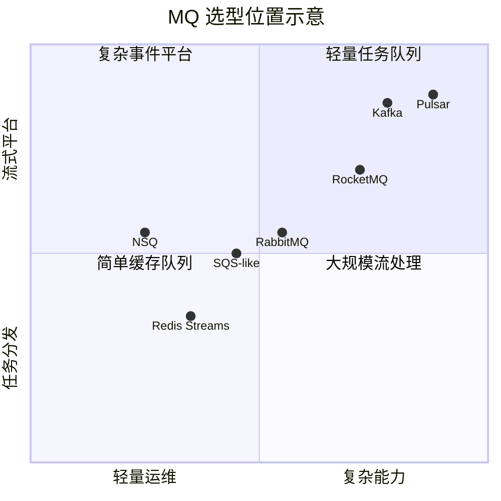
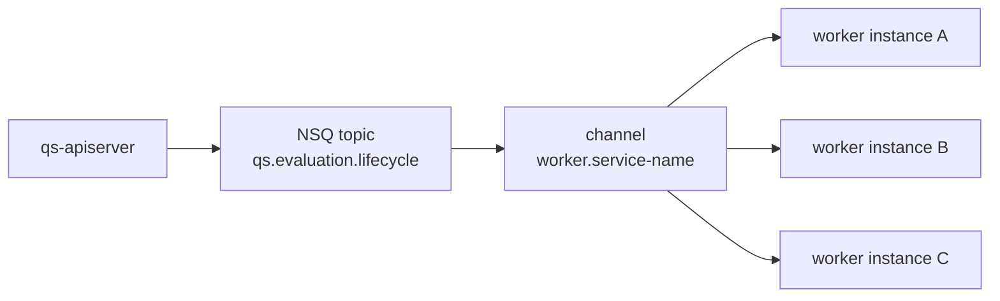
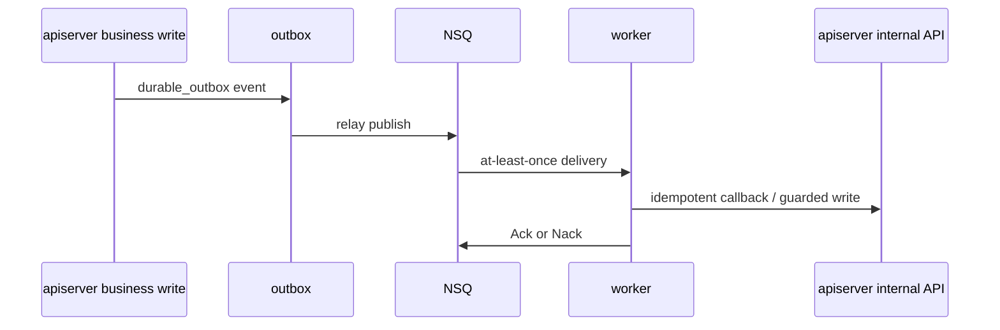

# MQ 选型与分析：为什么当前默认选择 NSQ

**本文回答**：市面主流 MQ 的实现方式和优缺点是什么，`qs-server` 当前为什么默认使用 NSQ，RabbitMQ/Kafka/RocketMQ/Pulsar/Redis Streams/SQS 类方案为什么没有成为默认实现，以及这个选择不承诺什么。

## 30 秒结论

| 维度 | 当前结论 |
| ---- | -------- |
| 代码支持 | component-base messaging 当前支持 NSQ 和 RabbitMQ 分支 |
| 仓库默认 | `qs-server` 默认走 NSQ |
| 选择理由 | 部署轻、Go 生态简单、topic/channel 模型贴合 worker 竞争消费、当前吞吐与运维复杂度匹配 |
| 主要代价 | 没有事务消息、没有 exactly-once、metadata 需要 envelope、复杂 routing 能力弱于 RabbitMQ |
| 架构补偿 | durable 场景靠 application outbox + handler 幂等，不把强一致性推给 MQ |
| 不做承诺 | 本文不是性能基准；不宣称 NSQ 在所有业务场景优于其它 MQ |

## 主流 MQ 对比总图



## 选型矩阵

| MQ | 实现方式 | 优点 | 缺点 | 对 qs-server 的匹配度 |
| -- | -------- | ---- | ---- | --------------------- |
| NSQ | topic + channel，consumer 竞争消费，lookupd 发现 | 部署轻、Go 客户端成熟、channel 语义直观、适合 worker backlog | 无事务消息、无原生 headers、复杂 routing 弱 | 高：当前默认 |
| RabbitMQ | exchange + queue + binding，AMQP | routing 能力强、headers 成熟、DLX 等功能丰富 | 运维模型比 NSQ 重，拓扑复杂度更高 | 中：代码支持分支 |
| Kafka | partitioned log，consumer group | 高吞吐、持久日志、回放能力强 | 运维重、消费模型和当前 task handler 不完全匹配 | 中低：当前过重 |
| RocketMQ | topic + queue，事务消息/顺序消息能力强 | Java 生态强，事务消息能力好 | 引入成本和运维复杂度较高 | 中低：当前不需要 |
| Pulsar | segment log + broker/bookkeeper 分层 | 多租户、geo、存储计算分离 | 运维复杂度最高 | 低：远超当前需求 |
| Redis Streams | Redis 内 stream + consumer group | 依赖少、接入快 | 长期持久化和隔离能力弱于专用 MQ | 低：Redis 已承担 cache/lock/governance，不混主事件总线 |
| SQS 类 | 云托管队列 | 运维轻、稳定 | 本地开发和私有部署依赖云服务语义 | 视部署而定 |

## 为什么 NSQ 匹配当前形态



当前 worker 运行模型是“订阅若干 topic，同一个 service-name 作为 channel，多实例共同排 backlog”。这和 NSQ 的 topic/channel 模型直接匹配：

- topic 表达事件类别。
- channel 表达一个消费者组。
- 多 worker 实例用相同 channel 竞争消费。
- `worker.concurrency` 映射到 `MaxInFlight`。

## NSQ 的不足如何被系统设计补偿

| NSQ 不足 | 当前补偿 |
| -------- | -------- |
| 不提供事务消息 | `durable_outbox` 事件先写 MySQL/Mongo outbox |
| 不提供 exactly-once | handler 幂等、业务唯一约束、Redis duplicate suppression |
| 无原生 headers | component-base `PublishMessage` 使用 envelope 保存 metadata |
| 复杂 routing 能力弱 | 事件 routing 由 `events.yaml` 和 `RoutingPublisher` 明确映射 |
| poison message 风险 | worker payload 解析失败时 Ack，避免永久堆积 |



## RabbitMQ 为什么不是默认

RabbitMQ 的 exchange / routing key / binding 能力更强，也有更自然的 headers 支持；但当前 `qs-server` 的事件拓扑只有 4 个 topic，worker 消费方式也不是复杂路由，而是按 topic/channel 竞争消费。选择 RabbitMQ 会增加拓扑和运维复杂度，但短期收益有限。

代码层仍保留 RabbitMQ provider 分支，原因是 provider 适配成本可控；但文档真值必须区分“代码支持”和“默认运行选择”。

## Kafka / Pulsar 为什么不是当前默认

Kafka/Pulsar 更适合作为大规模流式平台，而不是当前这种“业务事件触发 worker 后回调主服务”的轻量异步任务链。它们的优势在于长日志、回放、分区扩展、流处理生态；代价是运维和消费模型复杂度明显提高。

如果后续出现以下需求，才值得重新评估：

- 事件需要长期回放和多订阅分析。
- 消费端从 worker 扩展为多个独立数据产品。
- 单 topic 吞吐和保留窗口成为核心瓶颈。
- 需要跨数据中心或多租户事件平台能力。

## Redis Streams 为什么不混入主事件总线

Redis 在本项目已经承担 cache、lock、governance、部分 duplicate suppression。把主业务事件总线也压到 Redis Streams，会把不同可靠性与容量风险叠加到同一个基础设施上。当前更清晰的边界是：

- Redis：非结构存储、锁、治理、短期 guard。
- NSQ：业务事件传输。
- MySQL/Mongo outbox：可靠出站状态。

## 当前选择边界

| 不能说 | 应该说 |
| ------ | ------ |
| NSQ 保证 exactly-once | NSQ 负责投递，业务正确性靠 outbox + 幂等 |
| NSQ 比 Kafka/RabbitMQ 全面更好 | NSQ 更适合当前轻量 worker 事件链 |
| 所有事件都可靠不丢 | 只有 `durable_outbox` 有 outbox 补发语义 |
| RabbitMQ 没有用 | 代码支持 RabbitMQ 分支，但不是默认真值 |

## 代码锚点与测试锚点

| 能力 | 源码 | 测试 |
| ---- | ---- | ---- |
| provider options | [`internal/pkg/options/messaging_options.go`](../../../internal/pkg/options/messaging_options.go) | worker/process 与 runtime tests |
| apiserver publisher 创建 | [`internal/apiserver/process/resource_bootstrap.go`](../../../internal/apiserver/process/resource_bootstrap.go) | process tests |
| worker subscriber 创建 | [`internal/worker/integration/messaging/runtime.go`](../../../internal/worker/integration/messaging/runtime.go) | [`runtime_test.go`](../../../internal/worker/integration/messaging/runtime_test.go) |
| event envelope metadata | [`eventcodec/codec.go`](../../../internal/pkg/eventcodec/codec.go) | [`codec_test.go`](../../../internal/pkg/eventcodec/codec_test.go) |
| delivery/outbox 补偿 | [`outboxcore/core.go`](../../../internal/apiserver/outboxcore/core.go) | [`core_test.go`](../../../internal/apiserver/outboxcore/core_test.go) |

## Verify

```bash
GOTOOLCHAIN=local /Users/yangshujie/.gvm/gos/go1.25.9/bin/go test ./internal/pkg/eventcodec ./internal/pkg/eventruntime ./internal/worker/integration/messaging ./internal/apiserver/outboxcore
```
