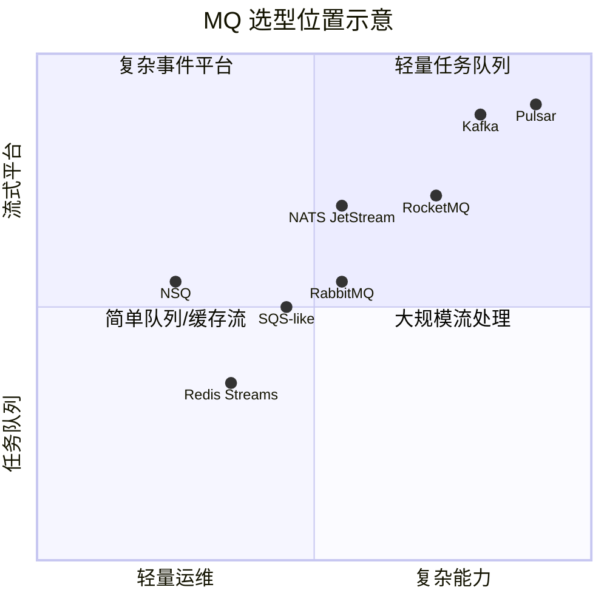
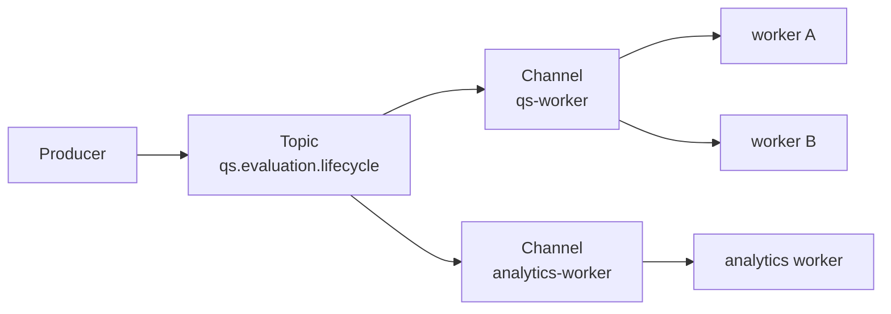
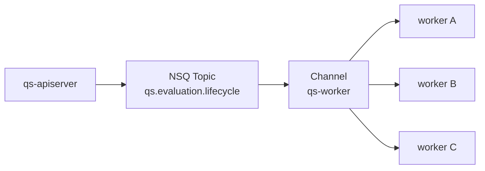
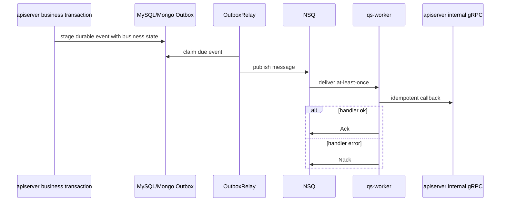

# MQ 选型与分析：为什么当前默认选择 NSQ

**本文回答**：市面主流 MQ 的实现方式、优缺点和适用场景是什么；qs-server 当前事件系统为什么默认选择 NSQ；RabbitMQ、Kafka、RocketMQ、Pulsar、Redis Streams、NATS/JetStream、SQS 类托管队列为什么没有成为当前默认；NSQ 的不足如何通过 outbox、handler 幂等、duplicate suppression 和 event observability 补偿。

---

## 30 秒结论

| 维度 | 结论 |
| ---- | ---- |
| 当前代码支持 | `MessagingOptions` 支持 `nsq` 和 `rabbitmq` 两个 provider |
| 当前默认 | 默认 provider 是 `nsq`，默认 `messaging.enabled=false`，避免配置错误导致服务不可用 |
| 当前事件形态 | qs-server 是“业务事件 -> worker 竞争消费 -> internal gRPC 回调 apiserver”的轻量异步任务链 |
| 为什么 NSQ | 部署轻、Go 生态友好、topic/channel 模型直接贴合 worker serviceName 作为 channel 的竞争消费模型 |
| NSQ 不足 | 不提供事务消息、复杂路由弱、无原生 headers、不是 exactly-once 平台 |
| 系统补偿 | 事务一致性靠 MySQL/Mongo outbox；投递后正确性靠 handler 幂等、状态机、唯一约束、locklease/checkpoint |
| RabbitMQ 地位 | 代码支持 provider 分支，适合复杂 routing/header/DLX 场景，但不是当前默认 |
| Kafka/Pulsar 地位 | 更适合大规模事件流、回放、数据平台；对当前 worker 任务链偏重 |
| Redis Streams 地位 | 可用于轻量 stream，但项目中 Redis 已承担 cache/lock/governance，不混入主业务事件总线 |
| 重新评估时机 | 当出现多消费者数据平台、长期事件回放、复杂 routing、强 DLQ、跨区域流平台等需求时再重评 |

一句话概括：

> **qs-server 当前选择 NSQ，不是因为 NSQ 全面强于其它 MQ，而是它最匹配当前“轻量部署 + topic/channel + worker 竞争消费 + outbox 补偿”的工程形态。**

---

## 1. 先明确 qs-server 需要什么 MQ

qs-server 的事件系统不是大数据流平台，也不是复杂企业消息路由中心。当前核心链路是：

```text
qs-apiserver
  -> publish / outbox relay
  -> MQ topic
  -> qs-worker
  -> handler
  -> internal gRPC callback apiserver
```

### 1.1 当前事件系统的关键诉求

| 诉求 | 说明 |
| ---- | ---- |
| 简单 topic publish | event type 通过 catalog 映射到 topic |
| Worker 竞争消费 | 多个 worker 实例共同消费同一个 backlog |
| 可控并发 | worker.concurrency / MaxInFlight 控制消费并发 |
| 低部署成本 | 当前项目不是大规模消息平台 |
| Go 生态顺手 | 项目主语言 Go，worker 和 apiserver 都是 Go |
| 能跑在私有服务器 | 不强依赖云托管服务 |
| 允许 at-least-once | handler 幂等兜底 |
| 可配合 outbox | durable 语义由应用 outbox 保证，不完全交给 MQ |

### 1.2 当前不强需求

| 暂不强需求 | 说明 |
| ---------- | ---- |
| 长期事件日志保留和大规模回放 | 当前统计有 projection/backfill，不依赖 MQ 日志回放 |
| 复杂 routing key/header routing | 当前 4 个 topic 足够 |
| 流处理 SQL / Connect 生态 | 当前不是数据湖 pipeline |
| 跨区域复制 | 当前部署形态不需要 |
| 金融级事务消息由 MQ 提供 | 当前采用 application outbox |
| 海量 partition 扩展 | 当前吞吐规模未到 Kafka/Pulsar 级别 |

---

## 2. 当前代码里的 MQ 抽象

### 2.1 MessagingOptions

`MessagingOptions` 支持：

```text
provider = nsq | rabbitmq
```

默认：

```text
Enabled = false
Provider = nsq
NSQAddr = 127.0.0.1:4150
NSQLookupdAddr = 127.0.0.1:4161
RabbitMQExchange = qs.events
RabbitMQExchangeType = topic
```

### 2.2 Publisher / Subscriber

apiserver publisher：

```text
MessagingOptions.NewPublisher()
  -> nsq.NewPublisher
  -> rabbitmq.NewPublisher
```

worker subscriber：

```text
MessagingOptions.NewSubscriber()
  -> nsq.NewSubscriber
  -> rabbitmq.NewSubscriber
```

worker runtime 也有自己的 `CreateSubscriber`：

```text
provider = nsq       -> NSQ subscriber + MaxInFlight
provider = rabbitmq  -> RabbitMQ subscriber
unknown              -> fallback NSQ
```

### 2.3 代码支持不等于默认选型

当前“代码支持 RabbitMQ”并不意味着“架构默认推荐 RabbitMQ”。

更准确的说法是：

```text
当前运行默认和文档分析按 NSQ 解释；
RabbitMQ 是 provider 分支能力；
上层 event catalog / outbox / worker dispatcher 与 provider 解耦。
```

---

## 3. 主流 MQ 实现模型总览



这张图只是工程直觉图，不是性能基准。

---

## 4. 选型维度

评估 MQ 时，不能只问“哪个性能最好”。应该按这些维度判断：

| 维度 | 问题 |
| ---- | ---- |
| 消息模型 | queue、topic、stream、subject、exchange 哪种模型？ |
| 消费模型 | consumer group、channel、subscription、pull/push？ |
| 持久化 | 是否默认持久化？保留多久？能否回放？ |
| 可靠性 | at-most-once / at-least-once / exactly-once 语义如何？ |
| 路由能力 | 是否支持 routing key、headers、wildcard、filter？ |
| 顺序性 | 是否保证全局顺序、partition 顺序、queue 顺序？ |
| 延迟 | 低延迟还是高吞吐优先？ |
| 吞吐 | 单机/集群吞吐上限和扩展方式？ |
| 运维复杂度 | 是否需要 ZooKeeper、BookKeeper、NameServer、控制器等？ |
| Go 生态 | Go client 是否成熟？ |
| 本地开发 | 本地启动是否简单？ |
| 可观测性 | 是否易于监控 backlog、lag、consumer？ |
| 与现有架构匹配 | 是否能自然接入 outbox + worker handler？ |

---

## 5. NSQ

### 5.1 实现模型

NSQ 的模型是：

```text
topic
  -> channel
  -> consumers
```

一个 topic 可以有多个 channel。每个 channel 会收到 topic 的一份消息副本。一个 channel 下多个 consumer 竞争消费 backlog。



### 5.2 优点

| 优点 | 说明 |
| ---- | ---- |
| 部署轻 | nsqd/nsqlookupd/nsqadmin 组合简单 |
| Go 生态友好 | NSQ 本身和客户端都贴近 Go 生态 |
| topic/channel 直观 | 和 worker serviceName/channel 直接匹配 |
| 竞争消费自然 | 多 worker 实例共享同一个 channel backlog |
| 配置少 | 适合中小系统快速落地 |
| 本地开发方便 | 单机即可跑起来 |
| 与 outbox 组合简单 | outbox 负责可靠性，NSQ 负责传输 |

### 5.3 缺点

| 缺点 | 影响 |
| ---- | ---- |
| 不提供事务消息 | 需要 application outbox |
| 不提供 exactly-once | 需要 handler 幂等 |
| 复杂 routing 弱 | 需要 event catalog 手动映射 topic |
| 无原生 headers | 需要 envelope/metadata 兼容 |
| 长期回放能力弱 | 不适合作为事件日志平台 |
| 多订阅分析能力弱 | 不如 Kafka/Pulsar 类平台 |

### 5.4 对 qs-server 的匹配

当前 worker 模型：

```text
topic = 事件类别
channel = worker.service-name
MaxInFlight = worker.concurrency
handler = event type dispatch
```

这和 NSQ 的 topic/channel 模型非常贴合。

---

## 6. RabbitMQ

### 6.1 实现模型

RabbitMQ 基于 AMQP 模型：

```text
publisher
  -> exchange
  -> binding
  -> queue
  -> consumer
```

exchange 根据 direct/fanout/topic/headers 等类型和 bindings 路由消息。

### 6.2 优点

| 优点 | 说明 |
| ---- | ---- |
| routing 能力强 | exchange + routing key + binding |
| headers 支持好 | 适合 header-based routing |
| AMQP 生态成熟 | 企业消息场景常见 |
| DLX/TTL/queue policy 丰富 | 便于复杂队列治理 |
| 管理工具成熟 | 可视化和运维能力好 |
| 适合复杂拓扑 | 多 exchange/queue/binding |

### 6.3 缺点

| 缺点 | 对 qs-server 的影响 |
| ---- | ------------------- |
| 拓扑复杂度高 | 当前只有 4 个 topic，收益有限 |
| 运维模型更重 | exchange/queue/binding/vhost/policy 都要管理 |
| 配置项更多 | 小系统可能过度设计 |
| 消费拓扑更复杂 | 当前 worker 只需要 topic/channel 竞争消费 |

### 6.4 为什么不是默认

RabbitMQ 很适合复杂 routing，但 qs-server 当前 routing 已经由：

```text
events.yaml
RoutingPublisher
worker dispatcher
```

明确处理。当前不需要引入更强的 AMQP routing 能力作为默认复杂度。

但保留 RabbitMQ provider 是合理的，因为未来如果出现复杂 routing、DLX、headers、企业队列治理诉求，可以重新评估。

---

## 7. Kafka

### 7.1 实现模型

Kafka 是分区日志模型：

```text
topic
  -> partitions
  -> append-only log
  -> consumer group
  -> offsets
```

同一 key 的消息进入同一 partition，partition 内有顺序；consumer group 通过 offset 消费。

### 7.2 优点

| 优点 | 说明 |
| ---- | ---- |
| 高吞吐 | 适合大规模事件流 |
| 持久日志 | 消息保留和回放能力强 |
| consumer group 成熟 | 多消费组读取同一事件流 |
| 分区扩展 | 横向扩展能力强 |
| 生态丰富 | Kafka Streams、Connect、Flink 等 |
| 数据平台友好 | 适合日志、CDC、实时数仓 |

### 7.3 缺点

| 缺点 | 对 qs-server 的影响 |
| ---- | ------------------- |
| 运维复杂度更高 | broker、partition、retention、rebalance |
| 消费模型偏流式 | 当前 handler 是任务式回调 |
| topic/partition 设计成本 | 当前事件量不需要复杂 partition |
| 本地开发重 | 对个人/小团队部署不轻 |
| exactly-once 仍有条件 | 业务 handler 仍需幂等 |

### 7.4 为什么不是当前默认

qs-server 当前需要的是：

```text
可靠触发 worker
回调 apiserver
完成异步副作用
```

不是：

```text
长期事件日志
多消费数据产品
流处理平台
大规模回放
```

Kafka 对当前阶段偏重。

---

## 8. RocketMQ

### 8.1 实现模型

RocketMQ 是分布式消息和流处理平台，提供 topic/queue、事务消息、顺序消息、延迟消息、过滤等能力，常见于交易、金融级消息等场景。

### 8.2 优点

| 优点 | 说明 |
| ---- | ---- |
| 业务消息能力强 | 事务消息、顺序消息、延迟消息等 |
| 高可靠 | 金融/交易场景经验丰富 |
| 高吞吐 | 面向互联网大规模消息 |
| 生态成熟 | Java/云厂商生态强 |
| 追踪和治理能力 | 消息轨迹等能力较完整 |

### 8.3 缺点

| 缺点 | 对 qs-server 的影响 |
| ---- | ------------------- |
| 引入成本高 | 当前项目 Go + 轻量部署，不需要这么重 |
| 运维复杂 | 集群组件和治理成本更高 |
| 当前代码未集成 | 需要新增 provider adapter |
| 事务消息与现有 outbox 重叠 | 当前已采用 application outbox |

### 8.4 为什么不是当前默认

RocketMQ 的优势在交易级业务消息；qs-server 当前通过 application outbox 获得主状态和事件起点的一致性，不需要把事务语义下沉到 MQ。

---

## 9. Pulsar

### 9.1 实现模型

Pulsar 采用 broker + BookKeeper 存储分层架构，并支持多租户、分层存储、跨地域复制、topic/namespace 等能力。

### 9.2 优点

| 优点 | 说明 |
| ---- | ---- |
| 存储计算分离 | broker 与 BookKeeper 分层 |
| 多租户强 | namespace/tenant 模型 |
| geo-replication | 跨地域复制能力强 |
| stream 能力强 | 适合大规模事件平台 |
| 订阅模型丰富 | exclusive/shared/failover/key_shared 等 |

### 9.3 缺点

| 缺点 | 对 qs-server 的影响 |
| ---- | ------------------- |
| 运维复杂度最高 | broker、BookKeeper、ZooKeeper/metadata |
| 学习成本高 | 远超当前事件链需求 |
| 本地部署重 | 不适合当前轻量运行 |
| 当前代码未集成 | 新增 provider adapter 成本高 |

### 9.4 为什么不是当前默认

Pulsar 是事件平台级能力。qs-server 当前并不需要多租户跨地域流平台能力。

---

## 10. Redis Streams

### 10.1 实现模型

Redis Streams 提供：

```text
stream
consumer group
consumer
pending entries
ack
```

它适合轻量流式队列和已有 Redis 环境下的简单事件流。

### 10.2 优点

| 优点 | 说明 |
| ---- | ---- |
| 依赖少 | 如果已有 Redis，可快速接入 |
| 操作简单 | stream + consumer group |
| 延迟低 | 内存型基础设施 |
| 适合轻量任务 | 小规模事件流可用 |

### 10.3 缺点

| 缺点 | 对 qs-server 的影响 |
| ---- | ------------------- |
| 与现有 Redis 职责混杂 | Redis 已承担 cache/lock/governance |
| 长期事件总线风险 | 数据保留、内存、持久化压力 |
| 运维边界不清 | cache 故障和 MQ 故障耦合 |
| 生态不如专用 MQ | topic/channel 和 worker runtime 不如 NSQ 直观 |

### 10.4 为什么不作为主事件总线

当前更清晰的边界是：

```text
Redis = cache / lock / hotset / governance / guard
NSQ = business event transport
MySQL/Mongo outbox = reliable delivery state
```

把主业务事件总线也放到 Redis，会让 Redis 同时承担缓存、锁、治理、消息队列，故障域过大。

---

## 11. NATS / JetStream

### 11.1 实现模型

NATS Core 是 subject-based messaging。JetStream 增加持久化 stream 和 consumer 视图，支持 ack、redelivery、pull/push consumer、replay 等能力。

### 11.2 优点

| 优点 | 说明 |
| ---- | ---- |
| subject 模型灵活 | dot-separated subject 和 wildcard |
| 部署相对轻 | 比 Kafka/Pulsar 简洁 |
| JetStream 支持持久化和 replay | 比纯 Core NATS 可靠 |
| consumer ack/redelivery 能力强 | 适合现代云原生 messaging |
| 横向扩展好 | 适合轻量到中等规模事件系统 |

### 11.3 缺点

| 缺点 | 对 qs-server 的影响 |
| ---- | ------------------- |
| 当前代码未接入 | 需要新增 provider adapter |
| 模型需要重新映射 | topic/channel -> subject/stream/consumer |
| 运维和认知成本高于 NSQ | 当前收益不足 |
| 与现有 docs/tests 不匹配 | 需要重建一套 provider contract tests |

### 11.4 是否值得未来考虑

如果未来希望在保持轻量的同时获得更强的持久 stream / replay / subject routing，NATS JetStream 值得重新评估。

---

## 12. SQS 类云托管队列

### 12.1 实现模型

云厂商托管队列，例如：

```text
queue
visibility timeout
dead-letter queue
long polling
managed durability
```

### 12.2 优点

| 优点 | 说明 |
| ---- | ---- |
| 运维轻 | 云厂商托管 |
| 可靠性高 | 云服务 SLA |
| DLQ/visibility timeout 成熟 | 排障和重试方便 |
| 不需要自建 MQ | 减少基础设施负担 |

### 12.3 缺点

| 缺点 | 对 qs-server 的影响 |
| ---- | ------------------- |
| 依赖云厂商 | 私有化/本地部署不方便 |
| 本地开发不一致 | 本地模拟复杂 |
| 成本和网络依赖 | 云资源成本与链路 |
| provider 语义差异 | 与 NSQ/RabbitMQ adapter 不同 |

### 12.4 为什么不是当前默认

qs-server 当前更偏私有部署和本地可运行，SQS 类方案不适合作为默认，但可以作为云部署 profile 的未来 provider。

---

## 13. 选型对比矩阵

| MQ | 模型 | 优点 | 代价 | 当前匹配度 |
| -- | ---- | ---- | ---- | ---------- |
| NSQ | topic/channel | 轻量、Go 友好、竞争消费自然 | 无事务消息、复杂 routing 弱、无原生 headers | 高，当前默认 |
| RabbitMQ | exchange/queue/binding | routing 强、headers/DLX/TTL 丰富 | 拓扑和运维复杂 | 中，代码支持分支 |
| Kafka | partitioned log | 高吞吐、回放、数据平台生态 | 运维重，偏流式 | 中低，当前过重 |
| RocketMQ | topic/queue + 业务消息能力 | 事务/顺序/延迟消息强 | 引入和运维成本高 | 中低，当前不需要 |
| Pulsar | broker/bookkeeper 分层 | 多租户、geo、存算分离 | 运维复杂度高 | 低，远超当前需求 |
| Redis Streams | stream/consumer group | 依赖少、轻量 | 与 Redis cache/lock 故障域混杂 | 低，不做主总线 |
| NATS JetStream | subject/stream/consumer | 轻量、subject 灵活、JetStream 持久化 | 当前未接入，需新 adapter | 未来可评估 |
| SQS-like | managed queue | 运维轻、云可靠 | 云依赖、本地不一致 | 视部署而定 |

---

## 14. 为什么当前选择 NSQ

### 14.1 与 worker 模型直接匹配

qs-server worker 的模型是：

```text
topic = event topic
channel = worker service name
worker instances = competing consumers
MaxInFlight = worker.concurrency
```

这和 NSQ topic/channel 模型直接一致。



### 14.2 运维成本匹配当前阶段

当前系统的重点是：

- 业务模型。
- Evaluation pipeline。
- Outbox 可靠出站。
- Statistics 投影。
- Redis cache/lock/governance。
- CI/CD 和部署简单性。

NSQ 不引入过重平台复杂度，更利于当前阶段快速稳定交付。

### 14.3 可靠性由 outbox 和 handler 幂等补足

NSQ 不提供事务消息和 exactly-once，但 qs-server 不把这些能力完全交给 MQ。

当前可靠性分层是：

| 层 | 负责 |
| -- | ---- |
| 业务事务 | 保存业务主状态 |
| outbox | 记录待出站事件 |
| NSQ | 事件传输 |
| worker | 消费和 Ack/Nack |
| handler | 幂等和业务回调 |
| apiserver | 主写模型和状态机 |

---

## 15. NSQ 不足与补偿设计

| NSQ 不足 | 当前补偿 |
| -------- | -------- |
| 无事务消息 | MySQL/Mongo outbox |
| 无 exactly-once | handler 幂等、业务唯一约束、状态机 |
| 无原生 headers | eventcodec envelope + metadata fallback |
| 复杂 routing 弱 | events.yaml + RoutingPublisher |
| 回放能力弱 | read model sync/backfill，而不是 MQ replay |
| poison message 风险 | worker poison Ack + observability |
| 消费重复 | locklease duplicate suppression / checkpoint |
| 任务失败重试语义交给 provider | handler error Nack + 业务幂等 |

### 15.1 当前主链路补偿示意



---

## 16. 什么时候需要重新评估 MQ

如果出现以下情况，应重新评估：

### 16.1 复杂 routing 需求

例如：

- 多个消费者只关心 event type 子集。
- 大量按 header 过滤。
- 需要 DLX/DLQ 策略。
- 需要 per-message TTL / priority。
- 需要复杂 exchange topology。

候选：RabbitMQ。

### 16.2 大规模事件流 / 回放需求

例如：

- 需要保留所有事件 7/30/90 天。
- 需要多个独立数据产品消费同一事件日志。
- 需要按 offset replay。
- 需要接 Flink/Spark/Connect。
- 事件吞吐成为核心瓶颈。

候选：Kafka / Pulsar / RocketMQ。

### 16.3 轻量但更强 stream 需求

例如：

- 仍想保持轻量部署。
- 需要 replay。
- 需要 subject/wildcard。
- 需要更现代 consumer ack 模型。

候选：NATS JetStream。

### 16.4 云托管优先

例如：

- 系统完全云部署。
- 团队不想运维 MQ。
- 接受云服务语义绑定。

候选：SQS / 云厂商队列。

---

## 17. 当前选型不承诺什么

| 不承诺 | 正确说法 |
| ------ | -------- |
| NSQ 是所有场景最佳 | NSQ 最匹配当前 qs-server 阶段 |
| NSQ 提供 exactly-once | 业务正确性靠 outbox + 幂等 |
| 所有事件都可靠不丢 | 只有 durable_outbox 有补发语义 |
| RabbitMQ/Kafka 不好 | 它们能力强，但当前默认没必要 |
| MQ 可以替代数据库事务 | 主状态仍由 MySQL/Mongo 事务维护 |
| MQ 可以替代 Statistics backfill | 统计修复靠 projection/sync/backfill |

---

## 18. 与事件系统文档的关系

| 问题 | 文档 |
| ---- | ---- |
| event type/topic/delivery 目录 | [01-事件目录与契约.md](./01-事件目录与契约.md) |
| direct publish 与 outbox | [02-Publish与Outbox.md](./02-Publish与Outbox.md) |
| worker Ack/Nack | [03-Worker消费与AckNack.md](./03-Worker消费与AckNack.md) |
| 新增事件 | [04-新增事件SOP.md](./04-新增事件SOP.md) |
| 观测排障 | [05-观测与排障.md](./05-观测与排障.md) |

本文只回答 MQ 选型，不重复事件系统实现细节。

---

## 19. 代码锚点

- Messaging options：[../../../internal/pkg/options/messaging_options.go](../../../internal/pkg/options/messaging_options.go)
- RoutingPublisher：[../../../internal/pkg/eventruntime/publisher.go](../../../internal/pkg/eventruntime/publisher.go)
- Worker messaging runtime：[../../../internal/worker/integration/messaging/runtime.go](../../../internal/worker/integration/messaging/runtime.go)
- Event codec：[../../../internal/pkg/eventcodec/](../../../internal/pkg/eventcodec/)
- Outbox core：[../../../internal/apiserver/outboxcore/core.go](../../../internal/apiserver/outboxcore/core.go)
- Event config：[../../../configs/events.yaml](../../../configs/events.yaml)

---

## 20. Verify

```bash
go test ./internal/pkg/eventcodec
go test ./internal/pkg/eventruntime
go test ./internal/worker/integration/messaging
go test ./internal/apiserver/outboxcore
```

如果修改 provider 选项：

```bash
go test ./internal/pkg/options
go test ./internal/worker/process
go test ./internal/apiserver/process
```

如果新增 provider：

```bash
go test ./internal/worker/integration/messaging
go test ./internal/pkg/eventruntime
go test ./internal/pkg/eventobservability
make docs-hygiene
```

---

## 21. 参考资料

- NSQ official design notes。
- RabbitMQ AMQP 0-9-1 model and exchanges/queues documentation。
- Apache Kafka introduction。
- Apache RocketMQ official feature and transaction message documentation。
- Apache Pulsar architecture overview。
- Redis Streams documentation。
- NATS JetStream documentation。
