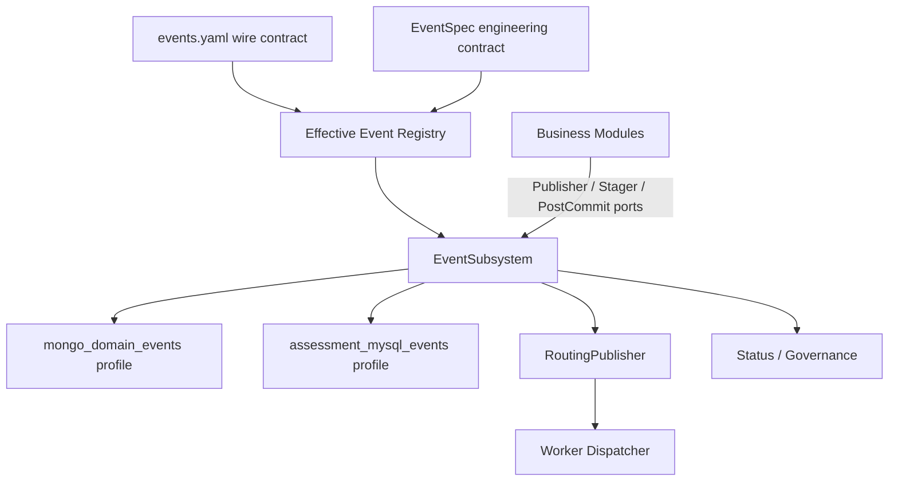

# 事件工程化设计

## 1. 本文回答

本文在当前 event 主链已经可运行的基础上，回答下一阶段如何将 event 从“多处机制组合”继续收口为可治理的工程化子系统：

1. cache 工程化中哪些结构原则适合 event？
2. event 当前已经完成了什么，还缺少什么？
3. Event Contract、Runtime Profile 和 Event Subsystem 应该如何分工？
4. 哪些运行时风险应优先处理？
5. 后续重构应该如何分批，才能保持事务、Topic、Outbox 和 worker 行为不变？

本文是工程化目标与维护路线；当前可运行保障仍以 [01-事件模块整体架构.md](01-事件模块整体架构.md) 和 [09-事件契约矩阵.md](09-事件契约矩阵.md) 为准。

## 2. 30 秒结论

当前 event 已经不是“缺少可靠性机制”的初级实现，而是一套主链稳定、工程化收口尚未完成的异步一致性体系。

已有机制不应推倒重写：Event Catalog、Mongo/MySQL Outbox、post-commit immediate、Redis ready index、relay、MQ、worker handler registry 以及 ACK/NACK 都应继续保留。

下一阶段的核心不是增加投递机制，而是完成三个收口：

1. 用 `EventSpec + EffectiveRegistry` 收口事件契约与有效运行策略。
2. 用 `OutboxProfile` 收口 Mongo/MySQL 两类可靠出站运行时。
3. 用 `EventSubsystem` 收口 publisher、store、ready index、relay、status 和 lifecycle 的所有权。

cache 可以作为结构参照，但不能机械复制它的领域概念：

> cache 是“能力中心化的状态加速子系统”；event 应设计成“契约中心化的异步投递子系统”。

## 3. 工程化状态速查

| 能力 | 当前状态 | 结论 |
| --- | --- | --- |
| event type / Topic / delivery / handler 目录 | 已实现 | `configs/events.yaml` 是运行时事件目录 |
| 代码事件常量与 YAML 同步 | 已实现 | `internal/pkg/eventcatalog` 契约测试保护 |
| 事件契约矩阵 | 已实现 | 生产者、store、immediate、handler、幂等和结算已有人类可读基线 |
| Signal 名称与清单同步 | 已实现 | `internal/pkg/signalcatalog` 校验名称、delivery 和 transport |
| Mongo/MySQL 本地事务 Outbox | 已实现 | 业务事实与 Outbox 同库事务提交 |
| immediate / ready index / relay | 已实现 | 加速层失败不改变 Outbox 事实源地位 |
| unknown / poison / handler failure 结算 | 已实现 | poison ACK、unknown ACK、handler error NACK |
| behavior footprint 退出 event | 已实现 | 只保留 `behavior_journey_scan` 轮询重建 |
| Mongo relay 的运行时命名与启动责任 | 已实现 | 以 `MongoDomainEventRelay` 启动 |
| Mongo relay 的构造权和 store 所有权 | 部分完成 | relay 仍在 Survey 组装，AnswerSheet/Interpretation 仍自行构造 Outbox store |
| immediate / priority 运行策略 | 部分完成 | 已有 `outboxruntime.Policy`，但 priority 仍有可变全局源与多个装配入口 |
| Effective Event Registry | 规划改造 | 尚无进程内可查询的完整有效契约 |
| Event Subsystem | 规划改造 | publisher、Outbox runtime、worker 与 Signal 的责任边界已清楚，但 apiserver 组合根尚未收口 |

## 4. 从 cache 借鉴什么

cache 工程化已经形成以下稳定结构：

```text
Capability Spec
  -> PolicyCatalog
  -> Effective Registry
  -> Cache Subsystem
  -> module-owned typed adapters
```

event 应借鉴的是结构原则：

| cache 原则 | event 对应设计 |
| --- | --- |
| 能力身份、owner、policy 有明确 Spec | 每个 event type 有 `EventSpec` |
| 配置、默认值和能力绑定先解析 | 启动时生成 `EffectiveEvent` |
| 治理端读取实际生效状态 | event status 输出有效契约、profile 和策略 |
| Subsystem 拥有 runtime 和 lifecycle | EventSubsystem 拥有 publisher、relay、ready index 与 status |
| 业务模块只拥有 typed adapter | 业务模块只注入 Publisher、Stager 和 PostCommitDispatcher 窄端口 |
| 架构测试防止边界回流 | 禁止业务模块新建 relay 或直接依赖优先级全局变量 |

event 不应复制 cache 的 `family`、`L1/L2` 和 warmup 概念。event 真正需要的维度是：owner、delivery、transport、Outbox profile、immediate、priority、handler、settlement 和 idempotency。

## 5. 目标结构



这个结构不要求把所有信息塞进同一个文件。工程化的关键是：

- 每项信息有明确权威来源。
- 启动时能生成一份完整的有效视图。
- 所有运行时组件只消费有效视图，不再各自携带默认值。

## 6. Contract Plane

### 6.1 `events.yaml` 继续作为 wire contract

`configs/events.yaml` 继续定义：

- event type。
- Topic。
- delivery class。
- aggregate 和 domain。
- worker handler name。

这些信息同时被 apiserver 和 worker 消费，不应迁入 apiserver 私有配置。

### 6.2 `EventSpec` 补充工程化契约

推荐的概念模型：

```go
type EventSpec struct {
	Type              string
	Owner             string
	OutboxProfile     OutboxProfile
	Immediate         bool
	Priority          Priority
	IdempotencyPolicy string
	SettlementPolicy  string
}
```

其中：

- `Owner` 表示事件语义和 producer 的维护方，不表示 relay 所有者。
- `OutboxProfile` 只对 `durable_outbox` 有效。
- `Immediate` 和 `Priority` 是运行策略，不是新的投递保障。
- `IdempotencyPolicy` 引用可审核的业务保护说明，不谎称通用 runtime 已经自动去重。
- `SettlementPolicy` 表达 handler error 的默认运输结算；业务终态和可忽略错误仍由 handler 显式转换。

### 6.3 Effective Registry 是进程内真实视图

`EffectiveRegistry` 应在启动时合并 `events.yaml` 与 `EventSpec`，并验证：

- YAML 和代码 event type 集合一致。
- durable event 必须指定 Outbox profile。
- best-effort event 不得指定 Outbox profile 或 immediate。
- immediate event 必须是 durable event。
- priority 只能影响 claim 顺序，不能改变 delivery。
- handler 必须存在于 worker 显式 registry。
- 幂等和结算必须有可审核声明。

治理端应读取 Effective Registry，而不是只返回 Topic/Event 数量。

## 7. Runtime Plane

### 7.1 两个 Outbox Profile

当前可靠出站应明确建模为两个 profile：

| Profile | 业务事务 | 物理 Store | 当前事件 |
| --- | --- | --- | --- |
| `mongo_domain_events` | MongoDB | Mongo `domain_event_outbox` | `answersheet.submitted`、Interpretation terminal events |
| `assessment_mysql_events` | MySQL | MySQL `domain_event_outbox` | Evaluation requested/outcome/failed |

每个 profile 统一持有：

- Outbox store adapter。
- ready-index namespace。
- immediate dispatcher。
- relay。
- reconciler。
- batch size、publish workers、interval 和 immediate concurrency。
- status reader 与 observer。

事件优先级和 immediate 必须从 Effective Registry 派生，Store 与 ready index 不得再各自持有可变全局默认值。

### 7.2 EventSubsystem 的所有权

EventSubsystem 应该拥有：

- Event Catalog 与 Effective Registry。
- RoutingPublisher。
- Mongo/MySQL Outbox profile runtime。
- relay 和 reconciler 的 Start/Close。
- event status 与观测器装配。

EventSubsystem 不应该拥有：

- 领域事件的创建时机。
- 评估、报告和通知的业务判断。
- handler 的业务幂等规则。
- Signal 的最终业务状态。

### 7.3 业务模块只依赖窄端口

Survey、Evaluation 和 Interpretation 应只获得：

- `EventPublisher`：用于已审核的 best-effort 事件。
- `EventStager`：在当前本地事务中暂存 durable 事件。
- `PostCommitDispatcher`：事务提交后的 ready index 与 immediate 加速。

业务模块不再新建、导出或启动 relay，也不再直接选择 P0/P1/P2 全局变量。

## 8. Consumer Plane

### 8.1 保持当前 ACK/NACK 基线

工程化改造不改变当前结算语义：

| 分类 | 结算 |
| --- | --- |
| poison | ACK |
| unknown | ACK |
| handler failure | NACK |
| success / duplicate skip / business terminal | ACK |

### 8.2 将 dispatch outcome 与 error 分开

当前 unknown event 由 subscriber 记录 warning 后返回 `nil`，上层最终只能观测为普通 ACK。规划引入显式 dispatch result：

```text
handled
unknown_acked
handler_failed
```

messaging adapter 再将 dispatch result 映射为 ACK/NACK。这只增强治理可见性，不改变结算策略。

## 9. Signal 边界

Signal 与 Domain Event 可以在契约和治理视图中并列，但不应共享可靠投递 runtime。

- cache changed signal 的 lifecycle 继续归 cache subsystem。
- report status signal 继续归 report-status runtime。
- EventSubsystem 不把 Redis Pub/Sub 包装成另一种 Outbox。
- 治理端可以聚合 event 与 signal 契约，但必须显示不同 delivery semantics。

原则是：

> 统一契约视图，不统一运行机制和业务所有权。

## 10. 当前优先风险

### 10.1 hot-rank 投影反向阻塞 durable 事件

当前 Mongo relay 在发布 `answersheet.submitted` 前执行 modelcatalog hot-rank Redis 投影。投影返回错误时，immediate 和 relay 都不会发布 MQ 消息，Outbox 会等待后续重试。

这不会丢失事件，但会把 Redis 派生读模型的可用性变成 Evaluation 主链的前置条件。除非产品明确要求 hot-rank 与事件发布共命运，否则应优先解除该反向依赖：

- 可重建读模型采用 fail-open，并记录独立 projection failure。
- 确实必须可靠的投影应作为独立 durable consumer，而不是 publish 前置 hook。
- `BeforePublishHook` 不应允许非传输副作用阻塞核心事件。

### 10.2 Mongo relay 所有权只提升了一半

当前已经完成：

- 运行时名称是 `MongoDomainEventRelay`。
- process 以 Mongo domain-event relay 身份启动它。

仍未完成：

- relay 仍由 Survey 组装。
- AnswerSheet Repository 自行构造并代理全局 Mongo Outbox store。
- Interpretation 另外构造指向同一 collection 的 Mongo Outbox store。
- Container 仍从 Survey Module 复制 relay 引用，transport 仍有 Survey fallback。

因此下一步应迁移的是构造权、store 所有权和 lifecycle，而不是再做一次字段重命名。

### 10.3 runtime policy 仍是多个视图

`outboxruntime.Policy` 已显式表达 immediate event types 和 priority tiers，但当前：

- runtime builder 只直接消费 immediate event types。
- Store 由各构造方另外传入 priority tiers。
- ready index bucket 仍依赖 `outboxpriority` 可变全局切片。

默认值当前一致，但结构上允许 Store claim 和 ready-index claim 在未来产生漂移。

### 10.4 unknown ACK 尚未与普通成功分类

unknown event 的 ACK 策略是明确的，但 subscriber 返回 `nil` 后，messaging 层只能把它记录为普通 ACK。这不是消息结算错误，而是治理分类不足。

## 11. 幂等与 ledger 决策

当前不引入统一 event-id ledger。每个事件的幂等保障继续以 [09-事件契约矩阵.md](09-事件契约矩阵.md) 为基线。

只有同时满足以下条件时，才评估事件专用 inbox/dedup record：

1. 副作用位于外部系统或不可逆边界。
2. handler 失败后必须重试。
3. 重复执行会产生不可接受的业务后果。
4. 业务唯一键、状态机、claim、CAS 或覆盖写无法解决。

对于可重复覆盖的投影、可忽略的 best-effort 通知或已有业务状态保护的计算链路，不应为了形式统一增加 ledger。

## 12. 分批维护路线

### 12.1 Batch 0：风险解耦与文档基线

- 确认 hot-rank 投影的业务级别，解除非关键 Redis 副作用对 durable publish 的阻塞。
- 保持事件矩阵、整体设计与实现状态同步。
- 不改变 Topic、collection、table、Outbox 状态或 worker 结算。

### 12.2 Batch 1：Contract Registry 收口

- 建立 `EventSpec` 和只读 `EffectiveRegistry`。
- 将 immediate、priority、profile、settlement 与 idempotency reference 建模为显式属性。
- 去除可变的 P0/P1/bucket 全局切片。
- 建立 YAML、EventSpec、handler registry 和契约矩阵的同步测试。

### 12.3 Batch 2：EventSubsystem 所有权收口

- 在 apiserver 组合根构造 EventSubsystem。
- 建立 `mongo_domain_events` 和 `assessment_mysql_events` profile。
- 将 Mongo relay 构造完全移出 Survey。
- 让 AnswerSheet 和 Interpretation 共享组合根提供的 Mongo Outbox adapter。
- 让 Survey、Evaluation 和 Interpretation 只消费窄端口。
- 保持 Mongo collection、MySQL table、事务、Topic、relay 调度和 worker 行为不变。

### 12.4 Batch 3：Consumer Governance 收口

- 引入显式 dispatch result。
- 将 unknown ACK 与 handler success ACK 分开观测。
- 保持 poison ACK、unknown ACK 和 handler failure NACK 语义不变。

### 12.5 Batch 4：按证据扩展治理

- 审计确实存在的外部不可逆副作用。
- 只对必要事件增加 inbox/dedup record。
- 只在存在操作闭环时引入 DLQ/replay。
- 只在出现 payload 不兼容升级需求时引入 schema version。

## 13. 架构保护测试

工程化改造完成后，建议至少保留以下自动约束：

- 所有 YAML event type 在 EventSpec 中唯一存在。
- 所有 durable event 都有 profile、priority、idempotency 和 settlement 声明。
- durable event 不得通过 direct-publish helper 发布。
- best-effort event 不得进入 Outbox staging。
- Survey、Evaluation 和 Interpretation 生产代码不得新建 relay。
- 业务模块不得导入优先级全局变量。
- EventSubsystem `Start/Close` 幂等，同一 Outbox profile 只启动一个 relay。
- hot-rank 等可重建投影失败不得阻断核心 durable event。
- unknown 事件产生独立 `unknown_acked` outcome。

## 14. 非目标

本轮工程化不以下列能力为默认目标：

- 不推倒现有 Outbox、relay、MQ 或 worker handler 实现。
- 不改变物理 Topic、Mongo collection 或 MySQL table。
- 不引入跨 MongoDB/MySQL/MQ 分布式事务。
- 不宣称 exactly-once。
- 不把 Redis Signal 升级为可靠业务事件。
- 不默认引入统一 event-id ledger。
- 不在没有操作流程时只增加一个名为 DLQ 的状态。
- 不在没有不兼容 payload 需求时预先设计 schema negotiation。

## 15. 代码事实源

| 能力 | 事实源 |
| --- | --- |
| cache 工程化参照 | [../../../internal/apiserver/cache/catalog](../../../internal/apiserver/cache/catalog)、[../../../internal/apiserver/cache/subsystem](../../../internal/apiserver/cache/subsystem) |
| event wire contract | [../../../configs/events.yaml](../../../configs/events.yaml)、[../../../internal/pkg/eventcatalog](../../../internal/pkg/eventcatalog) |
| Signal contract | [../../../configs/signals.yaml](../../../configs/signals.yaml)、[../../../internal/pkg/signalcatalog](../../../internal/pkg/signalcatalog) |
| Outbox runtime policy | [../../../internal/apiserver/container/internal/outboxruntime](../../../internal/apiserver/container/internal/outboxruntime)、[../../../internal/pkg/outboxpriority](../../../internal/pkg/outboxpriority) |
| Outbox mechanism | [../../../internal/apiserver/application/eventing](../../../internal/apiserver/application/eventing)、[../../../internal/apiserver/outboxcore](../../../internal/apiserver/outboxcore) |
| Mongo runtime assembly | [../../../internal/apiserver/container/modules/survey](../../../internal/apiserver/container/modules/survey)、[../../../internal/apiserver/container/modules/interpretation](../../../internal/apiserver/container/modules/interpretation) |
| MySQL runtime assembly | [../../../internal/apiserver/container/modules/evaluation](../../../internal/apiserver/container/modules/evaluation) |
| hot-rank projection hook | [../../../internal/apiserver/application/modelcatalog/hotrank](../../../internal/apiserver/application/modelcatalog/hotrank) |
| worker dispatch / settlement | [../../../internal/worker/integration/eventing](../../../internal/worker/integration/eventing)、[../../../internal/worker/integration/messaging](../../../internal/worker/integration/messaging) |
| 当前契约矩阵 | [09-事件契约矩阵.md](09-事件契约矩阵.md) |
