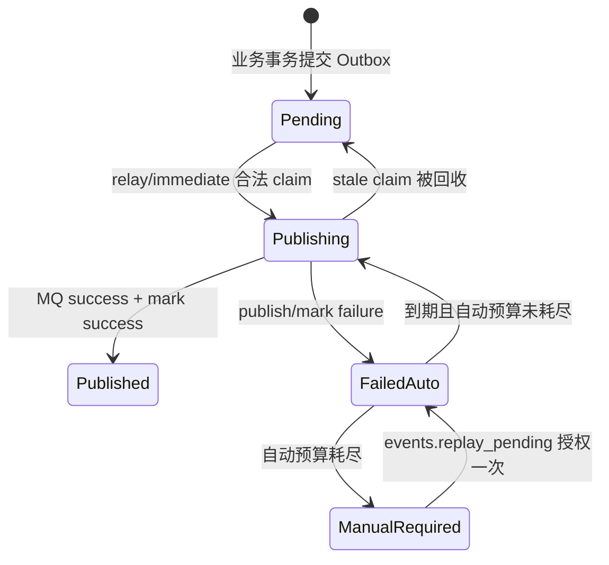

# 从事实到结算：Event 失败窗口与状态机

Event 体系真正治理的不是“怎样发一条消息”，而是一个已经发生的业务事实，怎样跨越数据库、进程、Redis、MQ 和消费者，最终变成可证明、可恢复的业务副作用。

本章是 Event 专题的推理主轴。它先建立完成点和状态机，再解释当前为什么选择 Transactional Outbox、bounded at-least-once、逐事件幂等和审计化 replay。具体代码与配置事实分别在后续章节展开。

## 1. 一条事件链至少有五个完成点

```text
T1 业务事实提交
T2 Outbox 出站意图提交
T3 MQ 接受消息
T4 某个 consumer channel 完成 ACK
T5 该 consumer 的业务副作用持久化
```

这五个完成点不能互相替代：

- T1 成功不等于 T3 一定发生；数据库 commit 后进程可能立刻退出。
- T2 成功不等于 T3 已发生；Outbox 可能仍在 pending/retry。
- T3 成功不等于 T4 成功；consumer 可能未收到、处理失败或 ACK 失败。
- T4 成功通常应以 T5 已成立或已建立另一项 durable 恢复责任为前提，但 MQ 本身无法替业务判断。
- 一个 channel 的 T4 不等于另一个 channel 的 T4；同 topic 的主消费者与附加投影有独立进度和失败域。

因此“Publish 返回 nil”“MQ 有消息”“consumer 日志打印成功”都不是端到端完成证明。排障必须先问：停在哪个完成点，哪个持久状态能够证明它。

## 2. 三种传播语义从业务损失推导

| 传播语义 | 适用问题 | producer 侧持久化 | 丢失后的责任 |
| --- | --- | --- | --- |
| `durable_outbox` Event | 丢失会让必要业务流程或投影永久缺失 | 业务事实与 Outbox 同一本地事务 | relay 自动恢复；耗尽后人工治理 |
| `best_effort` Event | 属于业务通知，但 producer 侧丢失可接受 | 无 | 无补偿，只保留观测 |
| Signal | 只提示缓存失效、状态刷新或等待者回读 | 无，Redis Pub/Sub ephemeral | TTL、主动查询、下一次 Signal |

分类依据不是 transport：MQ 消息若没有 Outbox，并不会自动 durable；Redis Signal 若被要求必达、重试、审计，就已经不再适合 Signal 语义。

### 2.1 为什么不把所有消息都做成 durable Event

纯缓存失效若进入 Outbox，会同时引入事务 staging、积压、消费幂等、死信和人工重放。可靠性成本只有在丢失损失值得时才合理。

### 2.2 为什么不能把所有传播都降级成 direct publish

关键业务流程一旦遇到“T1 已提交、T3 未发生”，没有任何持久线索可供恢复。日志能说明曾经失败，但不能自动重新建立工作。

### 2.3 重新分类的触发条件

- best-effort 丢失开始造成不可重建的数据缺口：升级为 durable Event；
- Signal 被要求必达或人工重放：改为 Event，不给 Pub/Sub 拼装半套 ACK；
- durable consumer 只构造可随时从权威数据全量重建的投影：可重新评估可靠等级，但要先计算重建成本与允许缺口。

## 3. 从 DB–MQ 双写窗口推导 Transactional Outbox

### 3.1 四种候选方案

| 方案 | 解决了什么 | 仍存在的失败窗口 | 当前结论 |
| --- | --- | --- | --- |
| DB commit → direct publish | 正常路径简单、低延迟 | commit 后 publish 前崩溃会永久漏事件 | 只用于 best-effort |
| publish → DB commit | 消息更早可见 | consumer 看到最终回滚或尚不可见的事实 | 不用于 durable 事实 |
| DB 与 MQ 分布式事务/XA | 理论上统一提交 | Mongo/MySQL/MQ 协调、可用性与恢复复杂 | 当前不选 |
| 本地 Transactional Outbox | T1 与 T2 原子成立，T3 异步重试 | 允许重复 publish，要求幂等消费 | 当前 durable 方案 |

Broker transaction 只能原子化 broker 内操作，不能覆盖业务数据库。CDC 可以减少 producer staging 代码，但需要稳定捕获双数据库日志、构造业务事件、治理 schema 和运维 connector；在当前拓扑中并不天然更简单。

### 3.2 当前不变量

```text
durable event 被承认
  => 业务事实 + Outbox 在同一个本地事务成立

Outbox 已成立
  => immediate、ready-index、relay 任一加速失败都不能删除恢复能力
```

Mongo 业务事实进入 Mongo Outbox，MySQL 业务事实进入 MySQL Outbox。系统不试图跨 Mongo/MySQL 创建一个“大事务”，而是让每个聚合在自己的事实存储内原子产生下一步意图，再由异步状态机收敛。

## 4. Producer 与 Outbox 状态机



关键推理：

- `pending/publishing/failed/published` 是持久事实；ready-index 只是候选索引。
- MQ 已接受但 `mark published` 失败时，Outbox 会再次发布；这是 at-least-once 的标准重复窗口。
- 自动 attempt 必须有界；否则永久 payload/route 错误会无限抢占 relay。
- 耗尽后保留 `failed + manual_required`，而不是删除或复制成另一张无法关联主状态的“Outbox DLQ”。
- 人工 replay 必须比较 event ID、store、当前 disposition 和 expected attempt，防止 operator 基于旧页面覆盖已变化状态。

当前 Outbox publish 自动预算默认/硬上限为 30；10 秒起步、1 小时封顶、20% deterministic jitter。数字属于这一个状态机，不能与 MQ delivery 或业务 retry 相加。

## 5. 为什么 immediate 与 ready-index 都不是可靠性基础

事务提交后有两条加速路径：

```text
AfterCommit
  ├─ ready-index enqueue：告诉 relay 哪些 ID 值得先 claim
  └─ immediate async publish：降低关键事件的端到端延迟

无论二者是否成功
  └─ DB relay polling：从 Outbox 事实恢复发现
```

### 5.1 ready-index

Redis ZSet 只优化“先找谁”。enqueue 丢失、ZSet 丢失或 Redis 故障时，reconciler/DB scan 仍能重新发现 Outbox。如果停掉 DB fallback 后 Redis 故障会永久漏事件，ready-index 就已越权成为事实源。

### 5.2 immediate

immediate 不是第三种 delivery。只有 Registry 声明的 durable event、并且 RoutingPublisher 真正 MQ-backed 时才启用。logging/nop 返回 nil 不能让 Outbox 变成 published。

`AfterCommit` 刻意不返回业务错误：此时 T1/T2 已经 commit，调用方无法再回滚。把 ready-index 或 immediate 错误返回给业务，只会制造“请求看似失败但事实已经成功”的新歧义。

## 6. Transport 与 channel 结算状态机

消息进入某个 channel 后，统一 transport 只处理四类结果：

| 输入结果 | MQ 动作 | 为什么 |
| --- | --- | --- |
| envelope/event type 无法解析 | NACK | 保留有界重投与 terminal handoff 证据，不能静默丢 poison payload |
| event type 对当前 registry unknown | ACK | 当前部署永远无法处理，持续 redelivery 没有收益；同时告警契约错位 |
| handler 返回 error | NACK | 当前副作用没有形成可接受结论，允许运输重试 |
| handler 成功、识别为重复或已建立 durable hold | ACK | 本 channel 的处理责任已完成或转交给另一持久状态机 |

ACK/NACK API 自身也可能失败。因此必须区分：handler 已完成、请求 ACK、broker 确认 ACK。这也是重复 delivery 仍可能发生的原因之一。

当前 MQ transport delivery 默认/硬上限为 8；30 秒起步、5 分钟封顶、20% jitter。这里有界的是业务 handler invocation，不是“第 8 次失败与 MySQL 落表组成一个原子动作”。
当前 NSQ provider 的终态链为：

```text
业务 channel 达到 MaxAttempts
       ↓
发布 cb.failed.<hash> handoff topic
       ↓ publish success
finish 原消息
       ↓
独立 handoff consumer
       ↓
MySQL recorder
       ↓ success
event_delivery_dead_letter(manual_required)
```

handoff publish 失败时原消息会 requeue；handoff consumer 或 MySQL recorder 失败时 handoff 消息会 requeue。
前者可能使原消息的 broker delivery attempt 超过 `MaxAttempts`，但不会再次调用业务 handler；后者会形成独立于业务 channel 的 handoff 积压。只有 recorder 成功后，
才能把 MySQL dead-letter 行作为持久化终态证据。

### 6.1 unknown 为什么 ACK，decode-invalid 为什么 NACK

二者都“处理不了”，但修复路径不同：

- unknown 说明消息能识别，只是当前进程没有注册 handler；在同一部署版本上重投不会改变结果，ACK 并通过 `unknown_acked` 暴露版本/契约错位。
- decode-invalid 可能来自临时 metadata 缺失、非标准 producer 或 schema 破坏；先用有界 NACK 保留运输证据，耗尽后进入 provider terminal handoff，
  recorder 成功才形成可人工判断的持久化 dead letter。

这是一项风险取舍，不是自然法则。若未来 unknown 事件必须被保留等待滚动升级，就需要独立 quarantine/parking-lot 设计，不能只把 ACK 改 NACK 后无限重投。

## 7. 业务重试、Outbox 重试、Hold 与运输重试是四个状态机

| 层 | 重试的动作 | 当前默认/硬上限 | 耗尽后 |
| --- | --- | ---: | --- |
| Evaluation / Interpretation business attempt | 再执行一次业务 run | 3 | 业务 `manual_required` 或 terminal |
| Outbox publish attempt | 把已提交 Outbox 发到 MQ | 30 | Outbox `failed + manual_required` |
| Retry-hold replay attempt | 把暂停期间保存的 retry event 再发布 | 30 | `retry_event_hold.manual_required` |
| MQ transport delivery attempt | 某 channel 再调用一次 handler | 8 | provider terminal handoff；recorder 成功后为 `event_delivery_dead_letter` |

不能说“总共重试 71 次”。四个 attempt 的 owner、动作、退避、幂等边界和终态完全不同。

一个业务 run 失败后可能产生 retry event；该 event 的 Outbox 可能 publish 重试；到 MQ 后 handler 又可能 transport redelivery。
如果 automatic business retry 被暂停，worker 将 retry event 写入 durable hold 后 ACK，让 hold replayer 接管，而不是继续消耗 transport budget。

## 8. at-least-once 为什么要求逐副作用幂等

重复来源至少包括：

- MQ 接受成功、Outbox mark 失败；
- immediate 与 relay 的时序竞争；
- handler 完成、ACK 失败；
- NACK/redelivery；
- operator replay dead letter。

当前不建立一个“全局 event-id ledger”宣称 exactly-once，而是按副作用选择最接近业务事实的裁决：

| 副作用类型 | 更合适的幂等边界 |
| --- | --- |
| 创建 Assessment | AnswerSheet/Assessment 业务键 + ensure/claim |
| 推进 Evaluation run | run state claim |
| 生成 Report | report business key + run claim + CAS |
| 覆盖报告状态 | 业务键上的幂等 overwrite/版本规则 |
| 可重复投影 | 设计为重复执行等价 |
| Redis 热度计数 | event ID processed key，接受 Redis 投影可重建语义 |
| 不可逆外部副作用 | 可能需要专属 inbox/dedup record 与结果回放 |

### 8.1 为什么统一 ledger 不是免费 exactly-once

ledger 只能证明“某个 event ID 被记录过”。若副作用成功但 ledger 写失败，仍会重复；若 ledger 先写成功但副作用失败，又会漏做。只有 ledger 与副作用能原子提交，或副作用本身支持稳定幂等 key，才闭合窗口。

所以是否引入 inbox，要围绕具体不可逆副作用和事务边界决定，不能为了表面统一给所有 consumer 增加一张表。

## 9. 一个 topic 可以有多个独立事实进度

`answersheet.submitted` 当前至少有两条 channel：

```text
qs.evaluation.lifecycle
  ├─ worker 主 channel → 创建/确保 Assessment
  └─ hot-rank channel → Redis projection
```

MQ 的 channel/consumer group 不是“调用两个 handler”的语法糖，而是两个独立的投递进度与失败域：

- hot-rank Redis 故障只 NACK projection channel；
- worker 主链仍可 ACK 并推进 Evaluation；
- 每条 channel 各自消耗 transport attempt，并在预算耗尽后进入自己的 provider terminal handoff；recorder 成功后才形成该 channel 的 dead letter；
- “某事件已消费”必须带上 channel，不能只有 event ID。

如果两个动作必须同成同败，应考虑放在同一业务事务/handler；如果需要独立扩缩容、重试和恢复，则应使用独立 channel。不要在 publisher hook 中同步执行投影，重新制造跨副作用双写窗口。

## 10. 人工 replay 不是“再发一次”按钮

系统有两个名字相近但责任不同的治理动作：

| 动作 | 恢复的持久事实 | 做什么 | 不做什么 |
| --- | --- | --- | --- |
| `events.replay_pending` | Outbox 或 retry hold 的 `manual_required` | 重新授权一次自动发布候选 | 不直接调用业务 handler |
| `events.replay_delivery` | 某 channel 的 transport dead letter | 解码 canonical event 并重新 publish | 不修改 poison payload，不绕过 channel |

安全的 replay 需要：组织范围、capability、二次确认、稳定 request ID、expected attempt/disposition、状态冲突检查、terminal audit。先修复 producer/handler/依赖，再重放；
否则 replay 只是更快地再次失败。

批量无限重放会放大事故和下游压力，因此当前治理动作有目标数量与风险等级约束。MySQL claim/audit 负责 action 本身幂等，不能只依靠操作日志。

## 11. 方案演化：从消息通知到可治理状态机

| 阶段 | 体系 | 能力提升 | 新的责任 |
| --- | --- | --- | --- |
| A | 事务后 direct publish | 正常路径能异步解耦 | DB–MQ 缝隙仍会漏事件 |
| B | Transactional Outbox + polling relay | 已提交意图可恢复 | 重复 publish，consumer 必须幂等 |
| C | ready-index + immediate | 降低发现和关键事件延迟 | 必须证明两者都是可丢加速 |
| D | bounded delivery + terminal handoff/dead letter | poison/永久错误不再无限调用业务 handler | 需要治理 handoff 积压、持久死信、诊断和人工恢复 |
| E | retry hold + 审计化 replay | 业务暂停与恢复可治理 | 多状态机必须保持 attempt/终态边界 |
| F（仅按需） | 专属 inbox/fencing/补偿 | 保护不可逆外部副作用 | 与副作用事务、结果回放和长期存储成本 |

当前系统处于 E，但不宣称端到端 exactly-once、全局 ledger、schema negotiation 或自动修复 poison payload。

## 12. 决策闭环与重评条件

审查或新增一个 Event 时，按以下顺序：

1. 先写出业务事实和丢失损失；可重建投影也要写重建时间与缺口容忍度。
2. 标出 T1–T5，列出每两个完成点之间的崩溃窗口。
3. 确定 producer delivery：durable、best-effort 还是 Signal。
4. 确定副作用幂等边界和 ACK 前必须成立的 durable 结论。
5. 分别定义 business、Outbox、hold、transport 的 retry owner、预算和终态。
6. 定义 backlog、oldest age、consume outcome、dead letter 和 audit 证据。
7. 定义人工恢复的权限、冲突检查与重新执行边界。

出现以下变化时应重新决策：

- best-effort 丢失开始造成业务缺口；
- 某个 consumer 增加不可逆外部副作用；
- 一个 handler 内的动作需要独立扩缩容或失败隔离；
- backlog 恢复目标无法由当前 polling/immediate/worker 预算满足；
- terminal handoff 或 decode dead letter 长期积压，说明 provider 交接或契约演进策略不足；
- 人工 replay 频率升高，说明自动终态或错误分类需要重构。

## 13. 继续阅读

- [Event 契约与演进](./20-事件契约与演进.md)：把上述语义固定成 Registry 与 wire contract。
- [Outbox 可靠出站链路](./30-Outbox可靠出站链路.md)：查看 producer/Outbox 状态机的当前实现。
- [MQ 发布、消费与结算](./40-MQ发布消费与结算.md)：查看 transport 与逐事件幂等。
- [可观测性与故障恢复](./50-可观测性与故障恢复.md)：用事实和指标定位 T1–T5。
- [Signal 一次性信令](./60-Signal一次性信令.md)：理解可丢唤醒为何不是“不完整 Event”。
