# Event System 阅读地图

**本文回答**：`event/` 子目录这一组文档应该如何阅读；qs-server 的事件系统负责什么、不负责什么；事件目录、Publish/Outbox、Worker Ack/Nack、新增事件 SOP、观测排障和 MQ 选型分别应该去哪里看。

---

## 30 秒结论

| 维度 | 结论 |
| ---- | ---- |
| 模块定位 | Event System 是 qs-server 的**异步流程驱动核心**，连接 Survey、Evaluation、Actor、Plan、Statistics 等模块 |
| 契约真值 | `configs/events.yaml` 定义 topic、event type、delivery、aggregate、domain、handler |
| 当前 Topic | `qs.survey.lifecycle`、`qs.evaluation.lifecycle`、`qs.analytics.behavior`、`qs.plan.task` |
| 当前 Event | 当前事件目录包含 19 个事件 |
| 出站模型 | `best_effort` 走 direct publish；`durable_outbox` 先 stage outbox，再由 relay 发布 |
| 消费模型 | worker 根据 event catalog 订阅 topic，通过显式 handler registry 分发 handler |
| Ack/Nack | poison message Ack；handler 成功 Ack；handler 失败 Nack |
| 可靠性边界 | Outbox 解决可靠出站，不解决 exactly-once；consumer 仍必须幂等 |
| MQ 默认 | 当前默认选择 NSQ，代码支持 NSQ / RabbitMQ provider 分支 |
| 观测入口 | publish/outbox/consume outcome、outbox backlog、consume duration、只读 event status |
| 推荐读法 | 先读整体架构，再读事件目录、Publish/Outbox、Worker Ack/Nack、SOP、观测排障，最后读 MQ 选型 |

一句话概括：

> **事件系统负责把“业务事实已经发生”可靠或尽力通知出去；业务事实仍由各业务模块的聚合、仓储和事务边界维护。**

---

## 1. Event System 负责什么

Event System 负责 qs-server 的异步消息机制：

```text
事件契约
事件发布
可靠出站
MQ 传输
worker 消费
Ack/Nack
行为投影
主链路异步驱动
事件观测
事件排障
```

它要回答：

```text
某个业务事实是否应该成为事件？
这个事件发到哪个 topic？
它是 best_effort 还是 durable_outbox？
业务状态和事件出站是否在同一事务边界？
worker 是否订阅了对应 topic？
handler 是否注册？
消息失败时 Ack 还是 Nack？
outbox 是否堆积？
handler 是否重复执行？
```

---

## 2. Event System 不负责什么

| 不属于 Event System 的内容 | 应归属 |
| --------------------------- | ------ |
| 业务状态机和聚合不变量 | `02-业务模块/*` |
| AnswerSheet / Assessment / Report 的主事实 | Survey / Evaluation |
| Task 状态事实 | Plan |
| Testee 标签和 Actor 主数据 | Actor |
| Statistics read model 口径 | Statistics |
| DB 事务和 schema 演进 | Data Access |
| Redis lock/cache 本身 | Redis / Resilience |
| 具体 WeChat/OSS/Notification SDK | Integrations |
| REST/gRPC 接口契约 | 接口与运维文档 |
| exactly-once 全链路保证 | 当前不承诺，由 outbox + 幂等降低风险 |

一句话边界：

```text
事件系统传递事实；
业务模块保存事实；
worker 执行副作用；
handler 必须幂等。
```

---

## 3. 本目录文档地图

```text
event/
├── README.md
├── 00-整体架构.md
├── 01-事件目录与契约.md
├── 02-Publish与Outbox.md
├── 03-Worker消费与AckNack.md
├── 04-新增事件SOP.md
├── 05-观测与排障.md
└── 06-MQ 选型与分析.md
```

| 顺序 | 文档 | 先回答什么 |
| ---- | ---- | ---------- |
| 1 | [00-整体架构.md](./00-整体架构.md) | 事件系统由哪些层组成，三进程如何协作 |
| 2 | [01-事件目录与契约.md](./01-事件目录与契约.md) | `events.yaml` 如何定义 topic、delivery、handler |
| 3 | [02-Publish与Outbox.md](./02-Publish与Outbox.md) | best_effort 和 durable_outbox 如何出站 |
| 4 | [03-Worker消费与AckNack.md](./03-Worker消费与AckNack.md) | worker 如何订阅、分发、Ack/Nack |
| 5 | [04-新增事件SOP.md](./04-新增事件SOP.md) | 新增事件时如何判断、实现、测试和补文档 |
| 6 | [05-观测与排障.md](./05-观测与排障.md) | 事件系统如何观测和逐层排障 |
| 7 | [06-MQ 选型与分析.md](./06-MQ%20选型与分析.md) | 为什么当前默认选择 NSQ，以及主流 MQ 对比 |

> 如果落库时使用你规划中的长文件名：`06-MQ 选型与分析--讨论市面主流 MQ 的实现方式与优缺点，分析为什么选择 NSQ .md`，请同步调整 README 中的链接。

---

## 4. 推荐阅读路径

### 4.1 第一次理解事件系统

按顺序读：

```text
00-整体架构
  -> 01-事件目录与契约
  -> 02-Publish与Outbox
  -> 03-Worker消费与AckNack
```

读完后应能回答：

1. `configs/events.yaml` 为什么是事件契约真值？
2. `best_effort` 和 `durable_outbox` 的边界是什么？
3. 为什么 RoutingPublisher 不直接判断 durable event？
4. 为什么 worker handler 必须显式注册？
5. 为什么 handler 失败会 Nack？
6. 为什么毒消息要 Ack？

### 4.2 要新增事件

读：

```text
04-新增事件SOP
  -> 01-事件目录与契约
  -> 02-Publish与Outbox
  -> 03-Worker消费与AckNack
```

重点看：

- 这个需求是不是“已发生的业务事实”。
- event type 是否是过去式事实。
- topic 是否复用现有 4 个 topic。
- delivery 应该是 best_effort 还是 durable_outbox。
- payload 是否只包含必要字段。
- worker handler 是否幂等。
- Ack/Nack 语义是否明确。
- 测试和文档是否补齐。

### 4.3 要排查“答卷提交后没有报告”

读：

```text
05-观测与排障
  -> 02-Publish与Outbox
  -> 03-Worker消费与AckNack
```

按链路查：

```text
answersheet.submitted outbox
  -> relay published
  -> worker answersheet_submitted_handler
  -> CreateAssessmentFromAnswerSheet
  -> assessment.submitted outbox
  -> assessment_submitted_handler
  -> EvaluateAssessment
  -> report.generated / assessment.failed
```

### 4.4 要排查 outbox 堆积

读：

```text
02-Publish与Outbox
  -> 05-观测与排障
```

重点看：

- pending / failed / publishing 数量。
- oldest age。
- relay 是否运行。
- ClaimDueEvents 是否失败。
- MQ publisher 是否失败。
- mark published/failed 是否失败。
- last_error 和 next_attempt_at。

### 4.5 要排查 worker 重复消费

读：

```text
03-Worker消费与AckNack
  -> 05-观测与排障
```

重点看：

- handler 是否 Nack。
- Ack 是否失败。
- MQ 是否重投。
- handler 是否幂等。
- 是否使用 locklease / checkpoint / 状态机 / 唯一约束。
- duplicate suppression 是否 degraded-open。

### 4.6 要理解 MQ 选型

读：

```text
06-MQ 选型与分析
  -> 00-整体架构
```

重点看：

- 当前事件系统是轻量 worker 任务链，不是大数据流平台。
- NSQ topic/channel 如何匹配 worker serviceName/channel。
- NSQ 的不足如何由 outbox 和 handler 幂等补偿。
- RabbitMQ/Kafka/Pulsar/RocketMQ/Redis Streams/NATS/SQS 什么时候重新评估。

---

## 5. Event System 主链路

```mermaid
flowchart LR
    answer["AnswerSheet<br/>submitted"] --> outbox1["Mongo/MySQL Outbox"]
    outbox1 --> mq1["qs.evaluation.lifecycle"]
    mq1 --> worker1["answersheet_submitted_handler"]
    worker1 --> assessment["Create / Submit Assessment"]
    assessment --> outbox2["Assessment Outbox"]
    outbox2 --> mq2["qs.evaluation.lifecycle"]
    mq2 --> worker2["assessment_submitted_handler"]
    worker2 --> eval["EvaluateAssessment"]
    eval --> report["Report generated"]
    report --> outbox3["Report / Footprint Outbox"]
    outbox3 --> mq3["assessment + analytics topics"]
    mq3 --> worker3["report / behavior handlers"]
```



这条链路说明：

1. Survey 保存答卷事实。
2. durable outbox 发布 `answersheet.submitted`。
3. Worker 创建/提交 Assessment。
4. durable outbox 发布 `assessment.submitted`。
5. Worker 触发 Evaluation pipeline。
6. Report 成功后发布 `assessment.interpreted`、`report.generated`、`footprint.report_generated`。
7. Worker 继续做重点关注同步、行为投影、统计等副作用。

---

## 6. 四类 Topic

| Topic Key | Topic Name | 说明 |
| --------- | ---------- | ---- |
| `questionnaire-lifecycle` | `qs.survey.lifecycle` | 问卷和量表生命周期事件 |
| `assessment-lifecycle` | `qs.evaluation.lifecycle` | 答卷、测评、报告主链路事件 |
| `analytics-behavior` | `qs.analytics.behavior` | 行为足迹与测评服务过程投影事件 |
| `task-lifecycle` | `qs.plan.task` | 测评任务生命周期事件 |

---

## 7. 两类 Delivery

### 7.1 best_effort

当前 best_effort 事件：

```text
questionnaire.changed
scale.changed
task.opened
task.completed
task.expired
task.canceled
```

语义：

```text
业务状态已保存；
事件尽力发布；
发布失败一般不回滚主状态；
不承诺 outbox 级补发。
```

### 7.2 durable_outbox

当前 durable_outbox 事件：

```text
answersheet.submitted
assessment.submitted
assessment.interpreted
assessment.failed
report.generated
footprint.*
```

语义：

```text
业务主状态与 outbox record 在同一持久化边界写入；
relay 异步发布；
失败可重试；
consumer 仍需幂等。
```

---

## 8. 事实源与边界

| 事实 | 真值 |
| ---- | ---- |
| event type / topic / delivery / handler | `configs/events.yaml` |
| 代码侧 event 常量 | `internal/pkg/eventcatalog/types.go` |
| topic 路由 | `eventcatalog.Catalog` + `RoutingPublisher` |
| direct publish helper | `application/eventing.PublishCollectedEvents` |
| durable 出站状态 | MySQL/Mongo outbox store |
| relay 逻辑 | `application/eventing.OutboxRelay` |
| worker handler 绑定 | `worker/handlers.NewRegistry()` |
| worker dispatch | `worker/integration/eventing.Dispatcher` |
| Ack/Nack | `worker/integration/messaging.MessageSettlementPolicy` |
| publish/outbox/consume 指标 | `eventobservability` |

---

## 9. 维护原则

### 9.1 先定义事实，再定义事件

新增事件前先判断：

```text
这是业务事实吗？
它已经发生了吗？
谁是事实源？
下游为什么需要它？
丢失会怎样？
```

### 9.2 不用事件伪装 RPC

如果需要请求-响应结果，用 REST/gRPC。事件适合广播已发生事实，不适合做同步函数调用。

### 9.3 delivery class 不能随意改

`best_effort -> durable_outbox` 需要新增 outbox stage 边界。

`durable_outbox -> best_effort` 通常风险很大，必须证明事件丢失不会影响主流程。

### 9.4 durable event 不走普通 direct publish

除 OutboxRelay 外，应用服务不应直接 publish durable_outbox event。

### 9.5 worker handler 必须幂等

不要假设消息只会消费一次。Ack failed、Nack retry、worker crash、MQ redelivery 都可能导致重复执行。

### 9.6 事件观测标签必须低基数

metrics label 不放 event_id、assessment_id、answer_sheet_id、task_id、user_id 等高基数字段。

---

## 10. 常见误区

### 10.1 “Event System 负责业务状态”

错误。事件系统只传递事实；业务状态由业务模块保存。

### 10.2 “Outbox 保证 exactly-once”

错误。Outbox 保证可靠出站，不保证全链路 exactly-once。

### 10.3 “best_effort 就是不重要”

不准确。best_effort 只是可靠性等级较低，不代表业务完全不关心。

### 10.4 “worker Ack 就代表业务一定成功”

不一定。Ack 只说明 handler 返回 nil。还要看 handler 是否正确完成业务调用。

### 10.5 “poison message 应该 Nack”

通常不应该。无法解析 event type 的消息重试也无法修复，会阻塞队列。

### 10.6 “RabbitMQ/Kafka 一定比 NSQ 好”

不成立。MQ 选型要看当前事件模型、部署复杂度、团队运维能力和可靠性补偿方式。

---

## 11. 代码锚点

### Contract / Catalog

- Event config：[../../../configs/events.yaml](../../../configs/events.yaml)
- Event catalog：[../../../internal/pkg/eventcatalog/](../../../internal/pkg/eventcatalog/)
- Event constants：[../../../internal/pkg/eventcatalog/types.go](../../../internal/pkg/eventcatalog/types.go)

### Publish / Outbox

- Publish helper：[../../../internal/apiserver/application/eventing/publish.go](../../../internal/apiserver/application/eventing/publish.go)
- RoutingPublisher：[../../../internal/pkg/eventruntime/publisher.go](../../../internal/pkg/eventruntime/publisher.go)
- Outbox core：[../../../internal/apiserver/outboxcore/core.go](../../../internal/apiserver/outboxcore/core.go)
- Outbox relay：[../../../internal/apiserver/application/eventing/outbox.go](../../../internal/apiserver/application/eventing/outbox.go)
- MySQL outbox：[../../../internal/apiserver/infra/mysql/eventoutbox/](../../../internal/apiserver/infra/mysql/eventoutbox/)
- Mongo outbox：[../../../internal/apiserver/infra/mongo/eventoutbox/](../../../internal/apiserver/infra/mongo/eventoutbox/)

### Worker

- Worker dispatcher：[../../../internal/worker/integration/eventing/dispatcher.go](../../../internal/worker/integration/eventing/dispatcher.go)
- Messaging runtime：[../../../internal/worker/integration/messaging/runtime.go](../../../internal/worker/integration/messaging/runtime.go)
- Worker handlers：[../../../internal/worker/handlers/](../../../internal/worker/handlers/)

### Observability / MQ

- Event observability：[../../../internal/pkg/eventobservability/](../../../internal/pkg/eventobservability/)
- Messaging options：[../../../internal/pkg/options/messaging_options.go](../../../internal/pkg/options/messaging_options.go)

---

## 12. Verify

基础：

```bash
go test ./internal/pkg/eventcatalog
go test ./internal/pkg/eventcodec
go test ./internal/pkg/eventruntime
go test ./internal/pkg/eventobservability
```

Outbox：

```bash
go test ./internal/apiserver/application/eventing
go test ./internal/apiserver/outboxcore
go test ./internal/apiserver/infra/mysql/eventoutbox
go test ./internal/apiserver/infra/mongo/eventoutbox
```

Worker：

```bash
go test ./internal/worker/integration/eventing
go test ./internal/worker/integration/messaging
go test ./internal/worker/handlers
```

文档：

```bash
make docs-hygiene
git diff --check
```

---

## 13. 下一跳

| 目标 | 文档 |
| ---- | ---- |
| 事件系统整体架构 | [00-整体架构.md](./00-整体架构.md) |
| 事件目录与契约 | [01-事件目录与契约.md](./01-事件目录与契约.md) |
| Publish 与 Outbox | [02-Publish与Outbox.md](./02-Publish与Outbox.md) |
| Worker 消费与 Ack/Nack | [03-Worker消费与AckNack.md](./03-Worker消费与AckNack.md) |
| 新增事件 SOP | [04-新增事件SOP.md](./04-新增事件SOP.md) |
| 观测与排障 | [05-观测与排障.md](./05-观测与排障.md) |
| MQ 选型与分析 | [06-MQ 选型与分析.md](./06-MQ%20选型与分析.md) |
| 回到基础设施总入口 | [../README.md](../README.md) |
