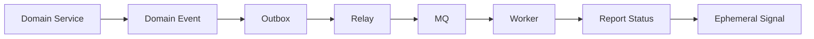

# event

event 模块是 qs-server 的异步一致性治理层，用于把答卷提交、测评执行、报告生成拆成可追踪、可重试、可补偿的异步链路。

## 1. 这个模块解决什么问题

答卷提交不能同步等待测评计算和报告生成，否则提交接口延迟不可控；但提交后的业务事件也不能丢。event 模块解决业务写入、可靠出站、异步消费和临时唤醒之间的边界问题。

## 2. 它在 qs-server 中处于什么位置

event 位于领域服务和 worker 之间。领域服务产生业务事实，Outbox 记录可靠出站，relay 发布到 MQ，worker 消费事件推进评估和报告生成，一次性信令只唤醒等待中的报告查询请求。

## 3. 整体架构是什么

## 4. 关键链路有哪些

| 链路 | 文档 |
| --- | --- |
| 事件模块整体架构 | [01-事件模块整体架构.md](01-事件模块整体架构.md) |
| 领域事件设计 | [02-领域事件设计.md](02-领域事件设计.md) |
| Outbox 可靠出站 | [03-Outbox可靠出站链路.md](03-Outbox可靠出站链路.md) |
| MQ 发布与消费 | [04-MQ发布与消费链路.md](04-MQ发布与消费链路.md) |
| 一次性信令 | [05-一次性信令链路.md](05-一次性信令链路.md) |
| 事件幂等 | [06-事件幂等与重复消费治理.md](06-事件幂等与重复消费治理.md) |
| 积压补偿 | [07-事件积压与补偿机制.md](07-事件积压与补偿机制.md) |
| 方案取舍 | [08-方案取舍.md](08-方案取舍.md) |
| 事件契约矩阵 | [09-事件契约矩阵.md](09-事件契约矩阵.md) |

## 5. 为什么选择当前方案

Outbox、MQ、Signal 不是替代关系。Outbox 解决“业务写入成功但消息发布失败”的可靠出站问题；MQ 解决跨进程异步消费问题；Signal 解决正在等待的 HTTP 请求被临时唤醒的问题。

## 6. 代码事实源

| 能力 | 事实源 |
| --- | --- |
| 事件契约 | [../../../configs/events.yaml](../../../configs/events.yaml) |
| 信令契约 | [../../../configs/signals.yaml](../../../configs/signals.yaml) |
| Outbox core / store | [../../../internal/apiserver/outboxcore](../../../internal/apiserver/outboxcore)、[../../../internal/apiserver/infra/mongo/eventoutbox](../../../internal/apiserver/infra/mongo/eventoutbox)、[../../../internal/apiserver/infra/mysql/eventoutbox](../../../internal/apiserver/infra/mysql/eventoutbox) |
| 发布与 worker | [../../../internal/apiserver/application/eventing](../../../internal/apiserver/application/eventing)、[../../../internal/worker/handlers](../../../internal/worker/handlers) |
