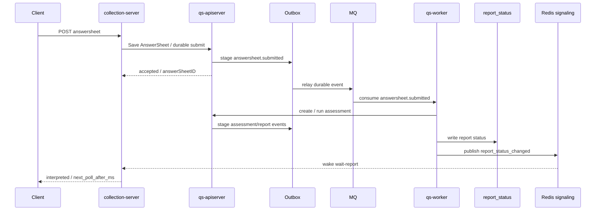

# Event System 阅读地图

**本文回答**：qs-server 的事件模块如何支撑异步测评链路；Event、Outbox、MQ、Worker 和 Redis signaling 分别负责什么；为什么 Outbox、MQ、一次性信令不是替代关系。

---

## 30 秒结论

事件模块是 qs-server 从同步提交走向异步测评的关键基础设施。

答卷提交接口不直接同步完成测评和报告生成，而是先保存 AnswerSheet，再通过 Outbox 记录领域事件。Outbox relay 将事件可靠发布到 MQ，worker 消费事件后执行测评、生成报告，并继续推进报告状态。

在报告查询场景中，系统额外引入一次性信令机制。worker 完成报告后写入 report_status，并通过 Redis signaling 唤醒正在等待的 wait-report 请求。这个信令只负责临时唤醒，不承担可靠投递职责；真正的业务事实仍然以数据库状态、Outbox 事件和报告状态为准。

---

## 四层边界

| 层 | 作用 | 当前事实源 |
| -- | ---- | ---------- |
| Event | 表达已经发生的业务事实，例如答卷已提交、测评已解读、报告已生成 | `configs/events.yaml`、`internal/apiserver/domain/*/events.go` |
| Outbox | 解决业务写入与事件发布的一致性，承载不能丢的业务事件 | `internal/apiserver/outboxcore`、`infra/*/eventoutbox` |
| MQ | 跨进程异步消费，让 worker 执行测评、报告生成、投影等副作用 | `internal/pkg/eventcatalog`、`internal/worker/handlers` |
| 一次性信令 | 临时唤醒在线等待请求或触发缓存失效/预热，不承担可靠事件职责 | `configs/signals.yaml`、`internal/pkg/cachesignal` |

一句话边界：

```text
Outbox 解决可靠出站。
MQ 解决异步解耦。
Redis signaling 解决临时唤醒。
三者不是替代关系。
```

---

## 为什么不能混用

| 常见追问 | 回答 |
| -------- | ---- |
| 既然用了 MQ，为什么还要 Outbox？ | MQ 只负责传输。Outbox 把业务状态写入和事件出站放进可恢复的本地事实中，避免“业务写成功但事件丢了”。 |
| 既然用了 Redis Pub/Sub，为什么还要 MQ？ | Redis Pub/Sub 是 best-effort 临时信令，订阅者不在线就可能错过；MQ 承载跨进程 worker 消费和重试。 |
| 既然报告完成可以写 Redis，为什么还要事件？ | Redis report_status 服务查询体验；报告生成、测评完成等业务事实仍要通过持久化状态和事件链路追踪。 |
| Outbox 能不能保证 exactly-once？ | 不能。Outbox 降低丢事件风险，consumer 仍必须幂等，worker 仍要处理重复投递。 |

---

## 当前事件契约

`configs/events.yaml` 是当前事件契约真值：

| 维度 | 当前事实 |
| ---- | -------- |
| Topic | `qs.survey.lifecycle`、`qs.evaluation.lifecycle`、`qs.analytics.behavior`、`qs.plan.task` |
| Delivery | `durable_outbox`、`best_effort` |
| durable 事件 | `answersheet.submitted`、`assessment.*`、`report.generated`、`footprint.*` 等 |
| best-effort 事件 | `questionnaire.changed`、`scale.changed`、`task.*` |
| ephemeral signal | 不在 `events.yaml` 中，单独见 `configs/signals.yaml` |

一次性信令当前包括 `report_status_changed`、`questionnaire_cache_changed`、`scale_cache_changed`、`personality_model_cache_changed`。

---

## 异步测评主链路



---

## 当前文档地图

| 顺序 | 文档 | 先回答什么 |
| ---- | ---- | ---------- |
| 1 | [00-整体架构.md](./00-整体架构.md) | 事件系统由哪些层组成，三进程如何协作 |
| 2 | [01-事件目录与契约.md](./01-事件目录与契约.md) | `events.yaml` 如何定义 topic、delivery、handler |
| 3 | [02-Publish与Outbox.md](./02-Publish与Outbox.md) | best_effort 和 durable_outbox 如何出站 |
| 4 | [03-Worker消费与AckNack.md](./03-Worker消费与AckNack.md) | worker 如何订阅、分发、Ack/Nack |
| 5 | [04-新增事件SOP.md](./04-新增事件SOP.md) | 新增事件时如何判断、实现、测试和补文档 |
| 6 | [05-观测与排障.md](./05-观测与排障.md) | 事件系统如何观测和逐层排障 |
| 7 | [06-MQ 选型与分析.md](./06-MQ%20选型与分析.md) | 为什么当前默认选择 NSQ，以及主流 MQ 对比 |

---

## 排查入口

| 问题 | 优先阅读 |
| ---- | -------- |
| 答卷提交后没有测评结果 | [02-Publish与Outbox.md](./02-Publish与Outbox.md)、[03-Worker消费与AckNack.md](./03-Worker消费与AckNack.md)、[05-观测与排障.md](./05-观测与排障.md) |
| outbox 堆积 | [02-Publish与Outbox.md](./02-Publish与Outbox.md)、[05-观测与排障.md](./05-观测与排障.md) |
| worker 重复消费 | [03-Worker消费与AckNack.md](./03-Worker消费与AckNack.md)、[../concurrency/README.md](../concurrency/README.md) |
| report 查询没有被唤醒 | `configs/signals.yaml`、[../concurrency/README.md](../concurrency/README.md)、[../../04-接口与运维/12-小程序报告等待接入指南.md](../../04-接口与运维/12-小程序报告等待接入指南.md) |
| 新增事件 | [04-新增事件SOP.md](./04-新增事件SOP.md)、`configs/events.yaml` |

---

## 幂等与补偿边界

| 层 | 当前要求 |
| -- | -------- |
| Producer | durable 事件必须 stage 到 Outbox；业务事实和事件出站不能只靠 direct publish |
| Relay | 负责 claim、publish、mark published/failed；失败后留待下一轮或补偿治理 |
| Consumer | handler 必须幂等，能接受 MQ 重投和重复消息 |
| Worker duplicate suppression | 只降低重复副作用，不替代业务幂等和 DB 约束 |
| Report signaling | 只唤醒等待请求；错过信令时客户端仍通过 status 查询和 `next_poll_after_ms` 兜底 |

---

## 代码事实源

| 主题 | 路径 |
| ---- | ---- |
| 事件契约 | `configs/events.yaml` |
| 一次性信令 | `configs/signals.yaml` |
| 事件目录加载 | `internal/pkg/eventcatalog` |
| 发布与 Outbox | `internal/apiserver/application/eventing`、`internal/apiserver/outboxcore` |
| Outbox store | `internal/apiserver/infra/mongo/eventoutbox`、`internal/apiserver/infra/mysql/eventoutbox` |
| Worker handler | `internal/worker/handlers` |
| report signal / cache signal | `internal/pkg/cachesignal`、`internal/collection-server/application/reportwait` |
