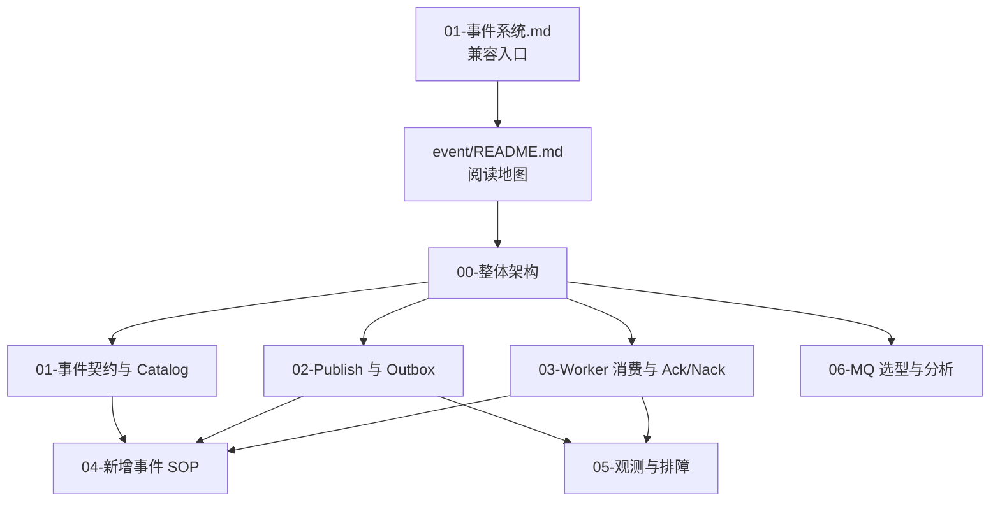

# 事件系统深讲阅读地图

**本文回答**：`docs/03-基础设施/event/` 是 `qs-server` 事件系统的深讲真值层；这里把事件契约、发布/outbox、worker 消费、观测排障和 MQ 选型拆开讲，避免把所有事实塞回单篇总览。

## 30 秒结论

| 维度 | 结论 |
| ---- | ---- |
| 事实优先级 | 源码与运行行为 > [`configs/events.yaml`](../../../configs/events.yaml) > 当前文档 > 宣讲层 > `_archive` |
| 当前主路径 | `eventcatalog + eventcodec + eventruntime + eventobservability` |
| 出站分层 | `best_effort` 走 direct publish；`durable_outbox` 先进入 MySQL/Mongo outbox，再由 relay 发布 |
| 消费分层 | worker 用显式 handler registry、dispatcher、messaging runtime 承接订阅、分发、Ack/Nack |
| 读法 | 先读 `00`，再按“契约、发布、消费、排障、新增事件”进入对应文档 |



## 建议阅读顺序

| 目标 | 阅读入口 |
| ---- | -------- |
| 快速理解事件系统整体 | [00-整体架构.md](./00-整体架构.md) |
| 新增或修改事件契约 | [01-事件契约与Catalog.md](./01-事件契约与Catalog.md)、[04-新增事件SOP.md](./04-新增事件SOP.md) |
| 判断事件该不该走 outbox | [02-Publish与Outbox.md](./02-Publish与Outbox.md) |
| 排查 worker 消费、Ack/Nack、poison message | [03-Worker消费与AckNack.md](./03-Worker消费与AckNack.md)、[05-观测与排障.md](./05-观测与排障.md) |
| 判断 MQ 选型与 NSQ 边界 | [06-MQ 选型与分析--讨论市面主流 MQ 的实现方式与优缺点，分析为什么选择 NSQ .md](./06-MQ 选型与分析--讨论市面主流 MQ 的实现方式与优缺点，分析为什么选择 NSQ .md) |

## 当前不在这里讲什么

| 不讲什么 | 应该去哪里 |
| -------- | ---------- |
| 业务模块对象模型 | [../../02-业务模块/README.md](../../02-业务模块/README.md) |
| 三进程启动与端口 | [../../01-运行时/README.md](../../01-运行时/README.md) |
| 异步评估主链叙事 | [../../05-专题分析/02-异步评估链路：从答卷提交到报告生成.md](../../05-专题分析/02-异步评估链路：从答卷提交到报告生成.md) |
| Redis cache / lock / governance | [../redis/README.md](../redis/README.md) |
| 历史重构过程 | [../../_archive/README.md](../../_archive/README.md) |

## Verify

修改本目录后至少执行：

```bash
python scripts/check_docs_hygiene.py
git diff --check
```

如修改事件事实，再执行：

```bash
GOTOOLCHAIN=local /Users/yangshujie/.gvm/gos/go1.25.9/bin/go test ./internal/pkg/eventcatalog ./internal/pkg/eventcodec ./internal/pkg/eventruntime ./internal/pkg/eventobservability
GOTOOLCHAIN=local /Users/yangshujie/.gvm/gos/go1.25.9/bin/go test ./internal/apiserver/application/eventing ./internal/apiserver/outboxcore ./internal/apiserver/infra/mysql/eventoutbox ./internal/apiserver/infra/mongo/eventoutbox
GOTOOLCHAIN=local /Users/yangshujie/.gvm/gos/go1.25.9/bin/go test ./internal/worker/integration/eventing ./internal/worker/integration/messaging ./internal/worker/handlers
```
