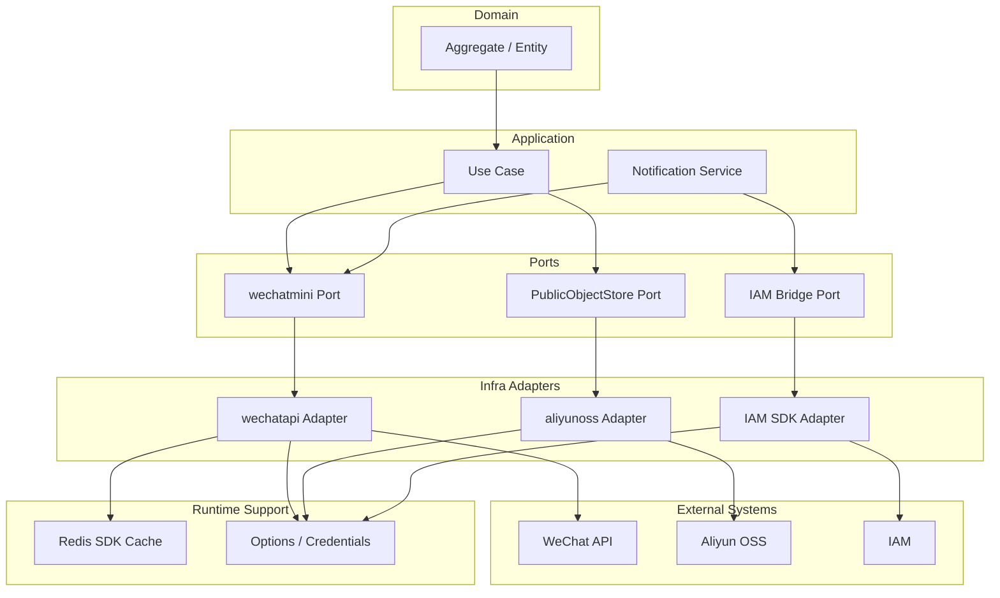

# External Integration Adapter 整体架构

**本文回答**：qs-server 外部集成层如何按 port/adapter 隔离第三方 SDK、缓存、凭据、错误语义和配置；为什么不抽象统一 integration framework；WeChat、OSS、Notification 三类外部适配如何落在当前代码中。

---

## 30 秒结论

| 维度 | 结论 |
| ---- | ---- |
| 主要问题 | WeChat、OSS、IAM 等外部系统的 SDK 对象、credential、token cache、错误语义不可控 |
| 设计选择 | application 定义业务用例和窄 port；infra adapter 封装第三方 SDK |
| 当前能力 | WeChat token/cache/QR/subscribe seam；Aliyun OSS public object store；task.opened mini program notification |
| 测试策略 | 单测覆盖本地 validation、key normalization、cache key、模板组装、错误映射；不做真实外部网络调用 |
| 取舍 | 不做通用 integration framework，避免为了统一抹平不同 SDK 语义 |
| 风险标记 | WeChat subscribe send 当前真实发送代码是注释状态，`SendSubscribeMessage` 直接返回 nil，必须按 seam 描述 |
| 核心边界 | 第三方 SDK 不进入 domain；业务层不直接处理 token/secret/OSS client/WeChat client |

一句话概括：

> **外部集成层的职责是“隔离不可控第三方”，不是“把所有外部系统抽成一个万能 SDK 框架”。**

---

## 1. 为什么需要 External Integration Adapter

外部系统通常具有这些特点：

- SDK 类型复杂。
- 错误语义不稳定。
- 凭据和 token 需要专门管理。
- 网络调用不可控。
- 配置和环境差异大。
- 测试容易 flaky。
- 第三方字段不适合进入 domain。

如果业务层直接依赖第三方 SDK，会导致：

| 问题 | 后果 |
| ---- | ---- |
| domain import SDK | 领域模型污染 |
| application 直接处理 token | 凭据生命周期散落 |
| handler 手写外部请求 | 错误语义不可控 |
| 单测访问真实外部网络 | flaky、慢、不可重复 |
| SDK error 原样泄漏 | 用户看到第三方内部错误 |
| 业务对象使用 openid/token 等细节 | 长期耦合外部平台 |

因此需要 port/adapter 边界。

---

## 2. 总体架构



---

## 3. 分层职责

| 层 | 职责 | 不做什么 |
| -- | ---- | -------- |
| Domain | 业务不变量和状态 | 不 import SDK，不处理 token |
| Application | 组织用例、选择 port、解释 skipped/error | 不构造第三方 client |
| Port | 定义业务需要的窄接口 | 不暴露 SDK 类型 |
| Adapter | 封装 SDK、credential、cache、错误映射 | 不决定业务状态 |
| External | 第三方平台 | 不进入单元测试 |
| Runtime Support | cache、options、observer | 不承载业务事实 |

---

## 4. 当前能力矩阵

| 能力 | Port | Adapter | External |
| ---- | ---- | ------- | -------- |
| WeChat Token | TokenProvider 内部能力 | `infra/wechatapi.TokenProvider` | WeChat MiniProgram / OfficialAccount |
| WeChat QR | `wechatmini.QRCodeGenerator` | `infra/wechatapi.QRCodeGenerator` | WeChat QR API |
| WeChat Subscribe | `wechatmini.MiniProgramSubscribeSender` | `infra/wechatapi.SubscribeSender` | WeChat Subscribe API seam |
| OSS Public Object | `objectstorage.PublicObjectStore` | `aliyunoss.publicObjectStore` | Aliyun OSS |
| Task Opened Notification | Application service | uses WeChat/IAM/Plan/Scale ports | WeChat mini program |

---

## 5. Port Interface 原则

Port 应该表达业务动作，而不是 SDK 能力。

### 5.1 好的 port

```go
SendSubscribeMessage(ctx, appID, appSecret, msg)
GenerateUnlimitedQRCode(ctx, appID, appSecret, scene, page, ...)
Put(ctx, key, contentType, body)
Get(ctx, key)
```

### 5.2 不好的 port

```go
GetWechatClient()
GetOSSBucket()
CallRawSDK(req interface{})
```

### 5.3 原则

- 参数使用业务语义。
- 返回业务可理解的错误。
- 不暴露 SDK client。
- 不暴露 SDK response 全量。
- 不把 token/secret 放入 domain。

---

## 6. Adapter 原则

Adapter 负责：

- SDK client 创建。
- credential provider。
- endpoint/bucket/appID/appSecret。
- SDK cache。
- request 参数转换。
- response 转换。
- 第三方错误包装。
- 本地可测 validation。

Adapter 不负责：

- 修改业务状态。
- 决定 task 是否 completed。
- 发领域事件。
- 写数据库。
- 做权限判断。
- 吞掉业务必须感知的失败。

---

## 7. 错误处理原则

| 场景 | 推荐处理 |
| ---- | -------- |
| 配置缺失 | application 可 skipped 或返回明确错误 |
| credential 缺失 | adapter 初始化失败 |
| object not found | 映射为 `ErrObjectNotFound` |
| 微信模板不匹配 | application 返回错误，避免静默错发 |
| 部分收件人发送失败 | 返回 partial result，不必整体失败 |
| 全部发送失败 | 返回 error |
| 外部网络错误 | 包装后向上返回 |
| seam / 未实现能力 | 文档明确标注，不假装完成 |

---

## 8. 观测与敏感信息

允许记录：

- action。
- app_id。
- object_key。
- bucket。
- template_id。
- task_id。
- recipient_count。
- result。

谨慎或禁止记录：

- app_secret。
- access_token。
- authorization header。
- raw token。
- secret key。
- openid 作为 metrics label。
- raw third-party response。
- 用户隐私字段。

注意：日志中目前有 `recipient_open_ids`，后续如果进入生产，应评估脱敏或降级为 count/hash。

---

## 9. 设计模式

| 模式 | 当前实现 | 意图 |
| ---- | -------- | ---- |
| Port / Adapter | wechatmini / objectstorage ports | 隔离 SDK |
| Anti-Corruption Layer | infra/wechatapi / aliyunoss | 转换外部模型 |
| Facade | Notification service | 组合多个 port 完成通知用例 |
| SDK Cache Adapter | WeChat RedisCacheAdapter | 适配第三方 cache 接口 |
| Contract Tests | adapter tests | 测本地确定行为 |
| Best-effort Integration | notification skipped/partial | 外部失败不污染主状态 |

---

## 10. 设计取舍

| 设计 | 收益 | 代价 |
| ---- | ---- | ---- |
| 不抽统一 framework | 保留 SDK 差异 | 文档要分别说明 |
| 不真实外部网络单测 | 测试稳定 | 需要集成测试另行设计 |
| adapter 不吞错误 | 业务可感知失败 | application 要处理错误 |
| WeChat SDK cache 走 Redis | token 复用 | Redis sdk_token family 需可用 |
| OSS port 只做 Put/Get | 简单明确 | list/delete/presign 后续再加 |
| SubscribeSender send seam | 测试友好 | 真实发送能力尚未完整落地 |

---

## 11. 当前不做什么

当前不做：

- 不做通用 ExternalIntegrationService。
- 不让 domain 依赖第三方 SDK。
- 不在单测中调用真实微信/OSS。
- 不把外部失败写成业务成功，除非明确 skipped/partial。
- 不提供 OSS list/delete/presign。
- 不把 WeChat token cache 当业务缓存。
- 不把 openid/token/secret 放入 metrics label。
- 不假装 SubscribeSender 已真实发送。

---

## 12. 排障入口

| 现象 | 优先看 |
| ---- | ------ |
| 微信 token 失败 | appID/appSecret、SDK cache、WeChat SDK |
| 微信小程序码失败 | path/page/scene、41030、app.json、发布状态 |
| 微信模板不匹配 | ListTemplates、template keys、expected spec |
| 通知 skipped | config、templateID、recipient resolver |
| 通知 partial | openID 发送失败列表 |
| OSS put 失败 | credential、bucket、endpoint、object key |
| OSS get not found | key normalization、bucket、NoSuchKey |
| 外部测试 flaky | 是否误用真实网络单测 |

---

## 13. 修改指南

新增外部集成前先判断：

| 需求 | 落点 |
| ---- | ---- |
| 新 SDK API | 新/扩展 port + adapter |
| 新 HTTP API | narrow client adapter |
| 新 OSS 能力 | PublicObjectStore 扩展或新增 port |
| 新通知类型 | Notification application service |
| 新 webhook | Webhook adapter + signature verifier |
| 新 token cache | SDK cache adapter，不进入业务 ObjectCache |
| 新外部错误语义 | adapter error mapping + application handling |

详细流程见：

- [04-新增外部集成SOP.md](./04-新增外部集成SOP.md)

---

## 14. 代码锚点

- WeChat port：[../../../internal/apiserver/port/wechatmini/wechatmini.go](../../../internal/apiserver/port/wechatmini/wechatmini.go)
- WeChat adapter：[../../../internal/apiserver/infra/wechatapi/](../../../internal/apiserver/infra/wechatapi/)
- Object storage port：[../../../internal/apiserver/infra/objectstorage/port/storage.go](../../../internal/apiserver/infra/objectstorage/port/storage.go)
- Aliyun OSS adapter：[../../../internal/apiserver/infra/objectstorage/aliyunoss/store.go](../../../internal/apiserver/infra/objectstorage/aliyunoss/store.go)
- Notification service：[../../../internal/apiserver/application/notification/task_opened_service.go](../../../internal/apiserver/application/notification/task_opened_service.go)

---

## 15. Verify

```bash
go test ./internal/apiserver/infra/wechatapi
go test ./internal/apiserver/infra/objectstorage/...
go test ./internal/apiserver/application/notification
```

如果修改文档：

```bash
make docs-hygiene
git diff --check
```

---

## 16. 下一跳

| 目标 | 文档 |
| ---- | ---- |
| WeChat 适配器 | [01-WeChat适配器.md](./01-WeChat适配器.md) |
| ObjectStorage 适配器 | [02-ObjectStorage适配器.md](./02-ObjectStorage适配器.md) |
| Notification 应用服务 | [03-Notification应用服务.md](./03-Notification应用服务.md) |
| 新增外部集成 SOP | [04-新增外部集成SOP.md](./04-新增外部集成SOP.md) |
