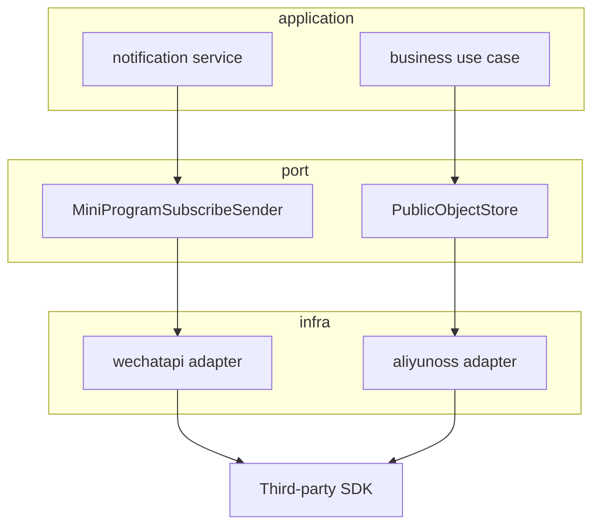

# External Integration Adapter 整体架构

**本文回答**：外部集成如何按 port/adapter 隔离第三方 SDK、缓存、错误语义和配置，让业务应用服务只依赖稳定接口。

## 30 秒结论

| 维度 | 结论 |
| ---- | ---- |
| 主要问题 | WeChat、OSS、IAM 等外部系统的 SDK 和错误语义不可控 |
| 设计选择 | application 定义用例语义，infra adapter 封装 SDK |
| 测试策略 | 能本地验证的 validation/cache/URL/模板组装先 contract test，真实网络调用不进单测 |
| 取舍 | 不做通用 integration framework，避免为了统一而抹平不同 SDK 语义 |

## 主图



## 设计模式应用

| 模式 | 使用点 | 为什么 |
| ---- | ------ | ------ |
| Adapter | `infra/wechatapi`、`infra/objectstorage` | 隔离第三方 SDK 类型和错误 |
| Port Interface | `infra/wechatapi/port`、`objectstorage/port` | application 只依赖业务需要的窄接口 |
| Facade | notification service | 把 testee/plan/scale/IAM/WeChat 组合成一个通知用例 |

## 取舍与边界

- 外部 SDK 的真实网络调用不进入常规单元测试，避免 flaky。
- Adapter contract test 优先覆盖输入校验、缓存 key、模板组装、错误包装。
- 外部系统不可用时是否降级由应用服务明确处理，adapter 不私自吞错误。

## 代码锚点

| 能力 | 锚点 |
| ---- | ---- |
| WeChat adapter | [wechatapi](../../../internal/apiserver/infra/wechatapi) |
| Object storage adapter | [objectstorage](../../../internal/apiserver/infra/objectstorage) |
| Notification service | [task_opened_service.go](../../../internal/apiserver/application/notification/task_opened_service.go) |

## Verify

```bash
go test ./internal/apiserver/infra/wechatapi ./internal/apiserver/infra/objectstorage/... ./internal/apiserver/application/notification
```
