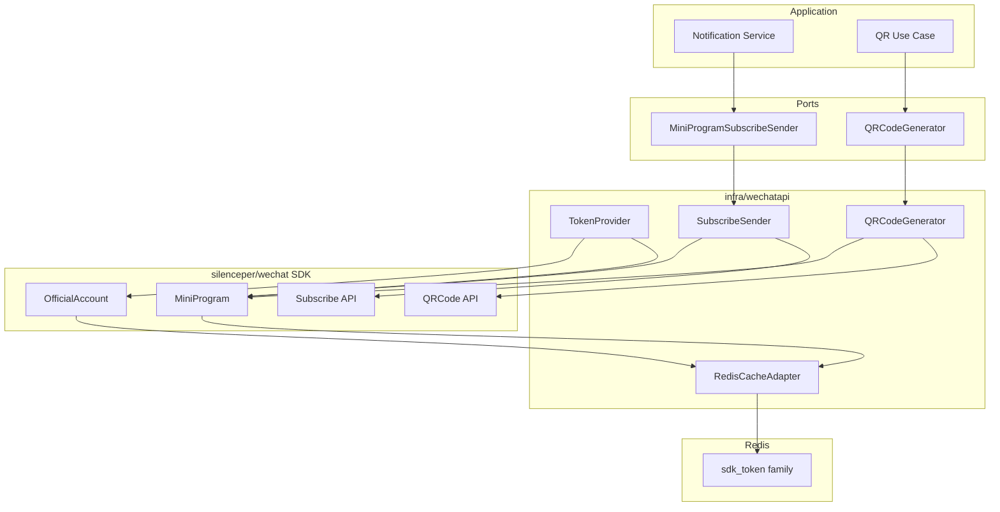

# WeChat 适配器

**本文回答**：qs-server 如何把 WeChat token、SDK cache、小程序码、订阅消息接口封装为 adapter；为什么业务层不能直接依赖 `silenceper/wechat` SDK；当前 `SubscribeSender.SendSubscribeMessage` 的真实发送逻辑为什么必须如实标记为 seam。

---

## 30 秒结论

| 维度 | 结论 |
| ---- | ---- |
| 核心目的 | 隔离 WeChat SDK、appID/appSecret、access_token cache、QR/subscribe API 错误语义 |
| Port | `wechatmini.QRCodeGenerator`、`wechatmini.MiniProgramSubscribeSender` |
| Adapter | `TokenProvider`、`QRCodeGenerator`、`SubscribeSender`、`RedisCacheAdapter` |
| SDK | `github.com/silenceper/wechat/v2` |
| SDK Cache | `RedisCacheAdapter` 适配 WeChat SDK `cache.Cache`，Redis key 通过 `BuildWeChatCacheKey`，family 观测为 `sdk_token` |
| Token | 支持 mini program token 与 official account token，默认 expiresIn 7200 秒 |
| QR | 支持有限量 QR code 和 unlimited QR code；unlimited 会 normalize page 并处理 41030 invalid page |
| Subscribe | `ListTemplates` 已调用 SDK；`SendSubscribeMessage` 当前真实发送逻辑被注释，函数直接返回 nil |
| 测试边界 | 单测只覆盖 validation、cache key、接口封装；不调用真实微信网络 |
| 风险提示 | 文档和上层服务不能把当前 SubscribeSender 当成真实线上发送完成能力 |

一句话概括：

> **WeChat adapter 当前已经封装 token/cache/QR/ListTemplates，但 subscribe send 仍是 seam，不能在文档里伪装成已完整发送。**

---

## 1. WeChat 适配器总图



---

## 2. Port 定义

`internal/apiserver/port/wechatmini/wechatmini.go` 定义应用层窄 port。

### 2.1 QRCodeGenerator

```go
GenerateQRCode(ctx, appID, appSecret, path, width)
GenerateUnlimitedQRCode(ctx, appID, appSecret, scene, page, width, autoColor, lineColor, isHyaline)
```

### 2.2 SubscribeMessage

字段：

| 字段 | 说明 |
| ---- | ---- |
| ToUser | openid |
| TemplateID | 小程序订阅模板 ID |
| Page | 跳转页面 |
| MiniProgramState | formal/trial/developer |
| Lang | zh_CN 等 |
| Data | 模板数据 key -> value |

### 2.3 MiniProgramSubscribeSender

```go
SendSubscribeMessage(ctx, appID, appSecret, msg)
ListTemplates(ctx, appID, appSecret)
```

### 2.4 infra/wechatapi/port

`infra/wechatapi/port/port.go` 只是 type alias 到 `port/wechatmini`，用于兼容 infra 侧引用。

---

## 3. RedisCacheAdapter

`RedisCacheAdapter` 把 Redis client 适配为 WeChat SDK 的 `cache.Cache`。

### 3.1 构造

```go
NewRedisCacheAdapterWithBuilder(client,builder)
NewRedisCacheAdapterWithBuilderAndObserver(client,builder,observer)
```

行为：

| 条件 | 行为 |
| ---- | ---- |
| client nil | 返回 SDK memory cache |
| builder nil | panic |
| observer nil | 使用全局 observability fallback |

### 3.2 Key

`buildKey(key)`：

```text
keys.BuildWeChatCacheKey(key)
```

这保证 WeChat SDK cache key 使用 Redis keyspace namespace，而不是裸 key。

### 3.3 Get / Set / IsExist / Delete

| 方法 | 行为 |
| ---- | ---- |
| Get | Redis GET，redis.Nil 返回 nil |
| Set | value 转 string 后 Redis SET timeout |
| IsExist | Redis EXISTS |
| Delete | Redis DEL |

### 3.4 Observability

成功：

```text
ObserveFamilySuccess("sdk_token")
```

失败：

```text
ObserveFamilyFailure("sdk_token", err)
```

WeChat token cache 属于 SDK token runtime 能力，不是业务 ObjectCache。

---

## 4. TokenProvider

`TokenProvider` 封装 WeChat access_token 获取。

### 4.1 MiniProgram Token

`FetchMiniProgramToken(ctx, appID, appSecret)`：

1. appID/appSecret 不能为空。
2. 创建 WeChat MiniProgram client。
3. 调 SDK `GetAccessToken()`。
4. 返回：
   - Token。
   - ExpiresAt = now + expiresIn。
5. 当前 expiresIn 固定按 7200 秒处理。

### 4.2 OfficialAccount Token

`FetchOfficialAccountToken(ctx, appID, appSecret)` 类似，只是使用 OfficialAccount client。

### 4.3 错误语义

| 场景 | 错误 |
| ---- | ---- |
| appID/appSecret 空 | `appID and appSecret cannot be empty` |
| SDK token 获取失败 | 包装为 `failed to get ... access token` |

---

## 5. QRCodeGenerator

### 5.1 GenerateQRCode

适用于数量较少的小程序码。

输入：

```text
appID
appSecret
path
width
```

校验：

- appID/appSecret 非空。
- path 非空。
- width <= 0 时默认 430。

调用：

```text
miniProgram.GetQRCode().GetWXACode(QRCoder{Path,Width})
```

返回：

```text
io.Reader(bytes.NewReader(response))
```

### 5.2 GenerateUnlimitedQRCode

适用于大量生成。

输入：

```text
scene
page
width
autoColor
lineColor
isHyaline
```

校验：

- appID/appSecret 非空。
- scene 非空。
- page 非空。
- width <= 0 默认 430。

页面路径处理：

```text
strings.TrimPrefix(page, "/")
```

如果原 page 以 `/` 开头，会记录 warning。

### 5.3 41030 invalid page

如果微信返回错误包含：

```text
41030
invalid page
```

adapter 返回更可读错误：

```text
页面路径无效 (errcode=41030): {page}
```

并给出检查提示：

- 页面路径是否在 app.json 注册。
- 小程序是否已发布。
- 页面路径格式是否正确，不应以 `/` 开头。

---

## 6. SubscribeSender

### 6.1 ListTemplates

`ListTemplates(ctx, appID, appSecret)`：

1. 创建 subscribe client。
2. 调 SDK `ListTemplates()`。
3. 转换为 `wechatmini.SubscribeTemplate`：
   - ID。
   - Title。
   - Content。

### 6.2 SendSubscribeMessage 当前状态

当前代码中真实发送逻辑被注释：

```go
// subscribeClient, err := ...
// req := &miniSubscribe.Message{...}
// subscribeClient.Send(req)
return nil
```

所以它当前语义是：

```text
接口存在；
输入没有实际校验；
不会调用真实 WeChat Send；
永远返回 nil。
```

这是非常重要的事实。

### 6.3 文档边界

因此：

- 不能说当前已经完成真实订阅消息发送。
- Notification service 中 sent_count 增加，当前在真实 adapter 下不代表 WeChat 已实际收到。
- 如果要上线真实发送，必须恢复代码、补 contract/integration tests、确认错误语义。

---

## 7. 当前发送 seam 的风险

| 风险 | 说明 |
| ---- | ---- |
| 上层误以为已发送 | Notification result 可能显示 sent |
| 监控误判 | delivered 日志不代表微信侧成功 |
| 测试过绿 | mock-friendly seam 掩盖真实 API 风险 |
| 线上漏通知 | 如果未恢复发送逻辑，用户收不到订阅消息 |
| 错误语义缺失 | 无法观察 WeChat send error |

后续恢复真实发送前，应至少补：

- appID/appSecret 校验。
- openID/templateID 校验。
- data item 转换。
- SDK Send 调用。
- WeChat error wrapping。
- fake sender tests。
- 可选 integration test。

---

## 8. WeChat 与 Redis Cache 边界

| 缓存 | 说明 |
| ---- | ---- |
| SDK token cache | WeChat SDK access_token 缓存，属于 sdk_token family |
| ObjectCache | 业务对象缓存，例如 scale/questionnaire |
| QueryCache | 查询结果缓存 |
| Hotset | 预热热点治理 |

WeChat token cache 不应进入业务 ObjectCache / QueryCache。

---

## 9. 配置与凭据边界

WeChat adapter 需要：

- appID。
- appSecret。
- SDK cache。
- templateID。
- page path。

Notification service 可以通过：

1. IAM WeChatAppConfigProvider 获取 appID/appSecret。
2. fallback 使用本地 config AppID/AppSecret。

不得记录 appSecret / access_token。

---

## 10. 设计模式与取舍

| 模式 | 当前实现 | 意图 |
| ---- | -------- | ---- |
| Port Interface | wechatmini | application 不依赖 SDK |
| Adapter | infra/wechatapi | SDK 封装 |
| SDK Cache Adapter | RedisCacheAdapter | 接入 Redis namespace |
| Facade | TokenProvider / QR / SubscribeSender | 简化业务调用 |
| Seam | SendSubscribeMessage no-op | 保留接口，待真实发送落地 |
| Contract Testing | cache/validation tests | 避免真实网络单测 |

---

## 11. 常见误区

### 11.1 “SubscribeSender 已经真实发送微信消息”

不准确。当前发送逻辑注释，函数直接返回 nil。

### 11.2 “WeChat token cache 是业务缓存”

不是。它是 SDK token cache，属于 external adapter runtime。

### 11.3 “微信 API 错误可以在 domain 中处理”

不建议。应在 adapter/application 层转换为业务可理解错误。

### 11.4 “小程序 page 可以随便带 /”

unlimited QR 会去掉开头 `/`，但微信仍要求页面在 app.json 中注册。

### 11.5 “单测应该真实调用微信”

不应该。真实网络调用应放 integration/e2e，常规单测只测本地 contract。

---

## 12. 排障路径

### 12.1 access_token 获取失败

检查：

1. appID/appSecret。
2. SDK cache 是否可用。
3. Redis sdk_token family。
4. WeChat SDK 错误。
5. 官方平台配置。

### 12.2 QR code 生成失败

检查：

1. appID/appSecret。
2. path/page。
3. scene。
4. width。
5. 是否 41030 invalid page。
6. 小程序是否已发布。
7. 页面是否在 app.json 中注册。

### 12.3 ListTemplates 失败

检查：

1. appID/appSecret。
2. token cache。
3. WeChat API 权限。
4. 网络。
5. 模板是否存在。

### 12.4 用户未收到订阅消息

优先确认：

```text
当前 SubscribeSender 是否已恢复真实 Send 调用
```

如果仍是 no-op seam，用户不会收到真实微信消息。

---

## 13. 修改指南

### 13.1 恢复真实 SendSubscribeMessage

必须：

1. 恢复 newSubscribeClient。
2. 校验 appID/appSecret。
3. 校验 ToUser/TemplateID。
4. 转换 DataItem。
5. 调 SDK Send。
6. 包装 WeChat 错误。
7. 补 adapter tests。
8. 补 notification tests。
9. 更新本文档状态。
10. 配置灰度与回滚。

### 13.2 新增 WeChat API

必须：

1. 先定义应用需要的 port。
2. adapter 内部封装 SDK。
3. 不返回 SDK 类型。
4. 使用 SDK cache。
5. 处理 credential。
6. 补 validation/error tests。
7. 更新文档。

---

## 14. 代码锚点

- WeChat port：[../../../internal/apiserver/port/wechatmini/wechatmini.go](../../../internal/apiserver/port/wechatmini/wechatmini.go)
- Infra port alias：[../../../internal/apiserver/infra/wechatapi/port/port.go](../../../internal/apiserver/infra/wechatapi/port/port.go)
- Redis cache adapter：[../../../internal/apiserver/infra/wechatapi/cache_adapter.go](../../../internal/apiserver/infra/wechatapi/cache_adapter.go)
- TokenProvider：[../../../internal/apiserver/infra/wechatapi/token-provider.go](../../../internal/apiserver/infra/wechatapi/token-provider.go)
- QRCodeGenerator：[../../../internal/apiserver/infra/wechatapi/qrcode-generator.go](../../../internal/apiserver/infra/wechatapi/qrcode-generator.go)
- SubscribeSender：[../../../internal/apiserver/infra/wechatapi/subscribe_sender.go](../../../internal/apiserver/infra/wechatapi/subscribe_sender.go)

---

## 15. Verify

```bash
go test ./internal/apiserver/infra/wechatapi
```

如果恢复真实发送：

```bash
go test ./internal/apiserver/application/notification
```

如果修改文档：

```bash
make docs-hygiene
git diff --check
```

---

## 16. 下一跳

| 目标 | 文档 |
| ---- | ---- |
| Notification 应用服务 | [03-Notification应用服务.md](./03-Notification应用服务.md) |
| 新增外部集成 SOP | [04-新增外部集成SOP.md](./04-新增外部集成SOP.md) |
| 整体架构 | [00-整体架构.md](./00-整体架构.md) |
