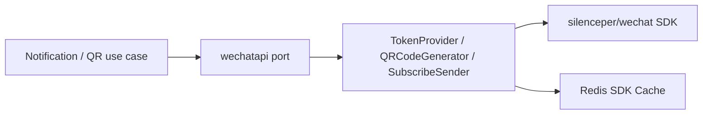

# WeChat 适配器

**本文回答**：WeChat token、二维码、小程序订阅消息如何被封装为 adapter，为什么不能让业务层直接依赖 `silenceper/wechat` SDK。

## 30 秒结论

| 维度 | 结论 |
| ---- | ---- |
| 解决问题 | WeChat SDK 需要 appID/secret、token cache、不同 API client，错误语义不适合进入业务层 |
| 核心代码 | `TokenProvider`、`QRCodeGenerator`、`SubscribeSender`、Redis cache adapter |
| 设计模式 | Adapter + Port Interface |
| 当前边界 | 单测只覆盖本地可确定的 validation/cache/封装，不做真实微信调用 |

## 主图



## 架构设计

| 能力 | 代码锚点 | 说明 |
| ---- | -------- | ---- |
| token | [token-provider.go](../../../internal/apiserver/infra/wechatapi/token-provider.go) | 封装 access token 获取 |
| QR code | [qrcode-generator.go](../../../internal/apiserver/infra/wechatapi/qrcode-generator.go) | 封装小程序码 API |
| subscribe | [subscribe_sender.go](../../../internal/apiserver/infra/wechatapi/subscribe_sender.go) | 封装订阅消息发送 |
| cache | [cache_adapter.go](../../../internal/apiserver/infra/wechatapi/cache_adapter.go) | SDK cache 使用 Redis namespace |

## 为什么这样设计

WeChat SDK 的对象模型围绕 SDK client，而业务需要的是“发订阅消息”“生成二维码”。通过 port/adapter，业务层只关心业务动作，配置、token、SDK cache、错误包装留在 infra。

## 取舍与边界

- 当前不在单测里触发真实 WeChat API。
- token 缓存属于 SDK cache，不是业务缓存治理。
- 模板内容校验由 notification application service 做，adapter 只负责发送。

## 代码锚点与测试锚点

| 能力 | 锚点 |
| ---- | ---- |
| Redis cache key contract | [cache_adapter_test.go](../../../internal/apiserver/infra/wechatapi/cache_adapter_test.go) |
| Adapter validation contract | [adapter_contract_test.go](../../../internal/apiserver/infra/wechatapi/adapter_contract_test.go) |

## Verify

```bash
go test ./internal/apiserver/infra/wechatapi
```
