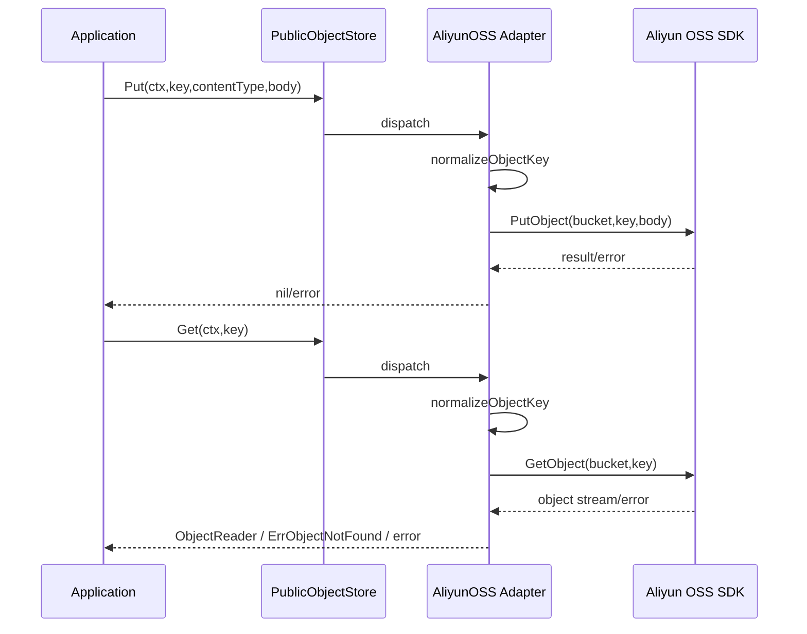

# ObjectStorage 适配器

**本文回答**：qs-server 如何通过 `PublicObjectStore` port 隔离 Aliyun OSS SDK；对象 key 如何规范化；Put/Get 如何处理 content type、cache-control、not found；为什么当前不提供 list/delete/presign 等通用文件管理能力。

---

## 30 秒结论

| 维度 | 结论 |
| ---- | ---- |
| Port | `objectstorage/port.PublicObjectStore` 只定义 `Put` / `Get` |
| Adapter | `objectstorage/aliyunoss.publicObjectStore` 封装 Aliyun OSS SDK v2 |
| 用途 | 当前主要承接二维码等公开对象上传/读取 |
| Key 规则 | `normalizeObjectKey` 会 trim 空格和前后 `/`，空 key 返回错误 |
| Put | 上传 object，设置 content type、content length，可设置 cache-control |
| Get | 打开 object stream，404 / NoSuchKey / NoSuchBucket 映射为 `ErrObjectNotFound` |
| Credential | 优先使用 static access key；否则从环境变量加载 |
| 当前边界 | 不提供 list/delete/presign；不是通用文件管理服务 |
| 测试重点 | key normalization、not found mapping、config validation、本地 contract |

一句话概括：

> **ObjectStorage adapter 只把业务需要的公开对象 Put/Get 暴露为 port，不把 OSS SDK、bucket、endpoint、credential 泄漏到 application。**

---

## 1. 为什么需要 ObjectStorage Port

OSS SDK 涉及：

- endpoint。
- region。
- bucket。
- access key。
- session token。
- internal endpoint。
- CNAME。
- timeout。
- retry。
- object key。
- SDK error。

这些都不应该进入 application/domain。

application 只需要：

```text
把某个对象按 key 上传；
按 key 读取某个公开对象。
```

所以定义 `PublicObjectStore`。

---

## 2. 架构图



---

## 3. Port 定义

`PublicObjectStore`：

```go
Put(ctx context.Context, key string, contentType string, body []byte) error
Get(ctx context.Context, key string) (*ObjectReader, error)
```

`ObjectReader`：

| 字段 | 说明 |
| ---- | ---- |
| Body | io.ReadCloser |
| ContentType | object content type |
| ContentLength | content length |
| CacheControl | cache-control |

错误：

```go
ErrObjectNotFound
```

---

## 4. Aliyun OSS Adapter

### 4.1 NewPublicObjectStore

输入：

```text
options.OSSOptions
```

会配置：

- Region。
- Endpoint。
- ConnectTimeout。
- ReadWriteTimeout。
- RetryMaxAttempts。
- UseInternalEndpoint。
- UseCName。
- CredentialsProvider。
- Bucket。
- CacheControl。

### 4.2 Credential

优先级：

1. AccessKeyID + AccessKeySecret。
2. 如果有 SessionToken，使用三元 static credentials。
3. 否则使用环境变量 credential provider。
4. 环境变量 credential 获取失败则初始化失败。

### 4.3 初始化失败

| 场景 | 行为 |
| ---- | ---- |
| opts nil | error: oss options are required |
| credentials 缺失且环境不可用 | error |
| SDK client config error | error |

---

## 5. Object Key Normalization

`normalizeObjectKey(key)`：

1. `strings.TrimSpace(key)`。
2. 去掉前后 `/`。
3. 如果结果为空，返回 error。
4. 否则返回 normalized key。

### 5.1 示例

| 输入 | 输出 |
| ---- | ---- |
| ` qrcode/a.png ` | `qrcode/a.png` |
| `/qrcode/a.png` | `qrcode/a.png` |
| `qrcode/a.png/` | `qrcode/a.png` |
| `/` | error |
| `` | error |

### 5.2 为什么要 normalize

- 避免同一对象有多种 key。
- 避免业务层关心 OSS path 细节。
- 防止空 key 上传到根。
- 让测试可固定 object key contract。

---

## 6. Put

`Put(ctx,key,contentType,body)`：

1. normalize key。
2. 构建 PutObjectRequest：
   - Bucket。
   - Key。
   - Body。
   - ContentType。
   - ContentLength。
3. 如果 cacheControl 非空，设置 CacheControl。
4. 调 OSS PutObject。
5. 失败则记录日志并包装错误。

### 6.1 日志字段

当前日志包含：

- action = upload_qrcode_oss。
- bucket。
- object_key。
- error。

注意：如果 object_key 可能包含敏感信息，后续应评估脱敏。

---

## 7. Get

`Get(ctx,key)`：

1. normalize key。
2. 构建 GetObjectRequest。
3. 调 OSS GetObject。
4. 如果 not found，返回 `ErrObjectNotFound`。
5. 其它错误记录日志并包装。
6. 成功返回 ObjectReader。

### 7.1 Not Found 映射

`isObjectNotFound(err)` 判断：

- StatusCode == 404。
- Code == `NoSuchKey`。
- Code == `NoSuchBucket`。

这些都映射为：

```text
objectstorageport.ErrObjectNotFound
```

### 7.2 ContentType fallback

如果 OSS result.ContentType 为空，则默认：

```text
image/png
```

---

## 8. 当前边界

当前 PublicObjectStore 不提供：

- List。
- Delete。
- Presign URL。
- Multipart upload。
- Private ACL。
- Metadata update。
- Object copy。
- Bucket management。
- Generic file management API。

如果未来需要，必须先明确业务用例，不要把 OSS SDK 全量暴露出去。

---

## 9. 与 WeChat QR 的关系

二维码生成可能走：

```text
WeChat QRCodeGenerator
  -> io.Reader / bytes
  -> PublicObjectStore.Put
  -> public object URL / key
```

ObjectStorage 不关心二维码如何生成，也不关心二维码业务含义。

它只负责对象存取。

---

## 10. 设计模式与取舍

| 模式 | 当前实现 | 意图 |
| ---- | -------- | ---- |
| Port Interface | PublicObjectStore | 应用层不依赖 OSS SDK |
| Adapter | aliyunoss | 封装 credential/client/error |
| Error Mapping | ErrObjectNotFound | 统一 not found 语义 |
| Key Normalization | normalizeObjectKey | 稳定 object key |
| Minimal Surface | Put/Get only | 避免通用文件服务膨胀 |

---

## 11. 常见误区

### 11.1 “ObjectStorage 就是文件管理系统”

不是。当前只是 public object store 的 Put/Get port。

### 11.2 “业务层可以自己拼 OSS SDK 请求”

不应。业务层只通过 port 调用。

### 11.3 “NoSuchBucket 应该暴露给业务”

当前映射为 ErrObjectNotFound，业务无需知道 OSS bucket 细节。

### 11.4 “object key 不需要规范化”

需要。否则同一对象可能有多个等价 key。

### 11.5 “Get 返回 nil body 可以不关闭”

错误。调用方拿到 ObjectReader 后负责关闭 Body。

---

## 12. 排障路径

### 12.1 Put 失败

检查：

1. OSS options 是否存在。
2. credentials。
3. endpoint / region。
4. bucket。
5. object key。
6. content type。
7. network / timeout。
8. OSS 权限。

### 12.2 Get 返回 ErrObjectNotFound

检查：

1. key normalization 后的 key。
2. bucket。
3. object 是否存在。
4. 是否上传到另一个 prefix。
5. NoSuchBucket。
6. 环境配置。

### 12.3 初始化失败

检查：

1. AccessKeyID/Secret。
2. SessionToken。
3. 环境变量 credentials。
4. Region / Endpoint。
5. SDK config。

---

## 13. 修改指南

### 13.1 新增 Delete

必须：

1. 明确业务用例。
2. 扩展 port。
3. adapter 实现 DeleteObject。
4. 定义 not found 是否算成功。
5. 补 tests。
6. 更新文档。

### 13.2 新增 Presign

必须：

1. 明确 public/private。
2. 明确过期时间。
3. 明确权限和安全风险。
4. 不把 secret 暴露给前端。
5. 补 tests/docs。

### 13.3 新增其它对象存储厂商

必须：

1. 复用 PublicObjectStore port，如语义一致。
2. 单独 adapter 包。
3. 错误映射保持一致。
4. 不让 application 知道厂商差异。
5. 补 contract tests。

---

## 14. 代码锚点

- Object storage port：[../../../internal/apiserver/infra/objectstorage/port/storage.go](../../../internal/apiserver/infra/objectstorage/port/storage.go)
- Aliyun OSS adapter：[../../../internal/apiserver/infra/objectstorage/aliyunoss/store.go](../../../internal/apiserver/infra/objectstorage/aliyunoss/store.go)
- OSS options：[../../../internal/pkg/options](../../../internal/pkg/options)

---

## 15. Verify

```bash
go test ./internal/apiserver/infra/objectstorage/...
```

如果修改文档：

```bash
make docs-hygiene
git diff --check
```

---

## 16. 下一跳

| 目标 | 文档 |
| ---- | ---- |
| WeChat 适配器 | [01-WeChat适配器.md](./01-WeChat适配器.md) |
| Notification 应用服务 | [03-Notification应用服务.md](./03-Notification应用服务.md) |
| 新增外部集成 SOP | [04-新增外部集成SOP.md](./04-新增外部集成SOP.md) |
| 整体架构 | [00-整体架构.md](./00-整体架构.md) |
