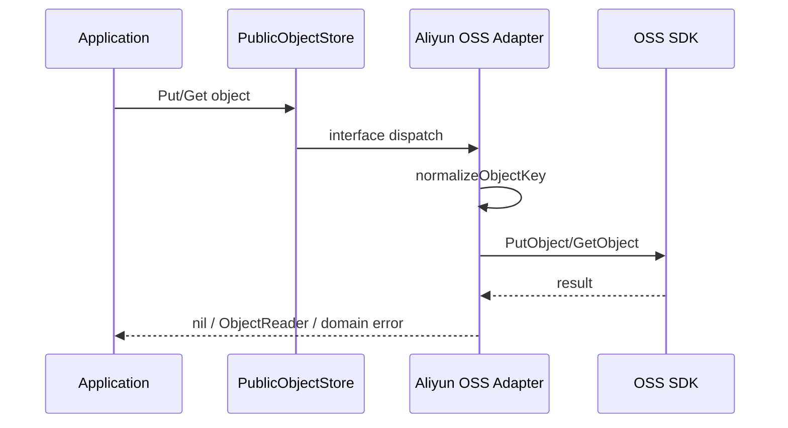

# ObjectStorage 适配器

**本文回答**：对象存储如何通过 `PublicObjectStore` port 隔离 OSS SDK，并服务二维码等公开对象上传/读取。

## 30 秒结论

| 维度 | 结论 |
| ---- | ---- |
| 解决问题 | OSS SDK credential、endpoint、bucket、object key 规则不能泄漏给业务层 |
| 核心代码 | `objectstorage/port` 与 `aliyunoss` adapter |
| 设计模式 | Port + Adapter |
| 当前边界 | 不提供通用文件管理治理 API；只承接应用需要的 put/get |

## 主图



## 架构设计

| 层 | 职责 |
| ---- | ---- |
| port | 定义 `Put`、`Get` 和 `ErrObjectNotFound` |
| aliyunoss adapter | credential、endpoint、bucket、key normalization、错误包装 |
| application | 决定对象 key、内容类型和业务用途 |

## 取舍与边界

- Adapter 会将 404 / NoSuchKey 映射为 `ErrObjectNotFound`。
- 当前不提供 list/delete/presign 治理能力；新增前必须先明确业务用例。
- object key normalization 是本地 contract，可单测保护。

## 代码锚点与测试锚点

| 能力 | 锚点 |
| ---- | ---- |
| Port | [storage.go](../../../internal/apiserver/infra/objectstorage/port/storage.go) |
| OSS adapter | [store.go](../../../internal/apiserver/infra/objectstorage/aliyunoss/store.go) |
| Key contract test | [store_test.go](../../../internal/apiserver/infra/objectstorage/aliyunoss/store_test.go) |

## Verify

```bash
go test ./internal/apiserver/infra/objectstorage/...
```
