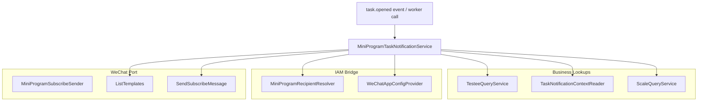
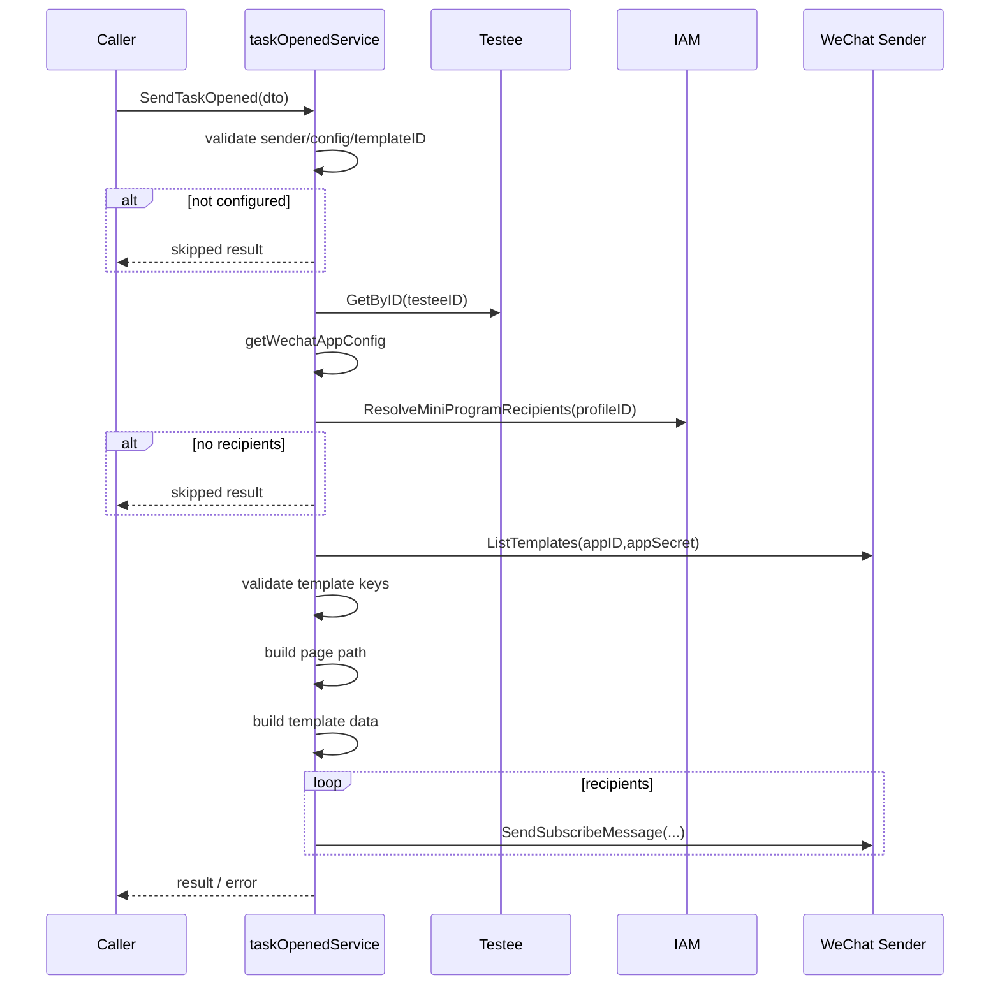

# Notification 应用服务

**本文回答**：`task.opened` 小程序通知如何组合 Testee、Plan、Scale、IAM recipient resolver、WeChat app config 和 WeChat subscribe sender；为什么它属于 application service，而不是 Plan/Task 聚合方法；通知 skipped、partial、failed 的语义是什么；当前 WeChat SubscribeSender seam 对发送结果有什么影响。

---

## 30 秒结论

| 维度 | 结论 |
| ---- | ---- |
| 模块定位 | Notification 是跨模块应用服务，编排 Testee、Plan、Scale、IAM、WeChat adapter |
| 核心服务 | `NewMiniProgramTaskNotificationService` 创建 `taskOpenedService` |
| 入口 DTO | `TaskOpenedDTO`，通常由 worker/event handler 传入 |
| 输出结果 | `TaskOpenedResult`，区分 skipped、sent_count、recipient_source、message |
| 配置来源 | 可从 IAM WeChatAppConfigProvider 按 WeChatAppID 解析 appID/appSecret，也可 fallback 到本地 AppID/AppSecret |
| 收件人解析 | 根据 Testee.ProfileID 通过 IAM bridge MiniProgramRecipientResolver 获取 openids 与 source |
| 模板校验 | 通过 ListTemplates 拉模板列表，提取模板 keys，与 expected spec 对比 |
| 模板数据 | planName、planDate、planProgress、warmPrompt 映射到模板 key |
| 失败语义 | 无配置/无模板/无收件人可 skipped；全部发送失败返回 error；部分失败返回 result.Message |
| 重要风险 | 当前真实 WeChat `SendSubscribeMessage` adapter 是 no-op seam，因此 service 的 sent_count 不代表微信真实送达 |
| 边界 | 通知失败不直接修改 Task 状态；重试/补偿应由 event/worker/通知策略设计 |

一句话概括：

> **Notification 应用服务负责“准备并尝试发送通知”，不负责改变任务状态，也不保证微信侧真实送达。**

---

## 1. 为什么 Notification 是应用服务

`task.opened` 通知需要跨多个模块：

```text
Task / Plan 上下文
Testee
Scale
IAM Profile / Recipient
IAM WeChat App Config
WeChat MiniProgram Subscribe
```

如果把通知逻辑放进 Plan 聚合，会导致：

- 聚合依赖外部 SDK。
- 聚合需要知道 WeChat 模板。
- 聚合处理 openid 和 appSecret。
- 领域层被外部系统污染。
- 测试复杂化。

所以通知应作为 application service：

```text
读取业务数据
  -> 解析收件人
  -> 组装模板
  -> 调用外部 adapter
  -> 返回发送结果
```

---

## 2. 主图



---

## 3. 核心依赖

`taskOpenedService` 字段：

| 字段 | 说明 |
| ---- | ---- |
| testeeQueryService | 查询 Testee / ProfileID |
| taskContextReader | 查询任务通知上下文 |
| scaleQueryService | 查询 Scale 标题 |
| recipientResolver | 通过 IAM bridge 解析小程序 openid |
| wechatAppService | 通过 IAM bridge 解析 WeChat app config |
| sender | MiniProgramSubscribeSender |
| config | 小程序通知配置 |
| templateCache | appID + templateID -> templateSpec |

---

## 4. Config

`notification.Config` 字段：

| 字段 | 说明 |
| ---- | ---- |
| WeChatAppID | IAM 中配置的 WeChat app 标识 |
| PagePath | 小程序跳转页面路径 |
| AppID | 本地 fallback appID |
| AppSecret | 本地 fallback appSecret |
| TaskOpenedTemplateID | task.opened 订阅消息模板 ID |

### 4.1 WeChat app config 解析

`getWechatAppConfig(ctx)`：

1. 如果配置了 WeChatAppID，且 wechatAppService enabled：
   - 调 IAM `ResolveWeChatAppConfig`。
   - 要求 resp.AppID / resp.AppSecret 非空。
2. 否则如果本地 AppID/AppSecret 非空：
   - 使用本地配置。
3. 否则返回：
   - `wechat mini program config is missing`。

---

## 5. SendTaskOpened 主流程



---

## 6. Skipped 语义

### 6.1 notifier not configured

如果：

```text
s == nil
sender == nil
config == nil
```

返回：

```text
Skipped=true
Message="mini program notifier not configured"
```

### 6.2 template id missing

如果 TaskOpenedTemplateID 为空：

```text
Skipped=true
Message="task opened template id not configured"
```

### 6.3 no recipients

如果未解析到 openid：

```text
Skipped=true
Message="no mini program recipients resolved"
```

Skipped 不是 error，表示当前通知无法发送但不应阻断任务主流程。

---

## 7. 收件人解析

`resolveRecipients(ctx,testeeResult)`：

1. testee nil 或 ProfileID nil -> nil。
2. recipientResolver nil 或 disabled -> nil。
3. 调：

```text
ResolveMiniProgramRecipients(ctx, profileID)
```

4. 返回：
   - OpenIDs。
   - Source。

### 7.1 recipient source

Source 用于解释 openid 来源，例如：

- direct user。
- guardian。
- profile relation。
- IAM bridge resolver。

具体 source 以 IAM bridge 返回为准。

---

## 8. 模板校验

### 8.1 loadTemplateSpec

流程：

1. 根据 templateID 得到 expected spec。
2. 从 templateCache 查 appID:templateID。
3. 未命中则调用 sender.ListTemplates。
4. 找到对应 template。
5. 用正则提取 `{{thing5.DATA}}` 这类 key。
6. 与 expected keys 对比。
7. 匹配则缓存 spec。
8. 不匹配返回 error。

### 8.2 当前 expected keys

task.opened 模板期望：

```text
thing5
date1
character_string2
thing3
```

对应：

| key | 数据 |
| --- | ---- |
| thing5 | planName |
| date1 | planDate |
| character_string2 | planProgress |
| thing3 | warmPrompt |

### 8.3 为什么要校验模板 key

微信模板字段如果不匹配，静默发送会出现：

- 字段错位。
- 用户收到错误文案。
- 发送失败难排查。

所以模板 key mismatch 返回 error。

---

## 9. 模板数据

`resolveTaskOpenedTemplateData(ctx,dto)` 默认：

| 字段 | 默认 |
| ---- | ---- |
| planName | `测评计划` |
| planDate | dto.OpenAt 或当前日期 |
| planProgress | `1/1` |
| warmPrompt | `请及时完成本次测评任务` |

如果能读取 taskContext：

- PlannedAt 覆盖 planDate。
- Seq/TotalTimes 生成 progress。
- ScaleCode 查 Scale title，作为 planName。
- UnfinishedSameDayTaskCount 生成 warmPrompt。

### 9.1 warm prompt

如果 count <= 0：

```text
请及时完成本次测评任务
```

否则：

```text
今天有 {count} 个任务未完成
```

---

## 10. PagePath 构造

`buildPagePath(entryURL)`：

1. 基础 pagePath 来自 config.PagePath。
2. 解析 entryURL。
3. 只提取 query 中的：
   - token。
   - task_id。
4. 拼到 pagePath 后。

这避免把 entryURL 中其它无关参数透传到小程序页面。

---

## 11. 发送结果语义

### 11.1 全部成功

返回：

```text
SentCount = len(recipients)
Message empty
```

### 11.2 部分失败

如果部分 openID 发送失败：

```text
SentCount = success count
Message = "partial delivery: ..."
return result, nil
```

这说明通知主动作部分成功，不作为整体 error。

### 11.3 全部失败

如果 sent == 0：

```text
return result, error
```

### 11.4 当前 adapter seam 的影响

由于 `SubscribeSender.SendSubscribeMessage` 当前直接返回 nil：

```text
sent_count 会增加；
日志会显示 delivered；
但不代表真实微信发送。
```

这必须在上线真实通知前修复。

---

## 12. Notification 与 Task 状态边界

通知服务不修改 task 状态。

| 动作 | 归属 |
| ---- | ---- |
| task opened | Plan/Task lifecycle |
| task.opened event | Event system |
| 发送小程序通知 | Notification application service |
| 发送失败是否重试 | Worker/Event/Notification policy |
| task 是否完成 | Plan task 状态机 |

通知失败不应直接把 task 改成 failed。

---

## 13. 设计模式与取舍

| 模式 | 当前实现 | 意图 |
| ---- | -------- | ---- |
| Application Facade | taskOpenedService | 跨模块编排 |
| Port Interface | MiniProgramSubscribeSender | 隔离 WeChat SDK |
| Recipient Resolution | IAM bridge resolver | 隔离 Profile/OpenID 查找 |
| Template Spec | expected keys | 防模板错位 |
| Local Cache | sync.Map templateCache | 降低模板列表重复查询 |
| Best-effort Notification | skipped/partial | 不影响主任务状态 |

---

## 14. 常见误区

### 14.1 “通知服务属于 Plan 聚合”

不属于。它跨 Testee/IAM/WeChat/Scale，是应用服务。

### 14.2 “skipped 是 error”

不一定。无配置/无收件人属于可解释跳过。

### 14.3 “partial delivery 是失败”

不是整体失败。部分 openID 成功，结果 Message 描述失败项。

### 14.4 “sent_count 表示微信真实送达”

当前不成立，因为 SubscribeSender.SendSubscribeMessage 是 no-op seam。

### 14.5 “模板字段可以不校验”

不建议。字段错位会导致用户收到错误消息或发送失败。

---

## 15. 排障路径

### 15.1 通知 skipped

检查：

1. sender 是否配置。
2. config 是否 nil。
3. TaskOpenedTemplateID。
4. Testee.ProfileID。
5. recipientResolver 是否 enabled。
6. 是否解析到 openid。

### 15.2 wechat app config missing

检查：

1. WeChatAppID。
2. WeChatAppConfigProvider 是否 enabled。
3. IAM ResolveWeChatAppConfig。
4. fallback AppID/AppSecret。
5. appSecret 是否为空。

### 15.3 template not found / mismatch

检查：

1. templateID。
2. WeChat ListTemplates。
3. 模板内容 keys。
4. expected spec。
5. templateCache 是否旧。

### 15.4 用户未收到消息

第一步检查：

```text
SubscribeSender.SendSubscribeMessage 是否已恢复真实发送逻辑
```

如果仍是 no-op seam，用户不会收到真实微信消息。

---

## 16. 修改指南

### 16.1 新增通知类型

必须：

1. 定义 DTO。
2. 定义 result。
3. 定义模板 spec。
4. 定义 recipient resolver。
5. 定义 page path。
6. 定义 sender port。
7. 明确 skipped/partial/error。
8. 补 tests/docs。

### 16.2 恢复真实微信发送

必须同步修改：

- WeChat adapter。
- Notification tests。
- 日志语义。
- 错误处理。
- 发送失败重试策略。
- 生产配置。
- 文档风险说明。

---

## 17. 代码锚点

- Notification service：[../../../internal/apiserver/application/notification/task_opened_service.go](../../../internal/apiserver/application/notification/task_opened_service.go)
- WeChat port：[../../../internal/apiserver/port/wechatmini/wechatmini.go](../../../internal/apiserver/port/wechatmini/wechatmini.go)
- WeChat SubscribeSender：[../../../internal/apiserver/infra/wechatapi/subscribe_sender.go](../../../internal/apiserver/infra/wechatapi/subscribe_sender.go)

---

## 18. Verify

```bash
go test ./internal/apiserver/application/notification
go test ./internal/apiserver/infra/wechatapi
```

如果修改文档：

```bash
make docs-hygiene
git diff --check
```

---

## 19. 下一跳

| 目标 | 文档 |
| ---- | ---- |
| WeChat 适配器 | [01-WeChat适配器.md](./01-WeChat适配器.md) |
| 新增外部集成 SOP | [04-新增外部集成SOP.md](./04-新增外部集成SOP.md) |
| ObjectStorage 适配器 | [02-ObjectStorage适配器.md](./02-ObjectStorage适配器.md) |
| 整体架构 | [00-整体架构.md](./00-整体架构.md) |
