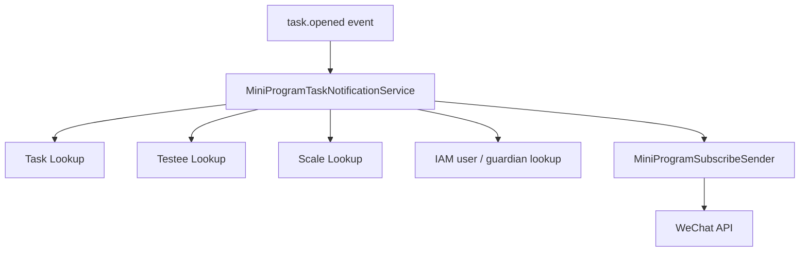

# Notification 应用服务

**本文回答**：`task.opened` 小程序通知如何组合 Testee、Plan、Scale、IAM 和 WeChat adapter，并把外部集成复杂度隔离在应用服务边界。

## 30 秒结论

| 维度 | 结论 |
| ---- | ---- |
| 解决问题 | 一个 task 通知需要查任务、计划、量表、接收人、模板并调用 WeChat |
| 核心代码 | `task_opened_service.go` |
| 设计模式 | Facade、Strategy-like recipient resolution、Adapter |
| 当前边界 | 通知失败不改变 task 状态；具体重试/补偿由事件和 worker 语义决定 |

## 主图



## 模型设计

| 模型 | 作用 |
| ---- | ---- |
| `TaskOpenedDTO` | worker/handler 传入的通知请求 |
| `TaskOpenedResult` | 发送结果摘要，区分 sent/skipped/partial |
| `templateSpec` | 从微信模板中提取必需字段 |
| `taskOpenedTemplateData` | 将计划、任务、量表转换为模板数据 |

## 为什么这样设计

通知是跨模块协作，不适合塞进 Plan 或 Actor 聚合。当前应用服务把“查资料、解析收件人、生成模板、调用 adapter”集中在一个用例中，聚合只保持自身状态。

## 取舍与边界

- 发送失败不会直接修改任务状态。
- 接收人解析优先 testee direct user，再 fallback guardian。
- 模板 key mismatch 会返回错误，避免静默发送字段错位消息。

## 代码锚点与测试锚点

| 能力 | 锚点 |
| ---- | ---- |
| 通知服务 | [task_opened_service.go](../../../internal/apiserver/application/notification/task_opened_service.go) |
| 通知 contract tests | [task_opened_service_test.go](../../../internal/apiserver/application/notification/task_opened_service_test.go) |
| WeChat port | [port.go](../../../internal/apiserver/infra/wechatapi/port/port.go) |

## Verify

```bash
go test ./internal/apiserver/application/notification
```
