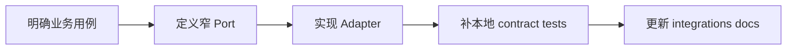

# 新增外部集成 SOP

**本文回答**：新增 SDK、Webhook、对象存储、第三方通知或外部查询时，如何避免让第三方模型污染业务层。

## 30 秒结论



## 操作清单

| 步骤 | 必做项 |
| ---- | ------ |
| 1. 定义用例 | 说明业务需要什么动作，而不是 SDK 有什么能力 |
| 2. 定义 port | application 只能依赖窄接口 |
| 3. 实现 adapter | SDK client、credential、timeout、cache、错误包装都留在 infra |
| 4. 补测试 | validation、cache key、请求组装、错误映射、fallback/skip 语义 |
| 5. 补观测 | 如需 metrics/status，label 必须 bounded，不包含 token、openid、secret |
| 6. 补文档 | 更新本目录对应深讲和业务模块入口 |

## 否定边界

- 不允许 domain import 第三方 SDK。
- 不允许把 token、secret、openid 写入 metrics label。
- 不允许 adapter 私自吞掉业务必须感知的失败。
- 不允许把真实网络调用写入常规单元测试。

## Verify

```bash
go test ./internal/apiserver/infra/wechatapi ./internal/apiserver/infra/objectstorage/... ./internal/apiserver/application/notification
python scripts/check_docs_hygiene.py
```
