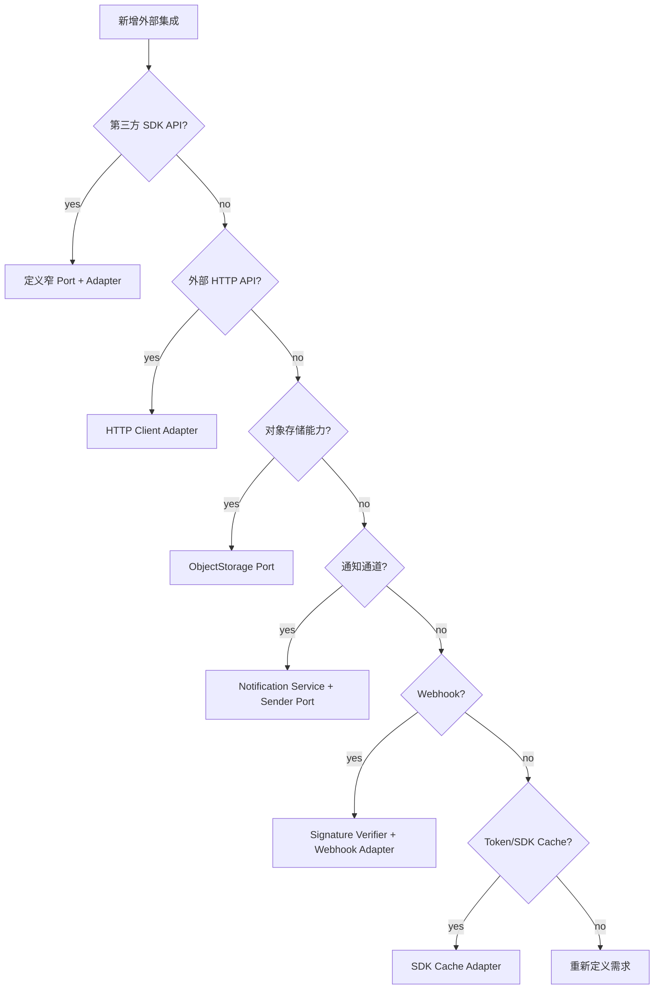

# 新增外部集成 SOP

**本文回答**：在 qs-server 中新增 SDK、HTTP API、Webhook、OSS 能力、通知通道、外部查询或第三方 token cache 时，应该如何先定义业务用例和窄 port，再实现 infra adapter、错误映射、观测、测试和文档，避免第三方模型污染 domain/application。

---

## 30 秒结论

新增外部集成默认流程：

```text
明确业务用例
  -> 定义窄 Port
  -> 实现 Adapter
  -> 隔离 credential / SDK / cache / error
  -> 补 contract tests
  -> 更新 docs
```

| 新增类型 | 主要落点 | 禁止做法 |
| -------- | -------- | -------- |
| 新 SDK API | 新/扩展 port + infra adapter | application 直接 import SDK |
| 新 HTTP 外部服务 | narrow client adapter | handler 手写 HTTP 请求 |
| 新 OSS 能力 | ObjectStorage port 扩展或新增 port | 暴露 OSS SDK/Bucket 到业务层 |
| 新通知类型 | Notification application service + sender port | 把通知塞进领域聚合 |
| 新 Webhook | signature verifier + adapter | 在 handler 里散写验签 |
| 新 token cache | SDK cache adapter | 放进业务 ObjectCache |
| 新第三方错误语义 | adapter error mapping | 原样泄漏 SDK error |

一句话原则：

> **先定义业务需要什么动作，而不是 SDK 提供了什么能力。**

---

## 1. 新增前先问 12 个问题

| 问题 | 为什么重要 |
| ---- | ---------- |
| 业务用例是什么？ | 避免按 SDK 能力暴露大接口 |
| application 需要哪个最小 port？ | 防止 SDK 污染业务层 |
| 是否需要 token/secret/credential？ | 必须隔离在 infra/config |
| 是否需要 SDK cache？ | 判断 Redis sdk_token 或 memory cache |
| 是否是真实网络调用？ | 常规单测不能直接调用 |
| 外部错误如何映射？ | 业务要能理解 |
| 失败是否影响业务状态？ | skipped/partial/error 语义 |
| 是否需要重试/补偿？ | 可能属于 Event/Worker |
| 是否涉及敏感信息？ | token/openid/secret 日志与 metrics |
| 是否需要 metrics/status？ | label 必须 bounded |
| 是否已有类似 port？ | 避免重复 adapter |
| 文档是否要标记 seam/TODO？ | 防止误用未完成能力 |

---

## 2. 决策树



---

## 3. 通用流程

### 3.1 标准步骤

1. 写清业务动作。
2. 定义 application-facing port。
3. 定义 DTO / result。
4. 在 infra adapter 中初始化 SDK/client。
5. 处理 credential/config。
6. 处理 timeout/retry，如需要。
7. 处理 SDK cache。
8. 映射外部错误。
9. 定义 skipped/partial/error。
10. 补 contract tests。
11. 更新 integrations 文档。
12. 更新业务模块文档，如外部集成影响业务链路。

### 3.2 不要反过来

不要从：

```text
引入 SDK
  -> 在 handler 里调用
  -> 后面再抽象
```

开始。

这会让第三方类型迅速污染业务层。

---

## 4. 新增 SDK API

### 4.1 实施步骤

1. 定义业务动作。
2. 在 port 层定义最小接口。
3. 参数使用业务语义。
4. 返回业务可理解结果。
5. adapter 内部创建 SDK client。
6. adapter 内部处理 token/cache。
7. adapter 包装 SDK error。
8. 单测覆盖 validation/error mapping。
9. 不做真实网络单测。
10. 更新文档。

### 4.2 禁止

- 返回 SDK response 全量。
- application 持有 SDK client。
- domain import SDK。
- 在 adapter 中修改业务状态。
- 把 secret/token 打日志。

---

## 5. 新增 HTTP 外部服务

必须定义：

| 项目 | 要求 |
| ---- | ---- |
| client timeout | 必须显式配置 |
| retry | 必须谨慎，避免放大压力 |
| auth | token/API key 不进日志 |
| error mapping | HTTP status -> domain/application error |
| response DTO | 不直接暴露第三方 raw JSON |
| tests | fake server / contract tests |

---

## 6. 新增 OSS 能力

### 6.1 适用场景

- 上传公开对象。
- 读取公开对象。
- 生成下载 URL。
- 删除对象。
- 对象元数据。

### 6.2 实施步骤

1. 判断是否能扩展 `PublicObjectStore`。
2. 如果语义不同，新增 port。
3. 定义 object key 规则。
4. 定义 not found 语义。
5. adapter 内部处理 bucket/endpoint/credential。
6. 补 key normalization tests。
7. 补 not found/error mapping tests。
8. 更新 [02-ObjectStorage适配器.md](./02-ObjectStorage适配器.md)。

### 6.3 禁止

- application 直接知道 bucket。
- handler 直接用 OSS SDK。
- object key 带未脱敏用户隐私。
- presign URL 无过期时间。

---

## 7. 新增 Notification

### 7.1 适用场景

- 新事件触发通知。
- 新通知通道。
- 新模板。
- 新收件人解析策略。

### 7.2 实施步骤

1. 定义通知 DTO。
2. 定义 result：
   - sent。
   - skipped。
   - partial。
   - failed。
3. 定义 recipient resolver。
4. 定义 template spec。
5. 定义 sender port。
6. 组合业务查询。
7. 明确失败是否改变业务状态。
8. 定义 retry/补偿策略。
9. 补 tests。
10. 更新 [03-Notification应用服务.md](./03-Notification应用服务.md)。

### 7.3 禁止

- 通知失败直接修改任务状态，除非业务明确设计。
- 把外部通道 SDK 放进 domain。
- 不校验模板字段。
- 把 openid/token 放进 metrics label。

---

## 8. 新增 Webhook

必须：

1. 定义签名算法。
2. 验证 timestamp/nonce/signature。
3. 防重放。
4. 定义 raw payload 保存策略。
5. 定义外部事件 -> 内部命令/事件映射。
6. 错误返回规范。
7. 补 fake payload tests。
8. 不把 webhook raw model 直接塞进 domain。

---

## 9. 新增 SDK Token Cache

### 9.1 适用场景

- WeChat access_token。
- 第三方 OAuth token。
- API session token。
- SDK 内部 ticket。

### 9.2 实施步骤

1. 明确 token 来源和 TTL。
2. 使用 SDK cache adapter。
3. 如果用 Redis，选择 sdk_token family。
4. 使用 keyspace builder。
5. 不进入业务 ObjectCache。
6. 不记录 token。
7. 补 cache key tests。
8. 定义 Redis failure 行为。

---

## 10. 错误语义设计

| 场景 | 推荐语义 |
| ---- | -------- |
| 外部配置缺失 | skipped 或明确 config error |
| credential 缺失 | adapter init error |
| token 获取失败 | 向上返回 error |
| not found | 映射为稳定 ErrNotFound |
| partial delivery | 返回 result + nil |
| all delivery failed | 返回 result + error |
| seam/no-op | 文档明确标记 |
| 网络超时 | 包装为 external call error |

---

## 11. 观测要求

### 11.1 日志

应记录：

- action。
- integration。
- operation。
- external resource id，必要时 hash。
- result。
- error。

不应记录：

- token。
- appSecret。
- access key secret。
- authorization header。
- raw openid 大量列表。
- raw third-party response 中的敏感字段。

### 11.2 Metrics

如果新增 metrics：

- label 必须 bounded。
- 不放 token/openid/secret/userID。
- external error code 可以白名单化。
- 高基数进入日志，不进 metrics。

---

## 12. 测试矩阵

| 能力 | 必测 |
| ---- | ---- |
| SDK adapter | validation、client init、error wrapping |
| Token cache | key builder、get/set/delete、Redis nil |
| WeChat QR | empty appID/secret、path/page/scene、default width、invalid page mapping |
| Subscribe | template list conversion、send validation、send error wrapping |
| OSS | key normalization、credential fallback、not found mapping |
| Notification | skipped、recipient empty、template mismatch、partial、all failed |
| Webhook | signature ok/fail、replay、malformed payload |
| Docs | seam/TODO 状态准确、Verify 可运行 |

---

## 13. 文档同步矩阵

| 变更 | 至少同步 |
| ---- | -------- |
| 新 WeChat 能力 | [01-WeChat适配器.md](./01-WeChat适配器.md) |
| 新 OSS 能力 | [02-ObjectStorage适配器.md](./02-ObjectStorage适配器.md) |
| 新通知 | [03-Notification应用服务.md](./03-Notification应用服务.md) |
| 新 SDK/HTTP adapter | [00-整体架构.md](./00-整体架构.md) |
| 新 token cache | Redis 文档 + integrations |
| 新业务链路 | 对应业务模块文档 |
| 新 external config | 运维/部署文档 |

---

## 14. 合并前检查清单

| 检查项 | 是否完成 |
| ------ | -------- |
| 已明确业务用例 | ☐ |
| 已定义窄 port | ☐ |
| application 未 import SDK | ☐ |
| domain 未 import SDK | ☐ |
| adapter 处理 credential/cache/error | ☐ |
| 真实网络调用未进入普通单测 | ☐ |
| token/secret/openid 未进入 metrics label | ☐ |
| skipped/partial/error 语义明确 | ☐ |
| seam/TODO 已如实写入文档 | ☐ |
| tests/docs 已更新 | ☐ |

---

## 15. 反模式

| 反模式 | 后果 |
| ------ | ---- |
| domain import 第三方 SDK | 领域污染 |
| handler 直接调用外部 HTTP | 错误和超时散落 |
| adapter 私自吞业务必须感知的失败 | 业务误以为成功 |
| 单测真实调用微信/OSS | flaky、慢、不可重复 |
| token/secret 打日志 | 安全风险 |
| openid 做 metrics label | 高基数 |
| 文档把 no-op seam 写成已完成能力 | 误导上线 |
| port 暴露 SDK client | adapter 边界失效 |

---

## 16. Verify

```bash
go test ./internal/apiserver/infra/wechatapi
go test ./internal/apiserver/infra/objectstorage/...
go test ./internal/apiserver/application/notification
```

如果修改文档：

```bash
make docs-hygiene
git diff --check
```

---

## 17. 下一跳

| 目标 | 文档 |
| ---- | ---- |
| 整体架构 | [00-整体架构.md](./00-整体架构.md) |
| WeChat 适配器 | [01-WeChat适配器.md](./01-WeChat适配器.md) |
| ObjectStorage 适配器 | [02-ObjectStorage适配器.md](./02-ObjectStorage适配器.md) |
| Notification 应用服务 | [03-Notification应用服务.md](./03-Notification应用服务.md) |
