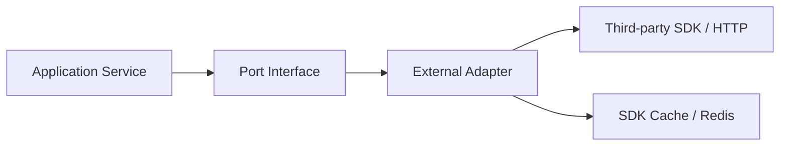

# External Integration Adapter 阅读地图

**本文回答**：外部集成适配层如何把 IAM SDK、WeChat SDK、对象存储、通知网关等第三方能力隔离在 adapter 边界内，避免业务层直接耦合 SDK。

## 30 秒结论

| 问题 | 结论 |
| ---- | ---- |
| 解决什么 | 第三方 SDK、token、HTTP/OSS 调用、模板消息错误语义不能泄漏进 domain |
| 当前能力 | WeChat token/cache/QR/subscribe、OSS public object store、task.opened 小程序通知 |
| 不做什么 | 不抽统一“外部集成框架”，不把第三方失败写成业务成功 |
| 第一入口 | 先读 [00-整体架构.md](./00-整体架构.md)，再读 WeChat、ObjectStorage、Notification |



## 阅读顺序

1. [00-整体架构.md](./00-整体架构.md)
2. [01-WeChat适配器.md](./01-WeChat适配器.md)
3. [02-ObjectStorage适配器.md](./02-ObjectStorage适配器.md)
4. [03-Notification应用服务.md](./03-Notification应用服务.md)
5. [04-新增外部集成SOP.md](./04-新增外部集成SOP.md)

## Verify

```bash
go test ./internal/apiserver/infra/wechatapi ./internal/apiserver/infra/objectstorage/... ./internal/apiserver/application/notification
```
