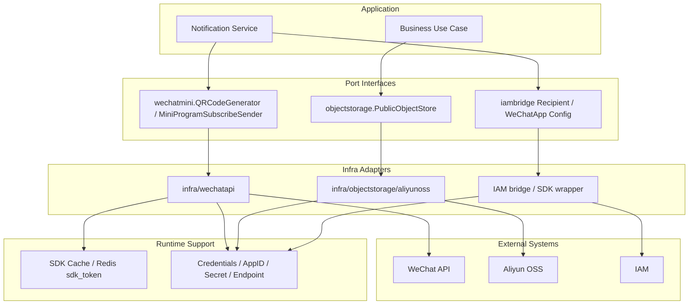

# External Integrations 阅读地图

**本文回答**：`integrations/` 子目录这一组文档应该如何阅读；qs-server 的外部适配层负责什么、不负责什么；WeChat、ObjectStorage、Notification、新增外部集成 SOP 分别应该去哪里看。

---

## 30 秒结论

| 维度 | 结论 |
| ---- | ---- |
| 模块定位 | `integrations/` 是 qs-server 的**外部系统适配文档组**，解释第三方 SDK、HTTP、OSS、通知网关如何被隔离在 port/adapter 边界内 |
| 当前能力 | WeChat token/cache/QR/subscribe seam、Aliyun OSS public object store、task.opened 小程序通知应用服务 |
| 核心原则 | application 依赖窄 port；infra adapter 封装 SDK client、credential、cache、timeout、错误包装 |
| 不做什么 | 不抽统一 integration framework；不让 domain import 第三方 SDK；不在单元测试中调用真实外部网络 |
| 风险点 | 当前 WeChat `SendSubscribeMessage` 的真实发送逻辑是注释状态，函数直接返回 nil；文档必须按 seam 描述 |
| 推荐读法 | 先读整体架构，再读 WeChat、ObjectStorage、Notification，最后读新增外部集成 SOP |

一句话概括：

> **Integrations 的目标不是把所有外部系统统一成一个框架，而是用窄 port 把不可控的第三方 SDK、凭据、缓存和错误语义隔离在 infra adapter 中。**

---

## 1. Integrations 负责什么

Integrations 负责外部系统适配：

```text
WeChat SDK
WeChat access token cache
WeChat QR code
WeChat mini program subscribe message seam
Object storage SDK
Aliyun OSS public object store
Notification application service
External SDK credentials
External call validation
External error mapping
```

它要回答：

```text
业务层需要的动作是什么？
第三方 SDK 类型在哪里隔离？
token/cache/credential 在哪里处理？
错误是否应该向上返回？
哪些外部能力当前只是 seam？
哪些调用不能进入单元测试？
```

---

## 2. Integrations 不负责什么

| 不属于 Integrations 的内容 | 应归属 |
| -------------------------- | ------ |
| 领域不变量 | Domain |
| 用例编排 | Application Service |
| DB/Mongo 持久化 | Data Access |
| Redis family/cache 治理 | Redis Plane |
| 限流、背压、锁 | Resilience Plane |
| IAM 用户权限判断 | Security Plane |
| 事件可靠出站 | Event System |
| 外部系统生产配置管理 | Deployment / Ops |
| 通知重试策略 | Event / Worker / Notification SOP |

---

## 3. 本目录文档地图

```text
integrations/
├── README.md
├── 00-整体架构.md
├── 01-WeChat适配器.md
├── 02-ObjectStorage适配器.md
├── 03-Notification应用服务.md
└── 04-新增外部集成SOP.md
```

| 顺序 | 文档 | 先回答什么 |
| ---- | ---- | ---------- |
| 1 | [00-整体架构.md](./00-整体架构.md) | port/adapter/SDK/cache 总图，外部集成边界 |
| 2 | [01-WeChat适配器.md](./01-WeChat适配器.md) | WeChat token、SDK cache、QR、subscribe message 当前状态 |
| 3 | [02-ObjectStorage适配器.md](./02-ObjectStorage适配器.md) | OSS public object store、Put/Get、key normalization、not found 映射 |
| 4 | [03-Notification应用服务.md](./03-Notification应用服务.md) | task.opened 小程序通知如何组合 Testee/Plan/Scale/IAM/WeChat |
| 5 | [04-新增外部集成SOP.md](./04-新增外部集成SOP.md) | 新 SDK/HTTP/OSS/notification 增加流程 |

---

## 4. 推荐阅读路径

### 4.1 第一次理解外部适配层

```text
00-整体架构
  -> 01-WeChat适配器
  -> 02-ObjectStorage适配器
  -> 03-Notification应用服务
```

读完后应能回答：

1. application 为什么不能直接依赖 WeChat/OSS SDK？
2. port 和 adapter 的边界在哪里？
3. WeChat token cache 为什么属于 SDK cache，不是业务 ObjectCache？
4. OSS object key 为什么要 normalize？
5. task.opened 通知为什么是 application service，而不是 Plan 聚合方法？
6. 当前 SubscribeSender 真实发送为什么仍是 seam？

### 4.2 要新增外部集成

先读：

```text
04-新增外部集成SOP
```

再按类型跳转：

| 类型 | 继续读 |
| ---- | ------ |
| 新 WeChat API | [01-WeChat适配器.md](./01-WeChat适配器.md) |
| 新 OSS 能力 | [02-ObjectStorage适配器.md](./02-ObjectStorage适配器.md) |
| 新通知 | [03-Notification应用服务.md](./03-Notification应用服务.md) |
| 新 SDK/HTTP adapter | [00-整体架构.md](./00-整体架构.md) |

---

## 5. 主图



---

## 6. 设计原则

1. **Application 依赖 port，不依赖 SDK。**
2. **Adapter 封装 credential、client、cache、timeout、SDK error。**
3. **外部失败不能被 adapter 私自吞掉，除非该能力明确是 best-effort seam。**
4. **真实网络调用不进入常规单元测试。**
5. **token、secret、openid 不进入 metrics label。**
6. **外部配置缺失要返回明确错误或 skipped，而不是 panic。**
7. **文档必须如实标记 seam / TODO / mock-friendly 行为。**

---

## 7. 代码锚点

- WeChat port：[../../../internal/apiserver/port/wechatmini/wechatmini.go](../../../internal/apiserver/port/wechatmini/wechatmini.go)
- WeChat adapter：[../../../internal/apiserver/infra/wechatapi/](../../../internal/apiserver/infra/wechatapi/)
- Object storage port：[../../../internal/apiserver/infra/objectstorage/port/storage.go](../../../internal/apiserver/infra/objectstorage/port/storage.go)
- Aliyun OSS adapter：[../../../internal/apiserver/infra/objectstorage/aliyunoss/store.go](../../../internal/apiserver/infra/objectstorage/aliyunoss/store.go)
- Notification service：[../../../internal/apiserver/application/notification/task_opened_service.go](../../../internal/apiserver/application/notification/task_opened_service.go)

---

## 8. Verify

```bash
go test ./internal/apiserver/infra/wechatapi
go test ./internal/apiserver/infra/objectstorage/...
go test ./internal/apiserver/application/notification
```

如果修改文档：

```bash
make docs-hygiene
git diff --check
```

---

## 9. 下一跳

| 目标 | 文档 |
| ---- | ---- |
| 整体架构 | [00-整体架构.md](./00-整体架构.md) |
| WeChat 适配器 | [01-WeChat适配器.md](./01-WeChat适配器.md) |
| ObjectStorage 适配器 | [02-ObjectStorage适配器.md](./02-ObjectStorage适配器.md) |
| Notification 应用服务 | [03-Notification应用服务.md](./03-Notification应用服务.md) |
| 新增外部集成 SOP | [04-新增外部集成SOP.md](./04-新增外部集成SOP.md) |
